# PLAN: iPaymu Testing Bridge & Egress Gateway (OCI Jakarta + Pulumi Kotlin + Cloudflare Tunnel)

> **Status**: Draf Disetujui · **Tanggal**: 2026-10-01 · **Target**: Lingkungan Pengujian & Integrasi Payment Gateway iPaymu untuk WeMake Flow Platform / EventVerse.

---

## 1. Latar Belakang & Masalah Bisnis

Pada integrasi payment gateway **iPaymu** untuk modul tagihan langganan (Builder Billing M2) maupun transaksi tenant:
1. **IP Whitelist Wajib**: Seluruh request API keluar (Outbound: Create Transaction, Virtual Account, QRIS, Check Status) wajib berasal dari IP Publik Statis yang terdaftar di dashboard iPaymu. Dynamic IP ISP lokal di laptop developer ditolak (`403 Forbidden` / `IP not authorized`).
2. **Domain & HTTPS Callback Wajib**: Notifikasi callback/webhook (Inbound: `notify_url` & `return_url`) wajib menggunakan domain resmi ber-SSL (HTTPS) yang terdaftar. iPaymu tidak mengizinkan URL berupa raw IP publik tanpa domain atau `localhost`.
3. **Problem Historis**: Sebelumnya developer menyewa VPN khusus untuk routing outbound. Pendekatan ini memiliki kekurangan:
   - Koneksi internet laptop developer rentan terganggu/putus-putus.
   - Tidak mencakup penerimaan webhook masuk (inbound) tanpa port-forwarding rumit.
   - Tidak otomatis (IaC) dan sulit direplikasi ke tim lain atau environment staging/production.

---

## 2. Solusi & Visi Arsitektur

Membangun **Testing Bridge & Egress Gateway** terotomatisasi penuh menggunakan **Pulumi Kotlin**:
- **Outbound Gateway (OCI Jakarta `ap-jakarta-1`)**: Memanfaatkan *OCI Always Free Tier* (Reserved Public IPv4 Statis + Compute Instance Ampere A1 ARM / AMD Micro) yang dikonfigurasi sebagai HTTP Forward Proxy (`tinyproxy`).
- **Inbound Tunnel (Cloudflare Tunnel)**: Mengarahkan subdomain resmi (misal: `ipaymu-hook.<domain>.com`) langsung ke port backend lokal laptop (`http://localhost:8081`) melalui daemon `cloudflared` tanpa membuka port router / firewall ISP.
- **Ktor Integration**: Ktor HttpClient menggunakan conditional proxy via Environment Variable (`IPAYMU_OUTBOUND_PROXY`).

```mermaid
flowchart LR
    subgraph Local_Machine [Laptop Developer / CI]
        KtorDev["Ktor Backend (:8081)"]
        CFDaemon["cloudflared daemon"]
    end

    subgraph OCI_Jakarta [Oracle Cloud Infrastructure - Jakarta]
        ReservedIP["Reserved Public IP Statis\n(Whitelisted di iPaymu)"]
        Tinyproxy["Tinyproxy Service (:8888)"]
    end

    subgraph Cloudflare_Edge [Cloudflare Network]
        CFTunnel["Cloudflare Tunnel\n(ipaymu-hook.domain.com)"]
    end

    subgraph iPaymu_Engine [iPaymu Payment Gateway]
        iPaymuAPI["iPaymu API v2\n(my.ipaymu.com)"]
        iPaymuNotify["Webhook Event Dispatcher"]
    end

    %% Outbound Flow
    KtorDev -->|"1. Request via Proxy (8888)"| Tinyproxy
    Tinyproxy -->|"2. Forward API Request"| ReservedIP
    ReservedIP -->|"3. Egress IP Lolos Whitelist"| iPaymuAPI

    %% Inbound Flow
    iPaymuNotify -->|"4. POST Callback (HTTPS)"| CFTunnel
    CFTunnel -->|"5. Secure WebSocket/gRPC Tunnel"| CFDaemon
    CFDaemon -->|"6. Proxy ke Localhost:8081"| KtorDev
```

---

## 3. Komponen Utama & Alokasi Resource

| Komponen | Provider / Teknologi | Peran Teknis | Estimasi Biaya |
| :--- | :--- | :--- | :--- |
| **IaC Engine** | Pulumi Java/Kotlin SDK (`com.pulumi:pulumi`) | Mendefinisikan seluruh resource secara deklaratif berbasis kode Kotlin | Gratis (Pulumi Community Edition) |
| **Cloud Provider** | OCI (`ap-jakarta-1` Jakarta) | Penyedia Reserved IPv4 Statis & VM Egress Gateway | Rp 0 (Always Free Tier) |
| **Compute Node** | OCI `VM.Standard.A1.Flex` (1 OCPU, 6GB RAM) | Menjalankan `tinyproxy` forwarding service | Rp 0 (Always Free) |
| **IP Statis** | OCI Core Reserved Public IP | IP tetap yang didaftarkan ke dashboard iPaymu | Rp 0 (Always Free jika attached) |
| **Edge Ingress** | Cloudflare Zero Trust Tunnel | Menerima webhook iPaymu dengan SSL otomatis | Rp 0 (Cloudflare Free Tier) |
| **DNS Record** | Cloudflare DNS (CNAME) | Mengarahkan `ipaymu-hook.<domain>` ke Tunnel endpoint | Rp 0 (Included) |

---

## 4. Tahapan Rencana Kerja (Phased Roadmap)

### Fase 1: Inisialisasi Proyek Pulumi Kotlin (`infra-bridge/`)
- Inisialisasi proyek Gradle dengan plugin `kotlin("jvm")`.
- Setup dependensi `com.pulumi:pulumi`, `com.pulumi:oci`, dan `com.pulumi:cloudflare`.
- Konfigurasi kredensial OCI CLI (API Key, Fingerprint, Tenancy OCID) dan Cloudflare API Token.

### Fase 2: OCI Network & Compute Provisioning
- Deklarasi VCN (10.0.0.0/16), Internet Gateway, Route Table default.
- Deklarasi Security List (Port 22 SSH, Port 8888 Tinyproxy).
- Alokasi Reserved Public IP (LIFETIME: `RESERVED`).
- Penyusunan `cloud-init` / `user_data` untuk auto-install `tinyproxy` pada saat first boot.
- Pengikatan (binding) Reserved IP ke VNIC instance.

### Fase 3: Cloudflare Webhook Tunnel Provisioning
- Pembuatan resource `Tunnel` di Pulumi dengan 32-byte secret terenkripsi.
- Pembuatan CNAME DNS record `ipaymu-hook.<domain>` menunjuk ke `<tunnel_id>.cfargotunnel.com`.
- Ekspor `tunnel_token` sebagai output sensitif Pulumi.

### Fase 4: Konfigurasi Ktor & Integrasi Kode Lokal
- Penambahan helper `HttpClient` engine proxy di server Ktor berbasis `IPAYMU_OUTBOUND_PROXY`.
- Pendaftaran endpoint handler `post("/api/payment/ipaymu/notify")` untuk verifikasi signature transaksi iPaymu.
- Verifikasi sandbox: request transaksi keluar lolos whitelist, callback masuk berhasil diproses lokal.

---

## 5. Matriks Risiko & Mitigasi

| Risiko | Dampak | Mitigasi |
| :--- | :--- | :--- |
| **Kapasitas VM Jakarta Habis ("Out of Capacity")** | Gagal create instance Ampere A1 Always Free | Upgrade akun ke status **Pay As You Go (PAYG)**; tagihan tetap Rp 0 selama di bawah kuota Always Free, namun alokasi hardware diutamakan. Opsi cadangan: Gunakan shape AMD `VM.Standard.E2.1.Micro`. |
| **Penyalahgunaan Port Proxy 8888 Terbuka** | Open proxy disalahgunakan pihak ketiga | Pasang Basic Authentication (`BasicAuth user pass`) pada konfigurasi `tinyproxy`, atau batasi IP ingress security list hanya untuk IP dinamis ISP developer saat ini. |
| **Webhook Latency / Timeout** | iPaymu menganggap webhook gagal dan melakukan retry berlebihan | `cloudflared` memelihara 4 koneksi persistent gRPC/WebSocket ke Cloudflare edge terdekat di Jakarta, latensi round-trip ke laptop < 15ms. |
| **Drift Antara Dev dan Production** | Perilaku payment berbeda di server nyata | Pola proxy yang sama dipakai di production (atau backend production dipindahkan langsung ke OCI VM yang sudah memiliki IP statis tersebut). |

---

## 6. Output & Deliverables

1. Berkas TRD lengkap: [`docs/trd/TRD-PAY-001-ipaymu-testing-bridge.md`](../trd/TRD-PAY-001-ipaymu-testing-bridge.md)
2. Skrip Pulumi Kotlin (`build.gradle.kts`, `OciGateway.kt`, `CloudflareWebhookTunnel.kt`, `Main.kt`).
3. Runbook operasional untuk startup testing bridge lokal dan simulasi transaksi.
