# PLAN: iPaymu Testing Bridge & Egress Gateway (OCI Jakarta + Pulumi Kotlin + Cloudflare Tunnel)

> **Status**: Draf Disetujui, **direvisi 2026-10-01 pasca-review** (lihat TRD-PAY-001 v1.1) · **Target**: lingkungan
> pengujian payment gateway iPaymu untuk WeMade Flow Platform.
>
> **Posisi di roadmap**: billing iPaymu adalah fase **L1** di [`PLAN-builder-console.md`](PLAN-builder-console.md) §8.
> Rencana ini hanya menyiapkan **infrastruktur jembatan** (tidak menyentuh kode aplikasi), sehingga boleh dikerjakan
> lebih awal. Kode Ktor (port `PaymentGateway`, `IpaymuPaymentGateway`, handler callback) dikerjakan di L1 lewat
> `wemade-feature-discovery` → `wemade-feature-workflow`.

---

## 1. Latar Belakang & Masalah Bisnis

1. **IP Whitelist**: request API keluar ke iPaymu (create transaction, VA, QRIS, cek status) wajib dari IP publik
   statis terdaftar. IP dinamis ISP laptop ditolak. *(Apakah sandbox juga menegakkannya belum diverifikasi — §5.)*
2. **Domain & HTTPS Callback**: `notifyUrl` wajib domain ber-SSL; raw IP dan `localhost` ditolak.
3. **Problem historis**: VPN sewaan mengganggu koneksi laptop, tidak menyediakan jalur webhook masuk, dan tidak
   bisa direplikasi ke developer lain.

---

## 2. Solusi & Visi Arsitektur

Jembatan pengujian yang seluruh resource-nya didefinisikan dengan **Pulumi Kotlin**:

- **Outbound (OCI Jakarta `ap-jakarta-1`)**: VM Always Free dengan **Reserved Public IP** (di-`protect`). `tinyproxy`
  hanya mendengar di `127.0.0.1:8888` dan hanya meneruskan ke domain iPaymu. Developer menjangkaunya lewat
  **SSH local forward** — tidak ada port proxy publik, tidak ada kredensial proxy.
- **Inbound (Cloudflare Tunnel)**: satu tunnel **per developer** (`ipaymu-hook-<dev>.<domain>`). Ingress hanya
  meneruskan path `/api/payment/ipaymu/notify` ke `localhost:8081`; path lain dijawab 404 di edge.
- **Kontrak ke L1**: `IPAYMU_OUTBOUND_PROXY=http://127.0.0.1:8888` (tanpa kredensial) dan syarat handler callback
  (cek ulang status, idempoten per `trx_id`, cek nominal, pakai `ConfirmSubscriptionPaymentUseCase`).

```mermaid
flowchart LR
    subgraph Local_Machine [Laptop Developer]
        KtorDev["Ktor Backend (:8081)"]
        SSHFwd["ssh -L 8888 (127.0.0.1:8888)"]
        CFDaemon["cloudflared (token per developer)"]
    end

    subgraph OCI_Jakarta [OCI Jakarta]
        Tinyproxy["tinyproxy @127.0.0.1:8888\n(filter: domain iPaymu saja)"]
        ReservedIP["Reserved Public IP (protect)\nIngress: hanya SSH 22"]
    end

    subgraph Cloudflare_Edge [Cloudflare]
        CFTunnel["ipaymu-hook-&lt;dev&gt;.domain\ningress: /notify saja, lainnya 404"]
    end

    subgraph iPaymu_Engine [iPaymu]
        iPaymuAPI["API v2"]
        iPaymuNotify["Webhook dispatcher"]
    end

    KtorDev -->|"1. HTTP proxy (CONNECT)"| SSHFwd
    SSHFwd -->|"2. Sesi SSH terenkripsi"| Tinyproxy
    Tinyproxy -->|"3. Keluar via Reserved IP"| ReservedIP
    ReservedIP -->|"4. Lolos whitelist"| iPaymuAPI

    iPaymuNotify -->|"5. POST callback (HTTPS)"| CFTunnel
    CFTunnel -->|"6. Koneksi keluar cloudflared"| CFDaemon
    CFDaemon -->|"7. localhost:8081/notify"| KtorDev
```

---

## 3. Komponen Utama & Alokasi Resource

| Komponen | Provider / Teknologi | Peran | Estimasi Biaya |
| :--- | :--- | :--- | :--- |
| **IaC** | Pulumi Java SDK dari Kotlin (`com.pulumi:pulumi`, `:oci`, `:cloudflare`, versi di-pin) | Seluruh resource sebagai kode | Gratis (backend state: lihat §5) |
| **Compute** | OCI `VM.Standard.A1.Flex` 1 OCPU / 6 GB (cadangan `E2.1.Micro`) | `tinyproxy` lokal | Rp 0 dalam kuota Always Free — **akun PAYG** |
| **IP statis** | OCI Reserved Public IP, `protect = true` | IP yang di-whitelist iPaymu | Perlu dicek di pricing OCI |
| **Akses proxy** | SSH local forward (kunci per developer) | Pengganti port proxy publik | Rp 0 |
| **Ingress** | Cloudflare Tunnel per developer + ingress terbatas path | Menerima callback ke laptop | Rp 0 (Free) |
| **DNS** | Cloudflare DNS (CNAME, proxied) | `ipaymu-hook-<dev>.<domain>` → tunnel | Rp 0 |

---

## 4. Tahapan Rencana Kerja

### Fase 0: Prasyarat (sebelum menulis kode)
- Pastikan **home region** tenancy OCI = `ap-jakarta-1` (Always Free hanya di home region; tidak bisa diganti).
- **Upgrade akun ke PAYG** — menghindari kapasitas A1 habis *dan* reklamasi VM Always Free yang menganggur.
- Tentukan backend state Pulumi (Pulumi Cloud individual atau object storage).
- Cek apakah sandbox iPaymu menegakkan IP whitelist (menentukan urgensi Fase 2).
- Siapkan API token Cloudflare (`Zone.DNS:Edit`, `Account.Cloudflare Tunnel:Edit`) dan kunci SSH publik developer.

### Fase 1: Inisialisasi Proyek Pulumi Kotlin (`infra/ipaymu-bridge/`)
- Build Gradle **mandiri** (`settings.gradle.kts` sendiri; tidak di-include root agar build KMP tidak tersentuh).
- Dependensi `com.pulumi:pulumi`, `com.pulumi:oci`, `com.pulumi:cloudflare` — **pin versi**; nama resource
  Cloudflare berbeda antar major version.
- `BridgeConfig.kt` bertipe: compartment, domain, `developers`, `sshPublicKeys`, shape.

### Fase 2: OCI Network & Compute (`OciEgressGateway.kt`, `TinyproxyCloudInit.kt`)
- VCN `10.0.0.0/16`, IGW, Route Table, Subnet publik `10.0.1.0/24`.
- Security List: ingress **hanya TCP 22**.
- Lookup availability domain & image Ubuntu 24.04 aarch64 (bukan OCID manual).
- Instance dengan `assignPublicIp = false`; Reserved IP diikat ke private IP utama VNIC; `protect = true`.
- Cloud-init tanpa rahasia: `tinyproxy` `Listen 127.0.0.1`, `ConnectPort 443`, `Filter` + `FilterDefaultDeny Yes`
  (allowlist `my.ipaymu.com`, `sandbox.ipaymu.com`, `api.ipify.org`). `iptables` bawaan image dibiarkan.

### Fase 3: Cloudflare Tunnel per Developer (`CloudflareWebhookTunnel.kt`)
- Per nama di `developers`: tunnel (secret 32-byte), konfigurasi ingress (path `/notify` → `localhost:8081`,
  catch-all `http_status:404`), CNAME `ipaymu-hook-<dev>`.
- Output: `egressIp`, `sshForwardCommand`, `webhookUrls`, `tunnelTokens` (secret).
- Skrip verifikasi `scripts/test-ipaymu-bridge.sh` (AC-PAY-2/3/4/7 di TRD).

### Fase 4: Serah-terima ke L1 Billing iPaymu (bukan bagian rencana ini)
- Kontrak env var & syarat handler callback sudah ditulis di TRD-PAY-001 FR-PAY-3.
- L1 memilih engine Ktor client (server belum punya engine) yang mendukung proxy + `CONNECT`.
- L1 mengimplementasikan handler callback dengan cek ulang status, idempoten per `trx_id`, cek nominal vs
  `totalIdr`, reuse `ConfirmSubscriptionPaymentUseCase` (aktor `system:ipaymu`), dan rekonsiliasi berkala.

---

## 5. Matriks Risiko & Mitigasi

| Risiko | Dampak | Mitigasi |
| :--- | :--- | :--- |
| **Home region bukan Jakarta** | VM Always Free tidak bisa dibuat di Jakarta | Cek di Fase 0. Alternatif: VM berbayar di Jakarta, atau egress dari home region (IP tetap statis). |
| **Kapasitas A1 Jakarta habis** | Gagal membuat instance | PAYG; cadangan `VM.Standard.E2.1.Micro`. |
| **VM Always Free direklamasi karena idle** | Proxy hilang tanpa peringatan | PAYG (akun PAYG tidak terkena reklamasi idle). |
| **IP whitelist hilang saat `pulumi destroy`/redeploy** | Harus daftar ulang ke iPaymu | `protect = true` pada `PublicIp`; ganti VM tidak mengganti IP. |
| **Proxy disalahgunakan** | IP whitelist masuk daftar hitam | Tidak ada port proxy publik (SSH forward); filter domain tujuan; SSH kunci saja. |
| **Seluruh API dev terekspos lewat tunnel** | Endpoint dev dapat diakses dari internet | Ingress hanya path `/notify`; catch-all 404 (diuji AC-PAY-7). |
| **Dua developer berbagi satu tunnel** | Callback terbagi acak antar laptop | Tunnel & hostname per developer; `notifyUrl` per transaksi. |
| **Laptop mati/tidur** | Callback hilang | Rekonsiliasi cek status di L1. |
| **Drift dev vs production** | Perilaku berbeda di server nyata | Desain egress production diputuskan di L1 bersama Docker + Caddy. |

---

## 6. Output & Deliverables

1. TRD: [`docs/trd/TRD-PAY-001-ipaymu-testing-bridge.md`](../trd/TRD-PAY-001-ipaymu-testing-bridge.md) (v1.1).
2. Proyek Pulumi `infra/ipaymu-bridge/` (`build.gradle.kts`, `Main.kt`, `BridgeConfig.kt`, `OciEgressGateway.kt`,
   `TinyproxyCloudInit.kt`, `CloudflareWebhookTunnel.kt`).
3. `scripts/test-ipaymu-bridge.sh` + runbook (TRD §5.3).
4. Teaching doc setelah bridge berdiri (CLAUDE.md §12).
