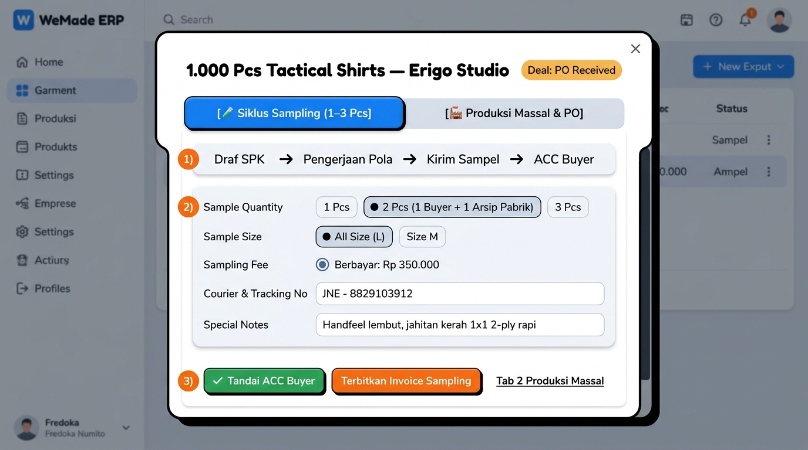
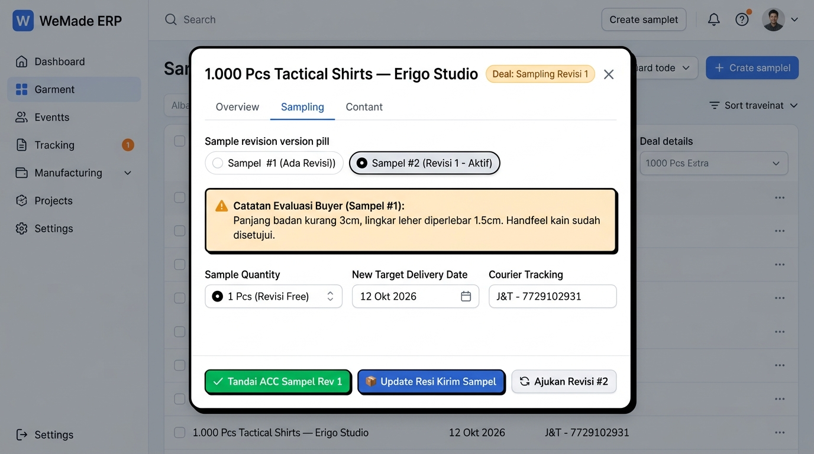
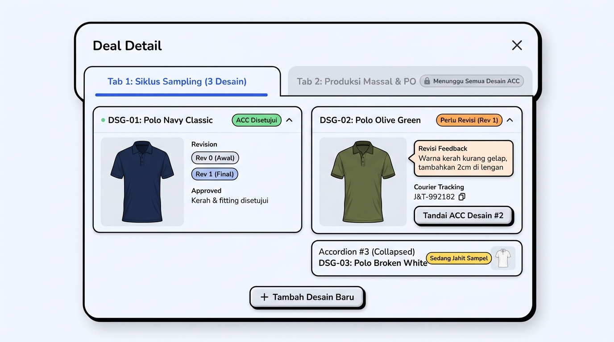
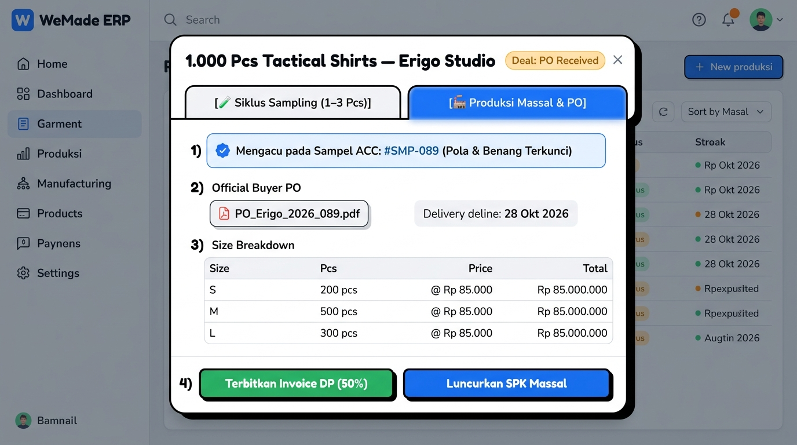

# 📋 Technical Planning: Alur Kerja Deal Garmen & Redesign Modal Detail Dual-Tab (Sampling vs Produksi Massal)

Dokumen rencana arsitektur teknis dan panduan pengerjaan integrasi komersial deal konveksi/garmen WeMade ERP, mencakup pemisahan **Siklus Sampling (Full Cycle Mini)** dan **Siklus Produksi Massal & PO (Full Cycle Bulk)** ke dalam antarmuka **Large Popup Modal (Extra-Wide Modal Dialog ~92vw / 1150dp)** interaktif bergaya Neo-Brutalist Claymorphism.

> **Spesifikasi Dimensi Modal**: Deal detail menggunakan sistem *Popup Modal Besar* (`Dialog` Compose Multiplatform) dengan lebar ~90–92vw (maksimal 1150dp) dan tinggi ~88vh dengan konten internal *scrollable*, outline tebal 3dp, hard shadow clay 8dp, serta tombol tutup `[ X ]` di pojok kanan atas. Ini menjamin seluruh rincian accordion multi-desain, foto sampel baju, resi, form revisi, dan tabel size breakdown massal dapat terbaca dengan lega dan nyaman tanpa layout yang sesak.

---

## 🖼️ Referensi Desain UI Lengkap dengan Inputan

### TAB 1: `[ 🧪 Siklus Sampling (1–3 Pcs) ]`
Fokus: *Pembuatan pola awal, rajutan/potongan sampel, resi pengiriman sampel, dan gerbang persetujuan (ACC Buyer).*



#### Rincian Komponen & Inputan Tab Sampling:
1. **Milestone Progress Tracker**:
   - `Draf SPK` $\to$ `Pengerjaan Pola` $\to$ `Kirim Sampel` $\to$ `ACC Buyer`.
2. **Form Inputan Cepat Sampling**:
   - **Sample Quantity**: Pemilih pil `[ 1 Pcs ]`, `[ ● 2 Pcs (1 Buyer + 1 Arsip Pabrik) ]`, `[ 3 Pcs ]`.
   - **Sample Size**: Pemilih ukuran `[ ● All Size (L) ]`, `[ Size M ]`, `[ Custom Size ]`.
   - **Sampling Fee**: Pilihan biaya sampling `● Berbayar: Rp 350.000` atau `Gratis / Dipotong saat PO Massal`.
   - **Courier & Tracking No**: Input ekspedisi & nomor resi pengiriman sampel (misal: `JNE - 8829103912`).
   - **Special Notes**: Catatan khusus buyer (misal: *"Handfeel lembut, jahitan kerah 1x1 2-ply rapi"*).
3. **Action Gate Buttons**:
   - **`[ ✅ Tandai ACC Buyer ]`** (Hijau): Mengunci spesifikasi dan mengaktifkan kesiapan PO Massal.
   - **`[ Terbitkan Invoice Sampling ]`** (Oranye): Mengirim draf tagihan sampling ke modul Invoicing.
   - **Link Cepat**: Pindah ke *Tab 2 Produksi Massal*.

---

### TAB 1.1: `[ 🔄 Flow Revisi Sampling ]`
Fokus: *Mencatat hasil evaluasi/fitting buyer, meluncurkan pengerjaan sampel perbaikan (Rev 1 / Rev 2), dan update resi pengiriman ulang.*



#### Rincian Komponen & Inputan Flow Revisi:
1. **Sample Revision Version Pills**:
   - Pemilih versi sampel: `[ Sampel #1 (Ada Revisi) ]` dan `[ ● Sampel #2 (Revisi 1 - Aktif) ]`.
   - Admin dapat melihat catatan historis antar-versi sampel tanpa kehilangan data awal.
2. **Kotak Catatan Evaluasi Buyer (Revision Feedback Callout)**:
   - Kotak peringatan clay amber: *"Catatan Evaluasi Buyer (Sampel #1): Panjang badan kurang 3cm, lingkar leher diperlebar 1.5cm. Handfeel kain sudah disetujui."*
3. **Form Penyesuaian Sampel Revisi**:
   - **Sample Quantity**: `1 Pcs (Revisi Free)` atau berbayar jika ada pergantian bahan total.
   - **New Target Delivery Date**: Tanggal target kirim sampel perbaikan (misal: `12 Okt 2026`).
   - **Courier Tracking**: Ekspedisi & nomor resi kirim sampel revisi baru (misal: `J&T - 7729102931`).
4. **Action Footer Revisi:**
   - **`[ ✅ Tandai ACC Sampel Rev 1 ]`** (Hijau): Mengunci versi revisi 1 sebagai sampel final acuan produksi massal.
   - **`[ 📦 Update Resi Kirim Sampel ]`** (Biru): Memperbarui status kurir pengiriman sampel ke buyer.
   - **`[ 🔄 Ajukan Revisi #2 ]`** (Ghost/Outline): Jika buyer masih memerlukan perbaikan lanjutan.

---

### TAB 1.2: `[ 🗂️ Accordion Multi-Design Sampling & Kunci Tab Produksi ]`
Fokus: *Mendukung multi-desain/multi-warna dalam 1 Deal menggunakan Accordion vertikal, pill revisi per desain, dan mengunci Tab Produksi sampai seluruh desain di-ACC.*



#### Rincian Mekanisme Accordion & Multi-Desain:
1. **Vertical Accordion List per Desain**:
   - Tiap desain memiliki kartu accordion mandiri:
     - **Header Accordion**: Kode Desain (`DSG-01`, `DSG-02`), Nama & Varian Warna (`Polo Navy Classic`, `Polo Olive Green`, `Polo Broken White`), Badge Status (`[ ACC Disetujui ]` hijau, `[ Perlu Revisi (Rev 1) ]` oranye, `[ Sedang Jahit ]` kuning).
     - **Body Accordion (Expanded)**: Gambar/mockup desain baju, pil revisi independen (`Rev 0`, `Rev 1`), kotak evaluasi revisi buyer, nomor resi kurir sampel, dan tombol individual **`[ Tandai ACC Desain Ini ]`**.
2. **Tombol `[ + Tambah Desain Baru ]`**:
   - Di bagian bawah accordion, admin bisa menambah varian desain/warna baru (`DSG-04`, dst) secara dinamis kapan saja selama tahap sampling.
3. **Pill Revisi & Catatan Komplain per Desain**:
   - Jika `DSG-01` sudah cocok tapi `DSG-02` minta revisi kerah/lengan, revisi hanya berjalan pada `DSG-02` tanpa mengganggu status `DSG-01` yang sudah ACC.
4. **Aturan Kunci Tab Produksi Massal (Gate Rule)**:
   - **Tab 2 (Produksi Massal & PO) statusnya TERKUNCI (`🔒 Menunggu Semua Desain ACC`)** jika masih ada desain aktif yang belum berstatus ACC.
   - Indikator kunci menampilkan status progres: *"2 dari 3 Desain sudah di-ACC"*.
   - Begitu semua desain aktif berstatus ACC (atau desain yang dibatalkan ditandai *Drop/Cancel*), gembok terbuka otomatis dan Tab 2 siap menerima PO resmi buyer serta memetakan size breakdown untuk seluruh desain yang lolos.

---

### TAB 2: `[ 🏭 Produksi Massal & PO ]`
Fokus: *Penguncian spesifikasi berbasis sampel ACC, upload berkas PO resmi dari buyer, rincian size breakdown massal, dan penagihan uang muka (DP).*



#### Rincian Komponen & Inputan Tab Produksi Massal:
1. **Banner Verifikasi Sampel**:
   - `✓ Mengacu pada Sampel ACC: #SMP-089 (Pola & Benang Terkunci)`.
2. **Dokumen PO Buyer**:
   - Berkas PO terlampir: `PO_Erigo_2026_089.pdf` (tombol unduh/preview).
   - Target tanggal pengiriman: `28 Okt 2026`.
3. **Tabel Size Breakdown Massal**:
   - S: 200 pcs @ Rp 85.000 = Rp 17.000.000
   - M: 500 pcs @ Rp 85.000 = Rp 42.500.000
   - L: 300 pcs @ Rp 85.000 = Rp 25.500.000
   - **Total**: 1.000 Pcs = **Rp 85.000.000**.
4. **Action Footer**:
   - **`[ Terbitkan Invoice DP (50%) ]`** (Hijau): Otomatis mem-prefill faktur DP Rp 42.500.000 di modul Invoicing.
   - **`[ Luncurkan SPK Massal ]`** (Biru): Mendorong instruksi kerja pemotongan dan penjahitan massal ke modul MRP.

---

## 💡 Konsep Bisnis: Mengapa Dipisah Menjadi Dua Siklus Penuh?

1. **Sampling adalah Siklus Mandiri**:
   - Memiliki alur produksi fisik (potong/rajut), resi pengiriman kurir tersendiri (JNE/Paxel), dan penagihan biaya jasanya sendiri (Invoice Sampling).
   - Dilakukan **sebelum buyer menerbitkan PO Massal**.
2. **Produksi Massal Berbasis Kontrak**:
   - Membutuhkan lampiran PO resmi dari buyer, penagihan DP puluhan/ratusan juta, dan penerbitan Surat Jalan pengiriman kontainer/truk kargo.
3. **Keterkaitan (Golden Sample Lock)**:
   - Ketika sampel di Tab 1 diberi tanda **ACC**, formula rajutan, jenis benang, dan toleransi susutnya otomatis terkunci menjadi acuan baku di Tab 2.

---

## 🏗️ Arsitektur Full-Stack End-to-End (5 Pilar)

### 1. Database & Persistence Layer (`server/`)
- **Migrasi Flyway**: [`V35__link_sampling_orders_to_deals.sql`](file:///Volumes/amalari/Projects/wemade/server/src/main/resources/db/migration/V35__link_sampling_orders_to_deals.sql)
  ```sql
  ALTER TABLE sampling_orders 
      ADD COLUMN IF NOT EXISTS deal_id VARCHAR(64) REFERENCES deals(id) ON DELETE SET NULL,
      ADD COLUMN IF NOT EXISTS sample_quantity INT NOT NULL DEFAULT 2,
      ADD COLUMN IF NOT EXISTS courier_tracking VARCHAR(150),
      ADD COLUMN IF NOT EXISTS sampling_fee_idr BIGINT NOT NULL DEFAULT 0;

  CREATE INDEX IF NOT EXISTS idx_sampling_orders_deal 
      ON sampling_orders(tenant_id, deal_id) WHERE deal_id IS NOT NULL;
  ```
- **Exposed Tables**: [`SamplingTables.kt`](file:///Volumes/amalari/Projects/wemade/server/src/main/kotlin/com/eventverse/app/infrastructure/tables/SamplingTables.kt)
  - Menambahkan pemetaan kolom `dealId`, `sampleQuantity`, `courierTracking`, dan `samplingFeeIdr` pada `SamplingOrdersTable`.

### 2. Pure Domain Layer (`core/`)
- **Entity**: [`SamplingOrder.kt`](file:///Volumes/amalari/Projects/wemade/core/src/commonMain/kotlin/com/eventverse/app/domain/sampling/SamplingOrder.kt)
  - Menambahkan atribut `val dealId: String? = null`, `val sampleQuantity: Int = 2`, `val courierTracking: String? = null`, `val samplingFeeIdr: Long = 0L`.
- **Use Cases**:
  - `CreateSamplingOrderFromDealUseCase`: Inisialisasi order sampling dari Deal.
  - `ApproveSamplingFromDealUseCase`: Menandai status sampel menjadi `ACC_APPROVED` dan memperbarui deal terkait.
- **Domain Events**:
  - `SamplingOrderCreatedFromDeal`, `SamplingOrderAccApproved`.

### 3. Backend API & Routing (`server/`)
- **Rute Ktor**: [`DealRoutes.kt`](file:///Volumes/amalari/Projects/wemade/server/src/main/kotlin/com/eventverse/app/routes/DealRoutes.kt) — sub-resource nested di bawah `/api/tenant/deals` (konvensi path tenant: `/api/tenant/...`, tenant context lewat plugin, bukan path segment):
  - `POST /api/tenant/deals/{id}/sampling-orders`: Simpan atau perbarui lembar sampling.
  - `POST /api/tenant/deals/{id}/sampling-orders/{samplingId}/acc`: Eksekusi ACC buyer.
  - `GET /api/tenant/deals/{id}/sampling-orders`: Ambil data sampling tertaut.
- **Proteksi RBAC** (selaras route deal lain): tenant (RLS) → `requireCrmAccess` (`VIEW` baca / `OPERATE` tulis) → `requireReachableOwner` pada owner deal.

### 4. Client-Server Integration (`app/shared/`)
- **HTTP Client**: [`DealApiClient.kt`](file:///Volumes/amalari/Projects/wemade/app/shared/src/commonMain/kotlin/com/eventverse/app/infrastructure/api/DealApiClient.kt)
  - Implementasi panggilan API pembuatan sampling, update resi kurir, dan tombol ACC buyer.
- **ViewModel & State**: [`DealViewModel.kt`](file:///Volumes/amalari/Projects/wemade/app/shared/src/commonMain/kotlin/com/eventverse/app/presentation/deal/DealViewModel.kt)
  - Penambahan `activeDialogTab: DealDetailTab` (SAMPLING vs MASSAL).
  - Event `ToggleSampleAcc(samplingId)`, `SubmitSamplingOrder(command)`.

### 5. Shared Presentation Layer (`app/shared/presentation/`)
- **Large Popup Modal Container**: [`DealDetailDialog.kt`](file:///Volumes/amalari/Projects/wemade/app/shared/src/commonMain/kotlin/com/eventverse/app/presentation/deal/components/DealDetailDialog.kt)
  - Menggunakan `Dialog(onDismissRequest = { ... }, properties = DialogProperties(usePlatformDefaultWidth = false))` dengan dimensi:
    - Lebar: `Modifier.fillMaxWidth(0.92f).widthIn(max = 1150.dp)`
    - Tinggi: `Modifier.fillMaxHeight(0.88f)`
    - Kontainer: `ClayCard` dengan outline 3dp, hard shadow 8dp, rounded corner `ClayShapes.Panel` (20dp).
    - Header: Judul Deal, Nama Klien, Badge PIC Sales, tombol tutup `[ X ]` (Canvas icon).
  - Tab Switcher:
    - `[ Siklus Sampling (N Desain) ]` (Aktif) — ikon clipboard `IconClipboard`.
    - `[ Produksi Massal & PO ]` dengan gembok `IconLock` + label "Menunggu N Desain ACC" jika belum semua desain disetujui.
    - (Catatan: ikon memakai vektor `ClayIcons.kt`, bukan emoji — kontrak §12/§11 mencegah tofu di Wasm.)
  - Konten Tab 1:
    - Komponen Accordion Vertikal untuk tiap desain (`DSG-01`, `DSG-02`, dst).
    - Konten accordion: thumbnail desain, pills revisi per desain (`Rev 0`, `Rev 1`), kotak evaluasi keluhan buyer (amber callout), input resi kurir, dan tombol **`[ Tandai ACC Desain Ini ]`**.
    - Tombol **`[ + Tambah Desain Baru ]`** di bawah accordion untuk menambah varian warna/desain baru.
  - Konten Tab 2 (Terbuka saat semua desain ACC):
    - Banner hijau verifikasi Golden Sample acuan.
    - Card Upload & Preview dokumen PO Buyer (PDF).
    - Tabel Size Breakdown gabungan per desain/warna (S, M, L, XL) dengan total nominal pesanan.
    - Tombol **`[ Terbitkan Invoice DP (50%) ]`** dan **`[ Luncurkan SPK Massal ]`**.
- **Toolbar Deals**: [`DealsPane.kt`](file:///Volumes/amalari/Projects/wemade/app/shared/src/commonMain/kotlin/com/eventverse/app/presentation/deal/components/DealsPane.kt)
  - Penyesuaian kontras chip filter "Semua" agar teks terbaca tajam dan tidak tertutup background.

---

## 🧪 Rencana Verifikasi

1. **Kompilasi Multiplatform**:
   ```bash
   ./gradlew :app:shared:compileKotlinWasmJs :app:shared:compileKotlinJvm \
             :app:shared:compileKotlinJs :app:shared:assembleAndroidMain
   ```
2. **Automated Unit Tests**:
   ```bash
   ./gradlew :core:jvmTest :server:test :app:shared:jvmTest
   ```
3. **Manual Verification di Browser**:
   - Buka `http://localhost:3000/crm-sales` $\to$ klik salah satu kartu Deal.
   - Buka **Tab 1 (Siklus Sampling)**: Coba ubah kuantitas sampel ke `2 Pcs`, isi resi kurir `JNE-12345`, klik `Tandai ACC Buyer`.
   - Pindah ke **Tab 2 (Produksi Massal & PO)**: Banner `Mengacu pada Sampel ACC: #SMP-089` muncul, dokumen PO dan tabel size breakdown 1.000 pcs terlihat lengkap, dan klik `Terbitkan Invoice DP (50%)` langsung membuka modul Invoicing dengan nilai Rp 42.500.000 terisi otomatis.
