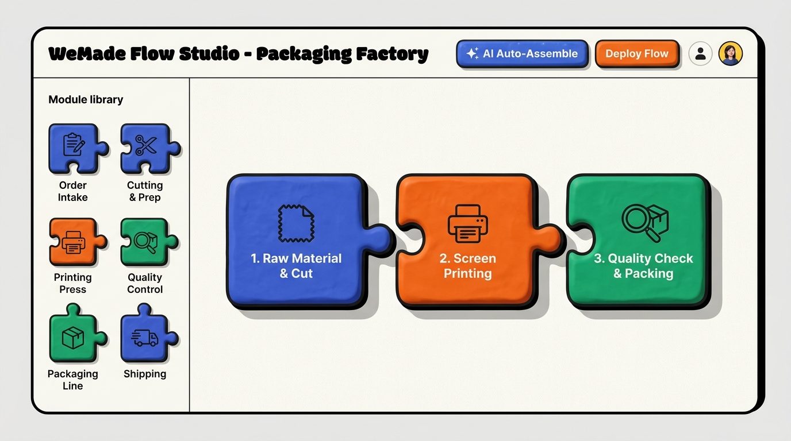
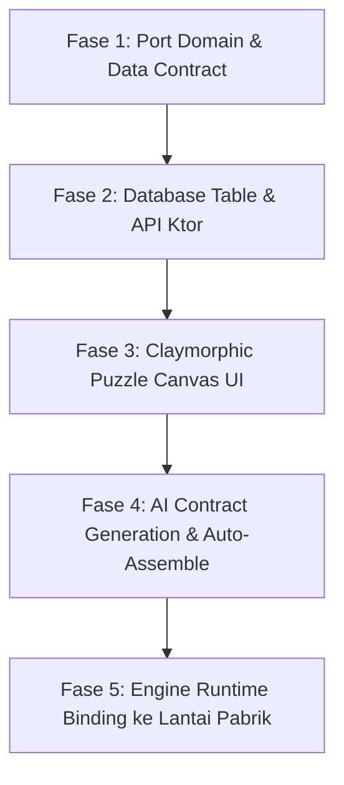

# Planning: WeMade Flow Studio — Visual Puzzle-Based Workflow Builder & AI Contract Generator (Full-Stack)

> **Fitur**: WeMade Flow Studio (Kanvas Alur Pabrik Interaktif Berbasis Puzzle Interlocking 4 Arah & AI Contract Generator)  
> **Tujuan**: Membuka kapabilitas WeMade ERP dari sekadar spesifik garmen menjadi **Modular & Customizable untuk Berbagai Industri** (Percetakan, Packaging, Kerajinan, Makanan, dsb.) tanpa koding ulang.  
> **Prinsip Arsitektur**: Mematuhi §13 — 5 Pilar Full-Stack End-to-End & Standar Styling Claymorphism + Neo-Brutalism (§12).

---

## 0. Konsep Visual & Mental Model

Konsep **WeMade Flow Studio** mengadaptasi mekanik permainan balok/puzzle fisik (seperti Scratch / Unreal Engine Blueprints) yang dipadukan dengan bahasa visual **Claymorphism + Neo-Brutalism** (outline tebal 3dp, hard shadow 6dp, sudut membulat 16–24dp).



### Anatomi Sambungan Puzzle 4 Arah (4-Way Interlocking Ports)

Di pabrik nyata, aliran barang tidak pernah hanya linear kiri-ke-kanan. Kepingan puzzle dirancang memiliki 4 sisi sambungan fungsional:

```
                          ▲ SISI ATAS: TOP_AUXILIARY
                          │ (Bahan Pembantu: Tinta, Lem, SPK, File Artwork)
                          ▼ [Lubang Socket Atas]
            ┌──────────────────────────────────────────────┐
◄───────────┤                                              ├───────────►
SISI KIRI:  │           POS #02: SCREEN PRINTING           │ SISI KANAN:
LEFT_INLET  │                                              │ RIGHT_OUTLET
(Bahan dari │  Durasi: 45 Menit                            │ (Hasil Jadi ke
pos hulu:   │  Operator: 2 Orang                           │  pos hilir:
Kain/Karton)│  Kapasitas: 500 pcs/shift                    │  Kaos Tersablon)
[Lubang     │                                              │ [Tonjolan
 Socket]    └──────────────────────┬───────────────────────┘  Peg]
                                   │
                                   ▼ [Tonjolan Peg Bawah]
                                   │ SISI BAWAH: BOTTOM_REWORK_OR_WASTE
                                   │ (Jalur Limbah/Afval, Rework Jahit, Retur)
                                   ▼
```

1. **Sisi Kiri (`LEFT_INLET`)**: Input bahan baku / setengah jadi dari pos sebelumnya.
2. **Sisi Kanan (`RIGHT_OUTLET`)**: Output barang jadi utama menuju pos hilir.
3. **Sisi Atas (`TOP_AUXILIARY`)**: Input bahan penolong (BOM sekunder), file spesifikasi PDF, atau persetujuan supervisor.
4. **Sisi Bawah (`BOTTOM_REWORK_OR_WASTE`)**: Jalur penanganan limbah/afval (kg) atau jalur putar balik perbaikan (*rework loop*) jika gagal QC.

---

## 1. Lima Pilar Arsitektur Full-Stack End-to-End (§13)

### Pilar 1: Database & Persistence Layer (`server/`)

Sistem memanfaatkan kolom `jsonb` PostgreSQL dengan indeks GIN untuk menyimpan topologi graph kustom per-tenant secara efisien tanpa skema kaku.

#### Migrasi Flyway (`V55__flow_studio_puzzle_workflows.sql`):
```sql
CREATE TABLE IF NOT EXISTS tenant_workflow_definitions (
    id VARCHAR(64) PRIMARY KEY,
    tenant_id VARCHAR(64) NOT NULL,
    workflow_code VARCHAR(64) NOT NULL,
    workflow_name VARCHAR(128) NOT NULL,
    industry_category VARCHAR(64) NOT NULL DEFAULT 'GARMENT',
    version INT NOT NULL DEFAULT 1,
    is_active BOOLEAN NOT NULL DEFAULT TRUE,
    topology_json JSONB NOT NULL,
    created_at TIMESTAMP WITH TIME ZONE NOT NULL DEFAULT NOW(),
    updated_at TIMESTAMP WITH TIME ZONE NOT NULL DEFAULT NOW(),
    CONSTRAINT uq_tenant_workflow UNIQUE (tenant_id, workflow_code)
);

CREATE INDEX idx_tenant_workflow_lookup ON tenant_workflow_definitions(tenant_id, is_active);
CREATE INDEX idx_tenant_workflow_topology_gin ON tenant_workflow_definitions USING GIN (topology_json);

-- Menegakkan isolasi multi-tenancy RLS
ALTER TABLE tenant_workflow_definitions ENABLE ROW LEVEL SECURITY;
CREATE POLICY tenant_workflow_definitions_isolation ON tenant_workflow_definitions
    USING (tenant_id = current_setting('app.current_tenant_id', true));
```

#### Tabel Exposed (`server/.../infrastructure/tables/FlowStudioTables.kt`):
```kotlin
object TenantWorkflowDefinitionsTable : Table("tenant_workflow_definitions") {
    val id = varchar("id", 64)
    val tenantId = varchar("tenant_id", 64)
    val workflowCode = varchar("workflow_code", 64)
    val workflowName = varchar("workflow_name", 128)
    val industryCategory = varchar("industry_category", 64)
    val version = integer("version")
    val isActive = bool("is_active")
    val topologyJson = text("topology_json") // Mapping jsonb string
    val createdAt = timestampWithTimeZone("created_at")
    val updatedAt = timestampWithTimeZone("updated_at")

    override val primaryKey = PrimaryKey(id)
}
```

---

### Pilar 2: Pure Domain Layer (`core/`)

Zero-dependency pada framework UI atau server. Mengembangkan domain `core/domain/pipeline/` yang sudah ada:

#### A. Value Objects & Enums Port Interlocking
```kotlin
enum class PortOrientation {
    LEFT_INLET,
    RIGHT_OUTLET,
    TOP_AUXILIARY,
    BOTTOM_REWORK_OR_WASTE
}

enum class PortDataKind(val displayName: String, val unitSymbol: String) {
    QUANTITY_PCS("Kuantitas Fisik", "pcs"),
    WEIGHT_KG("Timbangan / Massa", "kg"),
    ROLL_MATERIAL("Gulungan Bahan", "roll/yard"),
    SURFACE_AREA("Luas Lembaran", "m²"),
    APPROVAL_TOKEN("Verifikasi / Paraf", "sign"),
    SPECIFICATION_DOC("Dokumen Teknis / SPK", "doc")
}

data class PuzzlePort(
    val portId: String,
    val name: String,
    val orientation: PortOrientation,
    val dataKind: PortDataKind,
    val isRequired: Boolean = true,
    val description: String = ""
)
```

#### B. Entities & Graph Integrity Validator
```kotlin
data class PuzzleNode(
    val nodeId: String,
    val moduleCode: String,
    val title: String,
    val stage: PipelineStage,
    val archetype: ModuleArchetype,
    val ports: List<PuzzlePort>,
    val positionX: Float = 0f,
    val positionY: Float = 0f,
    val isCustomPlugin: Boolean = false
) {
    fun port(id: String): PuzzlePort? = ports.firstOrNull { it.portId == id }
}

data class PuzzleConnection(
    val connectionId: String,
    val fromNodeId: String,
    val fromPortId: String,
    val toNodeId: String,
    val toPortId: String,
    val edgeType: PipelineEdgeType = PipelineEdgeType.FORWARD
)

data class PuzzleWorkflow(
    val workflowId: String,
    val tenantId: TenantId,
    val name: String,
    val industry: String,
    val nodes: List<PuzzleNode>,
    val connections: List<PuzzleConnection>
) {
    /**
     * Memvalidasi bahwa setiap sambungan memiliki PortDataKind yang cocok.
     * Mencegah kesalahan perakitan di mana output Kilogram dihubungkan ke input Pcs
     * tanpa konverter.
     */
    fun validateInterlockingIntegrity(): Result<Unit> {
        // Aturan validasi domain murni
        return Result.success(Unit)
    }
}
```

#### C. Use Cases
1. `AssembleWorkflowWithAiUseCase`: Memanggil AI analyzer untuk menyusun graph workflow baru berdasarkan prompt bahasa alami user.
2. `ValidateWorkflowAssemblyUseCase`: Menjamin graph tidak memiliki *orphan required ports* atau siklus buntu.
3. `SaveTenantWorkflowUseCase`: Menyimpan dan mengaktifkan alur kerja untuk tenant.

---

### Pilar 3: Backend API & Routing (`server/`)

Menggunakan Ktor Server dengan validasi wewenang RBAC (`BusinessModule.PRODUCTION_MRP` / `ModuleAccessLevel.MANAGE`).

| Method | Endpoint | Fungsi | Payload / Response |
|---|---|---|---|
| `GET` | `/api/flow-studio/workflows/active` | Mengambil alur aktif tenant saat ini | `WorkflowDefinitionResponse` |
| `POST` | `/api/flow-studio/workflows` | Menyimpan alur puzzle baru | `SaveWorkflowRequest` |
| `POST` | `/api/flow-studio/ai/assemble` | Menghasilkan alur dari prompt AI | `AiAssembleRequest` $\rightarrow$ `AiAssembleResponse` |
| `GET` | `/api/flow-studio/catalog/library` | Mengambil katalog balok modul yang tersedia | `List<ModuleArchetypeResponse>` |

Contoh DTO Serialisasi:
```kotlin
@Serializable
data class AiAssembleRequest(
    val factoryDescription: String,
    val industryHint: String? = null
)

@Serializable
data class WorkflowDefinitionResponse(
    val workflowId: String,
    val workflowName: String,
    val industry: String,
    val nodes: List<PuzzleNodeDto>,
    val connections: List<PuzzleConnectionDto>
)
```

---

### Pilar 4: Client-Server Integration (`app/shared/`)

- `KtorFlowStudioRepository` mengimplementasikan repository domain dan menghubungkan Ktor Client ke backend.
- **MVI Architecture**:
  - `FlowStudioUiState`:
    - `nodes: List<PuzzleNodeUiModel>`
    - `connections: List<PuzzleConnectionUiModel>`
    - `draggedNode: PuzzleNodeUiModel?`
    - `activeGhostSnapTarget: SnapTarget?`
    - `isAiGenerating: Boolean`
    - `validationErrors: List<String>`
  - `FlowStudioUiEvent`:
    - `OnDragNode(nodeId, offset)`
    - `OnSnapNodes(fromPort, toPort)`
    - `OnDisconnect(connectionId)`
    - `OnRequestAiAssemble(prompt)`
    - `OnSaveWorkflow`

---

### Pilar 5: Shared Presentation Layer (`app/shared/presentation/flowstudio/`)

Mematuhi **Claymorphism Design System** (§12):

1. **`PuzzleCard.kt`**:
   - Dibuat menggunakan custom `Path` / `GenericShape` yang menggambar tonjolan setengah lingkaran (tab) dan lekukan ke dalam (socket) pada sisi-sisi yang aktif.
   - Menggunakan `Modifier.claySurface()` dengan border 3dp (`ClayBorder.Thick`) dan bayangan tegas 6dp (`ClayOffset.Rest`).
2. **`PuzzleCanvas.kt`**:
   - Kanvas tak terbatas (Infinite grid) dengan zoom & pan gesture.
   - Titik socket yang kompatibel berpendar lembut (*pulsating glow*) saat kepingan didekatkan.
   - Haptic / visual feedback "Klak!" saat terjadi *magnetic snap*.
3. **`ModuleLibraryDrawer.kt`**:
   - Palet kepingan di sebelah kiri tempat user menarik modul baru ke atas kanvas rakit.
4. **`AiAssembleDialog.kt`**:
   - Dialog claymorphic dengan input prompt dan preset industri (Pabrik Kardus, Konveksi Baju, Percetakan Sablon, Pengolahan Kopi).

---

## 2. Roadmap Eksekusi Bertahap



1. **Fase 1**: Penambahan `PortOrientation` dan `PortDataKind` pada modul domain `core/.../domain/pipeline/`.
2. **Fase 2**: Tabel `tenant_workflow_definitions` di server & endpoint CRUD topologi.
3. **Fase 3**: Implementasi Custom Shape puzzle dan Drag-and-Drop canvas di Compose Multiplatform.
4. **Fase 4**: Integrasi AI Prompting (Structured JSON output) untuk auto-assemble workflow dari teks.
5. **Fase 5**: Menghubungkan topologi yang disimpan agar otomatis merender formulir input operator di mobile (`/fulfillment` dll.).

---

## 3. Checklist Definition of Done (DoD)

- [ ] Domain murni memiliki unit test 100% lulus untuk validasi puzzle mismatch (misal: tolak sambungan Kg ke Pcs tanpa converter).
- [ ] Database migration `V55` sukses dieksekusi Flyway dan terisolasi dengan multi-tenant RLS.
- [ ] Endpoint Ktor terlindungi session dan tenant context yang valid.
- [ ] UI mematuhi zero literal `Color(0xFF...)` di luar token tema dan nol emoji unicode untuk ikon (menggunakan `ClayIcons.kt`).
- [ ] Build sukses di 5 target: Android, Desktop (JVM), Server, WasmJS, JS.
