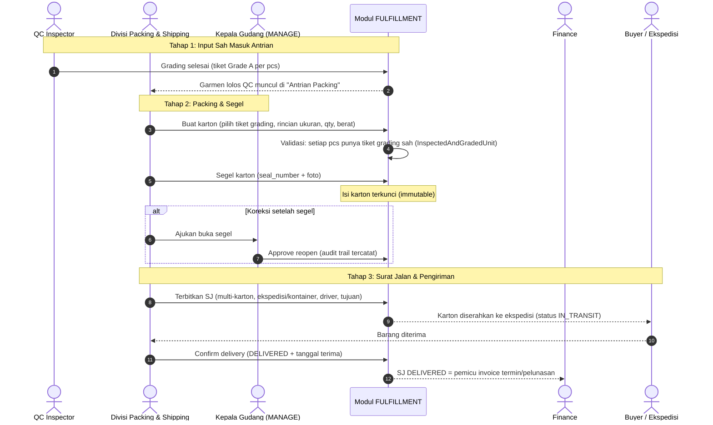

# Planning: Modul FULFILLMENT — Packing, Surat Jalan & Divisi Shipping (Full-Stack)

> **Modul**: Packing & Surat Jalan (`BusinessModule.FULFILLMENT`)
> **Archetype**: `ModuleArchetype.FULFILLMENT` — Input `InspectedAndGradedUnit` → Output `DispatchedShipmentManifest`
> **Integrasi Hulu-Hilir**: QC Grading ──► Packing & Surat Jalan ──► Ekspedisi/Kontainer ──► Pemicu Invoice (Finance)
> **Prinsip Arsitektur**: Mematuhi §13 — 5 Pilar Full-Stack End-to-End & Standar Styling Claymorphism (§12).

---

## 0. Keputusan Arsitektur: Pemisahan Divisi Finishing vs Shipping (WAJIB DIBACA)

Di node pipeline lama (`fob-fulfillment` di `PipelinePresetFactory.kt:433-440`), pekerjaan
**finishing baju** (setrika uap, pasang hangtag) dan **pekerjaan shipping** (karton, Surat Jalan)
digabung dalam satu divisi *"Finishing, Packing & Ekspedisi"*. Ini **konflasi dua archetype yang
berbeda** dan wajib dipisahkan sebelum matriks wewenang dibuat:

```
Archetype FINISHING                          Archetype FULFILLMENT
Input:  AssembledGarmentBundle               Input:  InspectedAndGradedUnit
Output: FinishedGarmentUnit                  Output: DispatchedShipmentManifest
(Cuci, Gosok, Setrika, Trimming)             (Packing Karton, Surat Jalan, Kirim)
   │                                             │
   ▼                                             ▼
 DIVISI FINISHING (Lantai Produksi)          DIVISI PACKING & SHIPPING (Logistik)
 • Setrika uap / steam                       • Verifikasi kuantitas per karton
 • Washing / dry process                     • Karton box, segel, packing list
 • Trimming, pasang label & hangtag          • Terbitkan Surat Jalan ekspedisi
 • Output → dikirim ke QC untuk grading      • Koordinasi ekspedisi/kontainer & resi
```

**Alasan domain (bukan sekadar kebersihan organisasi)**: garmen yang keluar dari setrika **belum
lolos QC grading** — secara kontrak port archetype ia bahkan belum memenuhi tipe input
`InspectedAndGradedUnit`. Memberi divisi Finishing akses ke modul FULFILLMENT sama dengan
membolehkan packing barang yang belum lolos inspeksi. Maka:

1. **Divisi Finishing: NOL akses** ke modul FULFILLMENT.
2. **Divisi Packing & Shipping** (divisi baru, cabang dari Gudang/Logistik): pemilik operasional modul.
3. **Gudang (induk)**: tetap `MANAGE` sesuai seed V17:139 — approval Surat Jalan & koreksi karton.
4. Deskripsi `BusinessModule.FULFILLMENT` (BusinessModule.kt:160) dan node `fob-fulfillment`
   **dibersihkan** dari frasa *"setrika uap (finishing iron)"* — deskripsi modul inilah yang tampil
   di layar RBAC saat admin menugaskan divisi, jadi konflasi ini menular ke matriks akses bila
   tidak dibersihkan.

### Handover Kontrak Pipeline (pola puzzle tetap utuh)

```
SEWING ──► FINISHING ──► QUALITY_CONTROL ──► FULFILLMENT ──► INVOICING
Assembled-  FinishedGarment-  InspectedAnd-     DispatchedShipment-   Invoice
Garment-    Unit              GradedUnit        Manifest              Sampling/Term
Bundle
```

Semua sambungan tervalidasi lewat port typing yang sudah terdaftar di
`OperationalModuleContract.kt` — tidak ada kontrak port baru yang perlu ditemukan.

---

## 1. Pekerjaan Lapangan Divisi Packing & Shipping

| # | Aktivitas | Data yang Diisi | Catatan Fungsi |
|---|---|---|---|
| 1 | **Tarik antrian grading** | Daftar garmen Grade A bertiket QC per PO/SPK | Input sah packing = output QC. Tanpa tiket grading, karton tidak bisa dibuat (ditegakkan di use case). |
| 2 | **Packing karton** | `carton_number`, rincian ukuran per karton (S/M/L/XL), qty pcs, berat kotor | Verifikasi kuantitas fisik vs packing list sebelum segel. |
| 3 | **Segel karton** | `seal_number`, foto karton tersegel | Setelah segel, isi karton **terkunci** (immutable) — koreksi hanya lewat kepala gudang (`MANAGE`). |
| 4 | **Terbitkan Surat Jalan** | Nomor SJ, daftar karton, ekspedisi/nomor kontainer, driver, tujuan, alamat buyer | Satu SJ dapat mencakup banyak karton; menjadi dokumen resmi muat. Ekspedisi fase 1 = input manual (resi/kontainer). |
| 5 | **Update status kirim** | `IN_TRANSIT` → `DELIVERED`, tanggal terima | Memicu Finance menerbitkan invoice termin/pelunasan. |
| 6 | **Retur/varians** | Karton dibuka kembali (butuh approval `MANAGE`), catatan short/over | Kontrak 5 DefectLiability: short pabrik (`FACTORY_WORKMANSHIP`) vs short bahan buyer (`CLIENT_SUPPLIED_DEFECT`) dicatat berbeda. |
| 7 | **Telemetri node** | `wipPieces` (karton terbuka), `cycleTimeHours`, `healthStatus` | Agar node berkedip hijau/kuning/merah di kanvas Factory Flow (Kontrak 6). |

### Kepemilikan Stok (Kontrak 3 — `StockOwnershipSemantics`)

| Preset | Semantik | Konsekuensi |
|---|---|---|
| FOB Full Package | `INTERNAL_FINISHED_GOODS` | Karton = aset pabrik sampai Surat Jalan diterima buyer. |
| CMT Makloon | `CONSIGNED_CLIENT_MATERIAL` | Baju jadi **milik buyer** sejak jadi (Rp 0 di neraca pabrik); SJ wajib, rekonsiliasi wajib. |
| Brand D2C | `INTERNAL_FINISHED_GOODS` | Karton pick-pack per order marketplace. |

Sudah terkodifikasi di `OperationalModuleCatalog.FulfillmentModule.stockOwnershipFor()` —
planning ini tinggal menegakkan di layer persistence & UI.

---

## 2. End-to-End Workflow: Dari Grading QC Sampai Invoice



---

## 3. Desain UI Divisi Packing & Shipping

Bahasa visual **Claymorphism + Neo-Brutalism** (`ClayCard`, `ClayButton`, `ClayBadge`,
`Modifier.claySurface`, token `WeMadeColors`, ikon Canvas dari `ClayIcons.kt` — nol emoji).

### Tampilan 1: Packing Bench (Layar Utama Staf Shipping)

```
┌──────────────────────────────────────────────────────────────────────────────────────────┐
│ PACKING BENCH                                    [Antrian: 142 pcs] [Karton Terbuka: 3]  │
├───────────────────────────────────┬──────────────────────────────────────────────────────┤
│ ANTRIAN GRADING (tiket QC lolos)  │ KARTON SEDANG DIBANGUN #CTN-2026-09-014              │
│ ┌───────────────────────────────┐ │ ┌──────────────────────────────────────────────────┐ │
│ │ PO-5512 • FLORAL CARDIGAN     │ │ │ Ukuran: S x40  M x60  L x58  XL x24   TOTAL: 182 │ │
│ │ [Grade A] 182 pcs siap packing│ │ │ Berat kotor: 48.5 kg                             │ │
│ │ → [Masukkan Karton]           │ │ │ ──────────────────────────────────────────────── │ │
│ ├───────────────────────────────┤ │ │ [Segel Karton]  (kunci isi + seal_number)        │ │
│ │ PO-5518 • RIB DRESS           │ │ └──────────────────────────────────────────────────┘ │
│ │ [Grade A] 96 pcs              │ │                                                      │
│ └───────────────────────────────┘ │ KARTON TERSEGEL (menunggu SJ):                       │
│                                   │ • #CTN-012 (182 pcs)  • #CTN-013 (180 pcs)           │
└───────────────────────────────────┴──────────────────────────────────────────────────────┘
```

### Tampilan 2: Surat Jalan (List & Cetak)

```
┌──────────────────────────────────────────────────────────────────────────────────────────┐
│ SURAT JALAN                                                        [+ Buat SJ]           │
├──────────┬──────────────────────┬─────────────────┬────────────┬─────────────────────────┤
│ No. SJ   │ Karton               │ Ekspedisi       │ Tujuan     │ Status                  │
├──────────┼──────────────────────┼─────────────────┼────────────┼─────────────────────────┤
│ SJ-0901  │ CTN-012, CTN-013     │ Kontainer MSK-U │ JKT Buyer  │ [IN_TRANSIT]            │
│ SJ-0900  │ CTN-009              │ JNE Cargo       │ Bandung    │ [DELIVERED] 05-Sep      │
│ SJ-0899  │ CTN-007, CTN-008     │ Kontainer MSK-T │ Semarang   │ [ISSUED] (belum muat)   │
└──────────┴──────────────────────┴─────────────────┴────────────┴─────────────────────────┘
```

---

## 4. Arsitektur Teknis 5 Pilar (Full-Stack End-to-End)

Sesuai aturan wajib **§13 Full-Stack Planning** di `AGENTS.md`.

### Pilar 1: Database & Persistence Layer (`server/`)

Migrasi Flyway baru: `V43__create_fulfillment_schema.sql` (slot berikutnya setelah V42):

```sql
CREATE TABLE IF NOT EXISTS fulfillment_cartons (
    id                 VARCHAR(64) PRIMARY KEY,
    tenant_id          VARCHAR(64) NOT NULL REFERENCES tenants(id) ON DELETE CASCADE,
    production_ref     VARCHAR(64) NOT NULL,              -- PO / SPK massal
    carton_number      VARCHAR(40) NOT NULL,
    size_breakdown     JSONB NOT NULL DEFAULT '{}',       -- {"S":40,"M":60,"L":58,"XL":24}
    quantity_pcs       INT NOT NULL DEFAULT 0,
    gross_weight_kg    DECIMAL(8,2) NOT NULL DEFAULT 0,
    graded_ticket_ids  JSONB NOT NULL DEFAULT '[]',       -- tiket QC Grade A sebagai bukti input sah
    seal_number        VARCHAR(40),
    status             VARCHAR(20) NOT NULL DEFAULT 'PACKING',  -- PACKING | SEALED | REOPENED
    created_at / updated_at TIMESTAMPTZ NOT NULL DEFAULT CURRENT_TIMESTAMP
);
CREATE INDEX IF NOT EXISTS idx_fulfillment_cartons_pipeline
    ON fulfillment_cartons (tenant_id, status, updated_at DESC);

CREATE TABLE IF NOT EXISTS fulfillment_surat_jalan (
    id                 VARCHAR(64) PRIMARY KEY,
    tenant_id          VARCHAR(64) NOT NULL REFERENCES tenants(id) ON DELETE CASCADE,
    sj_number          VARCHAR(40) NOT NULL,
    carrier_info       JSONB NOT NULL DEFAULT '{}',       -- {mode, ekspedisi, kontainer, driver, resi}
    destination        JSONB NOT NULL DEFAULT '{}',       -- {buyer, alamat, kontak}
    status             VARCHAR(20) NOT NULL DEFAULT 'ISSUED',   -- ISSUED | IN_TRANSIT | DELIVERED
    shipped_at / delivered_at TIMESTAMPTZ
);
-- tabel pivot karton <-> SJ (satu SJ banyak karton)
CREATE TABLE IF NOT EXISTS fulfillment_sj_cartons ( ... );

SELECT apply_tenant_rls('fulfillment_cartons');
SELECT apply_tenant_rls('fulfillment_surat_jalan');
```

Definisi tabel Exposed baru di `FulfillmentTables.kt` (pola `SamplingTables.kt`), repository
`PostgresFulfillmentRepository` mengimplementasikan interface domain.

### Pilar 2: Pure Domain Layer (`core/`)

Bebas framework:

- **Value Objects** (`FulfillmentValueObjects.kt`):
  `CartonNumber`, `SuratJalanNumber`, `SealNumber`, `FulfillmentStatus`
  (`PACKING`, `SEALED`, `REOPENED`, `ISSUED`, `IN_TRANSIT`, `DELIVERED`).
- **Entity behavior** (immutable copy, tanpa `var`):
  - `Carton.seal(seal: SealNumber, at: Instant): Carton` — menolak segel karton kosong.
  - `Carton.reopen(reason, approver, at): Carton` — hanya valid jika status `SEALED`; wajib audit trail.
  - `SuratJalan.dispatch(carrier, at): SuratJalan` — menolak jika tidak ada karton.
  - `SuratJalan.confirmDelivery(at): SuratJalan` — hanya dari `IN_TRANSIT`.
- **Use Cases** (`core/.../domain/fulfillment/usecases/`), return `Result<T>`:
  - `GetFulfillmentQueueUseCase` — antrian garmen lolos QC + karton terbuka.
  - `CreatePackingCartonUseCase` — **guard**: setiap pcs wajib punya tiket grading sah.
  - `SealCartonUseCase` / `ReopenCartonUseCase` (yang kedua cek level `MANAGE`).
  - `IssueSuratJalanUseCase` — validasi multi-karton & generate nomor SJ.
  - `ConfirmDeliveryUseCase` — memicu event domain `ShipmentDelivered` (pemicu invoice).
- **Domain Event** (past tense): `CartonSealed`, `SuratJalanIssued`, `ShipmentDelivered`.
- **Telemetri**: `wipPieces` = karton berstatus `PACKING`; output untuk node Factory Flow.

### Pilar 3: Backend API & Routing (`server/`)

Endpoint Ktor baru di `FulfillmentRoutes.kt`:

| Method | Path | Fungsi |
|---|---|---|
| `GET` | `/api/tenant/fulfillment/queue` | Antrian grading lolos + karton terbuka + SJ list |
| `POST` | `/api/tenant/fulfillment/cartons` | Buat karton (guard tiket grading) |
| `PATCH` | `/api/tenant/fulfillment/cartons/{id}/seal` | Segel karton |
| `PATCH` | `/api/tenant/fulfillment/cartons/{id}/reopen` | Buka segel (wajib `MANAGE`) |
| `POST` | `/api/tenant/fulfillment/surat-jalan` | Terbitkan SJ multi-karton |
| `GET` | `/api/tenant/fulfillment/surat-jalan/{id}/pdf` | Cetak SJ |
| `PATCH` | `/api/tenant/fulfillment/surat-jalan/{id}/delivered` | Konfirmasi terima |

Semua endpoint dijaga gerbang RBAC `requireFulfillmentAccess(level)` dengan konteks `tenant_id`
(pola `ModuleAccessConfig` + `AccessDecision` yang sudah ada).

### Pilar 4: Client-Server Integration (`app/shared/`)

- **`FulfillmentApiClient` & `FulfillmentRemoteDataSource`** (Ktor Client, pola `SamplingApiClient`):
  pemanggilan endpoint queue, carton, surat jalan; mapping DTO jaringan → entity domain;
  penanganan Loading / Success / Error / Timeout + offline fallback (cache antrian terakhir).
- **`FulfillmentViewModel`** (`CommonViewModel`):
  - `StateFlow<FulfillmentUiState>` dengan:
    `gradingQueue: List<GradedTicketUiModel>`,
    `openCartons: List<CartonUiModel>`,
    `suratJalanList: List<SuratJalanUiModel>`.
  - `sealed interface FulfillmentUiEvent`: `CreateCarton`, `SealCarton`, `ReopenCarton`,
    `IssueSuratJalan`, `ConfirmDelivery`.
  - `UiEffect` untuk toast sukses/gagal (tanpa business logic di ViewModel).

### Pilar 5: Shared Presentation Layer (`app/shared/presentation/fulfillment/`)

- `PackingBenchScreen.kt` — antrian grading + builder karton + tombol segel (Tampilan 1).
- `SuratJalanScreen.kt` — list SJ + status badge + cetak PDF + confirm delivery (Tampilan 2).
- Komponen diambil dari katalog `designsystem/` (`ClayCard`, `ClayButton`, `ClayBadge`,
  `claySurface`); nol literal `Color(0xFF…)` di luar `WeMadeTheme.kt`; ikon dari `ClayIcons.kt`
  (`IconTruck`, `IconCheck`, `IconFileText`, `IconLayers`).
- Responsif Web/Desktop & Mobile; navigasi via `AppNavScreen` *"Packing & Pengiriman"* yang sudah ada.

---

## 5. Matriks Akses & Menu Divisi Packing & Shipping (RBAC)

### Scope Modul: Terkunci Global (`ScopeCapability.GLOBAL_ONLY`)

- Data karton & Surat Jalan adalah **aset bersama pabrik** — scope otomatis terkunci
  `DataScope.ALL_TENANT_DATA`. Opsi *Data Sendiri* / *Data Bawahan* **disembunyikan** dari modal
  wewenang; UI hanya menampilkan badge `Seluruh Pabrik (Shared)`.
- Dilindungi `ModuleAccessConfig.sanitizeFor(module)` — payload ilegal dipaksa kembali ke
  `ALL_TENANT_DATA`.

### Matriks Akses per Divisi (AccessLevel: VIEW < OPERATE < MANAGE)

| Divisi | FULFILLMENT | Alasan |
|---|---|---|
| **Packing & Shipping** (divisi baru) | `OPERATE` | Pemilik operasional: packing, segel, SJ, koordinasi ekspedisi. |
| **Gudang / Warehouse** | `MANAGE` / ALL_TENANT_DATA | Approval SJ & koreksi karton tersegel. Sudah di-seed di V17:139. |
| **Finishing** | ❌ **NOL akses** | Output-nya (`FinishedGarmentUnit`) belum lolos QC grading — belum memenuhi kontrak input `InspectedAndGradedUnit`. Melarang packing barang belum inspeksi. |
| **QC** | `VIEW` | Verifikasi tiket grading masuk antrian packing. |
| **Sales** | `VIEW` | Cek status pengiriman per deal untuk follow-up buyer. |
| **PPIC** | `VIEW` | Telemetri WIP node fulfillment untuk penjadwalan. |
| **Finance** | `VIEW` | SJ `DELIVERED` = pemicu invoice; tidak boleh lihat operasional packing. |

### Menu yang Terlihat oleh Staf Packing & Shipping

Navigation drawer ter-filter oleh gerbang RBAC (`AppNavScreen.businessModule`), jadi menu tanpa
wewenang tidak dirender sama sekali:

| Menu | Akses |
|---|---|
| **Packing & Pengiriman** (`FULFILLMENT`) | ✅ OPERATE — layar utama (landing screen) |
| **Quality Control** | 👁 VIEW — tiket grading |
| **Gudang & Bahan Baku** (`INVENTORY`) | 👁 VIEW — stok material packing (karton, plastik, hangtag) |
| **Penjualan & Pelanggan** (`CRM_SALES`) | 👁 VIEW — alamat & kontak tujuan kirim |
| **Bagan Organisasi** (`ORG_CHART`) | 👁 VIEW — global shared semua karyawan |
| RBAC, Factory Flow, Sampling, Tech Pack, HPP, MRP, Lantai Produksi, Invoice | ❌ tersembunyi |

Semua penugasan di atas adalah **titik awal seed, bukan kebenaran permanen** — admin pabrik dapat
mengubahnya kapan saja via layar RBAC (`DepartmentModuleAssignment` + `specific_role_ids`).

### Prasyarat Cleanup (ikut dikerjakan)

1. `BusinessModule.FULFILLMENT.description` (BusinessModule.kt:160) → hapus *"Finishing setrika
   uap"* → *"Verifikasi kuantitas per karton, segel karton, dan cetak Surat Jalan ekspedisi."*
2. `PipelinePresetFactory.kt:439-440` → deskripsi node & `assignedDepartment` → `"Packing & Shipping"`.
3. Seed divisi `packing_shipping` (pola V4) + seed penugasan modulnya (pola V17, join by `code`).

---

## 6. User Review & Approval Required

> [!IMPORTANT]
> **Keputusan Bisnis yang Diusulkan untuk Disetujui:**
> 1. **Pemisahan Divisi**: Finishing (setrika/washing/trimming) dipisah dari Packing & Shipping;
>    Finishing tidak diberi akses apa pun ke modul FULFILLMENT.
> 2. **Segel Karton Immutable**: setelah segel, isi karton terkunci; koreksi hanya lewat approval
>    kepala gudang (`MANAGE`) dengan audit trail.
> 3. **Guard Tiket Grading**: karton tidak dapat dibuat tanpa tiket QC Grade A yang sah —
>    ditegakkan di `CreatePackingCartonUseCase`, bukan hanya di UI.
> 4. **Ekspedisi Fase 1 Manual**: input ekspedisi/kontainer/resi manual; integrasi API tracking
>    kurir disiapkan sebagai fase 2 (struktur `carrier_info` JSONB sudah siap menampung).
> 5. **SJ DELIVERED = Pemicu Invoice**: Finance hanya boleh menerbitkan invoice termin/pelunasan
>    setelah `ShipmentDelivered` tercatat.

---

## 7. Verification Plan

### Automated Tests
- **Unit Test Domain** (`core/src/commonTest/.../FulfillmentDomainTest.kt`):
  - `seal_carton_when_already_sealed_should_throw_exception`.
  - `create_carton_when_graded_ticket_missing_should_fail` (guard grading ditegakkan di domain).
  - `issue_surat_jalan_without_cartons_should_fail`.
  - `confirm_delivery_when_in_transit_should_succeed` / `when_issued_should_fail`.
  - `reopen_carton_without_manage_level_should_fail`.
- **Unit Test Codec**: round-trip encode/decode `size_breakdown`, `carrier_info`, `status`.
- **Integration Test** (`server/src/test/...`): endpoint SJ + RLS tenant isolation (tenant A tidak
  melihat karton tenant B), pola `PostgresSamplingOrderRepositoryIntegrationTest`.

### Manual Verification (Dev Server)
1. Buka modul **QC** → selesaikan grading (tiket Grade A).
2. Login sebagai persona divisi **Packing & Shipping** → verifikasi hanya 5 menu yang muncul
   (1 kerja + 4 VIEW) dan landing langsung ke Packing Bench.
3. Buat karton dari antrian grading → segel → coba edit isi (harus ditolak) → ajukan reopen →
   approve sebagai kepala gudang.
4. Terbitkan SJ multi-karton → cetak PDF → update ke `IN_TRANSIT` → `DELIVERED`.
5. Verifikasi Finance melihat status SJ (VIEW) dan pemicu invoice aktif.
6. Login sebagai persona **Finishing** → verifikasi menu *Packing & Pengiriman* tidak muncul dan
   akses langsung via URL `/fulfillment` ditolak gerbang RBAC (server-side, bukan hanya UI).
7. Kompilasi 5 target:
   ```bash
   ./gradlew :app:shared:compileKotlinJvm :app:shared:compileKotlinWasmJs \
             :app:shared:compileKotlinJs :app:shared:assembleAndroidMain \
             :app:shared:jvmTest
   ```
