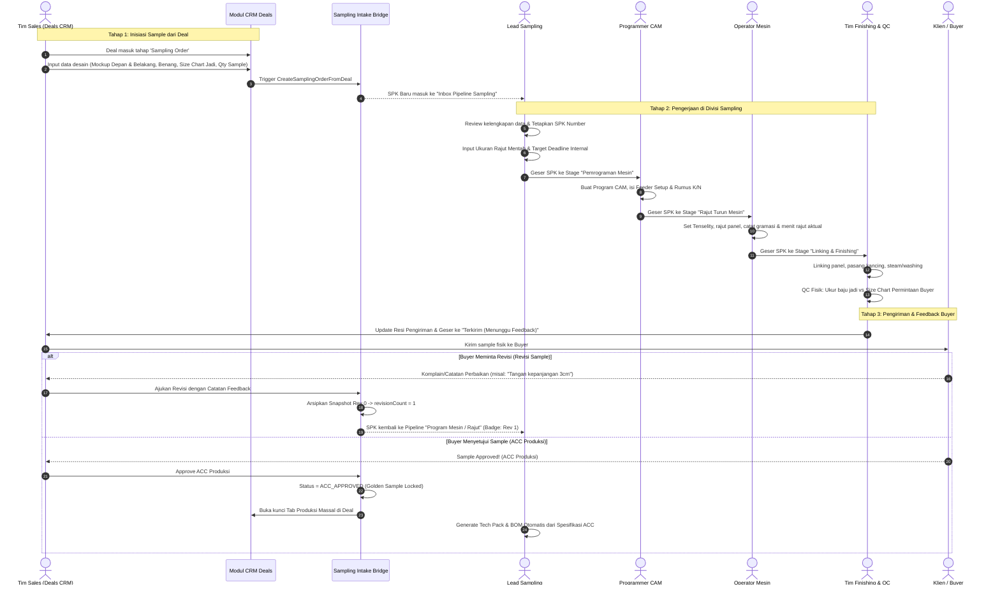
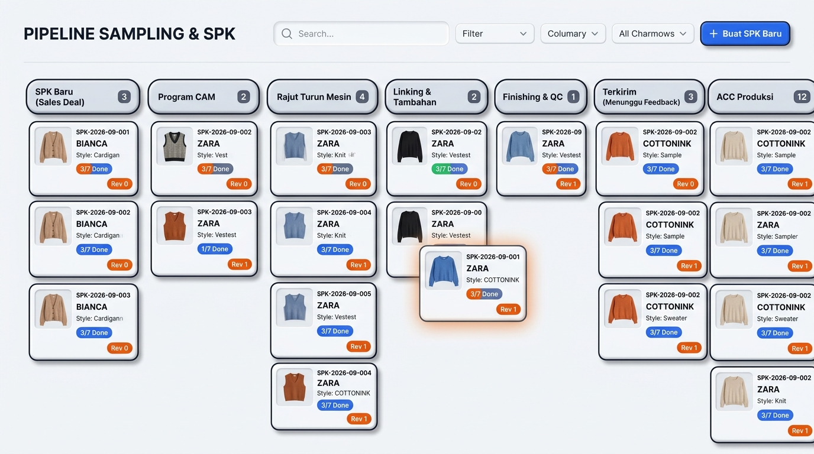
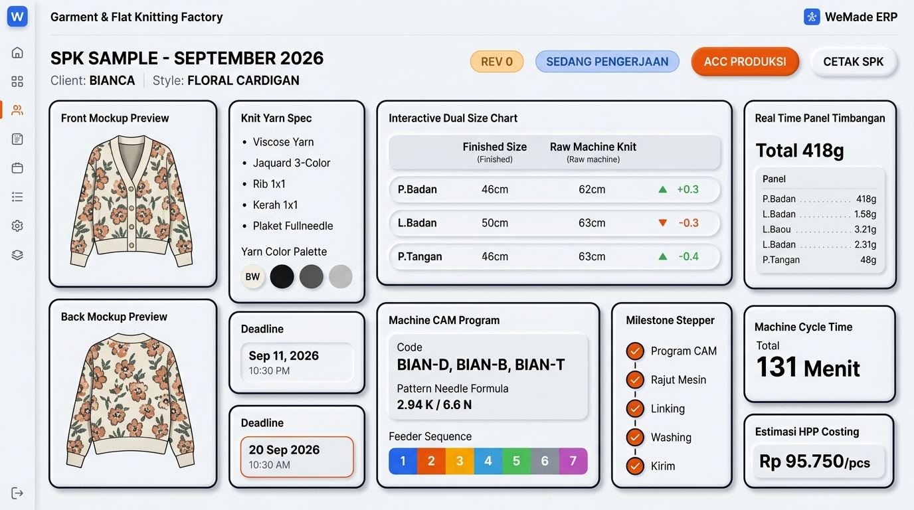

# Planning: Pipeline & Digital SPK Workbench Divisi Sampling (Full-Stack)

> **Modul**: Divisi Sampling & SPK Rajut (`BusinessModule.SAMPLING_ORDER`)
> **Referensi Lapangan**: Lembar Kerja Fisik *SPK SAMPLE BULAN SEPTEMBER* (Pabrik Rajut Flat Knitting)
> **Integrasi Hulu-Hilir**: Masuk otomatis dari CRM Deals (Sales) ──► Pipeline Pengerjaan Divisi Sampling ──► ACC Produksi (Golden Sample Lock) ──► Handover ke Tech Pack & Produksi Massal.
> **Prinsip Arsitektur**: Mematuhi §13 — 5 Pilar Full-Stack End-to-End & Standar Styling Claymorphism (§12).

---

## 1. Analisis Data SPK Sample: Sales (Deals) vs Tim Sampling

Berdasarkan data dari lembar kerja fisik pabrik pada foto:

```
┌──────────────────────────────────────┐       ┌─────────────────────────────────────────────────────────┐
│     DATA DARI SALES (DEALS CRM)      │  ───► │            DATA YANG DIISI TIM SAMPLING                 │
│  (Kebutuhan Bisnis & Harapan Buyer)  │       │       (R&D, Pemrograman Mesin, Setting & Aktual)        │
└──────────────────────────────────────┘       └─────────────────────────────────────────────────────────┘
```

### A. Data yang Dikirim Otomatis dari Tim Sales (Deals CRM)
Data ini diinput oleh Sales saat negosiasi deal dan menjadi input awal bagi tim sampling:
1. **Identitas Pesanan & Klien**:
   - Nama Klien/Brand (`CLIENT`: contoh *BIANCA*)
   - Nama Desain / Style (`STYLE`: contoh *FLORAL CARDIGAN*)
   - Nomor SPK Referensi & Deal ID
2. **Visual Desain (Mockup)**:
   - Foto Mockup Tampak Depan & Tampak Belakang (*3 Variasi Warna Floral Knit Cardigan: Offwhite/BW, Dark Grey, Black*)
3. **Preferensi Bahan & Rajut Dasar**:
   - Jenis Benang Dasar (`BENANG`: contoh *VISCOSE*)
   - Jenis Rajut Permintaan (`JENIS RAJUT`: contoh *JAQUARD 3-COLOR*)
   - Keterangan Komposisi Warna (`KETERANGAN`: *offwhite6302 + HITAM + dark grey 1869 + light grey M71*)
4. **Ukuran Jadi yang Diminta Buyer (`DETAIL SIZE CHART UKURAN JADI`)**:
   - Point of Measurement (POM) dimensi jadi: Panjang Badan (60 cm), Lebar Badan (55 cm), Panjang Tangan (60 cm), Rib (10 cm), Kerah (3 cm).
5. **Komersial & Target Kirim**:
   - Jumlah Sampel yang dipesan (contoh: 2 pcs)
   - Sampling Fee (Biaya pembuatan sample)
   - Target Deadline Pengiriman ke Buyer (`DEADLINE PENGIRIMAN`: contoh *12-Aug-2026*)
   - Catatan Khusus Buyer (misal: "motif bunga agak ke atas", "fitting loose").

---

### B. Data yang Wajib Diisi & Dikerjakan oleh Tim Sampling
Tim sampling (terdiri dari R&D, Programmer CAM, Operator Mesin, Linking, dan QC) mengisi data teknis realisasi pabrik:

| Bagian SPK | Penanggung Jawab | Data yang Diisi / Ditetapkan | Penjelasan Fungsi Pabrik |
|---|---|---|---|
| **1. Jadwal Internal Sampling** | R&D / Lead Sampling | • `deadline_program`: 7-Aug-2026<br>• `deadline_finishing`: 10-Aug-2026<br>• `deadline_delivery`: 12-Aug-2026 | Memecah deadline buyer menjadi milestone internal agar tidak telat turun mesin & finishing. |
| **2. Konstruksi Detail Rajut** | R&D Sampling | • Rib Spec: `1 x 1 (2 PLAY)`<br>• Kerah Spec: `1 x 1 (2 PLAY)`<br>• Plaket Spec: `FULLNEEDLE` | Menentukan jenis anyaman part pendukung baju agar rajutan kokoh dan tidak bergelombang. |
| **3. Size Chart Ukuran Rajut Mentah (`UKURAN RAJUT`)** | R&D / Pola Rajut | • P. Badan: 55 cm (turun mesin)<br>• L. Badan: 56 cm<br>• P. Tangan: 55 cm<br>• Turun Kerah: 6 cm, Bukaan Kerah: 19 cm<br>• Arm Hole: 25 cm, Kerah: 6 cm<br>• Rib Badan & Tangan: 10 cm<br>• L. Plaket: 2.5 cm, Bukaan Tangan: 10 cm, L. Bahu: 43 cm | **Kritis**: Rajutan mentah akan menyusut atau melar setelah turun mesin, proses linking, dan cuci/steam. Tim sampling menentukan ukuran cetak mesin agar saat jadi pas dengan ukuran buyer. |
| **4. Setup Program Mesin (CAM)** | Programmer Rajut | • File Program Depan: `BIAN-D`<br>• Belakang: `BIAN-B`<br>• Tangan: `BIAN-T`<br>• Kerah: `BIAN-KR`<br>• Plaket: `BIAN-PL` | Nama file program CAM (Shima Seiki / Stoll) yang diunggah/di-load ke mesin rajut komputer. |
| **5. Rumus Pola Jarum** | Programmer Rajut | • P. Badan: `2.94 K` (Kurs)<br>• L. Badan: `6.6 N` (Needle/Jarum)<br>• Rib: `4.7 K` | Kepadatan baris jarum per inch pada mesin flat knitting. |
| **6. Instruksi Feeder / Panah Benang** | Programmer / Operator | Feeder 1 s/d 7:<br>• F1: `RIB STRIPE 1 PLAY (HITAM)`<br>• F2: `RIB 1 PLAY (BW)`<br>• F3: `DASAR 1 PLAY (BW)`<br>• F4: `STRIPE 1 PLAY (M71)`<br>• F5: `STRIPE 1 PLAY (DARK GREY)`<br>• F6: `RIB 1 PLAY (HITAM)`<br>• F7: `BS POLY` | Peta jalur feeder benang pada carrier mesin rajut sesuai kombinasi jacquard warna. |
| **7. Matrix Tenselity (Settingan Tension)** | Operator Mesin Rajut | Parameter tension per bagian (Badan, Tangan, Kerah):<br>• BS Poly, BS Tarik, Silang, Rib, TIF Rib, Produksi, Jait Mati, BS Warna, Motong | Menentukan kerapatan rajutan fisik mesin agar tidak terlalu kendor atau terlalu kaku. |
| **8. Timbangan Gramasi Aktual** | Operator / QC Sampling | Realisasi timbangan per panel:<br>• Depan: `117 gr`<br>• Belakang: `117 gr`<br>• Tangan: `145 gr`<br>• Kerah: `11 gr`<br>• Plaket: `28 gr`<br>➡️ **Total Gramasi Aktual: 418 gr** | Basis perhitungan pemakaian benang riil untuk HPP Massal! |
| **9. Stopwatch Waktu Mesin (Cycle Time)** | Operator Mesin | Realisasi menit rajut per panel:<br>• Depan: `37 menit`<br>• Belakang: `37 menit`<br>• Tangan: `46 menit`<br>• Kerah: `3 menit`<br>• Plaket: `8 menit`<br>➡️ **Total Cycle Time: 131 menit / pcs** | Menghitung kapasitas produksi mesin dan biaya depresiasi/listrik per pcs. |
| **10. Instruksi Finishing & Proses Tambahan** | Tim Finishing / QC | • Linking: Catatan jahit linking<br>• Proses Tambahan: `Pasang Kancing` (atau bordir/sablon)<br>• Washing: `TIDAK WASHING` / `WASHING` | Perakitan panel rajut menjadi pakaian siap pakai. |
| **11. Logistik & Resi** | Admin Sampling | • Ekspedisi & Nomor Resi Pengiriman Sample ke Buyer | Memastikan sampel terlacak sampai ke tangan klien tepat waktu. |
| **12. Kalkulasi HPP & Keputusan ACC** | Lead Sampling & Sales | • Kalkulasi Estimasi HPP Massal<br>• Keputusan: `ACC PRODUKSI` atau `REVISI (Rev 1, 2..)` | Jika ACC, mengunci spesifikasi (*Golden Sample Lock*) dan menjadi dasar Tech Pack massal. |

---

## 2. End-to-End Workflow: Dari Deals ke Pipeline Sampling



---

## 3. Desain UI Divisi Sampling

Antarmuka Divisi Sampling dirancang responsif dengan bahasa visual **Claymorphism + Neo-Brutalism**:

### Tampilan 1: Pipeline Kanban Board Divisi Sampling
Menampilkan visualisasi antrian seluruh SPK Sample yang sedang berjalan di pabrik:



### Tampilan 2: Digital SPK Sample Workbench (Detail Lembar Kerja)
Ketika salah satu kartu SPK diklik, terbuka antarmuka detail yang meniru persis form kerja fisik pabrik pada foto:




```
┌────────────────────────────────────────────────────────────────────────────────────────────────────────────────────────┐
│ SPK-2026-09-001  •  CLIENT: BIANCA  •  STYLE: FLORAL CARDIGAN   [Rev 0] [Sedang Pengerjaan]   [Cetak PDF] [ACC PRODUKSI]│
├────────────────────────────────┬───────────────────────────────────────────────┬───────────────────────────────────────┤
│ KOLOM KIRI (30%): IDENTITAS &  │ KOLOM TENGAH (45%): SPESIFIKASI TEKNIS & SIZE │ KOLOM KANAN (25%): REALISASI PRODUKSI │
│ VISUAL MOCKUP                  │ CHART GANDA                                   │ & MILESTONE TRACKER                   │
├────────────────────────────────┼───────────────────────────────────────────────┼───────────────────────────────────────┤
│ [FOTO TAMPAK DEPAN]            │ 📊 SIZE CHART GANDA: JADI VS RAJUT MENTAH     │ ⏱️ HASIL TIMBANGAN & WAKTU RAJUT      │
│ [FOTO TAMPAK BELAKANG]         │ ┌──────────────┬──────┬──────┬──────┐         │ • Depan:    117 gr  |  37 Menit       │
│                                │ │ Parameter    │ Jadi │Rajut │Selisih│        │ • Belakang: 117 gr  |  37 Menit       │
│ 🧵 KETERANGAN BENANG:          │ ├──────────────┼──────┼──────┼──────┤         │ • Tangan:   145 gr  |  46 Menit       │
│ • Benang: Viscose              │ │ P. Badan     │60 cm │55 cm │ -5cm │         │ • Kerah:     11 gr  |   3 Menit       │
│ • Jenis: Jaquard 3-Color       │ │ L. Badan     │55 cm │56 cm │ +1cm │         │ • Plaket:    28 gr  |   8 Menit       │
│ • Rib: 1x1 (2 Play)            │ │ P. Tangan    │60 cm │55 cm │ -5cm │         │ ───────────────────────────────────── │
│ • Kerah: 1x1 (2 Play)          │ │ Arm Hole     │  -   │25 cm │  -   │         │ TOTAL: 418 Gram / Pcs | 131 Menit     │
│ • Plaket: Fullneedle           │ └──────────────┴──────┴──────┴──────┘         │                                       │
│ • Warna: Offwhite6302 + Hitam +│                                               │ 💰 KALKULASI ESTIMASI HPP MASSAL:     │
│   Dark Grey 1869 + Light Grey  │ 💻 CAM MACHINE PROGRAM:                       │ • Bahan Benang:  Rp 48.000            │
│                                │ • Depan: BIAN-D   • Belakang: BIAN-B          │ • Listrik/Mesin: Rp 32.750            │
│ 📅 TARGET DEADLINE:            │ • Tangan: BIAN-T  • Kerah: BIAN-KR            │ • CMT & Finishing: Rp 15.000          │
│ • Program CAM: 07-Aug-2026     │ • Plaket: BIAN-PL                             │ ───────────────────────────────────── │
│ • Finishing:   10-Aug-2026     │ • Rumus: P 2.94 K | L 6.6 N | Rib 4.7 K       │ ESTIMASI HPP: Rp 95.750 / pcs         │
│ • Pengiriman:  12-Aug-2026     │                                               │                                       │
│                                │ 🎯 INSTRUKSI FEEDER & PANAH (1-7):            │ 🏁 MILESTONE PROGRESS CHECKLIST:      │
│ 🚚 LOGISTIK PENGIRIMAN:        │ • F1: Rib Stripe 1 Play (Hitam)               │ [x] 1. Program Mesin (26-Aug-2026)    │
│ • Kurir: JNE Cargo             │ • F2: Rib 1 Play (BW)                         │ [x] 2. Rajut Turun Mesin (27-Aug-2026)│
│ • No. Resi: JNE-9081239812     │ • F3: Dasar 1 Play (BW)                       │ [x] 3. Proses Tambahan (28-Aug-2026)  │
│                                │ • F4: Stripe 1 Play (M71)                     │ [ ] 4. Linking (Perakitan)            │
│                                │ • F5: Stripe 1 Play (Dark Grey)               │ [ ] 5. Washing / Steam                │
│                                │ • F6: Rib 1 Play (Hitam)                      │ [ ] 6. Kirim Sample                   │
│                                │ • F7: BS Poly                                 │ [ ] 7. Kalkulasi HPP & ACC            │
│                                │                                               │                                       │
│                                │ ⚙️ TENSELITY SETTING (BADAN/TANGAN/KERAH):    │ 🔄 RIWAYAT REVISI:                    │
│                                │ BS Poly, BS Tarik, Silang, Rib, Produksi..    │ • Rev 0: Awal pembuatan (Aktif)       │
└────────────────────────────────┴───────────────────────────────────────────────┴───────────────────────────────────────┘
```

---

## 4. Arsitektur Teknis 5 Pilar (Full-Stack End-to-End)

Sesuai aturan wajib **§13 Full-Stack Planning** di `AGENTS.md`:

### Pilar 1: Database & Persistence Layer (`server/`)
- Memperluas skema PostgreSQL yang sudah ada (`sampling_orders`, `sampling_knit_specs`, `sampling_machine_programs`, `sampling_yield_timings`, `sampling_milestones` di V23-V40):
  - Migrasi Flyway baru: `V41__sampling_pipeline_and_tenselity_matrix.sql`:
    - Menambahkan kolom stage pengerjaan fisik ke `sampling_orders`:
      `pipeline_stage VARCHAR(30) NOT NULL DEFAULT 'NEW_INTAKE'` (`NEW_INTAKE`, `CAM_PROGRAMMING`, `MACHINE_KNITTING`, `LINKING_ASSEMBLY`, `FINISHING_QC`, `IN_DELIVERY`, `ACC_APPROVED`, `REVISED`).
    - Kolom `tenselity_matrix JSONB NOT NULL DEFAULT '{}'` di `sampling_machine_programs` untuk menyimpan mapping tenselity lengkap per panel (Badan, Tangan, Kerah) dan parameter (BS Poly, BS Tarik, Silang, Rib, dll.).
    - Indeks performa untuk query pipeline: `idx_sampling_orders_pipeline (tenant_id, pipeline_stage, updated_at DESC)`.
  - Definisi tabel Exposed di `SamplingTables.kt`:
    - Update `SamplingOrdersTable` dengan kolom `pipelineStage`.
    - Update `SamplingMachineProgramsTable` dengan mapping `tenselityMatrix`.

### Pilar 2: Pure Domain Layer (`core/`)
Bebas framework, pure Kotlin:
- **Value Objects & Enums** (`SamplingOrderValueObjects.kt`):
  - `SamplingPipelineStage`: `NEW_INTAKE`, `CAM_PROGRAMMING`, `MACHINE_KNITTING`, `LINKING_ASSEMBLY`, `FINISHING_QC`, `IN_DELIVERY`, `ACC_APPROVED`, `REVISED`.
  - `TenselityRow(val parameterName: String, val bodyValue: String, val sleeveValue: String, val collarValue: String)`.
  - `PanelYieldGramasi`, `PanelCycleMinutes`.
- **Entity Behavior** (`SamplingOrder.kt`):
  - `fun advancePipelineStage(target: SamplingPipelineStage, updatedAt: Instant): SamplingOrder`
  - `fun updateTenselityMatrix(matrix: Map<String, Map<String, String>>, updatedAt: Instant): SamplingOrder`
  - `fun updateActualGramasiAndTiming(weights: PanelWeightGrams, minutes: PanelKnittingMinutes, updatedAt: Instant): SamplingOrder`
- **Use Cases** (`core/.../domain/sampling/usecases/`):
  - `GetSamplingPipelineOrdersUseCase`: mengambil seluruh order dikelompokkan berdasarkan stage.
  - `AdvanceSamplingPipelineStageUseCase`: memindahkan kartu SPK antar stage.
  - `UpdateSamplingTenselityUseCase`: menyimpan settingan tenselity mesin.
  - `UpdateActualYieldTimingUseCase`: mencatat gramasi timbangan & cycle time.
  - `CalculateSamplingHppUseCase`: menghitung estimasi HPP massal berdasarkan realisasi sampel.

### Pilar 3: Backend API & Routing (`server/`)
- Endpoint Ktor baru di `SamplingRoutes.kt`:
  - `GET /api/tenant/sampling/pipeline` -> mengembalikan list SPK dikelompokkan per stage / kanban columns.
  - `PATCH /api/tenant/sampling/orders/{id}/stage` -> drag-and-drop / advance stage SPK.
  - `PUT /api/tenant/sampling/orders/{id}/tenselity` -> update parameter tenselity.
  - `PUT /api/tenant/sampling/orders/{id}/yield-timing` -> update timbangan gramasi & waktu rajut.
  - `POST /api/tenant/sampling/orders/{id}/calculate-hpp` -> kalkulator estimasi HPP.
- RBAC Wewenang: Proteksi `requireSamplingAccess(OPERATE)` dengan tenant context.

### Pilar 4: Client-Server Integration (`app/shared/`)
- **`SamplingApiClient` & `SamplingRemoteDataSource`**:
  - Implementasi pemanggilan HTTP Ktor Client untuk endpoint stage pipeline, tenselity, dan yield timing.
- **`SamplingViewModel`**:
  - StateFlow `SamplingUiState` diperluas dengan `pipelineOrders: Map<SamplingPipelineStage, List<SamplingOrder>>`.
  - View mode toggle: `KanbanBoard` vs `WorkbenchDetail` vs `TableListView`.
- **`SamplingUiEvent`**:
  - `MoveOrderStage(val orderId: SamplingOrderId, val targetStage: SamplingPipelineStage)`
  - `SaveTenselity(val orderId: SamplingOrderId, val tenselity: Map<String, Map<String, String>>)`
  - `SaveActualYieldTiming(val orderId: SamplingOrderId, val weights: PanelWeightGrams, val minutes: PanelKnittingMinutes)`

### Pilar 5: Shared Presentation Layer (`app/shared/presentation/sampling/`)
- **Desain System Claymorphism**:
  - Nol literal `Color(0xFF...)` -> selalu memakai `WeMadeColors`.
  - Nol emoji literal -> memakai `ClayIcons` canvas icon vector (`IconCheck`, `IconClock`, `IconTruck`, `IconFileText`, `IconLayers`, dll.).
  - `ClayShapes.Card`, `ClayBorder.Thick` (3dp), hard shadow 6dp.
- **Komponen UI**:
  - `SamplingPipelineKanbanBoard.kt`: Board kanban responsif dengan kolom stage, drag/tap move, badge counter, dan badge revisi.
  - `SamplingTenselityTable.kt`: Tabel tenselity per baris parameter dan kolom (Badan, Tangan, Kerah).
  - `SamplingActualYieldPanel.kt`: Form input timbangan gramasi dan stopwatch waktu rajut per panel dengan auto-sum instant.
  - `DualSizeChartComparison.kt`: Menampilkan komparasi Ukuran Jadi vs Ukuran Rajut Mentah dengan badge selisih (shrinkage factor).
  - `SamplingHppEstimatorCard.kt`: Card kalkulasi HPP otomatis dari data aktual sample.

---

## 5. User Review & Approval Required

> [!IMPORTANT]
> **Keputusan Bisnis yang Diusulkan untuk Disetujui:**
> 1. **Otomatisasi Masuk Pipeline**: Setiap kali Sales menambah kartu sampling di Deal (atau Deal masuk tahap Sampling), kartu SPK otomatis tercipta di kolom `📥 SPK Baru` di Pipeline Sampling dengan nomor SPK unik (`SPK-YYYY-MM-XXX`).
> 2. **Size Chart Ganda**: Ukuran Jadi (dari Buyer/Sales) dan Ukuran Rajut Mentah (Settingan Mesin oleh R&D) disimpan berdampingan agar operator mesin tidak salah menarik ukuran mesin rajut.
> 3. **Golden Sample Lock**: Ketika sampel di-ACC oleh Buyer/Sales, data teknis (gramasi, waktu rajut, program CAM, formula K/N) terkunci dan menjadi sumber kebenaran (single source of truth) untuk membuat Tech Pack & BOM Produksi Massal.

---

## 6. Verification Plan

### Automated Tests
- **Unit Test Domain** (`core/src/commonTest/.../SamplingOrderPipelineTest.kt`):
  - Validasi perpindahan stage pipeline `advancePipelineStage`.
  - Validasi perhitungan total gramasi dan cycle time.
  - Validasi isolasi revisi (snapshot Rev 0 tidak tertimpa saat Rev 1 diajukan).
- **Unit Test Codec** (`core/src/commonTest/.../SamplingOrderCodecTest.kt`):
  - Round-trip encode/decode tenselity matrix dan pipeline stage.

### Manual Verification (Dev Server)
- Menguji via web browser di `http://localhost:3000`:
  1. Buka menu `CRM Sales` -> Buat Deal baru -> Isi Tab Sampling (Mockup Depan/Belakang, Benang, Size Chart).
  2. Pindah ke modul `Order Sampling & SPK` -> Verifikasi SPK baru langsung muncul di kolom `SPK Baru`.
  3. Buka SPK -> Isi Ukuran Rajut Mentah, Program CAM, Feeder Setup, Tenselity, Gramasi & Waktu Rajut.
  4. Majukan stage SPK melalui Kanban Board atau checklist milestone.
  5. Uji tombol `Ajukan Revisi` -> Verifikasi snapshot riwayat revisi tercatat.
  6. Uji tombol `ACC Produksi` -> Verifikasi status terkunci dan tombol buat Tech Pack aktif.
