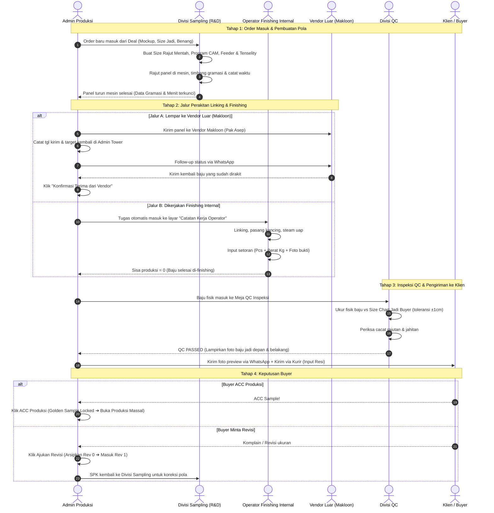

# Planning: 4 Modul Terpadu Alur Sampling (Sampling, Finishing, QC, & Admin Control Tower)

> **Modul Terkait**: 
> 1. `BusinessModule.SAMPLING_ORDER` (Divisi Sampling & R&D Mesin Rajut)
> 2. `BusinessModule.OPERATOR_EXEC` (Divisi Finishing & Perakitan Linking Internal)
> 3. `BusinessModule.QUALITY_CONTROL` (Divisi Quality Control & Inspeksi Fisik)
> 4. `BusinessModule.CRM_SALES` (Admin Produksi / Merchandiser Control Tower)
>
> **Tujuan**: Menghubungkan seluruh siklus hidup sampel pakaian rajut secara seamless: sejak Deal diinput dari Klien, diprogram dan dirajut di mesin flat knitting, dirakit (lewat vendor makloon atau tim finishing internal), diverifikasi akurasi ukurannya oleh QC, hingga difollow-up dan di-ACC oleh Klien.
> **Prinsip**: Mematuhi aturan baku 5 Pilar Full-Stack (§13) dan Design System Claymorphism (§12).

---

## 1. Pembagian Peran & Arsitektur 4 Modul

```
┌────────────────────────────────────────────────────────────────────────────────────────────────────────┐
│                                 4 MODUL KOLABORATIF ALUR SAMPLING PABRIK                               │
├────────────────────────────┬────────────────────────────┬────────────────────────────┬─────────────────┤
│ 1. DIVISI SAMPLING         │ 2. DIVISI FINISHING        │ 3. DIVISI QC               │ 4. ADMIN TOWER  │
│    (R&D & Mesin Rajut)     │    (Perakitan & Linking)   │    (Quality Control)       │    (Monitoring) │
├────────────────────────────┼────────────────────────────┼────────────────────────────┼─────────────────┤
│ • Modul: SAMPLING_ORDER    │ • Modul: OPERATOR_EXEC     │ • Modul: QUALITY_CONTROL   │ • Modul: CRM &  │
│ • Pelaku: Programmer CAM   │ • Pelaku: Operator Meja    │ • Pelaku: Tim QC Inspeksi  │   SAMPLING_ORDER│
│   & Operator Mesin         │   Linking & Finishing      │                            │ • Pelaku: Admin │
│                            │                            │                            │   Produksi / MD │
│                            │                            │                            │                 │
│ TANGGUNG JAWAB:            │ TANGGUNG JAWAB:            │ TANGGUNG JAWAB:            │ TANGGUNG JAWAB: │
│ 1. Pola CAM & Jarum K/N    │ 1. Antrean tugas masuk     │ 1. Ukur fisik baju vs Size │ 1. Monitor E2E  │
│ 2. Feeder 1-7 & Tenselity  │ 2. Input setoran bertahap  │    Chart Jadi Buyer        │ 2. Follow-up    │
│ 3. Rajut turun mesin       │    (Pcs & Kg timbangan)    │ 2. Cek cacat rajut/jahit   │    Vendor (WA)  │
│ 4. Timbang gramasi panel   │ 3. Foto timbangan/baju     │ 3. Keputusan: Lolos (Pass) │ 3. Update status│
│ 5. Stopwatch cycle time    │ 4. Hitung sisa otomatis    │    atau Rework/Reject      │    ke Klien/Deal│
│ 🏁 SELESAI di Turun Mesin  │ 🏁 SELESAI di Baju Jadi    │ 🏁 SELESAI di QC Approved  │ 4. Resi & ACC   │
└────────────────────────────┴────────────────────────────┴────────────────────────────┴─────────────────┘
```

---

## 2. Alur Kerja Antar-Divisi (End-to-End Handover Flow)



---

## 3. Spesifikasi Rinci 4 Modul Antarmuka (UI & Fungsional)

### Modul 1: Divisi Sampling (R&D & Mesin Rajut) — `SAMPLING_ORDER`
* **Pengguna**: Programmer CAM & Operator Mesin Rajut.
* **Tampilan**: *Digital SPK Sample Workbench*.
* **Fitur Utama**:
  1. **Dual Size Chart Matrix**: Membandingkan Ukuran Jadi (Permintaan Buyer) vs Ukuran Rajut Mentah (Koreksi Tarik/Susut Mesin).
  2. **CAM Machine Program Setup**: Kode file (`BIAN-D, BIAN-B, BIAN-T, BIAN-KR, BIAN-PL`), Rumus Jarum (`2.94 K / 6.6 N`), Feeder sequence 1–7.
  3. **Tenselity Matrix**: Settingan tension per panel (Badan, Tangan, Kerah).
  4. **Timbangan Gramasi & Stopwatch Waktu**: Form input berat gram & menit rajut per panel dengan auto-sum total gramasi & cycle time.
  5. **Tombol Handover**: `[ ✅ Selesai Turun Mesin & Serahkan ke Finishing ]`.

---

### Modul 2: Divisi Finishing (Perakitan Linking Internal) — `OPERATOR_EXEC`
* **Pengguna**: Operator Linking, Pasang Kancing, dan Steam Finishing Pabrik.
* **Tampilan**: *Catatan Kerja Operator (Task Queue & Setoran Harian)*.
* **Fitur Utama**:
  1. **Antrean Tugas Masuk (Work Queue)**: Menampilkan daftar baju/panel yang baru turun dari mesin rajut.
  2. **Form Input Setoran Bertahap (Partial Depositing)**:
     - Tanggal Setor (default hari ini).
     - Jumlah Beres (Pcs) & Berat Timbangan (Kg).
     - Tombol `[ 📷 Foto Timbangan / Foto Baju Jadi ]`.
  3. **Akumulasi Otomatis Tanpa Batching**:
     - Sistem otomatis menghitung: $\text{Sisa Belum Setor} = \text{Target Rencana} - \sum \text{Setoran}$.
     - Begitu sisa = 0, tugas otomatis selesai dan langsung diteruskan ke Divisi QC.

---

### Modul 3: Divisi QC (Quality Control & Inspeksi) — `QUALITY_CONTROL`
* **Pengguna**: Tim QC / Quality Assurance.
* **Tampilan**: *Layar Inspeksi QC Sample & Defect*.
* **Fitur Utama**:
  1. **Verifikasi Point of Measurement (POM) Fisik**:
     - Tabel komparasi: Ukuran Target (dari Deal) vs Ukuran Aktual Fisik (hasil ukur meteran kain).
     - Indikator deviasi otomatis: Hijau (dalam toleransi $\le 1$ cm), Merah (melebihi toleransi).
  2. **Checklist Cacat (Defect Audit)**:
     - Jarum patah, belang warna benang, bolong/drop stitch, jahitan linking loncat.
  3. **Hasil Keputusan QC**:
     - `[ ✅ QC PASSED ]`: Lolos inspeksi, siap dikirim ke buyer.
     - `[ ⚠️ REWORK ]`: Dikembalikan ke operator finishing untuk perbaikan (misal kancing kendor).
     - `[ ❌ REJECT / RE-KNIT ]`: Rusak fatal, harus dirajut ulang.
  4. **Unggah Foto Verifikasi Akhir**: Slot foto baju jadi di manekin (Tampak Depan & Belakang).

---

### Modul 4: Admin Control Tower (Monitoring Full-Cycle & Follow-up) — `CRM_SALES` & `SAMPLING_ORDER`
* **Pengguna**: Admin Produksi / Merchandiser (MD).
* **Tampilan**: *Tab Monitoring Terpusat & Integrasi Kartu Deal*.
* **Fitur Utama**:
  1. **Jalur Pengerjaan Finishing (Toggle 1 Klik)**:
     - Pilihan: `[ 🏠 Internal Pabrik ]` vs `[ 🚚 Lempar ke Vendor Makloon ]`.
  2. **Dashboard Rekap Monitoring Vendor Makloon**:
     - Tabel seluruh SPK yang sedang di vendor luar.
     - Tanggal kirim, target kembali, status keterlambatan (H-1, Terlambat).
     - Tombol cepat **`[ 💬 WhatsApp Vendor ]`** (otomatis buka template chat follow-up).
     - Tombol **`[ ✅ Konfirmasi Terima dari Vendor ]`** (langsung memindahkan baju ke antrean QC).
  3. **Komunikasi Status ke Klien (Di Deal Detail)**:
     - Preview foto baju jadi hasil finishing & QC.
     - Input ekspedisi & nomor resi pengiriman ke klien.
     - Tombol aksi final: **`ACC PRODUKSI`** (mengunci Golden Sample & membuka PO Massal) atau **`AJUKAN REVISI`** (simpan snapshot Rev 0, naik ke Rev 1).

---

## 4. Arsitektur Teknis 5 Pilar (Full-Stack End-to-End)

### Pilar 1: Database & Persistence Layer (`server/`)
* **Migrasi Flyway Baru**: `V41__sampling_multidivision_workflow.sql`:
  ```sql
  -- 1. Jalur finishing & data vendor pada sampling_orders
  ALTER TABLE sampling_orders
      ADD COLUMN finishing_path VARCHAR(20) NOT NULL DEFAULT 'INTERNAL', -- INTERNAL | MAKLOON_VENDOR
      ADD COLUMN vendor_name VARCHAR(150),
      ADD COLUMN vendor_phone VARCHAR(50),
      ADD COLUMN vendor_sent_at DATE,
      ADD COLUMN vendor_target_at DATE,
      ADD COLUMN vendor_returned_at DATE,
      ADD COLUMN vendor_cost_per_pcs BIGINT NOT NULL DEFAULT 0,
      ADD COLUMN vendor_status VARCHAR(30) NOT NULL DEFAULT 'NONE'; -- NONE | WITH_VENDOR | OVERDUE | RETURNED

  -- 2. Log setoran bertahap tim finishing internal
  CREATE TABLE IF NOT EXISTS sampling_finishing_deposits (
      id VARCHAR(64) PRIMARY KEY,
      tenant_id VARCHAR(64) NOT NULL REFERENCES tenants(id) ON DELETE CASCADE,
      sampling_order_id VARCHAR(64) NOT NULL REFERENCES sampling_orders(id) ON DELETE CASCADE,
      deposit_date DATE NOT NULL DEFAULT CURRENT_DATE,
      qty_pcs INT NOT NULL,
      weight_kg NUMERIC(6, 2) NOT NULL DEFAULT 0.0,
      scale_photo_key TEXT,
      garment_photo_key TEXT,
      operator_name VARCHAR(100) NOT NULL DEFAULT '',
      notes TEXT NOT NULL DEFAULT '',
      created_at TIMESTAMPTZ NOT NULL DEFAULT CURRENT_TIMESTAMP
  );

  -- 3. Lembar inspeksi Quality Control
  CREATE TABLE IF NOT EXISTS sampling_qc_inspections (
      id VARCHAR(64) PRIMARY KEY,
      tenant_id VARCHAR(64) NOT NULL REFERENCES tenants(id) ON DELETE CASCADE,
      sampling_order_id VARCHAR(64) NOT NULL REFERENCES sampling_orders(id) ON DELETE CASCADE,
      inspector_name VARCHAR(100) NOT NULL,
      inspected_at TIMESTAMPTZ NOT NULL DEFAULT CURRENT_TIMESTAMP,
      measured_pom_values JSONB NOT NULL DEFAULT '{}',
      defects_found JSONB NOT NULL DEFAULT '[]',
      qc_result VARCHAR(20) NOT NULL DEFAULT 'PASSED', -- PASSED | REWORK | REJECT
      qc_notes TEXT NOT NULL DEFAULT '',
      verified_photo_front_key TEXT,
      verified_photo_back_key TEXT
  );

  SELECT apply_tenant_rls('sampling_finishing_deposits');
  SELECT apply_tenant_rls('sampling_qc_inspections');
  ```
* **Exposed Tables** di `server/.../infrastructure/tables/SamplingWorkflowTables.kt`:
  - `SamplingFinishingDepositsTable`
  - `SamplingQcInspectionsTable`
  - Mapper repository Postgres untuk membaca dan menulis entitas domain.

---

### Pilar 2: Pure Domain Layer (`core/`)
* **Value Objects & Enums** (`SamplingWorkflowValueObjects.kt`):
  - `FinishingPath`: `INTERNAL`, `MAKLOON_VENDOR`.
  - `VendorFollowUpStatus`: `NONE`, `WITH_VENDOR`, `OVERDUE`, `RETURNED`.
  - `QcInspectionResult`: `PASSED`, `REWORK`, `REJECT`.
  - `FinishingDeposit(id, date, qtyPcs, weightKg, scalePhotoKey, garmentPhotoKey, operatorName)`.
  - `QcPomMeasurement(pomName, targetCm, actualCm, deviationCm, isWithinTolerance)`.
* **Entity Behavior** (`SamplingOrder.kt`):
  - `fun assignMakloonVendor(name, phone, sentAt, targetAt, costPerPcs, now): SamplingOrder`
  - `fun recordVendorReturn(returnedAt, now): SamplingOrder`
  - `fun addFinishingDeposit(deposit: FinishingDeposit, now): SamplingOrder`
  - `fun completeQcInspection(report: QcInspectionReport, now): SamplingOrder`
* **Use Cases**:
  - `RecordFinishingDepositUseCase` (Divisi Finishing)
  - `SubmitQcInspectionUseCase` (Divisi QC)
  - `AssignMakloonVendorUseCase` & `ConfirmVendorReturnUseCase` (Admin Tower)
  - `GetVendorMonitoringListUseCase` (Admin Tower)

---

### Pilar 3: Backend API & Routing (`server/`)
* **Endpoint Ktor**:
  - `POST /api/tenant/sampling/orders/{id}/finishing/deposits` ➔ Tim finishing setor pcs & kg timbangan.
  - `POST /api/tenant/sampling/orders/{id}/finishing/vendor` ➔ Admin assign ke vendor makloon luar.
  - `POST /api/tenant/sampling/orders/{id}/finishing/vendor-receive` ➔ Admin konfirmasi barang kembali dari vendor.
  - `POST /api/tenant/sampling/orders/{id}/qc/inspect` ➔ Tim QC submit hasil ukur & lolos QC.
  - `GET /api/tenant/sampling/admin/vendor-monitoring` ➔ List monitoring seluruh vendor aktif untuk follow-up admin.
* **RBAC Guard**:
  - Tim Finishing ➔ Wewenang `OPERATOR_EXEC` (OPERATE).
  - Tim QC ➔ Wewenang `QUALITY_CONTROL` (OPERATE).
  - Tim Sampling & Admin ➔ Wewenang `SAMPLING_ORDER` (OPERATE / MANAGE).

---

### Pilar 4: Client-Server Integration (`app/shared/`)
* **Data Sources & Codecs**:
  - `SamplingWorkflowCodec`: encode/decode data setoran finishing, inspeksi QC, dan data vendor.
  - `SamplingApiClient` diperluas dengan method pengerjaan finishing, QC, dan vendor monitoring.
* **ViewModels**:
  - `FinishingOperatorViewModel`: Mengelola antrean kerja dan submit setoran finishing.
  - `QcInspectionViewModel`: Mengelola form ukur fisik POM dan submit status QC.
  - `SamplingAdminControlViewModel`: Mengelola rekap vendor monitoring dan template WhatsApp.

---

### Pilar 5: Shared Presentation Layer (`app/shared/presentation/`)
* **Design System Claymorphism**:
  - Nol literal warna ➔ Menggunakan `WeMadeColors.Primary`, `SurfaceMuted`, `Warning`, `Success`, `Error`.
  - Nol emoji literal di string UI ➔ Menggunakan `ClayIcons.IconCheck`, `ClayIcons.IconClock`, `ClayIcons.IconTruck`, dll.
* **Komponen & Layar Baru**:
  1. `app/shared/.../presentation/finishing/FinishingOperatorScreen.kt`: Antarmuka task queue finishing & dialog setoran timbangan.
  2. `app/shared/.../presentation/qc/QcInspectionScreen.kt`: Antarmuka perbandingan ukuran target vs fisik & checklist defect.
  3. `app/shared/.../presentation/sampling/components/AdminVendorMonitoringTab.kt`: Tab rekap vendor makloon luar dengan tombol WA dan status keterlambatan.
  4. Perluasan `DealDetailDialog.kt`: Menampilkan badge status vendor dan shortcut terima barang langsung di tab Deal.

---

## 5. Verification Plan

### Automated Tests
- **Unit Test Domain** (`core/src/commonTest/.../SamplingMultiDivisionWorkflowTest.kt`):
  - Uji akumulasi setoran parsial tim finishing ($24 + 51 = 75$ pcs ➔ sisa 0).
  - Uji validasi toleransi deviasi ukuran di QC (deviasi $\le 1$ cm lulus, $> 1$ cm peringatan).
  - Uji transisi status vendor makloon (`WITH_VENDOR` ➔ `RETURNED`).
- **Unit Test Codec** (`core/src/commonTest/.../SamplingWorkflowCodecTest.kt`):
  - Round-trip serialisasi setoran finishing dan inspeksi QC.

### Manual Verification (Dev Server)
- Menguji alur E2E di browser `http://localhost:3000`:
  1. **Admin/Sales**: Buka Deal ➔ Input order sampling.
  2. **Divisi Sampling**: Buka `Order Sampling & SPK` ➔ Input CAM, Feeder, Tenselity ➔ Klik Selesai Rajut Turun Mesin.
  3. **Jalur Vendor**: Admin klik "Lempar ke Vendor Pak Asep" ➔ Cek tab "Monitoring Vendor" ➔ Uji tombol WhatsApp ➔ Klik "Konfirmasi Terima".
  4. **Jalur Internal**: Buka modul `Catatan Kerja Operator` ➔ Input setoran 2 pcs (berat timbangan) ➔ Verifikasi tugas tuntas.
  5. **Divisi QC**: Buka modul `Inspeksi QC` ➔ Input hasil ukur fisik POM ➔ Klik `QC PASSED`.
  6. **Admin**: Buka Deal ➔ Verifikasi foto baju jadi muncul ➔ Klik `ACC PRODUKSI`.
