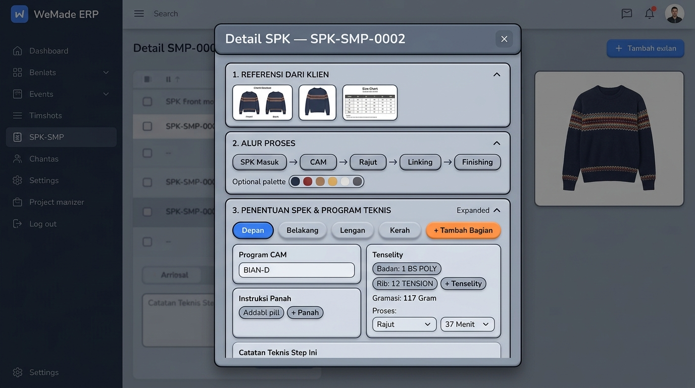
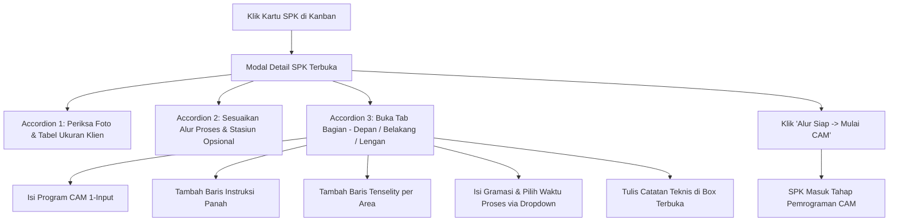

# Technical Planning: Redesain Detail SPK dengan 3 Accordion Claymorphism (Referensi Klien, Alur Proses, & Penentuan Spek Teknis)

Dokumen ini mendefinisikan arsitektur teknis dan rancangan antarmuka (UI/UX) untuk dialog **Detail SPK Sampling** di WeMade ERP, menggabungkan 3 Accordion terpadu: **Referensi Klien**, **Alur Proses Desain**, dan **Penentuan Spek & Program Teknis**.

---

## 1. Visual Mockup Arsitektur (Claymorphism + Neo-Brutalism)



### Prinsip Visual (WeMade Claymorphism Standards):
1. **Outline Tebal 3dp**: Menggunakan `ClayBorder.Thick` dengan warna gelap tegas (`WeMadeColors.Outline` / `Border`) di sekeliling dialog dan kartu accordion.
2. **Hard Shadow 0-Blur**: Bayangan terproyeksi padat (`ClayOffset.Rest` geser 6dp x 6dp) tanpa efek blur, menghadirkan kedalaman fisik 3D.
3. **Rounded Surfaces**: Sudut membulat ramah pada kontainer (`ClayShapes.Card` 16dp) dan tab/tombol pill (`ClayShapes.Pill` 999dp).
4. **Palet Warna Brand WeMade**: Biru elektrik (`#2563EB`) untuk state aktif/primary, oranye terang (`#EA580C`) untuk tombol aksi `+ Tambah`, dan putih bersih untuk surface kartu. Nol literal `Color(...)` baru di luar `WeMadeTheme.kt`.
5. **Nol Emoji Tofu**: Semua ikon menggunakan vektor Canvas dari `ClayIcons.kt` (`IconImage`, `IconPackage`, `IconRuler`, `IconPlus`, `IconTrash`, `IconClose`, `IconChevronDown`, dll.).

---

## 2. Struktur 3 Accordion di Dialog Detail SPK

Dialog `SamplingSpkDetailDialog` disusun menjadi 3 accordion bertingkat yang dapat di-expand/collapse secara independen:

### Accordion 1: REFERENSI DARI KLIEN (DEAL)
- **Tujuan**: Memberikan acuan desain visual dan spesifikasi ukuran yang disepakati dengan buyer saat deal berlangsung.
- **Konten**:
  - **Slot Mockup Depan & Belakang**: Dua kartu clay menampilkan foto mockup baju tampak depan dan tampak belakang dengan kemampuan klik untuk zoom preview.
  - **Tabel Ukuran dari Klien (*Size Chart / POM*)**: Menampilkan parameter pengukuran pola (Lebar Dada, Panjang Baju, dll.) per ukuran standar (`ALL SIZE`, `S`, `M`, `L`, `XL`), baris alokasi *Jumlah Sampel (pcs)* yang di-highlight, serta badge total pcs.
  - **Informasi Order**: Mode Ukuran, Qty Sample, Jalur Finishing (Internal/Makloon), dan Deadline Pengiriman.

### Accordion 2: ALUR PROSES DESAIN
- **Tujuan**: Menentukan alur stasiun kerja produksi spesifik untuk SPK ini.
- **Konten**:
  - Integrasi `ProcessFlowAdjusterPanel`: Visual pipeline stasiun kerja (`SPK Masuk` → `Program CAM` → `Penentuan Spek / Rajut` → `Linking` → `Finishing` → `Terkirim`).
  - Palet proses opsional: Kemampuan menambah atau menghapus stasiun tambahan (*Bordir Komputer*, *Sablon / Print*, *Laundry / Garment Dyeing*).
  - Status alur: Badge *"Mengikuti Alur Default"* vs *"Alur Kustom Desain"*.

### Accordion 3: PENENTUAN SPEK & PROGRAM TEKNIS (Expanded by Default)
*Bebas dari duplikasi gambar mockup karena foto sudah ada di Accordion 1.*
- **A. Tabbing Bagian Garmen Dinamis (Top)**:
  - Tab pills: `[ Depan ]` (Aktif) · `[ Belakang ]` · `[ Lengan ]` · `[ Kerah ]`.
  - Tombol aksi: `[ + Tambah Bagian ]` (warna oranye) untuk menambahkan panel pakaian kustom tanpa batas (mis. *Placket Kancing*, *Saku Kangguru*, *Tudung Hoodie*, *Badan Kiri/Kanan*).
- **B. Konten Teknis per Tab Bagian Aktif**:
  1. **Program CAM**: **1 Input Tunggal** per panel (Label `Kode Program:`, misal `BIAN-D` atau `HD-OVS-DPN.001`).
  2. **Instruksi Panah / Feeder Benang**: **Dinamis & Addable** dengan tombol `+ Tambah Panah` (mis. `Panah 1: 1 RIB STRIPE 1 PLAY (HITAM)`, `Panah 2: SPANDEX 70D (PUTIH)`).
  3. **Tenselity (Kerapatan Rajut)**: **Dinamis & Addable** per area panel dengan tombol `+ Tambah Tenselity` (mis. `Badan Utama: 1 BS POLY`, `Rib Bawah: 12 TENSION`).
  4. **Gramasi & Waktu Proses**:
     - Input Berat: `Gramasi: [ 117 ] Gram`.
     - Waktu Proses: Dropdown Proses `[ Rajut ▼ ]` (pilihan: *Rajut*, *Linking*, *Finishing*, dll.) dan Durasi `[ 37 ] Menit`, dengan tombol `+ Tambah Waktu`.
  5. **Catatan Teknis Step Ini**:
     - Textarea terbuka (*always-open note box*) di bagian bawah untuk catatan operator (mis. peringatan tarikan benang atau instruksi khusus jarum).

---

## 3. Arsitektur End-to-End Full-Stack (5 Pilar)

### Pilar 1: Database & Persistence Layer
- Skema PostgreSQL `sampling_orders`:
  - Kolom `stage_inputs` bertipe JSONB menyimpan riwayat lembar kerja per tahap (`StageWorkInput`).
  - Kolom `mockup_image_urls` menyimpan path object storage S3/MinIO.
  - Kolom `size_matrix` menyimpan matriks ukuran client dari Deal.
  - Skema JSONB sudah modular dan mendukung struktur section dinamis tanpa perlu migrasi DDL baru.

### Pilar 2: Pure Domain Layer (`core/`)
- Objek `StageSectionNames`:
  - `PROGRAM`: Nama kode program per bagian.
  - `FEEDER_INSTRUCTIONS`: Instruksi panah per feeder.
  - `TENSELITY`: Kerapatan rajut per area panel.
  - `PANEL_WEIGHTS`: Gramasi per panel.
  - `PANEL_MINUTES`: Durasi waktu proses per panel.
  - `NOTES`: Catatan teknis tahap.
- Entity `SamplingOrder`, value objects `StageInputSection`, `StageInputRow`.

### Pilar 3: Backend API & Routing (`server/`)
- `GET /api/tenant/sampling/orders`: Dilengkapi dengan `PoFileStorage` untuk presigning URL mockup foto depan dan belakang.
- `PATCH /api/tenant/sampling/orders/{id}/stage-inputs`: Menyimpan draft isian teknis (Program, Panah, Tenselity, Waktu, Catatan) secara real-time / on-demand.
- `POST /api/tenant/sampling/orders/{id}/stage`: Validasi gerbang transisi tahap (`requiresStageWorksheet`).

### Pilar 4: Client Repository & Image Loader (`app/shared/`)
- `KtorSamplingOrderRepository`: Integrasi pemanggilan API save stage inputs & advance stage.
- `rememberMockupBitmap`: Memuat bitmap foto dari presigned URL secara asinkron dan efisien.

### Pilar 5: Shared Presentation Layer (`app/shared/presentation/`)
Pemisahan file mematuhi batas ukuran file (< 400 baris per file):
1. **`ClientSamplingReferenceCard.kt`** (~260 baris): Komponen Accordion 1 (Mockup depan/belakang, Tabel Ukuran POM, Info Deal).
2. **`TechnicalSpecWorksheetPanel.kt`** (~320 baris): Komponen Accordion 3 (Tabbing bagian dinamis, Program 1 input, Panah addable, Tenselity addable, Gramasi, Dropdown Waktu, dan Catatan Teknis).
3. **`SamplingSpkDetailDialog.kt`** (~220 baris): Mengorkestrasi ke-3 accordion dan footer aksi (*Tutup*, *Simpan Draft*, *Alur Siap -> Mulai CAM*).

---

## 4. Alur Interaksi Pengguna (User Flow)



---

## 5. Rencana Verifikasi & Testing (Verification Plan)

1. **Kompilasi KMP & Server**:
   ```bash
   ./gradlew :app:shared:compileKotlinJvm
   ./gradlew :server:compileKotlin
   ```
2. **Audit Kepatuhan Desain & Ukuran File**:
   - Memastikan tidak ada file presentasi melebihi 400 baris.
   - Memastikan nol literal `Color(...)` baru di luar theme.
   - Memastikan seluruh ikon memakai Canvas `ClayIcons.kt`.
3. **Verifikasi Fungsional UI**:
   - Uji penambahan tab bagian baru (`+ Tambah Bagian`).
   - Uji penambahan baris instruksi panah (`+ Panah`) dan tenselity (`+ Tenselity`).
   - Uji pilihan dropdown proses pada waktu dan input menit.
   - Uji penyimpanan data stage inputs ke backend dan pemindahan tahap pipeline.
