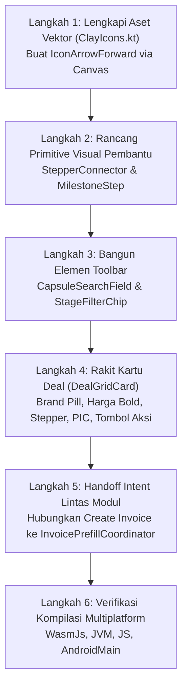

# 🎓 Modul Pembelajaran: Redesign UI Kartu Deal & Sales Pipeline Sesuai Mockup Neo-Brutalist Clay

> **Level Target**: Junior to Mid Developer  
> **Topik Utama**: Compose Multiplatform, Neo-Brutalist Claymorphism, Canvas Custom Vector Icons, Stepper Milestone Progress, Cross-Module Intent Coordinator  
> **Prasyarat**: Pemahaman dasar Compose (State Hoisting, Modifiers, Canvas Drawing), Design System WeMade (`ClayTokens`, `ClayModifier`, `ClayCard`), dan integrasi modul CRM-Invoicing.  
> **Referensi**: Penyesuaian Tampilan Deal CRM Sales (`/crm-sales`) sesuai usulan mockup.

---

## 💡 1. Konsep Dasar & Masalah di Dunia Nyata

### Masalah Nyata
Sebelum penyesuaian ini dilakukan, tampilan tab Deal di CRM Sales memiliki beberapa kekurangan:
1. **KPI Pipeline** masih menggunakan tampilan generic ber-subtitle kecil ("deal non-hilang"), tanpa titik indikator warna yang membedakan tipe metrik di pandangan pertama.
2. **Search Bar dan Filter Chip** diletakkan terpisah secara vertikal sehingga memakan banyak ruang layar (*vertical real estate*) yang seharusnya dialokasikan untuk kartu transaksi.
3. **Kartu Deal** lama tidak mencerminkan hierarki visual yang diusulkan oleh tim produk/desain:
   - Nilai harga transaksi berwarna biru alih-alih hitam tebal (*bold solid*),
   - Indikator alur (*pipeline indicator*) hanya berupa teks berjejer tanpa visualisasi tahapan milestone (*stepper*) yang terhubung dengan panah arah,
   - Identitas PIC (*Sales Person-in-Charge*) belum menampilkan avatar dan inisial badge yang jelas,
   - Tombol aksi belum mencerminkan aksi primer alur penjualan konveksi: `Upload PO` (oranye) dan `Create Invoice` (hijau).

### Solusi Kita
Kita merombak total komponen `DealsPane.kt` dan design system ikon canvas:
- **4 Kartu KPI Ringkas**: Ditambahkan dot penanda warna (`Primary`, `Warning`/Amber, `Success`) di samping label, dengan teks nominal berukuran besar 20sp berwarna hitam pekat (`WeMadeColors.OnSurface`).
- **Toolbar Satu Baris (Capsule Search + Chips)**: Field pencarian diubah menjadi bentuk kapsul bulat penuh (`CircleShape`) ber-outline tebal 3dp (`ClayBorder.Thick`) sejajar dengan chip filter tahapan yang memiliki tombol hapus filter (`IconClose`).
- **Kartu Grid Deal Berorientasi Milestone**:
  - Pill brand klien berwarna biru solid dengan teks putih tebal.
  - Pill status tahapan berwarna oranye/amber dengan teks gelap tebal.
  - Stepper 3 tahap (`Qualify` ───→ `PO` ─── `Invoice`) digambar langsung dengan Canvas vector (garis konektor hijau dengan kepala panah dan ikon centang).
  - Avatar PIC dan badge inisial emas (`JM`).
  - Dua tombol aksi Claymorphic: `Upload PO` untuk melampirkan pesanan pembeli dan `Create Invoice` yang langsung mentransfer data deal ke modul Invoicing lewat `InvoicePrefillCoordinator`.

---

## 🧭 2. "Start dari Mana?" — Alur Langkah Penulisan (Order of Operations)

Jika kamu diminta mengimplementasikan redesign visual berbasis mockup seperti ini dari awal, urutan langkah terbaiknya adalah:



1. **Langkah 1: Lengkapi Aset Vektor Kanvas (`ClayIcons.kt`)**  
   Periksa ketersediaan ikon. Karena tidak boleh ada emoji Unicode (menghindari bug tofu `▯` di Skiko/Wasm), tambahkan fungsi `IconArrowForward` menggunakan `Canvas` dan `Path` Compose.
2. **Langkah 2: Rancang Komponen Pembantu Stepper**  
   Buat fungsi `StepperConnector(active: Boolean)` dan `MilestoneStep(circleContent, label)` untuk merender 3 tahapan transaksi yang terhubung panah arah.
3. **Langkah 3: Bangun Elemen Toolbar**  
   Ganti text field biasa menjadi kapsul `CircleShape` dengan hard shadow clay, dan tempatkan horizontal sejajar dengan chip filter tahapan.
4. **Langkah 4: Rakit Kartu Deal (`DealGridCard`)**  
   Susun komponen kartu: pill brand biru di kiri atas, status pill oranye di kanan atas, deskripsi produk, nominal harga hitam bold 22sp, stepper progress di tengah, serta footer PIC dan tombol aksi.
5. **Langkah 5: Integrasi Intent Lintas Modul**  
   Pasang aksi pada tombol `Create Invoice` agar memicu `InvoicePrefillCoordinator.setPending(InvoicePrefillData.fromDeal(deal, contact))` dan berpindah layar menggunakan `LocalAppNavigator`.
6. **Langkah 6: Verifikasi Kompilasi Semua Target KMP**  
   Pastikan tidak ada breaking changes pada modul lain (`ContactsPane`, `DealDetailDialog`) dan kompilasi berhasil di target Wasm, JVM, JS, serta Android.

---

## 🧱 3. Bedah Blok per Blok Kode (Deep Code Walkthrough)

### Blok A: Kanvas Ikon Vektor Panah Kanan (`ClayIcons.kt`)

```kotlin
@Composable
fun IconArrowForward(modifier: Modifier = Modifier, color: Color = WeMadeColors.OnSurface) {
    Canvas(modifier = modifier) {
        val w = size.width
        val h = size.height
        val stroke = 1.8f * density
        val midY = h * 0.50f

        // Garis horizontal utama
        drawLine(
            color = color,
            start = Offset(w * 0.16f, midY),
            end = Offset(w * 0.82f, midY),
            strokeWidth = stroke,
            cap = StrokeCap.Round
        )

        // Kepala panah mengarah ke kanan
        val head = Path().apply {
            moveTo(w * 0.82f, midY)
            lineTo(w * 0.58f, h * 0.26f)
            moveTo(w * 0.82f, midY)
            lineTo(w * 0.58f, h * 0.74f)
        }
        drawPath(head, color = color, style = Stroke(width = stroke, cap = StrokeCap.Round, join = StrokeJoin.Round))
    }
}
```
**Mengapa blok ini ditulis begini?**
- `density` digunakan agar ketebalan garis beradaptasi dengan DPI layar (retina vs standar).
- Menggunakan `Path()` dengan `StrokeCap.Round` dan `StrokeJoin.Round` menghasilkan ujung panah yang membulat halus sesuai tema clay WeMade, tanpa memerlukan font eksternal atau SVG loader berat.

---

### Blok B: Stepper Konektor dengan Panah Arah Otomatis (`DealsPane.kt`)

```kotlin
@Composable
private fun StepperConnector(active: Boolean, modifier: Modifier = Modifier) {
    val lineColor = if (active) WeMadeColors.Success else WeMadeColors.Border
    Canvas(modifier = modifier.height(26.dp)) {
        val w = size.width
        val midY = size.height * 0.5f
        val stroke = 2.dp.toPx()

        // Garis penghubung horizontal
        drawLine(
            color = lineColor,
            start = Offset(0f, midY),
            end = Offset(w - 6.dp.toPx(), midY),
            strokeWidth = stroke,
            cap = StrokeCap.Round
        )

        // Kepala panah di ujung garis
        val arrowSize = 6.dp.toPx()
        val endX = w - 4.dp.toPx()
        val path = Path().apply {
            moveTo(endX, midY)
            lineTo(endX - arrowSize, midY - arrowSize * 0.7f)
            moveTo(endX, midY)
            lineTo(endX - arrowSize, midY + arrowSize * 0.7f)
        }
        drawPath(path, color = lineColor, style = Stroke(width = stroke, cap = StrokeCap.Round, join = StrokeJoin.Round))
    }
}
```
**Mengapa blok ini ditulis begini?**
- Konektor ini diletakkan di dalam `Box(Modifier.weight(1f).padding(bottom = 16.dp))` di antara dua lingkaran step. `padding(bottom = 16.dp)` mengkompensasi tinggi teks label di bawah lingkaran sehingga garis konektor berada tepat horizontal di titik tengah lingkaran (*center-aligned*).
- Jika tahapan aktif (misal `PO Diterima` atau `In Production`), garis berubah menjadi hijau terang (`WeMadeColors.Success`), memberikan indikasi progres transaksi yang hidup.

---

### Blok C: Tombol Neo-Brutalist Padat dengan Hard Shadow (`ClayCardButton`)

```kotlin
@Composable
private fun ClayCardButton(
    text: String,
    containerColor: Color,
    onClick: () -> Unit,
    modifier: Modifier = Modifier
) {
    val interactionSource = remember { MutableInteractionSource() }
    val isPressed by interactionSource.collectIsPressedAsState()

    Box(
        modifier = modifier
            .claySurface(
                shape = ClayShapes.Button,
                background = containerColor,
                outline = WeMadeColors.Outline,
                borderWidth = ClayBorder.Medium,
                offset = ClayOffset.Small,
                pressed = isPressed
            )
            .clickable(
                interactionSource = interactionSource,
                indication = null,
                onClick = onClick
            )
            .padding(horizontal = 14.dp, vertical = 8.dp),
        contentAlignment = Alignment.Center
    ) {
        Text(
            text = text,
            fontSize = 12.sp,
            fontWeight = FontWeight.Bold,
            color = WeMadeColors.OnSurface
        )
    }
}
```
**Mengapa blok ini ditulis begini?**
- Menghindari tombol Material default yang memiliki elevasi kabur (*blurred elevation shadow*).
- Memakai modifier `Modifier.claySurface` dengan `pressed = isPressed`: ketika tombol ditekan kursor/sentuhan, bayangan berkurang dari 4dp menjadi 2dp (`ClayOffset.Pressed`), menciptakan ilusi fisik tombol ditekan ke dalam kanvas.

---

### Blok D: Handoff Prefill Antar-Modul (`InvoicePrefillCoordinator`)

```kotlin
onCreateInvoice = { deal, contact ->
    InvoicePrefillCoordinator.setPending(
        InvoicePrefillData.fromDeal(deal, contact)
    )
    navigator(AppNavScreen.INVOICING)
}
```
**Mengapa blok ini ditulis begini?**
- Modul CRM Sales tidak boleh bergantung langsung (*tight coupling*) pada ViewModel atau State internal modul Invoicing.
- Handoff dilakukan lewat koordinator state stateless `InvoicePrefillCoordinator`. Saat layar Invoicing terbuka, ia membaca pending data ini dan langsung membuka form faktur dengan identitas pembeli serta deal ID yang sudah terisi otomatis.

---

## ⚖️ 4. Teknologi & Pendekatan yang Dipilih: The "Why"

| Pendekatan yang Dipilih | Alternatif yang Ditolak | Alasan Kita Memilih Pendekatan Ini | Risiko Jika Memakai Alternatif |
|---|---|---|---|
| **Canvas Drawing untuk Konektor & Panah** | Menempelkan aset gambar SVG atau PNG | Render 100% instan tanpa latency loading gambar, ukuran file 0 byte, dan warna mengikuti token tema secara reaktif. | Gambar eksternal bisa gagal load di web/Wasm, resolusi pecah saat zoom, dan tidak bisa berubah warna secara dinamis. |
| **Capsule Shape (`CircleShape`) pada Search Bar** | Kotak teks standar dengan border radius kecil (4dp-8dp) | Sesuai dengan bahasa desain Neo-Brutalisme yang ramah dan menonjolkan estetika clay playful. | Tampilan menjadi monoton seperti dashboard korporat jadul dan menyimpang dari mockup yang disetujui. |
| **`InvoicePrefillData.fromDeal` di Companion Object** | Membuat instance dummy lalu memanggil method instance | Fungsi factory statis lebih bersih, idiomatik di Kotlin, dan tidak memerlukan alokasi instance kosong sebelum memetakan data. | Terjadi error kompilasi `"Unresolved reference 'fromDeal'"` jika diletakkan di level instance data class. |
| **Penyelarasan Horizontal Search & Filter Chips** | Kolom vertikal bertumpuk | Menghemat ruang vertikal sehingga 6 kartu deal pertama langsung terlihat di atas lipatan layar (*above the fold*). | Pengguna harus scrolling jauh hanya untuk melihat 1 kartu transaksi. |

---

## ⚠️ 5. Jebakan Pemula (Junior Pitfalls) & Cara Menghindarinya

1. **Jebakan 1: Menghapus Extension Function yang Digunakan File Lain**  
   - *Kasus Nyata*: Saat merapikan `DealsPane.kt`, fungsi `internal fun DealStage.tint(): Color` hampir terhapus. Hal ini menyebabkan error kompilasi di `ContactsPane.kt` dan `DealDetailDialog.kt`.  
   - *Pencegahan*: Sebelum menghapus atau memindahkan fungsi `internal` atau `public`, selalu gunakan `grep_search` untuk memastikan tidak ada pemanggil (*call sites*) di file lain.
2. **Jebakan 2: Meletakkan Factory Method di Luar Companion Object**  
   - *Kasus Nyata*: `fun fromDeal` ditulis di bawah deklarasi properti data class setelah penutup `companion object {}`. Akibatnya Kotlin menganggapnya sebagai method instance, bukan static factory `InvoicePrefillData.fromDeal(...)`.  
   - *Pencegahan*: Perhatikan posisi kurung kurawal `companion object { ... }` pada Kotlin data classes.
3. **Jebakan 3: Garis Stepper Tidak Sejajar dengan Lingkaran**  
   - *Kasus Nyata*: Jika garis ditaruh di dalam Row yang sama dengan Column bertumpuk (Lingkaran + Teks Label), garis konektor akan berada di tengah total tinggi (lingkaran + teks), bukan di tengah lingkaran.  
   - *Pencegahan*: Berikan `Modifier.padding(bottom = 16.dp)` pada konektor agar titik vertikalnya sejajar pas dengan pusat lingkaran diameter 26dp.

---

## 🧪 6. Bagaimana Cara Membuktikan Kodingan Kita Bekerja?

### Verifikasi Otomatis
Jalankan kompilasi pada semua platform target Kotlin Multiplatform:
```bash
./gradlew :app:shared:compileKotlinWasmJs :app:shared:compileKotlinJvm \
          :app:shared:compileKotlinJs :app:shared:assembleAndroidMain
```
Dan pastikan seluruh unit test domain & presentation tetap hijau:
```bash
./gradlew :core:jvmTest :app:shared:jvmTest
```

### Verifikasi Manual di Browser
1. Jalankan aplikasi via `./dev.sh` dan buka `http://localhost:3000/crm-sales`.
2. Klik tab **Deal**:
   - Periksa 4 kartu KPI di atas: apakah memiliki dot warna penanda (`Total Pipeline Value` biru, `Active Deals` oranye, `Pending Invoices` oranye, `Win Rate` hijau) dengan nominal hitam tebal.
   - Periksa toolbar pencarian: bentuk kapsul bulat sejajar dengan chip filter tahapan.
   - Periksa grid kartu deal:
     - Badge Brand biru solid (`Erigo Studio`) di kiri atas,
     - Badge Status oranye/amber (`PO Received`) di kanan atas,
     - Harga hitam tebal 22sp,
     - Stepper 3 tahap dengan panah konektor kanvas hijau,
     - Sales PIC dengan avatar lingkaran dan badge inisial `JM`,
     - Tombol `Upload PO` (oranye) membuka dialog detail PO,
     - Tombol `Create Invoice` (hijau) mengalihkan pengguna ke modul faktur dengan form terisi otomatis.

---

## 🏆 7. Tantangan Mandiri untuk Kamu (Self-Study Challenge)

- [ ] **Tantangan 1**: Tambahkan animasi mikro (*pulsing glow*) pada lingkaran tahap yang sedang aktif (misal lingkaran `PO` ketika deal berstatus `PO_RECEIVED`).
- [ ] **Tantangan 2**: Buat agar chip filter dapat dipilih lebih dari satu tahapan (*multi-select* via `Set<DealStage>`) dan hitung jumlah transaksi per filter pada label chip (misal: `PO Received (3)`).
