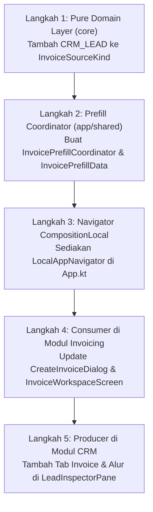

# 🎓 Modul Pembelajaran: Integrasi Alur Kualifikasi CRM (Sampling & Order Langsung) ke Modul Custom Invoicing

> **Level Target**: Junior to Mid Developer  
> **Topik Utama**: Domain-Driven Design (DDD), Cross-Module Intent Handoff, State Coordination, Compose Multiplatform, Claymorphism Design System  
> **Prasyarat**: Pemahaman MVI Pattern, CompositionLocal, Value Objects, dan Arsitektur Multi-Modul KMP  
> **Referensi Modul**: `BusinessModule.CRM_SALES`, `BusinessModule.INVOICING`, `LeadInspectorPane.kt`, `CreateInvoiceDialog.kt`

---

## 💡 1. Konsep Dasar & Masalah di Dunia Nyata

### Masalah Nyata di Lantai Penjualan & Pabrik
Di industri konveksi dan manufaktur garmen, proses penjualan (*sales pipeline*) tidak langsung bermuara pada produksi massal secara seragam. Saat prospek memenuhi kualifikasi (*Qualified Lead*), terdapat dua cabang realitas komersial:
1. **Jalur A (Sampling / Prototyping)**: Klien membutuhkan sampel baju fisik (1–3 pcs) terlebih dahulu untuk verifikasi kualitas jahitan, gramasi rajut, dan *fitting*. Untuk ini, pabrik harus menerbitkan **Invoice Sampling** (biaya jasa pembuatan sampel).
2. **Jalur B (Order Langsung / Mass Production)**: Klien sudah menyetujui desain atau membawa sampel acuan sendiri dan ingin langsung memesan dalam kuantitas ratusan/ribuan pcs. Untuk mengunci antrean mesin di lantai produksi, pabrik harus menerbitkan **Invoice DP (Down Payment / Uang Muka)** sebesar 30%–50%.

Jika sistem ERP menaruh tombol aksi acak di dalam form data prospek tanpa integrasi data ke modul keuangan (Invoicing):
- Tim sales terpaksa mencatat ulang nama perusahaan, nomor WhatsApp, email, dan PIC secara manual di modul tagihan.
- Kesalahan ketik (*human error*) kerap terjadi, menyebabkan faktur tagihan terbit atas nama yang salah atau tidak terlacak riwayatnya ke prospek CRM terkait.

### Solusi Kita: Tab Khusus & Cross-Module Prefill Handoff
Kita merancang integrasi yang elegan:
- Menambahkan tab khusus **`[ Invoice & Alur ]`** di samping tab `[ Update ]` pada panel inspeksi prospek (`LeadInspectorPane`).
- Menghadirkan dua kartu pilihan alur komersial tegas berorientasi aksi:
  - **Alur Sampling** $\to$ menghasilkan **Invoice Sampling** (`InvoiceKind.SAMPLE`).
  - **Alur Order Langsung** $\to$ menghasilkan **Invoice DP** (`InvoiceKind.DOWN_PAYMENT`).
- Memanfaatkan **`InvoicePrefillCoordinator`** dan **`LocalAppNavigator`** untuk secara instan memindahkan pengguna ke modul Invoicing dengan modal **Custom Invoice** yang otomatis terisi (*prefilled*) lengkap dengan data prospek.

---

## 🧭 2. "Start dari Mana?" — Alur Langkah Penulisan (Order of Operations)

Jika kamu diminta membuat integrasi antar dua modul independen seperti ini, urutan menulisnya adalah:



1. **Langkah 1: Pure Domain Layer (`core/`)**  
   Perbarui enum `InvoiceSourceKind` dengan menambahkan entri `CRM_LEAD("Prospek CRM")`. Ini memastikan database dan domain mencatat secara sah bahwa faktur tagihan berasal dari prospek CRM.
2. **Langkah 2: Coordinator Intent Handoff (`app/shared/presentation/invoicing/`)**  
   Buat data class `InvoicePrefillData` dan singleton coordinator `InvoicePrefillCoordinator` untuk menampung intent perpindahan form tanpa membuat modul CRM bergantung erat (*tightly coupled*) pada instance ViewModel modul Invoicing.
3. **Langkah 3: Navigation via CompositionLocal (`app/shared/`)**  
   Ekspos `LocalAppNavigator` di level root Compose agar komponen anak di manapun dapat memicu navigasi global secara modular.
4. **Langkah 4: Consumer Handoff di Modul Invoicing**  
   Tambahkan dukungan `initialPrefill: InvoicePrefillData?` di `CreateInvoiceDialog` dan konsumsi pending data pada `LaunchedEffect` di `InvoiceWorkspaceScreen`.
5. **Langkah 5: Producer Intent di Modul CRM (`LeadInspectorPane`)**  
   Tambahkan tab `LeadInspectorTab.INVOICE`, bangun dua kartu Claymorphic Alur Sampling dan Alur Order Langsung, lalu pasang trigger `setPending(...)` dan navigasi.

---

## 🧱 3. Bedah Blok per Blok Kode (Deep Code Walkthrough)

### Blok A: Pure Domain Value Object
Lokasi: [`InvoiceValueObjects.kt`](file:///Volumes/amalari/Projects/wemade/core/src/commonMain/kotlin/com/eventverse/app/domain/invoicing/InvoiceValueObjects.kt)

```kotlin
enum class InvoiceSourceKind(val displayName: String) {
    MANUAL("Manual"),
    SAMPLING("Order Sampling"),
    FULFILLMENT("Surat Jalan / Shipment"),
    COSTING("Kalkulasi Costing"),
    CRM_LEAD("Prospek CRM");

    companion object {
        fun fromCode(code: String?): InvoiceSourceKind =
            entries.firstOrNull { it.name.equals(code, ignoreCase = true) } ?: MANUAL
    }
}
```
**Mental Model:**
- Entity `Invoice` memiliki kolom `sourceKind` dan `sourceRef`. Dengan menambahkan `CRM_LEAD`, faktur yang diterbitkan dari CRM dapat dilacak audit trail-nya secara legal tanpa mengubah skema tabel relational yang kaku.

---

### Blok B: Loose-Coupled Intent Coordinator
Lokasi: [`InvoicePrefillCoordinator.kt`](file:///Volumes/amalari/Projects/wemade/app/shared/src/commonMain/kotlin/com/eventverse/app/presentation/invoicing/InvoicePrefillCoordinator.kt)

```kotlin
data class InvoicePrefillData(
    val kind: InvoiceKind = InvoiceKind.SAMPLE,
    val clientName: String = "",
    val contactPerson: String = "",
    val phone: String = "",
    val email: String = "",
    val address: String = "",
    val sourceKind: InvoiceSourceKind = InvoiceSourceKind.CRM_LEAD,
    val sourceRef: String = "",
    val lineDescription: String = "",
    val lineQty: Double = 1.0,
    val linePrice: Long = 0L,
    val notes: String = ""
)

object InvoicePrefillCoordinator {
    private var pending: InvoicePrefillData? = null

    fun setPending(data: InvoicePrefillData) { pending = data }
    fun hasPending(): Boolean = pending != null
    fun consumePending(): InvoicePrefillData? {
        val current = pending
        pending = null
        return current
    }
}
```
**Mengapa pola ini dipilih?**
- *Single Responsibility & Zero Coupling*: Modul CRM tidak perlu menginjeksi atau mengenal `InvoiceViewModel`. Cukup menitipkan data ke coordinator sebelum berpindah rute navigasi.
- *Atomic Consumption (`consumePending`)*: Setelah data diambil oleh layar Invoicing, state pending langsung di-*clear* (`null`) agar tidak memicu dialog berulang saat pengguna me-refresh atau kembali ke layar Invoicing di kemudian hari.

---

### Blok C: Penerima Data Prefill di Custom Invoice Dialog
Lokasi: [`CreateInvoiceDialog.kt`](file:///Volumes/amalari/Projects/wemade/app/shared/src/commonMain/kotlin/com/eventverse/app/presentation/invoicing/components/CreateInvoiceDialog.kt)

```kotlin
@Composable
fun CreateInvoiceDialog(
    state: InvoiceUiState,
    onEvent: (InvoiceUiEvent) -> Unit,
    initialPrefill: InvoicePrefillData? = null
) {
    var selectedKind by remember(initialPrefill) { mutableStateOf(initialPrefill?.kind ?: InvoiceKind.DOWN_PAYMENT) }
    var clientName by remember(initialPrefill) { mutableStateOf(initialPrefill?.clientName ?: "") }
    var contactPerson by remember(initialPrefill) { mutableStateOf(initialPrefill?.contactPerson ?: "") }
    var phone by remember(initialPrefill) { mutableStateOf(initialPrefill?.phone ?: "") }
    var email by remember(initialPrefill) { mutableStateOf(initialPrefill?.email ?: "") }
    // ...
}
```
**Mental Model:**
- Penggunaan `remember(initialPrefill) { ... }` memastikan bahwa jika dialog menerima instance data prefill baru, seluruh form field secara reaktif mereset dirinya ke nilai bawaan yang dibawa dari CRM.

---

### Blok D: Tampilan Tab `Invoice & Alur` di CRM Lead Inspector
Lokasi: [`LeadInspectorPane.kt`](file:///Volumes/amalari/Projects/wemade/app/shared/src/commonMain/kotlin/com/eventverse/app/presentation/crm/components/LeadInspectorPane.kt)

```kotlin
LeadInspectorTab.INVOICE -> {
    val navigator = LocalAppNavigator.current
    Column(
        modifier = Modifier.weight(1f).verticalScroll(rememberScrollState()),
        verticalArrangement = Arrangement.spacedBy(ClaySpacing.Lg)
    ) {
        // Kartu Alur Sampling
        ClayCard(
            modifier = Modifier.weight(1f),
            outlineColor = WeMadeColors.Success,
            borderWidth = ClayBorder.Medium,
            contentPadding = PaddingValues(ClaySpacing.Md)
        ) {
            // Header, Badge INVOICE SAMPLE, dan deskripsi
            ClayButton(
                text = "+ Generate Invoice Sampling",
                style = ClayButtonStyle.Primary,
                leading = { IconRuler(Modifier.size(13.dp), color = WeMadeColors.Surface) },
                onClick = {
                    InvoicePrefillCoordinator.setPending(
                        InvoicePrefillData(
                            kind = InvoiceKind.SAMPLE,
                            clientName = lead.brandName.display(fallback = lead.contactPerson),
                            contactPerson = lead.contactPerson,
                            phone = lead.whatsappNumber?.value ?: "",
                            email = lead.email,
                            sourceKind = InvoiceSourceKind.CRM_LEAD,
                            sourceRef = lead.id.value,
                            lineDescription = "Jasa Pembuatan Prototype Sample Baju - ${lead.brandName.display(fallback = lead.contactPerson)}",
                            lineQty = 1.0,
                            linePrice = 150000L
                        )
                    )
                    onClose?.invoke()
                    navigator(AppNavScreen.INVOICING)
                },
                modifier = Modifier.fillMaxWidth()
            )
        }
        // ... Kartu Alur Order Langsung dengan InvoiceKind.DOWN_PAYMENT ...
    }
}
```
**Mental Model:**
- Sesuai panduan *Rule §12 (Claymorphism)*: Tidak ada emoji Unicode di dalam string teks (`IconRuler` dan `IconPackage` digunakan sebagai vektor murni Canvas).
- Kartu Alur Sampling diberi aksen `WeMadeColors.Success` (hijau) melambangkan tahap R&D/prototipe, sedangkan Kartu Order Langsung diberi aksen `WeMadeColors.Primary` (biru) melambangkan antrean produksi resmi.

---

## 🎯 4. Mengapa Memilih Pendekatan Ini? (The "Why")

| Pendekatan yang Dipilih | Alternatif yang Ditolak | Mengapa Kita Memilih Ini? | Risiko Alternatif yang Ditolak |
|---|---|---|---|
| **Pemisahan Tab `[ Invoice & Alur ]`** | Menaruh tombol di dalam Tab `[ Detail ]` | Tab `Detail` tetap bersih untuk editing data inti prospek & custom fields; aksi komersial memiliki ruang bernapas yang leluasa. | Form prospek menjadi padat (*cluttered*), membingungkan sales yang hanya ingin mengedit alamat atau nomor telepon. |
| **`InvoicePrefillCoordinator` (Loose Coupling)** | Modul CRM langsung mengimpor dan memanggil API Invoicing | Mempertahankan isolasi domain DDD. CRM hanya tahu ia butuh faktur, detail pembuatan faktur didelegasikan ke Invoicing. | Siklus dependensi antar-modul (*circular dependency*), kode menjadi rapuh saat arsitektur modul dipecah ke microservices. |
| **Penyediaan `LocalAppNavigator` via Compose** | Hardcoded callback drilling bertingkat 5 level | Navigasi dapat dipicu dari komponen dalam manapun secara modular dan bersih. | Callback drilling rentan salah pasang, membebani parameter layout perantara (`CrmWorkspaceScreen` $\to$ `CrmKanbanBoard` $\to$ `LeadInspectorPane`). |

---

## ⚠️ 5. Jebakan Pemula (Common Pitfalls)

1. **Jebakan State Persisten Tanpa Reset**:
   * *Kesalahan*: Mengisi prefill di coordinator tanpa mengosongkannya setelah dibaca (`pending = null`).
   * *Akibat*: Saat pengguna membuka menu Invoicing secara manual untuk membuat tagihan umum, form tiba-tiba masih terisi data prospek masa lalu!
   * *Solusi*: Selalu gunakan metode konsumsi atomik (`consumePending()`) yang membaca sekaligus mereset state.
2. **Jebakan Unicode Emoji Glyph**:
   * *Kesalahan*: Menulis tombol `text = "🎨 Buat Invoice"` atau `text = "→ Lanjut"`.
   * *Akibat*: Di browser Wasm/Skiko, simbol tersebut akan dirender sebagai kotak tahu kosong (*tofu*) karena ketiadaan fallback font emoji OS.
   * *Solusi*: Selalu gunakan Canvas vector dari `ClayIcons.kt`.

---

## 🧪 6. Cara Verifikasi & Pengujian

### Uji Otomatis (Gradle Unit Tests)
Jalankan verifikasi domain invoicing dan CRM:
```bash
./gradlew :core:jvmTest --tests "*Invoice*" --tests "*Crm*"
./gradlew :server:test --tests "*Invoice*"
./gradlew :app:shared:compileKotlinWasmJs
```

### Uji Interaktif di Browser
1. Buka `localhost:3000/crm-sales`.
2. Klik salah satu kartu prospek pada tahap *Qualified Lead*.
3. Periksa panel inspeksi:
   - Pastikan terdapat tiga tab: `[ Detail ]`, `[ Update ]`, dan `[ Invoice & Alur ]`.
   - Buka tab `[ Invoice & Alur ]`: verifikasi dua kartu (*Alur Sampling* dan *Alur Order Langsung*) tampil dengan outline tegas dan badge warna yang jelas.
4. Klik tombol **`+ Generate Invoice Sampling`**:
   - Modal prospek menutup, aplikasi otomatis berpindah rute ke `/invoicing`.
   - Dialog **Buat Faktur Tagihan Baru** langsung terbuka dengan pilihan `Invoice Sample` terpilih dan data kontak prospek sudah terisi lengkap.

---

## 🚀 7. Tantangan Mandiri (Self-Study Challenge)

Untuk memperdalam pemahaman arsitektur Anda:
- [ ] **Tantangan 1**: Di tab `Invoice & Alur`, buat query API ringan untuk memeriksa apakah sudah ada invoice yang memiliki `sourceRef == lead.id.value`. Jika sudah ada, ubah badge dari `Belum Dibuat` menjadi nomor invoice nyata (cth: `INV/2026/09/SMP-001`) dan ubah tombol aksi menjadi `Lihat Faktur`.
- [ ] **Tantangan 2**: Buat link balasan di mana saat status invoice di modul Invoicing berubah menjadi `PAID` (Lunas), sebuah aktivitas otomatis (*system activity note*) ditambahkan ke tab `Update` prospek terkait.
