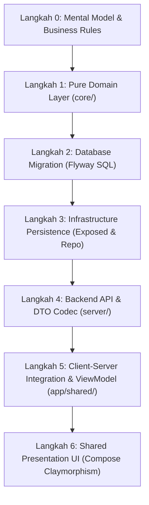

# 🎓 Modul Pembelajaran: Redesign CRM Sales Kanban & Executive KPI Metrics (Full-Stack DDD)

> **Level Target**: Junior to Mid Developer  
> **Topik Utama**: Domain-Driven Design (DDD), Full-Stack Architecture, Postgres Schema Evolution, Ktor REST API, Compose Multiplatform, Claymorphism + Neo-Brutalism Design System  
> **Prasyarat**: Pemahaman dasar Kotlin Multiplatform (KMP), Compose UI layout, SQL Flyway migrations, dan pemisahan arsitektur Onion/Clean Architecture  
> **Referensi Task**: CRM Sales Redesign & Garment Commercial Lead Optimization

---

## 💡 1. Konsep Dasar & Masalah di Dunia Nyata

### Masalah Nyata
Sebelum redesign ini, halaman CRM Sales (`/crm-sales`) terasa kaku, kosong, dan tidak informatif:
1. **The Giant Wireframe Box**: Tiga kolom kanban dibungkus outline border berwarna neon setinggi 800px dengan latar belakang putih polos. Terlihat seperti sketsa wireframe mentah daripada sistem ERP garmen kelas enterprise.
2. **Kartu Anemic**: Kartu lead hanya menampilkan nama brand dan nominal uang tipis. Sales person tidak bisa melihat konteks pesanan garmen (misal: "500 pcs Kemeja Tactical"), siapa PIC sales yang bertanggung jawab, kapan terakhir kali customer dihubungi (SLA contact), atau tombol pintas untuk langsung mem-follow-up via WhatsApp.
3. **Absennya Executive KPI Strip**: Manajer sales atau pemilik pabrik harus menghitung secara manual berapa total nilai proyek yang sedang aktif, berapa konversi lead yang berhasil lolos kualifikasi (*Qualified*), dan berapa prospek yang terbengkalai belum di-follow-up lebih dari 24 jam.
4. **Tofu Glyphs (Kotak Kosong)**: Penggunaan Unicode glyphs seperti `⊞` dan `☰` pada tombol toggle tampilan merender kotak tofu (`▯`) di Skiko/Wasm web browser karena engine Canvas browser tidak memiliki fallback font emoji/simbol sistem.

### Analogi Sederhana
Bayangkan seorang manajer pabrik masuk ke ruang showroom penjualan:
- **Sebelumnya**: Hanya ada tiga papan tulis besar kosong dengan coretan nama merek menggunakan spidol tipis. Sang manajer harus bertanya satu per satu ke stafnya untuk tahu berapa total potensi uang masuk bulan ini.
- **Setelahnya**: Terdapat **Executive Cockpit Dashboard** di baris teratas (menampilkan Total Nilai Pipeline Rp 320 Juta, 3 Prospek Aktif, 50% Rasio Kualifikasi, 1 Perlu Follow-up Cepat), disusul oleh meja kanban modern berlatar abu-abu netral yang rapi. Setiap kartu pesanan memiliki spesifikasi produk yang jelas, identitas PIC sales, badge urgensi waktu kontak, dan tombol hijau untuk langsung menelepon/chat pelanggan.

---

## 🧭 2. "Start dari Mana?" — Alur Langkah Penulisan (Order of Operations)

Jika kamu diminta membangun atau merombak fitur full-stack end-to-end seperti ini dari nol, **jangan langsung loncat ke UI Composable atau langsung membuat tabel database**. Ikuti urutan langkah standar ini:



1. **Langkah 0: Desain Mental & Kontrak Domain (`core/`)**
   - Tentukan apa konsep garmen yang hilang dari entitas lead: Kategori produk pesanan garmen (`ProductCategory`), waktu interaksi terakhir (`lastContactedAt`), dan ringkasan metrik eksekutif (`CrmLeadKpiMetrics`).
2. **Langkah 1: Pure Domain Modeling**
   - Buat Value Object immutable (`ProductCategory`), perbarui entity `CrmLead`, dan buat use case bisnis murni `GetCrmLeadKpiMetricsUseCase` yang bebas dependensi framework.
3. **Langkah 2: Skema Database & Migrasi Flyway**
   - Tambahkan kolom `product_category` dan `last_contacted_at` pada tabel `crm_leads` via file migrasi Flyway versi terurut (`V37__...sql`) lengkap dengan indeks performa.
4. **Langkah 3: Infrastructure Persistence (`server/`)**
   - Daftarkan kolom baru pada objek Exposed `CrmLeadsTable` dan lakukan mapping entity di `PostgresCrmLeadRepository`.
5. **Langkah 4: Backend API & Routing (`server/`)**
   - Perbarui DTO serializer/deserializer di `CrmLeadCodec.kt`, tambahkan endpoint `GET /api/tenant/crm/leads/metrics` pada `CrmRoutes.kt`.
6. **Langkah 5: Client State & ViewModel (`app/shared/`)**
   - Tambahkan state filtering (`selectedEmployeeId`, `selectedSource`), properti `kpiMetrics`, serta event handling pada `CrmViewModel`.
7. **Langkah 6: Presentation UI Components (`app/shared/presentation/`)**
   - Bangun `CrmKpiMetricsRow` (4 kartu metrik bergaya Clay), sempurnakan `CrmKanbanColumn` (background `SurfaceMuted`, outline `Outline`), dan rombak `CrmKanbanCard` (spesifikasi garmen, tombol WhatsApp, avatar sales).

---

## 🧱 3. Bedah Blok per Blok Kode (Deep Code Walkthrough)

Mari kita bedah kode implementasi dari layer terdalam hingga ke lapisan UI terluar.

### Blok A: Pure Domain Value Object & Use Case (`core/`)

```kotlin
// File: core/src/commonMain/kotlin/com/eventverse/app/domain/crm/CrmLeadValueObjects.kt
@JvmInline
value class ProductCategory(val value: String) {
    val display: String get() = value.ifBlank { "Uncategorized" }
    companion object {
        val EMPTY = ProductCategory("")
        val KEMEJA = ProductCategory("Kemeja Tactical / PDH")
        val POLO = ProductCategory("Kaos Polo / Wangki")
        val HOODIE = ProductCategory("Jaket / Hoodie")
        val SERAGAM = ProductCategory("Seragam Pabrik / Wearpack")
    }
}
```

```kotlin
// File: core/src/commonMain/kotlin/com/eventverse/app/domain/crm/usecases/GetCrmLeadKpiMetricsUseCase.kt
class GetCrmLeadKpiMetricsUseCase {
    operator fun invoke(leads: List<CrmLead>, now: Instant): CrmLeadKpiMetrics {
        val nonArchived = leads.filter { !it.isArchived }
        if (nonArchived.isEmpty()) return CrmLeadKpiMetrics()

        val totalPipeline = nonArchived.sumOf { it.estimatedValue?.amount ?: 0L }
        val activeLeads = nonArchived.filter { it.stage != LeadStage.UNQUALIFIED }
        val qualifiedCount = nonArchived.count { it.stage == LeadStage.QUALIFIED }

        val conversionRate = if (nonArchived.isNotEmpty()) {
            ((qualifiedCount.toDouble() / nonArchived.size.toDouble()) * 1000.0).toInt() / 10.0
        } else 0.0

        val twentyFourHoursAgo = now - 24.hours
        val followUpNeeded = activeLeads.count { lead ->
            val contactTime = lead.lastContactedAt ?: lead.createdAt
            contactTime < twentyFourHoursAgo || lead.activityCount == 0
        }

        return CrmLeadKpiMetrics(
            totalPipelineValue = totalPipeline,
            activeLeadsCount = activeLeads.size,
            qualifiedConversionRate = conversionRate,
            followUpNeededCount = followUpNeeded
        )
    }
}
```

**Mengapa blok ini ditulis begini?**
- **`@JvmInline value class`**: Menghindari alokasi heap object overhead di JVM/Wasm runtime namun memberikan type safety penuh (tidak bisa tertukar dengan string sembarang).
- **`operator fun invoke`**: Menjadikan use case callable seperti fungsi matematika murni: `useCase(leads, now)`. Ini mempermudah unit testing tanpa mock framework (zero external dependency).
- **Penetapan SLA 24 Jam**: Metrik `followUpNeededCount` secara otomatis menandai prospek aktif yang belum disentuh lebih dari 24 jam atau yang aktivitasnya masih nol.

---

### Blok B: Database Schema & Migration (`server/`)

```sql
-- File: server/src/main/resources/db/migration/V37__add_product_category_and_last_contacted_to_crm_leads.sql
ALTER TABLE crm_leads
ADD COLUMN IF NOT EXISTS product_category VARCHAR(100) NOT NULL DEFAULT '',
ADD COLUMN IF NOT EXISTS last_contacted_at TIMESTAMPTZ;

CREATE INDEX IF NOT EXISTS idx_crm_leads_tenant_category
ON crm_leads (tenant_id, product_category);

CREATE INDEX IF NOT EXISTS idx_crm_leads_tenant_last_contacted
ON crm_leads (tenant_id, last_contacted_at);
```

**Mengapa blok ini ditulis begini?**
- **Compound Index `(tenant_id, ...)`**: Sistem WeMade mengusung arsitektur SaaS multi-tenant. Setiap query data pasti menyertakan filter `tenant_id`. Mengindeks `(tenant_id, product_category)` dan `(tenant_id, last_contacted_at)` memastikan query agregasi dan filter kartu tetap berkecepatan *O(log N)* meskipun terdapat ratusan ribu record di database.

---

### Blok C: Executive KPI Row (`app/shared/presentation/`)

```kotlin
// File: app/shared/src/commonMain/kotlin/com/eventverse/app/presentation/crm/components/CrmKpiMetricsRow.kt
@Composable
fun CrmKpiMetricsRow(
    metrics: CrmLeadKpiMetrics,
    modifier: Modifier = Modifier
) {
    Row(
        modifier = modifier.fillMaxWidth(),
        horizontalArrangement = Arrangement.spacedBy(ClaySpacing.Md)
    ) {
        // 1. Total Pipeline Value
        KpiCard(
            title = "Total Pipeline Value",
            value = formatRupiahShort(metrics.totalPipelineValue),
            subtitle = "Estimasi omzet aktif",
            accentColor = WeMadeColors.Primary,
            modifier = Modifier.weight(1f)
        )
        // 2. Active Leads Count
        KpiCard(
            title = "Active Leads",
            value = "${metrics.activeLeadsCount}",
            subtitle = "New + Qualified",
            accentColor = WeMadeColors.Info,
            modifier = Modifier.weight(1f)
        )
        // 3. Qualified Conversion Rate
        KpiCard(
            title = "Qualified Conversion",
            value = "${metrics.qualifiedConversionRate}%",
            subtitle = "Rasio prospek lolos",
            accentColor = WeMadeColors.Success,
            modifier = Modifier.weight(1f)
        )
        // 4. Follow-up Needed
        KpiCard(
            title = "Follow-up Needed",
            value = "${metrics.followUpNeededCount}",
            subtitle = "Belum kontak > 24 jam",
            accentColor = if (metrics.followUpNeededCount > 0) WeMadeColors.Error else WeMadeColors.Success,
            modifier = Modifier.weight(1f)
        )
    }
}
```

**Mengapa blok ini ditulis begini?**
- **Visual Alert Dinamis**: Pada metrik *Follow-up Needed*, jika nilainya > 0 maka `accentColor` otomatis berubah menjadi merah (`WeMadeColors.Error`) untuk memperingatkan tim penjualan bahwa ada prospek garmen yang terancam dingin (*cold lead*).
- **Semantik Desain WeMade**: Menggunakan `ClayCard`, `ClaySpacing.Md`, dan token warna semantik (`WeMadeColors.Primary`, `WeMadeColors.Success`, dll.) tanpa satu pun literal `Color(0xFF...)`.

---

### Blok D: Rombak Kanban Column & Rich Card (`app/shared/presentation/`)

```kotlin
// File: app/shared/src/commonMain/kotlin/com/eventverse/app/presentation/crm/components/CrmKanbanColumn.kt
val columnOutline = when {
    isDropTarget -> stage.tint()
    else -> WeMadeColors.Outline // Outline gelap 3dp konsisten
}

Column(
    modifier = modifier
        .width(ClayPaneWidth.KanbanColumn)
        .clayFlat(
            shape = ClayShapes.Card,
            background = WeMadeColors.SurfaceMuted, // Abu-abu sejuk lembut #F8FAFC
            outline = columnOutline,
            borderWidth = ClayBorder.Thick
        )
        .padding(ClaySpacing.Md)
) { ... }
```

```kotlin
// File: app/shared/src/commonMain/kotlin/com/eventverse/app/presentation/crm/components/CrmKanbanCard.kt
// Spesifikasi garmen yang padat konteks
val specText = buildString {
    val pcs = lead.estimatedPcs
    if (pcs != null && pcs > 0) append("$pcs pcs • ")
    append(lead.productCategory.display)
}
Text(
    text = specText,
    fontSize = 11.sp,
    fontWeight = FontWeight.Medium,
    color = WeMadeColors.OnSurfaceMuted
)

// Quick Action WhatsApp via LocalUriHandler
if (lead.whatsappNumber != null) {
    Box(
        modifier = Modifier
            .clayFlat(
                shape = ClayShapes.Pill,
                background = WeMadeColors.SuccessContainer,
                outline = WeMadeColors.Success,
                borderWidth = ClayBorder.Thin
            )
            .clickable {
                uriHandler.openUri(lead.whatsappNumber.toDirectUrl())
            }
            .padding(horizontal = 8.dp, vertical = 4.dp)
    ) {
        Text("Chat WA", fontSize = 10.sp, fontWeight = FontWeight.Bold, color = WeMadeColors.Success)
    }
}
```

**Mengapa blok ini ditulis begini?**
- **Mengeliminasi Giant Wireframe Box**: Kolom sekarang diisi dengan `WeMadeColors.SurfaceMuted` (`#F8FAFC`), dan outline kolom memakai `WeMadeColors.Outline` gelap 3dp yang tegap, bukan outline neon tanpa latar.
- **Konteks Spesifik Pabrik Garmen**: Menampilkan volume produksi (`500 pcs`) dan kategori (`Kemeja Tactical / PDH`) langsung di muka kartu kanban, memangkas waktu inspeksi drawer bagi sales reps.
- **Zero Emoji Compliance**: Tombol aksi WhatsApp dan chevron dropdown menggunakan vektor canvas `IconChevronDown` dan teks deskriptif bersih, bukan emoji WhatsApp (`💬`) yang memicu rendering kotak kosong (tofu) di Compose Wasm.

---

## ⚖️ 4. Teknologi & Pendekatan yang Dipilih: The "Why"

| Teknologi / Pendekatan | Alternatif yang Ada | Mengapa Kita Memilih Ini? | Risiko Jika Memakai Alternatif |
|---|---|---|---|
| **Pure Domain Use Case (`GetCrmLeadKpiMetricsUseCase`)** | Menghitung agregasi langsung di Composable UI / ViewModel | Logika kalkulasi metrik bersifat deterministik, dapat diuji dengan unit test murni tanpa mocking, dan bisa diakses oleh backend API maupun client tanpa duplikasi rumus. | Rumus perhitungan pipeline value atau conversion rate akan tercecer di Composable. Jika definisi "Follow-up Needed" berubah, harus diubah di banyak tempat. |
| **Pemisahan `SurfaceMuted` vs `Surface`** | Background kanban putih polos (`Color.White`) | Memberikan kontras kedalaman (*visual hierarchy*) antara kanban board container dan kartu lead di dalamnya. Kartu putih di atas latar abu-abu sejuk memberikan kesan tactile/clay yang nyata. | Tampilan menjadi flat, dingin, dan terasa seperti wireframe prototipe yang belum rampung. |
| **`clayFlat` + `LocalUriHandler` untuk Tombol Chat WA** | Mengharuskan pengguna mengklik kartu lalu membuka inspector drawer | Mengurangi *interaction cost* (Fitts's Law). Sales rep yang sedang mem-follow-up prospek bisa langsung membuka percakapan WhatsApp hanya dengan 1 kali klik dari kartu kanban. | Produktivitas sales terhambat karena harus bolak-balik buka-tutup drawer untuk sekadar mengirim pesan follow-up. |
| **Token `WeMadeColors.Outline`** | Hardcode warna neon per stage di seluruh border kolom 800px | Mengikuti Neo-Brutalism WeMade standard (§12 User Rules): outline gelap konsisten 3dp; status dibedakan melalui aksen badge di header kolom dan pill, bukan dengan mewarnai bingkai raksasa. | Layar terlihat seperti sirkus warna neon yang melelahkan mata dan membingungkan operator pabrik. |

---

## ⚠️ 5. Jebakan Pemula (Junior Pitfalls) & Cara Menghindarinya

1. **Jebakan 1: Unicode Emojis / Glyphs sebagai Ikon di Compose Wasm**
   - *Kenapa bahaya*: Ketika kamu menulis `Text("⊞ Kanban")` atau `Text("💬 Chat WA")`, di Mac atau browser desktop mungkin terlihat normal, tetapi pada engine Skiko Compose Wasm, browser tidak memiliki font emoji bawaan OS. Akibatnya, browser menampilkan karakter kotak kosong atau tanda tanya (`▯`).
   - *Solusi elegan*: Gunakan vektor Canvas berbasis `drawPath` dari `ClayIcons.kt` (`IconChat`, `IconChevronDown`, dll.) atau gunakan label teks terstruktur.
2. **Jebakan 2: Mencoba Smart-Cast Properti Entity Public Lintas Modul**
   - *Kenapa bahaya*: Di Kotlin, properti `val` pada public entity modul lain (seperti `lead.estimatedPcs` dari modul `:core` ke `:app:shared`) tidak bisa di-smart-cast secara otomatis ke non-null karena kompiler khawatir modul lain bisa mengubah getter tersebut secara polimorfis.
   - *Solusi elegan*: Selalu tampung ke local variable terlebih dahulu:
     ```kotlin
     val pcs = lead.estimatedPcs
     if (pcs != null && pcs > 0) { ... }
     ```
3. **Jebakan 3: Menggunakan Parameter Imajiner pada Komponen Desain**
   - *Kenapa bahaya*: Mengira `ClayButton` memiliki parameter `trailing = { ... }`. Saat dikompilasi, Gradle akan melempar error `Cannot find a parameter with this name: trailing`.
   - *Solusi elegan*: Periksa definisi komponen di `presentation/designsystem/`. Jika membutuhkan layout trigger dropdown kustom dengan chevron di kanan, gunakan `Row` berbalut `Modifier.clayFlat` + `Modifier.clickable`.

---

## 🧪 6. Bagaimana Cara Membuktikan Kodingan Kita Bekerja?

### Unit Test untuk Pure Domain Logika Metrik
Di modul `core/src/commonTest/kotlin/com/eventverse/app/domain/crm/GetCrmLeadKpiMetricsUseCaseTest.kt`:

```kotlin
@Test
fun invoke_calculatesMetricsAccurately() {
    val useCase = GetCrmLeadKpiMetricsUseCase()
    val leads = listOf(
        sampleLead("1", LeadStage.NEW_LEAD, 50_000_000L, "Kemeja Tactical", now, activityCount = 1),
        sampleLead("2", LeadStage.QUALIFIED, 150_000_000L, "Jaket Bomber", now, activityCount = 2),
        sampleLead("3", LeadStage.UNQUALIFIED, 20_000_000L, "Kaos Polos", null, activityCount = 0),
        sampleLead("4", LeadStage.QUALIFIED, 100_000_000L, "Seragam Kerja", now, activityCount = 1)
    )

    val metrics = useCase(leads, now)

    // Pipeline Value: 50m + 150m + 20m + 100m = 320m
    assertEquals(320_000_000L, metrics.totalPipelineValue)
    // Active Leads: 3
    assertEquals(3, metrics.activeLeadsCount)
    // Qualified Conversion Rate: 2 qualified / 4 total = 50%
    assertEquals(50.0, metrics.qualifiedConversionRate)
}
```

Jalankan pengujian via terminal:
```bash
./gradlew :core:jvmTest --tests "com.eventverse.app.domain.crm.GetCrmLeadKpiMetricsUseCaseTest"
```

### Verifikasi Kompilasi Multiplatform
Pastikan shared UI dan backend terkompilasi bersih di kedua target runtime (JVM dan WasmJS):
```bash
./gradlew :server:compileKotlin :core:compileKotlinJvm :app:shared:compileKotlinJvm :app:shared:compileKotlinWasmJs
```

---

## 🏆 7. Tantangan Mandiri untuk Kamu (Self-Study Challenge)

Untuk mengasah pemahamanmu setelah mempelajari arsitektur modul ini, coba selesaikan tantangan berikut:

- [ ] **Tantangan 1 (Filter Interaktif KPI)**: Saat pengguna memilih filter Sales PIC tertentu dari dropdown toolbar, periksa apakah kartu KPI strip di bagian atas ikut mengkalkulasi ulang metrik khusus untuk sales tersebut, atau tetap menampilkan metrik seluruh perusahaan. Bagaimana cara membuat toggle switch "Tampilkan Metrik Saya Saja vs Seluruh Tim"?
- [ ] **Tantangan 2 (Target Pipeline Bar)**: Tambahkan progress bar horizontal mini di dalam kartu *Total Pipeline Value* yang membandingkan `totalPipelineValue` saat ini terhadap target bulanan perusahaan (misal target Rp 500.000.000). Gunakan `Modifier.clayFlat` untuk track dan filenya.
- [ ] **Tantangan 3 (SLA Urgency Animation)**: Tambahkan indikator visual (misal dot oranye berkedip halus atau badge peringatan) pada kartu kanban yang `lastContactedAt`-nya sudah melewati 48 jam untuk menandai status prospek garmen yang butuh penanganan darurat.
