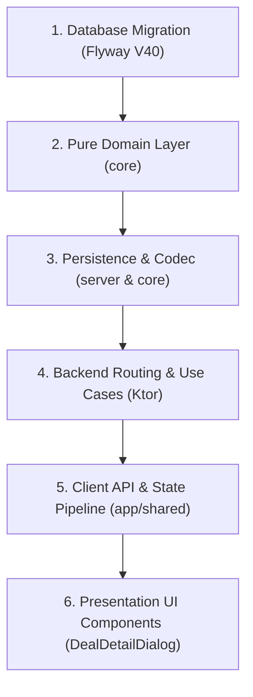

# 🎓 Modul Pembelajaran: Sampling Order Dual-Mockup (Depan/Belakang) & Custom Size Chart Matrix

> **Level Target**: Junior to Mid Developer  
> **Topik Utama**: Full-Stack KMP, Domain-Driven Design (DDD), PostgreSQL JSONB, Flyway Migration, Compose Multiplatform Claymorphism UI  
> **Prasyarat**: Pemahaman dasar Kotlin Multiplatform, Exposed ORM / PostgreSQL JSONB, dan State Management di Jetpack/Compose Multiplatform  
> **Referensi Fitur**: CRM Deal Sampling Sheet — Dual Mockup Views (Tampak Depan & Belakang) + Dynamic Size Chart POM Matrix

---

## 💡 1. Konsep Dasar & Masalah di Dunia Nyata

### Masalah Nyata di Industri Garment & Konveksi
Dalam alur kerja pesanan pakaian kustom / garment maklon (B2B):
1. **Sampling Bukan Sekadar 1 Foto**: Sebuah sampel baju tidak bisa hanya difoto dari depan. Buyer dan bagian pola/cutting konveksi wajib melihat **tampak depan** dan **tampak belakang** secara berdampingan untuk memastikan detail sablon, bordir, potongan punggung, dan kerah.
2. **Kebutuhan Ukuran Sejak Awal (Bukan Pasca-ACC)**: Buyer sering kali meminta sampel dengan ukuran khusus (misal: "Saya mau sampel ukuran L untuk model pria dan S untuk model wanita"). Jika ukuran baru diminta saat produksi massal, sampel yang dibuat bisa salah proporsi.
3. **Fleksibilitas Point of Measurement (POM)**: Standar ukuran baju kaos berbeda dengan kemeja, hoodie, atau cardigan. Garment butuh baris ukuran dinamis (misal: *Lebar Dada*, *Panjang Baju*, *Panjang Lengan*, *Lebar Bahu*) dengan kolom standar ukuran (`ALL SIZE`, `S`, `M`, `L`, `XL`, `XXL`, `XXXL`) yang bisa ditambah atau dihapus tanpa harus merombak struktur database setiap kali ada jenis pakaian baru.
4. **Header yang Rapi & Tidak Menggeser Layout**: Ketika buyer mengajukan revisi (Rev 1, Rev 2), menaruh rentetan pill revisi di baris header kartu membuat layout berantakan saat revisi bertambah banyak. Penggunaan **dropdown menu melayang** dengan label ringkas (`Rev 0`, `Rev 1`, `Rev 2`) menjaga header tetap stabil dan elegan.

---

## 🧭 2. "Start dari Mana?" — Alur Langkah Penulisan (Order of Operations)

Jika kamu diminta membangun fitur ini dari awal, ikuti urutan kerja (order of operations) Full-Stack DDD berikut:



1. **Langkah 1: Migrasi Database (Flyway)**:
   - Tambahkan kolom `size_matrix JSONB NOT NULL DEFAULT '[]'` ke tabel `sampling_orders` (`V40__sampling_size_matrix.sql`).
2. **Langkah 2: Pure Domain Model (`core`)**:
   - Buat model `SizeChartRow(id, pomName, values)` dan konstanta `STANDARD_SAMPLING_SIZE_COLUMNS`.
   - Update entitas `SamplingOrder` dengan field `sizeMatrix` dan method `attachMockup(storageKey, slot = "front" | "back")`.
   - Update Use Cases: `CreateSamplingOrderUseCase`, `CreateSamplingOrderFromDealUseCase`, dan `AttachSamplingMockupUseCase`.
3. **Langkah 3: Shared Codec & Serialisasi**:
   - Tambahkan encoding/decoding `sizeMatrix` pada `SamplingOrderCodec.kt` menggunakan format JSON yang aman terhadap tipe data numbers/strings.
4. **Langkah 4: Backend Persistence & Rute Ktor (`server`)**:
   - Perbarui `SamplingTables.kt` dan `PostgresSamplingOrderRepository.kt` untuk menyimpan `size_matrix` ke PostgreSQL.
   - Perbarui endpoint Ktor `DealRoutes.kt` (POST & PUT `/{id}/sampling-orders` dan POST mockup slot query).
5. **Langkah 5: Client-Server Integration (`app/shared`)**:
   - Perbarui `DealRemoteDataSource.kt` dan `DealApiClient.kt` untuk menyertakan `sizeMatrix` dan query param `slot`.
   - Sambungkan event ViewModel `DealUiEvent.SaveSamplingOrder` dan `UploadSamplingMockup`.
6. **Langkah 6: Presentation UI (Claymorphism)**:
   - Buat `DesignMockupSlot` berukuran 108dp dengan label "Tampak Depan" dan "Tampak Belakang".
   - Buat `SamplingSizeChartTable` dengan `horizontalScroll`, input `pomName` dan ukuran dengan `BasicTextField`, serta tombol `+ Tambah Ukuran`.
   - Buat dropdown menu melayang untuk pemilihan revisi (`Rev 0`, `Rev 1`, ...) tanpa label berlebih.

---

## 🧱 3. Bedah Blok per Blok Kode (Deep Code Walkthrough)

### Blok A: Pure Domain Model (`SamplingSizeMatrix.kt`)

```kotlin
package com.eventverse.app.domain.sampling

/** Kolom ukuran standar garmen yang siap diisi oleh buyer / admin CRM */
val STANDARD_SAMPLING_SIZE_COLUMNS = listOf(
    "ALL SIZE", "S", "M", "L", "XL", "XXL", "XXXL"
)

/**
 * Satu baris pengukuran (Point of Measurement - POM).
 * Contoh: pomName = "Lebar Dada", values = {"ALL SIZE": "52", "S": "48", "M": "50", ...}
 */
data class SizeChartRow(
    val id: String,
    val pomName: String,
    val values: Map<String, String> = emptyMap()
)

fun defaultSamplingSizeMatrix(): List<SizeChartRow> = listOf(
    SizeChartRow(
        id = "pom_ld",
        pomName = "Lebar Dada",
        values = STANDARD_SAMPLING_SIZE_COLUMNS.associateWith { "" }
    ),
    SizeChartRow(
        id = "pom_pb",
        pomName = "Panjang Baju",
        values = STANDARD_SAMPLING_SIZE_COLUMNS.associateWith { "" }
    )
)
```
**Mengapa blok ini ditulis begini?**
- `STANDARD_SAMPLING_SIZE_COLUMNS` didefinisikan di domain agar konsisten antara frontend dan backend tanpa ada *magic string*.
- `defaultSamplingSizeMatrix()` menyediakan 2 baris default ("Lebar Dada" dan "Panjang Baju") sehingga admin tidak perlu mengetik dari nol saat membuat kartu desain baru.
- Tidak ada dependensi ke Android/Compose/Ktor di sini — murni Kotlin standard library.

---

### Blok B: Dual Mockup Keys di Entity (`SamplingOrder.kt`)

```kotlin
data class SamplingOrder(
    // ...
    val mockupStorageKey: String? = null,
    val sizeMatrix: List<SizeChartRow> = emptyList()
) {
    val mockupFrontKey: String?
        get() = mockupStorageKey?.split(";")?.firstOrNull { it.startsWith("front:") }?.removePrefix("front:")
            ?: mockupStorageKey?.takeIf { !it.contains(";") && !it.startsWith("back:") }

    val mockupBackKey: String?
        get() = mockupStorageKey?.split(";")?.firstOrNull { it.startsWith("back:") }?.removePrefix("back:")

    fun attachMockup(key: String, slot: String = "front", updatedAt: Instant): SamplingOrder {
        val front = if (slot == "front") key else mockupFrontKey
        val back = if (slot == "back") key else mockupBackKey
        val combined = listOfNotNull(
            front?.let { "front:$it" },
            back?.let { "back:$it" }
        ).joinToString(";")
        return copy(mockupStorageKey = combined.ifBlank { null }, updatedAt = updatedAt)
    }
}
```
**Mengapa blok ini ditulis begini?**
- **Backward Compatibility**: Data mockup lama yang belum memiliki prefix slot tetap dianggap sebagai `mockupFrontKey`.
- Disimpan sebagai string terkomposisi `"front:...;back:..."` sehingga tidak memerlukan alter table rumit untuk foto kedua, sementara getter domain memisahkannya dengan bersih.

---

### Blok C: Database Migration & Exposed Mapping (`V40__sampling_size_matrix.sql`)

```sql
-- server/src/main/resources/db/migration/V40__sampling_size_matrix.sql
ALTER TABLE sampling_orders
    ADD COLUMN IF NOT EXISTS size_matrix JSONB NOT NULL DEFAULT '[]';
```
Dan di Exposed table:
```kotlin
object SamplingOrdersTable : Table("sampling_orders") {
    // ...
    val sizeMatrix = jsonbText("size_matrix").default("[]")
}
```
**Mengapa JSONB?**
- PostgreSQL `JSONB` menyimpan representasi biner terindeks yang sangat efisien untuk dokumen terstruktur dinamis seperti baris-baris POM.
- Menghindari pembuatan tabel relasional `sampling_order_size_rows` dan `sampling_order_size_cells` yang akan menghasilkan multi-join mahal hanya untuk membaca beberapa baris ukuran garmen.

---

### Blok D: Dropdown Menu Revisi Melayang (`DealDetailDialog.kt`)

```kotlin
Box {
    ClayActionSurface(
        onClick = { isRevisionDropdownOpen = !isRevisionDropdownOpen },
        contentPadding = PaddingValues(horizontal = 10.dp, vertical = 7.dp)
    ) {
        Row(
            verticalAlignment = Alignment.CenterVertically,
            horizontalArrangement = Arrangement.spacedBy(ClaySpacing.Xs)
        ) {
            Text(
                text = "Rev $selectedRevision",
                fontSize = 11.sp,
                fontWeight = FontWeight.Bold,
                color = WeMadeColors.Primary
            )
            if (isRevisionDropdownOpen) {
                IconChevronUp(Modifier.size(10.dp), color = WeMadeColors.Primary)
            } else {
                IconChevronDown(Modifier.size(10.dp), color = WeMadeColors.Primary)
            }
        }
    }
    DropdownMenu(
        expanded = isRevisionDropdownOpen,
        onDismissRequest = { isRevisionDropdownOpen = false }
    ) {
        for (rev in order.revisionCount downTo 0) {
            DropdownMenuItem(
                text = {
                    Text(
                        text = "Rev $rev",
                        fontSize = 12.sp,
                        fontWeight = if (rev == selectedRevision) FontWeight.Bold else FontWeight.Normal,
                        color = if (rev == selectedRevision) WeMadeColors.Primary else WeMadeColors.OnSurface
                    )
                },
                onClick = {
                    selectedRevision = rev
                    isRevisionDropdownOpen = false
                }
            )
        }
    }
}
```
**Mengapa pendekatan ini lebih baik daripada deretan pills?**
- **Ruang Statis**: Header kartu accordion tetap bersih dan stabil berapa pun jumlah revisi yang dibuat buyer.
- **Label Ringkas**: Menggunakan "Rev 0", "Rev 1", "Rev 2" tanpa imbuhan teks panjang menjaga kejelasan visual seketika.

---

### Blok E: Layout 2 Kolom (Grid Mockup Vertikal vs Kontrol Kanan)

```kotlin
// Row utama 2 kolom di SamplingDesignCard
Row(
    modifier = Modifier.fillMaxWidth(),
    horizontalArrangement = Arrangement.spacedBy(ClaySpacing.Lg),
    verticalAlignment = Alignment.Top
) {
    // Kolom Kiri (Lebar 200dp): Foto Tampak Depan & Belakang secara Vertikal
    Column(
        modifier = Modifier.width(200.dp),
        verticalArrangement = Arrangement.spacedBy(ClaySpacing.Md)
    ) {
        DesignMockupSlot(label = "Tampak Depan", bitmap = frontBitmap, ...)
        DesignMockupSlot(label = "Tampak Belakang", bitmap = backBitmap, ...)
    }

    // Kolom Kanan (weight 1f): Size Chart, Feedback, Sampling Fee, Catatan, dan Aksi
    Column(
        modifier = Modifier.weight(1f),
        verticalArrangement = Arrangement.spacedBy(ClaySpacing.Md)
    ) {
        SamplingSizeChartTable(...)
        // Feedback Callout, Fee TextField, Notes TextField, Action Buttons
    }
}
```
**Mengapa disusun vertikal di kolom kiri?**
- **Ruang Foto Maksimal (Aspect Ratio & Skala)**: Menjejerkan foto secara horizontal di samping tabel mempersempit ukuran foto menjadi hanya ~108dp. Dengan menumpuk Tampak Depan dan Tampak Belakang secara vertikal di kolom kiri selebar 200dp x tinggi 180dp, detail pola dan mockup baju tampil jauh lebih besar dan jelas.
- **Keseimbangan Visual**: Tinggi total dua slot foto (~380dp) sangat seimbang dengan tinggi total kolom kanan yang berisi Size Chart Table + Form Fee & Catatan + Tombol Aksi (~380dp), sehingga kartu tidak menyisakan ruang kosong yang janggal.

---

### Blok F: Dynamic Size Chart Table (`SamplingSizeChartTable`)

```kotlin
@Composable
private fun SamplingSizeChartTable(
    sizeMatrix: List<SizeChartRow>,
    onUpdateRow: (index: Int, SizeChartRow) -> Unit,
    onDeleteRow: (index: Int) -> Unit,
    onAddRow: () -> Unit,
    modifier: Modifier = Modifier
) {
    Column(
        modifier = modifier
            .clayFlat(
                shape = ClayShapes.Chip,
                background = WeMadeColors.Surface,
                outline = WeMadeColors.Border,
                borderWidth = ClayBorder.Medium
            )
            .padding(ClaySpacing.Sm)
    ) {
        // Header & Tombol Tambah Ukuran
        // Scroll horizontal untuk tabel matriks ukuran
        val scrollState = rememberScrollState()
        Box(modifier = Modifier.fillMaxWidth().horizontalScroll(scrollState)) {
            Column {
                // Baris Header Kolom POM + ALL SIZE .. XXXL
                // Baris Input POM + BasicTextField per Cell
            }
        }
    }
}
```
**Poin Kunci Desain**:
- Menggunakan `BasicTextField` yang dibungkus `Box.clayFlat(shape = ClayShapes.Pill, borderWidth = ClayBorder.Hairline)` agar input angka terasa ringan dan tidak memakan terlalu banyak padding seperti `OutlinedTextField` bawaan Material.
- `horizontalScroll` menjamin tabel tidak terpotong di layar yang lebih sempit tanpa merusak layout kartu keseluruhan.

---

## ⚠️ 4. Jebakan Pemula (Common Pitfalls) & Cara Menghindarinya

1. **Memakai `Modifier.width(fillMaxWidth())` di Tab Button**:
   - *Masalah*: Garis aktif indikator tab yang memakai `fillMaxWidth()` akan mendorong tab sebelahnya keluar batas pandang.
   - *Solusi*: Gunakan `Modifier.width(IntrinsicSize.Max)` pada kontainer tombol tab agar lebarnya pas dengan teks labelnya.
2. **Positional / Regex Parsing pada PostgreSQL JSONB**:
   - *Masalah*: PostgreSQL `JSONB` menormalkan dan mengurutkan ulang kunci objek JSON saat di-query. Menggunakan `substringAfter` atau regex akan gagal total saat urutan key berubah.
   - *Solusi*: Selalu gunakan parser terstruktur berbasis AST (`JsonParser.parseObject`) dan baca field secara spesifik lewat nama kunci.
3. **Hardcoding Warna / Unicode Emoji**:
   - *Masalah*: Menulis `Color(0xFF...)` melanggar Design System Rules WeMade, dan memakai emoji seperti `➕` atau `❌` akan menjadi kotak kosong (tofu `▯`) di Compose Wasm.
   - *Solusi*: Selalu gunakan token semantik `WeMadeColors.*` dan ikon Canvas vektor `IconPlus` & `IconClose` dari `ClayIcons.kt`.

---

## 🧪 5. Verifikasi & Pengujian

1. **Unit Test Pure Domain**:
   ```bash
   ./gradlew :core:jvmTest
   ```
   Memastikan domain model, use case, dan codec serialisasi JSON berjalan sempurna tanpa regresi.
2. **Kompilasi Multiplatform (Wasm & JVM)**:
   ```bash
   ./gradlew :app:shared:compileKotlinJvm :app:shared:compileKotlinWasmJs :server:compileKotlin
   ```
   Memastikan seluruh target KMP kompatibel tanpa runtime leak atau error type inference.
3. **Pengujian Manual di Browser (Web UI)**:
   - Buka Deal CRM di browser.
   - Klik salah satu deal dan perhatikan kartu desain sampling `DSG-01`.
   - Verifikasi bahwa terdapat 2 slot foto (`Tampak Depan` dan `Tampak Belakang`).
   - Cek tabel Size Chart di sebelah kanan: coba edit nilai `Lebar Dada` dan `Panjang Baju`, lalu klik `+ Tambah Ukuran` untuk menambah baris baru (misal `Panjang Lengan`).
   - Cek dropdown revisi di header kartu: pastikan muncul pilihan ringkas `Rev 0`, `Rev 1`, dsb. tanpa teks `(Terkini)`, `(Arsip)`, atau `(Awal)`.
