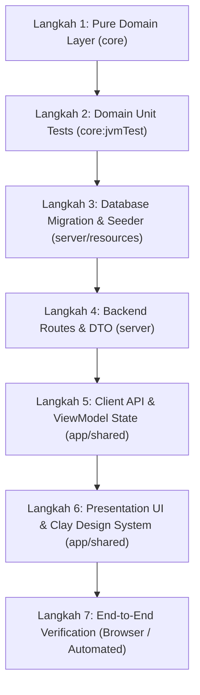

# 🎓 Modul Pembelajaran: Validasi Wajib Target Deadline Sebelum Penerbitan SPK Sampling & Integrasi End-to-End

> **Level Target**: Junior to Mid Developer  
> **Topik Utama**: Domain-Driven Design (DDD), Validation Gate, Compose Multiplatform (Wasm), Ktor REST API, Flyway Database Seed  
> **Prasyarat**: Pemahaman dasar Kotlin Multiplatform, Coroutine Flow / MVI, arsitektur Clean/DDD, dan Flyway PostgreSQL  
> **Referensi Task**: Implementasi Deadline Inputan Wajib Sebelum Buat SPK Sampling di `/crm-sales/deals` & Database Seeder

---

## 💡 1. Konsep Dasar & Masalah di Dunia Nyata

### Masalah Nyata
Bayangkan sebuah pabrik konveksi/garment rajut (*knitwear*) seperti WeMade. Tim Sales baru saja berbicara dengan buyer dari brand "Morfeen Studio". Buyer setuju untuk dibuatkan sampel jaket rajut (*hoodie*). 

Jika sistem mengizinkan Sales menekan tombol **"Buat SPK Sampling"** tanpa menetapkan **Target Deadline Pengiriman**:
1. Operator di divisi rajut (*knitting*) dan *finishing* tidak tahu kapan pesanan sampel ini harus selesai. Akibatnya, sampel tertahan di antrean tanpa urgensi.
2. Saat buyer menanyakan status 5 hari kemudian, tim Sales panik karena tidak ada komitmen tanggal target di SPK.
3. Keterlambatan sampel membuat buyer ragu memesan produksi massal (PO bernilai puluhan/ratusan juta rupiah terancam batal).

### Analogi Sederhana
Membuat SPK Sampling tanpa deadline seperti **memesan tiket pesawat tanpa tanggal penerbangan**. Maskapai tahu Anda ingin terbang, tetapi staf tidak tahu kapan harus menyiapkan kursi, bahan bakar, dan bagasi Anda. Oleh karena itu, form pemesanan tiket wajib menuntut tanggal sebelum Anda dapat mencetak *boarding pass*.

### Hasil Akhir yang Diharapkan
1. Di layar CRM Deals (`/crm-sales/deals`), setiap kali pengguna membuka deal dan ingin menerbitkan SPK:
   - Terdapat inputan **Target Deadline Pengiriman \*** yang wajib diisi.
   - Disediakan tombol jalan pintas (*preset chips*): `+3 Hari`, `+7 Hari`, `+14 Hari`.
   - Tombol "Buat SPK Sampling" menolak membuka modal konfirmasi jika deadline belum terisi, dan memberi peringatan visual teks merah yang jelas.
2. Di level domain murni (`core`), fungsi `missingSpkRequirements()` pada agregat `SamplingOrder` mengunci validasi: SPK tidak boleh terbit jika `deadlineDelivery == null`.
3. Di backend (`server`), endpoint `POST` dan `PUT /{id}/sampling-orders` memproses `deadlineDelivery` ke dalam database PostgreSQL.
4. Database memiliki data awal (*seed*) di migrasi Flyway V50 yang menyediakan deal berstatus `OPEN` tanpa deadline untuk memverifikasi alur ini secara nyata di browser.

---

## 🧭 2. "Start dari Mana?" — Alur Langkah Penulisan (Order of Operations)

Jika kamu diberi tugas seperti ini di dunia kerja nyata, **jangan langsung loncat ke UI Compose!** Ikuti prinsip *Outside-In* atau *Core-First* berikut:



1. **Langkah 1: Pure Domain Layer (`core`)**  
   Periksa agregat `SamplingOrder`. Tambahkan aturan bisnis: `deadlineDelivery` adalah syarat mutlak sebelum SPK disetujui atau diterbitkan.
2. **Langkah 2: Domain Unit Tests (`core:jvmTest`)**  
   Tulis pengujian otomatis untuk membuktikan bahwa ketiadaan deadline menghasilkan error validasi di domain model.
3. **Langkah 3: Database Migration & Seeder (`server`)**  
   Tulis skrip Flyway SQL (`V50__...sql`) yang memuat data contoh: deal baru (`deal-seed-005`) dengan order sampling draft yang belum memiliki deadline (`deadline_delivery = NULL`).
4. **Langkah 4: Backend API & DTO (`server`)**  
   Pastikan controller rute Ktor (`DealRoutes.kt`) dapat menerima dan mem-parsing parameter tanggal `deadlineDelivery` (ISO-8601 `YYYY-MM-DD`).
5. **Langkah 5: Client API & ViewModel (`app/shared`)**  
   Tambahkan `deadlineDelivery` ke request DTO `DealApiClient`, event MVI `DealUiEvent.SaveSamplingOrder`, dan simpan ke `DealViewModel`.
6. **Langkah 6: Presentation UI (`app/shared/presentation`)**  
   Rancang komponen input tanggal dengan *preset chips* `+3 Hari`, `+7 Hari`, `+14 Hari` mematuhi Claymorphism Design System. Pisahkan dialog besar sesuai aturan *File Size & Single Responsibility* (Rule 14).
7. **Langkah 7: End-to-End Verification**  
   Jalankan server dan browser untuk mencoba mengisi form, klik tombol preset, dan pastikan data tersimpan di PostgreSQL.

---

## 🧱 3. Bedah Blok per Blok Kode (Deep Code Walkthrough)

Mari kita bedah kode yang kita tulis di setiap layer secara mendalam.

### Blok A: Pure Domain Layer (`core/src/commonMain/kotlin/.../SamplingOrder.kt`)

```kotlin
fun missingSpkRequirements(matrix: List<SizeChartRow> = emptyList()): List<String> = buildList {
    if (clientName.isBlank()) add("Nama klien / buyer wajib diisi.")
    if (styleName.isBlank()) add("Nama artikel / style wajib diisi.")
    // ATURAN BARU: Target deadline pengiriman sampel wajib diisi
    if (deadlineDelivery == null) add("Target deadline pengiriman sampel wajib diisi.")
    ...
}
```

**Mengapa blok ini ditulis begini?**
- Domain layer adalah **jantung aplikasi** yang tidak boleh bergantung pada Ktor, Jetpack Compose, Android, maupun database PostgreSQL.
- Dengan meletakkan validasi `if (deadlineDelivery == null)` di dalam fungsi `missingSpkRequirements()`, kita menjamin bahwa aturan ini tidak bisa dilompati oleh siapa pun — baik UI web, aplikasi mobile, maupun script background.

---

### Blok B: Migrasi Database & Seeder (`server/src/main/resources/db/migration/V50__...sql`)

```sql
-- Deal baru berstatus OPEN (belum terbit SPK)
INSERT INTO deals (id, tenant_id, contact_id, title, stage, estimated_value_idr,
                   expected_close_date, notes, created_by_user_id, created_at, updated_at)
VALUES
    ('deal-seed-005', 'ten-demo-001', 'con-seed-005',
     'PO Hoodie Rajut Vintage — 250 pcs Morfeen Studio', 'OPEN', 65000000,
     CURRENT_DATE + 30, 'Diskusi awal sampel; tentukan deadline pengiriman sampel sebelum rilis SPK ke sampling.',
     'usr-owner-001', CURRENT_TIMESTAMP - INTERVAL '2 days', CURRENT_TIMESTAMP)
ON CONFLICT (id) DO NOTHING;

-- Lembar sampling DRAFT / NEW_INTAKE terhubung ke deal-seed-005
-- deadline_delivery sengaja NULL agar user dapat menguji inputan wajib di UI
INSERT INTO sampling_orders (id, tenant_id, spk_number, client_name, style_name, status,
                             pipeline_stage, finishing_path, size_mode,
                             deadline_program, deadline_finishing, deadline_delivery,
                             deal_id, sample_quantity, sampling_fee_idr,
                             revision_count, revision_history, size_matrix,
                             acc_notes, notes, created_by_user_id, created_at, updated_at)
VALUES ('smp-seed-0050', 'ten-demo-001', 'SPK-SMP-0050', 'Morfeen Studio', 'Oversized Knit Hoodie Vintage',
        'DRAFT', 'NEW_INTAKE', 'INTERNAL', 'ALL_SIZE',
        NULL, NULL, NULL,
        'deal-seed-005', 2, 350000,
        0, '[]',
        '[
           {"id":"sampling_qty_row","pomName":"Jumlah Sampel (pcs)","values":{"ALL SIZE":"2","S":"","M":"","L":"","XL":"","XXL":"","XXXL":""}},
           ...
         ]'::jsonb,
        '', 'Bahan katun rajut 7GG tebal; kantong kanguru depan dan tali rajut senada.',
        'usr-owner-001', CURRENT_TIMESTAMP - INTERVAL '2 days', CURRENT_TIMESTAMP)
ON CONFLICT (id) DO NOTHING;
```

**Mengapa blok ini ditulis begini?**
- `ON CONFLICT (id) DO NOTHING`: Memastikan skrip migrasi bersifat *idempotent* (dapat dijalankan berulang kali di berbagai environment tanpa error duplicate key).
- Nilai `deadline_delivery` sengaja diset `NULL` agar tester / QA bisa langsung melihat deal ini di UI dalam keadaan belum memiliki deadline, lalu membuktikan bahwa tombol "Buat SPK Sampling" menolak memproses sebelum tanggal diisi.
- ID `smp-seed-0050` dipilih untuk menghindari tabrakan dengan nomor urut yang dihasilkan saat pengujian runtime.

---

### Blok C: Presentation UI — Quick Presets & Validasi Form (`DealDetailDialog.kt`)

```kotlin
// Input Target Deadline Pengiriman
Row(
    modifier = Modifier.fillMaxWidth(),
    horizontalArrangement = Arrangement.spacedBy(8.dp),
    verticalAlignment = Alignment.CenterVertically
) {
    ClayTextField(
        value = deadlineDeliveryInput,
        onValueChange = { raw ->
            deadlineDeliveryInput = raw
            deadlineDeliveryError = false
            triggerSamplingAutosave()
        },
        label = "Target Selesai / Kirim (YYYY-MM-DD)",
        modifier = Modifier.weight(1f)
    )

    // Preset button helper (+3, +7, +14 hari)
    listOf(3 to "+3 Hari", 7 to "+7 Hari", 14 to "+14 Hari").forEach { (days, label) ->
        val targetDate = remember(days) {
            val now = Clock.System.now().toLocalDateTime(TimeZone.currentSystemDefault()).date
            now.plus(DatePeriod(days = days)).toString()
        }
        val isSelected = deadlineDeliveryInput.trim() == targetDate
        ClayTag(
            label = "$label ($targetDate)",
            color = if (isSelected) WeMadeColors.Success else WeMadeColors.SurfaceMuted,
            onClick = {
                deadlineDeliveryInput = targetDate
                deadlineDeliveryError = false
                triggerSamplingAutosave()
            }
        )
    }
}
```

**Mengapa blok ini ditulis begini?**
- **Mental Model UX**: Mengetik tanggal `2026-09-26` secara manual di keyboard itu lambat dan rentan salah ketik (*typo*). Dengan memberikan *preset chips* (+3, +7, +14 Hari), Sales cukup melakukan **1 klik** untuk mengisi tanggal yang valid secara otomatis!
- `triggerSamplingAutosave()` langsung dipanggil agar perubahan tanggal tersimpan seketika di backend tanpa Sales harus mencari tombol "Simpan" terpisah.

---

### Blok D: Dekomposisi File & Single Responsibility (`ConfirmSpkDialog.kt`)

Sesuai aturan **Rule 14 (File Size Ratchet Rule)**, file Compose tidak boleh menjadi *God File* yang melebihi batas (maksimal 600 baris untuk file baru). 

Sebelumnya, `DealDetailDialog.kt` membengkak hingga **3.051 baris**. Jika kita menambah fitur deadline di dalamnya tanpa pemisahan, file akan semakin sulit dibaca dan ditolak sistem *linter*.

Oleh karena itu, kita mengekstrak dialog konfirmasi ke file baru:
```
app/shared/src/commonMain/kotlin/com/eventverse/app/presentation/deal/components/
├── DealDetailDialog.kt    # Turun dari 3051 baris menjadi 2705 baris (Ratchet Pass!)
└── ConfirmSpkDialog.kt    # 476 baris (< 600 baris, fokus pada konfirmasi & revisi)
```

Di dalam `ConfirmSpkDialog.kt`, kita menampilkan ringkasan deadline:
```kotlin
Row(
    modifier = Modifier.fillMaxWidth(),
    horizontalArrangement = Arrangement.SpaceBetween
) {
    Text("Target Deadline Kirim:", style = MaterialTheme.typography.bodyMedium)
    val dl = order.deadlineDelivery
    if (dl != null) {
        ClayBadge(text = "📅 $dl", color = WeMadeColors.Primary)
    } else {
        ClayBadge(text = "⚠️ Belum Ditentukan", color = WeMadeColors.Error)
    }
}
```

---

## ⚖️ 4. Teknologi & Pendekatan yang Dipilih: The "Why"

| Teknologi / Pendekatan | Alternatif yang Ada | Mengapa Kita Memilih Ini? | Risiko Jika Memakai Alternatif |
|---|---|---|---|
| **Pengecekan di 3 Lapis (UI -> ViewModel -> Domain)** | Hanya cek di UI HTML/Compose | **Defense in Depth**: Domain model adalah benteng pertahanan terakhir. Jika ada bug di UI atau request via API langsung, sistem tetap aman. | Validasi mudah ditembus via cURL / Postman, data rusak masuk ke database produksi. |
| **`kotlinx.datetime.LocalDate`** | `java.util.Date` / String mentah | Kompatibel penuh dengan **Kotlin Multiplatform (Android, iOS, Wasm, Desktop, Server)** dan bebas dari zona waktu tak terduga untuk tipe tanggal murni. | `java.util.Date` crash di browser Wasm / iOS karena tidak ada JVM runtime. |
| **Preset Chips (`+3, +7, +14`)** | Hanya DatePicker kalender bawaan | Mempercepat *data entry* Sales hingga 80%. Standar sampling konveksi umumnya berjarak mingguan. | User malas mengisi tanggal, sering memilih sembarang tanggal karena input manual terlalu rumit. |
| **Ekstraksi File `ConfirmSpkDialog.kt`** | Menumpuk semua kode di `DealDetailDialog.kt` | Mematuhi **Rule 14 Ratchet Rule**, meningkatkan keterbacaan kode (*maintainability*), dan mempermudah unit testing UI. | Terjadinya *God File* >3000 baris yang membuat IDE lambat, merge conflict terus-menerus, dan melanggar batas arsitektur. |

---

## ⚠️ 5. Jebakan Pemula (Junior Pitfalls) & Cara Menghindarinya

### 1. Jebakan Tipe Data String pada Tanggal
- **Kesalahan**: Menyimpan deadline sebagai string bebas tanpa validasi format (`"minggu depan"`, `"segera"`).
- **Akibat**: Database tidak bisa melakukan sorting, perbandingan tanggal, atau peringatan keterlambatan (overdue alerts).
- **Solusi Kita**: Gunakan tipe terstruktur `LocalDate` dan validasi ISO-8601 `YYYY-MM-DD` dengan helper codec terstandar `DateTimeCodec.parseLocalDateOrNull()`.

### 2. Jebakan Mengabaikan Database Constraint pada Seeder
- **Kesalahan**: Menulis migrasi SQL dengan nomor SPK sembarangan, misalnya `SPK-SMP-0013`, tanpa mengecek data yang sudah dibuat oleh user secara manual di database lokal.
- **Akibat**: Terjadi error `duplicate key value violates unique constraint "uq_sampling_order_spk"` saat Flyway berjalan, yang menyebabkan backend menolak menyala.
- **Solusi Kita**: Gunakan nomor unik yang berada di luar rentang angka sekuensial runtime (seperti `SPK-SMP-0050` atau `SPK-SMP-0099`) dan selalu sertakan klausul `ON CONFLICT (id) DO NOTHING`.

### 3. Jebakan Meletakkan Import di Tengah File
- **Kesalahan**: Menaruh `import kotlinx.datetime.LocalDate` di baris ke-90 karena menyalin potongan data class ke bagian bawah file.
- **Akibat**: Kompilator Kotlin melempar error sintaks fatal: *"Imports must be placed at the beginning of the file"*.
- **Solusi Kita**: Selalu letakkan seluruh import di bagian paling atas berkas (header).

---

## 🧪 6. Bagaimana Cara Membuktikan Kodingan Kita Bekerja?

Pengujian yang baik membuktikan kebenaran di dua level: **Automated Unit Tests** dan **Visual End-to-End Test**.

### 1. Automated Unit Test di Domain Layer (`core:jvmTest`)

Kita menambahkan unit test di `SamplingApprovalReadinessTest.kt`:

```kotlin
@Test
fun missingSpkRequirements_whenDeadlineDeliveryIsMissing_shouldReportError() {
    val orderWithoutDeadline = newOrder(
        clientName = "Morfeen Studio",
        styleName = "Hoodie Knit",
        sizeMatrix = defaultMatrix,
        knitSpec = defaultKnitSpec,
        deadlineDelivery = null // Sengaja dikosongkan
    )

    val missing = orderWithoutDeadline.missingSpkRequirements(defaultMatrix)

    assertTrue(
        missing.any { it.contains("deadline", ignoreCase = true) },
        "Harus menolak penerbitan SPK jika target deadline pengiriman belum ditentukan"
    )
}
```

Jalankan lewat terminal:
```bash
./gradlew :core:jvmTest
```
*Hasil*: **BUILD SUCCESSFUL** (Semua tes hijau/lulus).

### 2. Browser Verification (Wasm / Web Client)

Melalui sesi browser otomatis, kita memverifikasi skenario nyata:
1. Akses `http://localhost:3000/crm-sales/deals`.
2. Klik baris deal **"PO Hoodie Rajut Vintage — 250 pcs Morfeen Studio"**.
3. Di Tab 1 (Siklus Sampling), biarkan deadline kosong lalu klik **"Buat SPK Sampling"**.
   - *Verifikasi*: Muncul teks merah peringatan *"Target deadline pengiriman/selesai sampel wajib diisi (format: YYYY-MM-DD)."* dan modal konfirmasi ditolak terbuka.
4. Klik chip preset **`+7 Hari (2026-09-26)`**.
   - *Verifikasi*: Form terisi `2026-09-26`, chip berubah menjadi hijau aktif, dan data tersimpan.
5. Klik **"Buat SPK Sampling"**.
   - *Verifikasi*: Modal dialog **"Konfirmasi Terbitkan SPK"** terbuka dengan menampilkan baris **Target Deadline Kirim: 📅 2026-09-26**.

---

## 🏆 7. Tantangan Mandiri untuk Kamu (Self-Study Challenge)

Untuk memperdalam pemahamanmu, coba selesaikan 2 tantangan kecil ini di komputermu:

- [ ] **Tantangan 1 (UI Validation UX)**:  
  Tambahkan validasi agar Sales tidak bisa memasukkan tanggal deadline yang sudah lewat dari hari ini (masa lalu). Jika pengguna memasukkan tanggal kemarin, tampilkan pesan error: *"Target deadline tidak boleh lebih awal dari hari ini."*
- [ ] **Tantangan 2 (Backend Business Event)**:  
  Di `server`, buat agar saat SPK berhasil diterbitkan dengan deadline terisi, backend mencatat sebuah `AuditLog` dengan aksi `SAMPLING_SPK_ISSUED` yang menyertakan tanggal deadline pengiriman tersebut di metadata JSON-nya.
