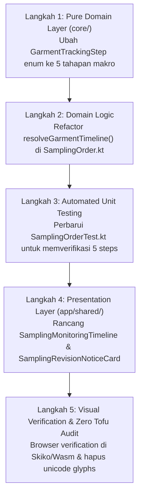

# 🎓 Modul Pembelajaran: Konsolidasi 5-Langkah Stepper & Sampling Monitoring Timeline di CRM Sales Deals

> **Level Target**: Junior to Mid Developer  
> **Topik Utama**: Domain-Driven Design (DDD), Clean Architecture, Compose Multiplatform, Neo-Brutalism & Claymorphism UI  
> **Prasyarat**: Kotlin Multiplatform dasar, Compose State & Modifiers, pemahaman alur operasional pabrik garmen  
> **Referensi Task**: Konsolidasi Stepper Deals ke 5 Tahap & Monitoring Timeline Sampling

---

## 💡 1. Konsep Dasar & Masalah di Dunia Nyata

### Masalah Nyata
Di pabrik garmen terintegrasi seperti WeMade, proses fisik pembuatan sampel meliputi banyak subtahap teknis di lantai produksi: pembuatan program mesin CAM, rajut turun mesin, assembling/linking, inspeksi QC 1 panel mentah, pencucian & steam uap finishing, dan inspeksi akhir QC 2 garmen jadi.

Namun, pengguna di modul **CRM Sales Deals** adalah tim **Sales & Account Executive**, bukan teknisi mesin pabrik.
Jika stepper proses garmen di level transaksi sales dijejali 8 langkah mikro (Input Spek, Rilis SPK, Rajut, QC 1, Finishing, QC 2, Siap Kirim, ACC Buyer):
1. **Kelebihan Beban Kognitif (Cognitive Overload)**: Layar dialog deal menjadi sempit, teks stepper bertabrakan atau terpotong, dan sales kesulitan melihat status deal secara makro.
2. **Kaburnya Batas Domain**: Bagi sales, yang penting adalah: *Apakah sampel sedang dibuat (Sampling)? Kapan target/selesainya? Apakah ada komplain/revisi dari buyer?*

### Solusi Arsitektural
Kita menerapkan prinsip **Hierarki Informasi**:
- **Tingkat Makro (Stepper Transaksi)** diringkas menjadi **5 Langkah Utama**:
  1. `Input Spek & Pola`
  2. `Rilis SPK`
  3. `Sampling` (mengonsolidasikan seluruh aktivitas fisik pabrik)
  4. `Siap Kirim`
  5. `ACC Buyer`
- **Tingkat Mikro (Operasional Produksi)** disajikan dalam **Sampling Monitoring Timeline** di dalam kartu aktif (orange card), yang merinci tanggal mulai, tanggal selesai, status pengerjaan, dan catatan revisi buyer untuk:
  - 1. Program CAM
  - 2. Rajut & Jahit
  - 3. QC In-Line
  - 4. Finishing
  - 5. QC 2 (Final)
  - Info Catatan Revisi Buyer (jika status revisi aktif)

---

## 🧭 2. "Start dari Mana?" — Alur Langkah Penulisan (Order of Operations)

Jika kamu diminta mengimplementasikan fitur ini dari nol, ikuti urutan ketergantungan dari dalam ke luar (Dependency Rule):



---

## 🔬 3. Bedah Kode Blok per Blok & Mental Model

### A. Domain Layer: `GarmentTrackingStep`
File: `core/src/commonMain/kotlin/com/eventverse/app/domain/sampling/SamplingOrderValueObjects.kt`

```kotlin
enum class GarmentTrackingStep(val displayName: String, val order: Int) {
    INPUT_SPEK("Input Spek & Pola", 1),
    SPK_RELEASED("Rilis SPK", 2),
    SAMPLING("Sampling", 3),
    READY_TO_SHIP("Siap Kirim", 4),
    ACC_APPROVED("ACC Buyer", 5);
}
```
**Mental Model**:
Enum ini mendefinisikan *kontrak makro*. Kita menghapus `KNITTING`, `QC_IN_LINE`, `FINISHING`, dan `QC_FINAL` dari enum stepper ini, menggantikannya dengan `SAMPLING`.

### B. Pure Function: `resolveGarmentTimeline()`
File: `core/src/commonMain/kotlin/com/eventverse/app/domain/sampling/SamplingOrder.kt`

```kotlin
fun resolveGarmentTimeline(): List<GarmentStepState> {
    val isDraft = status == SamplingStatus.DRAFT || pipelineStage == SamplingPipelineStage.NEW_INTAKE
    val totalDeposited = finishingDeposits.sumOf { it.qtyPcs }
    val isFinishingTuntas = totalDeposited >= sampleQuantity && totalDeposited > 0
    val isDeliveredOrApproved = pipelineStage == SamplingPipelineStage.IN_DELIVERY ||
        pipelineStage == SamplingPipelineStage.ACC_APPROVED ||
        isAccApproved ||
        !courierTracking.isNullOrBlank()

    val isSamplingComplete = !isDraft && isDeliveredOrApproved
    val isSamplingActive = !isDraft && !isDeliveredOrApproved
    ...
```
**Mental Model**:
Logika bisnis status stepper tidak boleh ditanam di UI Composable! Fungsi ini murni (pure deterministic function), menerima state `SamplingOrder` dan mengembalikan daftar 5 `GarmentStepState`.
- `isSamplingActive`: bernilai `true` selama SPK sudah rilis namun barang fisik belum beranjak ke pengiriman kurir.
- `isSamplingComplete`: bernilai `true` saat sampel sudah siap kirim atau ACC.

### C. Presentation Layer: `SamplingMonitoringTimeline`
File: `app/shared/src/commonMain/kotlin/com/eventverse/app/presentation/deal/components/DealDetailDialog.kt`

```kotlin
@Composable
private fun SamplingMonitoringTimeline(order: SamplingOrder, modifier: Modifier = Modifier) {
    // 1. Ekstrak data fase CAM dari milestone & pipelineStage
    val camMilestone = order.milestones.find { it.step == MilestoneStep.PROGRAM }
    val isCamDone = camMilestone?.isCompleted == true || order.pipelineStage > SamplingPipelineStage.CAM_PROGRAMMING
    val isCamActive = order.pipelineStage == SamplingPipelineStage.CAM_PROGRAMMING
    ...
    Row(modifier = modifier.fillMaxWidth(), horizontalArrangement = Arrangement.spacedBy(ClaySpacing.Sm)) {
        TimelineStepCard(
            stepNumber = "1",
            title = "Program CAM",
            status = if (isCamDone) "Selesai" else if (isCamActive) "Pengerjaan" else "Antrean",
            isDone = isCamDone,
            isActive = isCamActive,
            mulaiText = formatInstant(order.createdAt),
            selesaiText = camMilestone?.completedAt?.let { formatLocalDate(it) } ?: if (isCamDone) "Selesai" else "-",
            detailText = "${order.machineProgram.effectiveTenselity.firstOrNull()?.parameter?.ifBlank { "12G CAM" } ?: "12G CAM"} • ${order.knitSpec.yarnType.ifBlank { "Viscose" }}",
            modifier = Modifier.weight(1f)
        )
        // Card 2: Rajut & Jahit, Card 3: QC In-Line, Card 4: Finishing, Card 5: QC 2 Final
    }
}
```
**Mental Model**:
Setiap kartu fase dalam timeline menggunakan `Modifier.weight(1f)` di dalam `Row`, sehingga membagi ruang horizontal secara proporsional. Kartu menampilkan penanda tanggal mulai, tanggal selesai, badge status dinamis, dan parameter spesifikasi fisik.

---

## 🏛️ 4. Technology & Architectural Decisions (The "Why")

| Keputusan | Alternatif yang Ditolak | Alasan & Trade-off |
|---|---|---|
| **5-Step Makro Stepper di Deals** | Tetap 8-Step Stepper | Stepper 8 langkah membuat dialog berdesakan di layar, padat secara visual, dan memaksa sales memikirkan hal-hal yang bukan ranah mereka. |
| **Monitoring Timeline di Kartu Aktif** | Menghilangkan detail pabrik sama sekali | Sales tetap membutuhkan visibilitas (*visibility*) kapan pesanan sampel mereka selesai diprogram, dirajut, atau dicuci, agar dapat menjawab pertanyaan buyer secara akurat tanpa harus bolak-balik menelpon lantai pabrik. |
| **Presisi Waktu (`DD MMM YYYY, HH:mm`)** | Hanya menampilkan tanggal saja | Pada proses sampling cepat (rapid prototyping), satu hari bisa terjadi beberapa pergeseran fase (misal pagi CAM, siang rajut, sore finishing). Penambahan jam dan menit memberikan transparansi SLA yang presisi. |
| **Warna Ungu (`Purple`) untuk In-Progress** | Memakai Oranye atau Biru | Biru membuat kontras bentrok ganda dengan kartu/kontainer accordion, sedangkan oranye adalah warna sinyal bahaya/peringatan yang eksklusif untuk **Revisi Buyer**. Ungu memberikan sinyal visual proses yang segar dan jelas perbedaannya dengan hijau (Beres). |
| **Pembersihan Parameter Mesin (1 BS POLY, Jaquard)** | Menampilkan raw data gauge & tenselity | Di CRM Deals, sales dan buyer tidak memerlukan pembacaan register benang/feeder pabrik. Menampilkan parameter mentah hanya menambah kebingungan dan mempersempit tata letak. |
| **Vektor Canvas (`ClayIcons.kt`)** | Unicode emoji (`✓`, `⏳`, `⚠️`) | Skiko di Compose Wasm/Web merender glyph Unicode OS sebagai kotak kosong/tofu (`▯`) jika font sistem tidak mendukung fallback. Selalu gunakan icon berbasis Canvas vektor. |

---

## ⚠️ 5. Jebakan Pemula (Common Pitfalls & How We Avoided Them)

1. **Jebakan Tofu (`▯`) Unicode**:
   - *Kesalahan*: Menulis `status = "Selesai ✓"`.
   - *Dampak*: Pada browser berbasis Wasm/Canvas, simbol centang `✓` berubah menjadi kotak tahu (`▯`).
   - *Solusi*: Tulis string bersih `status = "Selesai"`, dan biarkan `IconCheck(...)` dari `ClayIcons.kt` merender visual centang hijaunya.

2. **Pencemaran Domain Sales oleh Parameter Mesin Pabrik**:
   - *Kesalahan*: Memasang chip detail `order.machineProgram.effectiveTenselity` ("1 BS POLY") dan `knitType` ("Jaquard") di dialog CRM Deals.
   - *Solusi*: Buat pemisahan batas konteks yang tegas. Di deals, fokuslah pada ringkasan operasional bisnis: target sampel, setoran finishing, dan jalur finishing internal vs vendor makloon.

3. **Kekacauan Semantik Warna (Color Collision)**:
   - *Kesalahan*: Memberi warna oranye untuk proses berjalan normal (`IN_PROGRESS`), atau biru di atas latar kartu biru.
   - *Dampak*: Sales panik mengira pesanan mengalami revisi/cacat, atau teks tidak terbaca karena warna bertumpuk.
   - *Solusi*: Sepakati semantik:
     - Hijau (`WeMadeColors.Success`) = Selesai / Beres / ACC.
     - Ungu (`WeMadeColors.Purple`) = Sedang Dikerjakan / In Progress normal.
     - Oranye (`WeMadeColors.Warning`) = Perlu Tindakan Khusus / Revisi Buyer.
     - Abu-abu (`WeMadeColors.OnSurfaceMuted`) = Antrean / Belum Mulai.

4. **Teks Terpotong pada Kolom Sempit**:
   - *Kesalahan*: Mengunci baris tanggal menjadi `maxLines = 1` dengan string panjang `17 Sep 2026, 14:23`.
   - *Solusi*: Berikan `maxLines = 2` dengan `lineHeight = 11.sp` agar saat kartu menyempit, jam dan menit dapat berpindah ke baris kedua dengan rapi tanpa terpotong elipsis (`...`).

---

## 🧪 6. Verifikasi Mandiri & Latihan Tantangan

### Verifikasi Mandiri
1. **Jalankan Unit Test**:
   ```bash
   ./gradlew :core:jvmTest :app:shared:compileKotlinJvm
   ```
2. **Uji Browser Interaktif**:
   Buka `http://localhost:3000/crm-sales/deals`, klik deal yang memiliki SPK (misal `Test 3`), lalu periksa:
   - Stepper atas menampilkan 5 bulatan: `1. Input Spek`, `2. Rilis SPK`, `3. Sampling`, `4. Siap Kirim`, `5. ACC Buyer`.
   - Langkah yang sedang berjalan berwarna **Ungu**, langkah beres berwarna **Hijau**, dan revisi berwarna **Oranye**.
   - Kartu timeline menampilkan jam dan menit lengkap (misal `17 Sep 2026, 14:23`).
   - Tidak ada lagi tulisan "1 BS POLY" maupun "Jaquard" pada ringkasan kartu.

### Latihan Tantangan untuk Junior Developer
> **Tantangan**: Tambahkan kalkulasi selisih waktu otomatis (*duration tracker*) antara `Mulai` dan `Selesai`: jika keduanya sudah terisi, tampilkan label durasi (misal `"⏱️ 1j 45m"`) menggunakan Canvas icon jam dan token font semantik!
