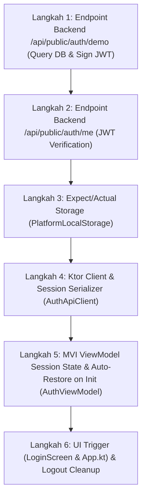

# 🎓 Modul Pembelajaran: Real Database Demo Authentication, Signed JWT, & KMP Session Persistence

> **Level Target**: Junior to Mid Developer  
> **Topik Utama**: Kotlin Multiplatform (KMP), Compose Multiplatform (WasmJs), Ktor Server Auth, Signed HMAC-256 JWT, Expect/Actual Storage, Session Auto-Restoration on Page Reload  
> **Prasyarat**: Pemahaman dasar coroutines, arsitektur client-server Ktor, dan prinsip multiplatform `expect`/`actual`.  
> **Referensi File**: 
> - [`server/src/main/kotlin/com/eventverse/app/Application.kt`](file:///Volumes/amalari/Projects/wemade/server/src/main/kotlin/com/eventverse/app/Application.kt)
> - [`app/shared/src/commonMain/kotlin/com/eventverse/app/infrastructure/storage/PlatformLocalStorage.kt`](file:///Volumes/amalari/Projects/wemade/app/shared/src/commonMain/kotlin/com/eventverse/app/infrastructure/storage/PlatformLocalStorage.kt)
> - [`app/shared/src/wasmJsMain/kotlin/com/eventverse/app/infrastructure/storage/PlatformLocalStorage.wasmJs.kt`](file:///Volumes/amalari/Projects/wemade/app/shared/src/wasmJsMain/kotlin/com/eventverse/app/infrastructure/storage/PlatformLocalStorage.wasmJs.kt)
> - [`app/shared/src/commonMain/kotlin/com/eventverse/app/infrastructure/api/AuthApiClient.kt`](file:///Volumes/amalari/Projects/wemade/app/shared/src/commonMain/kotlin/com/eventverse/app/infrastructure/api/AuthApiClient.kt)
> - [`app/shared/src/commonMain/kotlin/com/eventverse/app/presentation/auth/AuthViewModel.kt`](file:///Volumes/amalari/Projects/wemade/app/shared/src/commonMain/kotlin/com/eventverse/app/presentation/auth/AuthViewModel.kt)

---

## 💡 1. Konsep Dasar & Masalah di Dunia Nyata

### Masalah di Dunia Nyata
Bayangkan kamu sedang mendemokan sistem ERP pabrik konveksi ke seorang calon klien (Owner Pabrik). Kamu menekan tombol *"Demo Masuk Cepat"*, masuk ke dashboard, dan membuat data karyawan baru. Lalu klien tanpa sengaja me-refresh halaman browser (`F5`). 

Tiba-tiba, aplikasi terlempar keluar kembali ke halaman login! Klien bingung: *"Loh, baru saja saya masuk kok langsung ditendang keluar lagi? Apakah datanya hilang?"*

Kondisi ini terjadi ketika:
1. **Mock Sesi Hanya di RAM (In-Memory)**: State login hanya disimpan di variabel memori browser atau ViewModel. Saat reload, seluruh memori JavaScript/Wasm di-reset dari nol.
2. **Demo Token Bohongan (Palsu)**: Frontend membuat string acak seperti `"dummy-token-123"` tanpa pernah diverifikasi oleh database backend. Akibatnya saat request API berikutnya membutuhkan otorisasi (`Authorization: Bearer <token>`), backend menolak dengan error `401 Unauthorized`.

### Analogi Sederhana: Gelang Tiket Festival Musik (Wristband with RFID)
- **Login Dummy**: Kamu masuk ke konser musik dengan stempel cap tangan yang langsung luntur begitu terkena air cuci tangan (reload browser).
- **Real JWT + LocalStorage**: Saat kamu masuk lewat gerbang demo, petugas gerbang memeriksa buku registrasi resmi (PostgreSQL), lalu memasangkan gelang RFID resmi berhologram anti-pemalsuan dengan tanda tangan digital promotor (HMAC-256 JWT Token). Gelang ini kamu kenakan di pergelangan tanganmu (`localStorage`). Walaupun kamu keluar gerbang sebentar untuk membeli minuman atau cuci muka (reload browser), petugas di pintu panggung utama (`Bagan Organisasi`) cukup men-scan gelang RFID tersebut dan kamu langsung dipersilakan masuk tanpa harus antre registrasi ulang dari awal.

---

## 🧭 2. "Start dari Mana?" — Alur Langkah Penulisan (Order of Operations)

Jika kamu diminta membangun fitur otentikasi cepat dengan persistensi multiplatform dari nol, ikuti urutan berikut:



1. **Langkah 1: Endpoint Backend (`/api/public/auth/demo`)**
   - Mengapa backend dulu? Karena token JWT harus ditandatangani secara kriptografis oleh server menggunakan private secret key, bukan dibuat-buat di sisi client.
2. **Langkah 2: Endpoint Verifikasi Backend (`/api/public/auth/me`)**
   - Client butuh endpoint untuk mengecek apakah token yang tersimpan di browser masih sah atau sudah kadaluwarsa/dicabut.
3. **Langkah 3: Expect/Actual Abstraksi Storage (`PlatformLocalStorage`)**
   - Karena Kotlin Multiplatform berjalan di Web (WasmJs, JS), Desktop (JVM), Android, dan iOS, kita tidak bisa langsung memanggil `window.localStorage` di kode `commonMain`. Kita buat kontrak `expect` di common, dan `actual` di masing-masing platform.
4. **Langkah 4: Ktor HTTP Client & Parser (`AuthApiClient`)**
   - Komponen client untuk memanggil API demo login, memverifikasi token, dan melakukan serialisasi `UserSession` ke/dari string JSON.
5. **Langkah 5: Auto-Restore di Constructor/Init ViewModel (`AuthViewModel`)**
   - Pada saat pertama kali ViewModel dibuat, sebelum frame UI pertama dirender, baca `PlatformLocalStorage`. Jika ada sesi valid, isi `authenticatedSession` seketika.
6. **Langkah 6: Pengujian Reload di Browser & Verifikasi Logout**
   - Uji klik demo login, catat token di DevTools `Application -> LocalStorage`, reload browser, pastikan tidak terlempar ke login, lalu uji tombol logout.

---

## 🧱 3. Bedah Blok per Blok Kode (Deep Code Walkthrough)

### Blok A: Backend Real Query & Penerbitan JWT Token Resmi (`Application.kt`)

```kotlin
post("/demo") {
    val params = runCatching { call.receiveParameters() }.getOrNull()
    val tenantSlug = params?.get("tenantSlug")?.ifBlank { null }
        ?: call.request.queryParameters["tenantSlug"]?.ifBlank { null }
        ?: "wemade-demo"

    val tenant = repository.findBySlug(TenantSlug(tenantSlug))
    if (tenant == null) {
        call.respond(HttpStatusCode.NotFound, "Tenant dengan slug '$tenantSlug' tidak ditemukan")
        return@post
    }

    // 1. Ambil pengguna nyata dari tabel PostgreSQL 'users'
    val user = userRepo.findAllByTenant(tenant.id)
        .firstOrNull { it.role == Role.TENANT_ADMIN }
        ?: userRepo.findByEmail(EmailAddress("student.achmad@gmail.com"))
        ?: run {
            val fallback = User(
                id = UserId("usr-owner-001"),
                tenantId = tenant.id,
                username = Username("achmad_owner"),
                email = EmailAddress("student.achmad@gmail.com"),
                role = Role.TENANT_ADMIN,
                isActive = true
            )
            userRepo.save(fallback)
            fallback
        }

    // 2. Terbitkan token JWT resmi bertanda tangan digital (HMAC-256)
    val sessionToken = jwtTokenService.generateToken(user, tenantSlug)
    val permissionsJson = user.effectivePermissions.joinToString(",") { "\"${it.name}\"" }

    val responseJson = "{\"token\":\"${sessionToken.value}\",\"user\":{\"id\":\"${user.id.value}\",\"tenantId\":\"${user.tenantId?.value ?: ""}\",\"username\":\"${user.username.value}\",\"email\":\"${user.email.value}\",\"role\":\"${user.role.name}\",\"permissions\":[$permissionsJson]},\"tenantSlug\":\"$tenantSlug\"}"

    call.respondText(responseJson, contentType = ContentType.Application.Json)
}
```

**Mental Model & Penjelasan:**
- **Bukan Mock**: Query `userRepo.findAllByTenant(tenant.id)` mengeksekusi SQL nyata ke tabel PostgreSQL. Jika pengguna belum ada di tenant tersebut, fallback dibuat dan disimpan via `userRepo.save(fallback)`.
- **Signed JWT**: `jwtTokenService.generateToken(user, tenantSlug)` menyematkan `issuer`, `subject` (`userId`), `role`, dan tanggal kedaluwarsa 7 hari, lalu disegel dengan secret key server. Client tidak dapat memalsukan token ini.

---

### Blok B: Multiplatform LocalStorage Interop (`PlatformLocalStorage.kt`)

Di `app/shared/src/commonMain/kotlin/com/eventverse/app/infrastructure/storage/PlatformLocalStorage.kt`:
```kotlin
package com.eventverse.app.infrastructure.storage

expect object PlatformLocalStorage {
    fun setItem(key: String, value: String)
    fun getItem(key: String): String?
    fun removeItem(key: String)
    fun clear()
}
```

Dan implementasinya di `wasmJsMain` (`PlatformLocalStorage.wasmJs.kt`):
```kotlin
package com.eventverse.app.infrastructure.storage

@OptIn(kotlin.js.ExperimentalWasmJsInterop::class)
@JsFun("(key, value) => { try { window.localStorage.setItem(key, value); } catch (e) {} }")
private external fun jsSetItem(key: String, value: String)

@OptIn(kotlin.js.ExperimentalWasmJsInterop::class)
@JsFun("(key) => { try { return window.localStorage.getItem(key); } catch (e) { return null; } }")
private external fun jsGetItem(key: String): String?

@OptIn(kotlin.js.ExperimentalWasmJsInterop::class)
@JsFun("(key) => { try { window.localStorage.removeItem(key); } catch (e) {} }")
private external fun jsRemoveItem(key: String)

actual object PlatformLocalStorage {
    actual fun setItem(key: String, value: String) = jsSetItem(key, value)
    actual fun getItem(key: String): String? = jsGetItem(key)
    actual fun removeItem(key: String) = jsRemoveItem(key)
    actual fun clear() = jsClear()
}
```

**Mental Model & Penjelasan:**
- **Mengapa `@JsFun` di Kotlin/Wasm?**: Di Kotlin/Wasm, kode Kotlin dikompilasi ke bytecode WebAssembly biner. Wasm tidak memiliki akses langsung ke DOM atau objek JavaScript `window`. Anotasi `@JsFun` menjembatani runtime Wasm ke host JavaScript engine browser secara zero-overhead.
- **Error Protection (`try-catch`)**: Jika pengguna membuka browser dalam mode incognito ketat atau storage diblokir oleh kebijakan browser, operasi tidak akan melempar exception yang membuat aplikasi crash (white-screen).

---

### Blok C: Inisialisasi Otomatis & Auto-Restoration di `AuthViewModel.kt`

```kotlin
init {
    // 1. Auto-restore session from PlatformLocalStorage on startup / reload
    val savedJson = PlatformLocalStorage.getItem(STORAGE_KEY)
    val restoredSession = AuthApiClient.deserializeSession(savedJson)
    if (restoredSession != null) {
        _uiState.update {
            it.copy(
                authenticatedSession = restoredSession,
                tenantSlug = restoredSession.tenantSlug ?: it.tenantSlug
            )
        }
        sessionStorage.setSession(
            TenantSession(
                tenantId = restoredSession.user.tenantId ?: TenantId("ten-default"),
                slug = TenantSlug(restoredSession.tenantSlug ?: "wemade-demo"),
                name = "Pabrik ${restoredSession.tenantSlug ?: "wemade-demo"}",
                tier = SubscriptionTier.PRO
            )
        )

        // 2. Asynchronously verify token validity against backend DB
        scope.launch {
            val verifyResult = authApiClient.verifySession(restoredSession.token.value)
            verifyResult.onSuccess { verifiedSession ->
                _uiState.update { it.copy(authenticatedSession = verifiedSession) }
                PlatformLocalStorage.setItem(STORAGE_KEY, AuthApiClient.serializeSession(verifiedSession))
            }.onFailure {
                // Token expired or invalid: clear session
                PlatformLocalStorage.removeItem(STORAGE_KEY)
                sessionStorage.clearSession()
                _uiState.update {
                    it.copy(
                        authenticatedSession = null,
                        errorMessage = "Sesi telah kedaluwarsa. Silakan masuk kembali."
                    )
                }
            }
        }
    }
}
```

**Mental Model & Penjelasan:**
- **Zero-Flicker Login (Instant Restoration)**: Restorasi dilakukan langsung di blok `init` secara sinkron dari storage lokal. Saat Compose mengevaluasi `val isAuthenticated = session != null` di frame pertama, statusnya sudah `true`! Hasilnya, pengguna tidak melihat kedipan (flash) form login sebelum masuk dashboard.
- **Silent Background Verification**: Walaupun state langsung dipulihkan dari storage, di latar belakang coroutine memanggil `GET /api/public/auth/me`. Jika token ternyata sudah di-revoke atau kadaluwarsa, barulah sesi dibersihkan secara aman.

---

## ⚖️ 4. Teknologi & Pendekatan yang Dipilih: The "Why"

| Keputusan Arsitektur | Alternatif yang Ada | Mengapa Pendekatan Kita Lebih Unggul? | Risiko Jika Memakai Alternatif |
|---|---|---|---|
| **Penerbitan JWT Resmi via Backend** | Generate mock UUID session di frontend | Backend dan API lain (`/api/tenant/employees`, dll.) dapat memvalidasi identitas user melalui `Authorization: Bearer <token>`. | Frontend terlihat seperti login, tapi saat request data ke backend akan ditolak `401 Unauthorized`. |
| **`PlatformLocalStorage` via `expect`/`actual`** | Hardcoded library JS atau browser wrapper | Kode `commonMain` tetap 100% portable ke Android, iOS, Desktop (JVM), dan Web (Wasm/JS). | Build Android/iOS/Desktop akan gagal kompilasi karena mencoba mengimpor objek DOM browser. |
| **Lazy `HttpClient` Provider** | Direct instansiasi `val client = HttpClient()` | Menghindari kegagalan runtime `NoClassDefFoundError` / `HttpClientEngineContainer` saat unit test berjalan di JVM tanpa engine spesifik. | Unit test di JVM akan crash saat class ViewModel pertama kali dimuat oleh classloader. |
| **Sinkron Sesi di `init` + Asinkron Verifikasi** | Loading spinner sampai server merespon token check | User experience instan! Halaman langsung terbuka tanpa jeda blank/loading setiap kali reload. | Reload terasa lambat dan lagging jika koneksi internet pengguna sedang tidak stabil. |

---

## ⚠️ 5. Jebakan Pemula (Junior Pitfalls) & Cara Menghindarinya

1. **Jebakan 1: Menyimpan Password / Secret di LocalStorage**
   - *Kenapa bahaya*: Siapa pun yang memiliki akses ke script (misal via celah XSS) dapat membaca seluruh isi `localStorage`.
   - *Solusi kita*: Hanya simpan token JWT bertanda tangan digital dan profil publik (username, email, role). Password asli tidak pernah dikirim atau disimpan di client.

2. **Jebakan 2: Lupa Menghapus Sesi saat Logout**
   - *Kenapa bahaya*: Jika hanya mengosongkan StateFlow di memori, saat user me-refresh browser, sesi lama akan terbaca kembali dari `localStorage` dan user login lagi secara otomatis!
   - *Solusi kita*: Pada event `LoginUiEvent.Logout`, wajib panggil `PlatformLocalStorage.removeItem(STORAGE_KEY)` dan `sessionStorage.clearSession()`.

3. **Jebakan 3: Menggunakan Safe Call Berlebihan pada Tipe Non-Nullable**
   - *Kenapa bahaya*: Di Kotlin, melakukan `session?.tenantSlug` ketika `session` sudah dijamin tidak null di dalam blok `if (isAuthenticated && session != null)` akan menimbulkan compiler warning `Unnecessary safe call on a non-null receiver`.
   - *Solusi kita*: Gunakan smart cast secara bersih: `session.tenantSlug`.

---

## 🧪 6. Bagaimana Cara Membuktikan Kodingan Kita Bekerja?

### A. Pengujian Otomatis (Unit Test Serializer)
Jalankan pengujian unit test pada modul `app/shared`:
```bash
./gradlew :app:shared:jvmTest
```
Pengujian pada [`AuthApiClientTest.kt`](file:///Volumes/amalari/Projects/wemade/app/shared/src/commonTest/kotlin/com/eventverse/app/infrastructure/api/AuthApiClientTest.kt) memvalidasi:
- Objek `UserSession` lengkap (ID, Tenant, Username, Role, JWT Token) diserialisasi ke JSON string dan direkonstruksi kembali tanpa kehilangan tipe data.
- JSON rusak atau string kosong ditangani secara aman dengan mengembalikan `null`.

### B. Pengujian Manual Browser (End-to-End)
1. Buka browser di `http://localhost:3000/`.
2. Klik tombol **"Demo Mode: Masuk Cepat (Owner Pabrik)"**.
3. Buka tab DevTools (`F12`) -> **Network**, amati request `POST /api/public/auth/demo` mengembalikan status `200 OK` dengan payload JSON bertoken asli.
4. Buka tab **Application** -> **Local Storage** -> `http://localhost:3000`, pastikan kunci `wemade_auth_session` terisi.
5. Lakukan reload browser (`F5` atau `Ctrl+R`).
6. **Hasil yang diharapkan**: Halaman tetap berada di `Bagan Organisasi`, nama `achmad_owner` tetap muncul di pojok kanan atas, dan tidak ada formulir login yang muncul.
7. Klik tombol merah **"Logout"**, pastikan data di `localStorage` terhapus dan layar terkunci kembali.

---

## 🏆 7. Tantangan Mandiri untuk Kamu (Self-Study Challenge)

- [ ] **Tantangan 1**: Tambahkan opsi *"Ingat Saya"* (checkbox `Remember Me`). Jika tidak dicentang, simpan sesi ke `sessionStorage` (yang hilang saat tab ditutup) alih-alih `localStorage`.
- [ ] **Tantangan 2**: Implementasikan token refresh otomatis (JWT Refresh Token) jika masa berlaku token tersisa kurang dari 1 jam.
- [ ] **Tantangan 3**: Tambahkan indikator status koneksi backend di UI (misal: titik hijau *"DB Connected"* saat token terverifikasi di backend).
