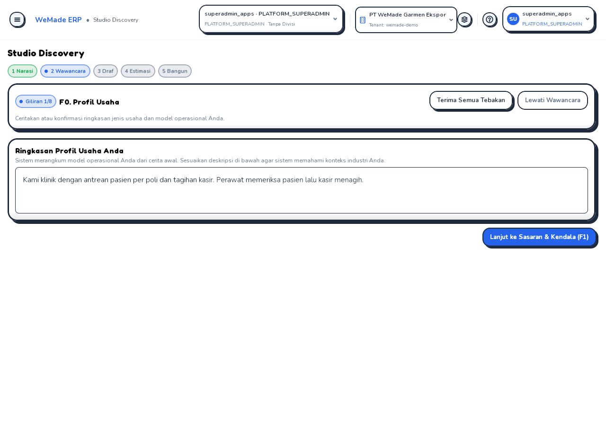
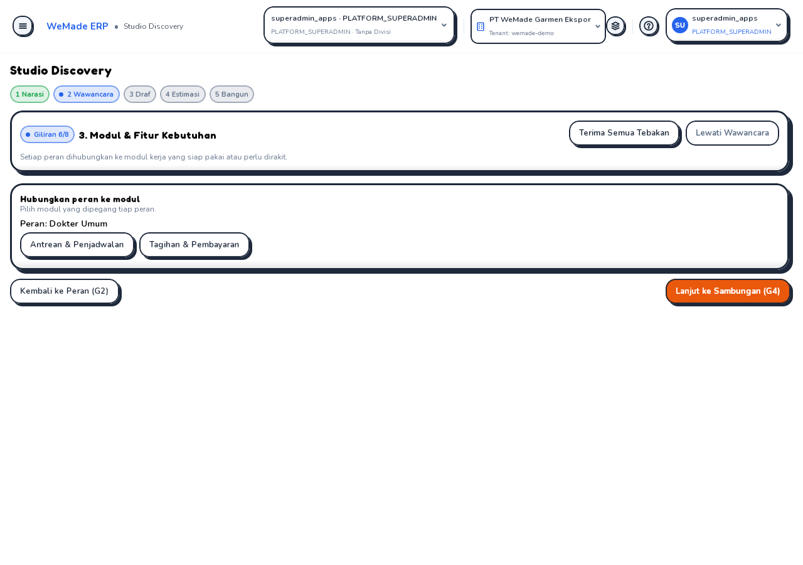
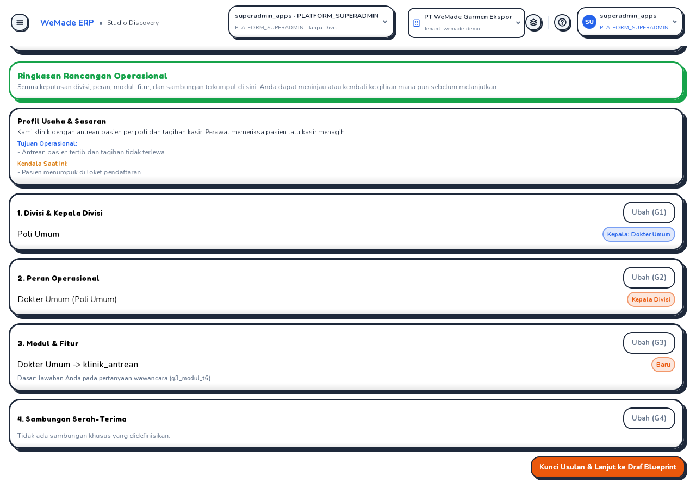
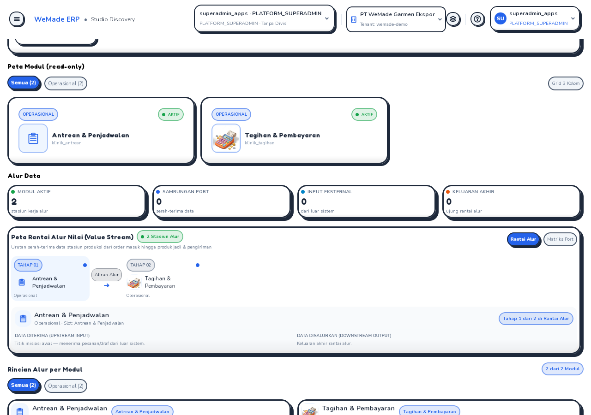

# 🎓 Modul Pembelajaran: Menyambung Wawancara A, B, dan C dari Ujung ke Ujung

> **Level Target**: Junior to Mid Developer
> **Topik Utama**: integrasi lintas-jalur, kontrak klien↔server, state yang digerakkan server, kegagalan aman untuk AI, verifikasi dengan mata
> **Prasyarat**: [`teaching-iv-b-interview-engine.md`](teaching-iv-b-interview-engine.md), [`teaching-iv-a-discovery-interview-ui.md`](teaching-iv-a-discovery-interview-ui.md), [`teaching-iv-c-koog-interview.md`](teaching-iv-c-koog-interview.md)

---

## 💡 1. Masalahnya
Tiga jalur selesai dan hijau **sendiri-sendiri**, tetapi pengguna sungguhan tidak pernah melihat wawancara. Penelusuran kode produksi menunjukkan:
- UI tidak pernah memanggil route wawancara (`answerInterview` tanpa pemanggil);
- tidak ada jalur produksi yang membuat sesi wawancara, jadi wizard A selalu melewati langkahnya;
- agent Koog milik C hanya hidup di eval dan tes.

**Analogi:** tiga tim membangun tiga bagian jembatan yang masing-masing lolos uji beban, tetapi tidak ada yang memeriksa bahwa ketiganya bertemu di tengah sungai.

## 🧭 2. Start dari Mana?
1. **Buktikan celahnya dulu** dengan mencari pemanggil di kode produksi (bukan menebak dari status tes).
2. **Server:** pengisi langkah (`InterviewStepFiller`) sebagai port di core; hanya melaksanakan, tidak menegakkan.
3. **Klien:** `InterviewRemote`; state UI diganti oleh balasan server.
4. **Wizard:** memulai wawancara setelah draf dibuat.
5. **Jalankan aplikasi sungguhan** dan lihat dengan mata; periksa data di DB.

## 🧱 3. Bedah Kode
**Kontrak yang menolak rekaan klien.** UI memberi butir baru `basisRef = JAWABAN("turn_1")`, id yang dikarang klien. Server menolak (`answerId` tidak ada). Perbaikan: klien **tidak** mengirim `basisRef` untuk butir buatan pengguna; server membubuhkan `JAWABAN` dengan id pertanyaan yang nyata. Pelajaran: apa yang bisa dihitung server, jangan dihitung klien.

**State digerakkan server.** `InterviewSessionState.applyServer` mengganti seluruh isi dengan ringkasan server; klien tidak menghitung langkah berikutnya (server melewati langkah yang tak perlu, mis. G4 saat modul tertaut < 2). Meninjau ulang langkah sebelumnya hanya pindah layar tanpa memanggil server.

**AI yang tidak boleh merusak alur.**
```kotlin
val filled = runCatching { agent.fill(...) }.getOrNull() ?: return session
return if (InterviewValidator.validate(filled, draft.pack).isEmpty()) filled else session
```
Galat, timeout, atau usulan tak sah ⇒ sesi dikembalikan seperti semula (tebakan deterministik). Usulan agent **menggantikan** tebakan deterministik langkahnya, lalu `withoutDangling` memangkas butir langkah lanjut yang menunjuk butir yang sudah diganti; tanpa itu seluruh sesi ditolak validator.

**Saklar biaya.** `INTERVIEW_AGENT=koog` **dan** `DEEPSEEK_API_KEY` terisi baru menyalakan agent; selain itu `null`. Terpisah dari agent discovery supaya biaya wawancara dikendalikan sendiri.

## ⚖️ 4. Keputusan & Alasan
| Pilihan | Alternatif | Alasan |
|---|---|---|
| Port `InterviewStepFiller` di core | Memanggil Koog dari route | Core tak boleh bergantung framework; mudah dites dengan pengisi palsu |
| Agent mengisi saat langkah **mulai ditanya** | Mengisi semua langkah di awal | Giliran konsultan F0–F2 menghasilkan masukan yang dipakai agent di G1 |
| `suggestedOrigin` dari server | Klien menebak asal | `REUSE_PACK` untuk modul pack non-garment ditolak validator |
| Hapus saran konsultan yang dikodekan tetap | Biarkan | Saran rekaan melanggar "berdasar cerita" |

## ⚠️ 5. Jebakan (yang ketemu hari ini)
1. **Hijau per jalur ≠ hidup di produksi.** Cari pemanggil di kode produksi.
2. **Data rekaan di UI** (saran "qc_inspection" untuk narasi apa pun, id giliran lokal) lolos semua tes UI karena tesnya mengunci perilaku rekaan itu.
3. **Buntu di layar:** G3 tanpa tebakan tidak punya cara menambah modul. Hanya terlihat saat dijalankan.
4. **Asal modul** yang dipilih pengguna (`REUSE_PACK` vs `NEW`) bergantung pada registri; klien tak tahu.
5. **Input canvas Compose** memotong ketikan; periksa data tersimpan di DB, bukan hanya layar.

## 🧪 6. Pembuktian
- Core: `InterviewStepFillerTest` (6), `InterviewTurnTest`.
- Server: `AgentStepFillerTest` (4, `ScriptedPromptExecutor`, tanpa jaringan), `DiscoveryInterviewApiTest` (9, termasuk muatan UI persis dan `suggestedOrigin`).
- Klien: `InterviewSessionStateRemoteTest` (4) dengan `InterviewRemote` palsu.
- **Dilihat dengan mata** (server + web asli, DB scratch, pack klinik, login Superadmin demo): F0 → F1 → F2 → G1 → G2 → G3 → (G4 dilewati) → G5 → draf. Data akhir: `step=done`, versi 2, tujuh giliran dengan id nyata, tautan `jawaban/g3_modul_t6`.






**Belum dibuktikan:** agent AI sungguhan (eval live C4 butuh kunci API dan biaya; menunggu persetujuan).

## 🏆 7. Tantangan
- [ ] Jalankan eval live pertama (C4) dengan `INTERVIEW_AGENT=koog`; bandingkan % tebakan diterima dengan baseline deterministik.
- [ ] Tampilkan `sharedModules` (B6) di ringkasan G5.
- [ ] Pecah `InterviewSessionState` (427 baris, di atas batas lunak 400): pisahkan bagian sinkron server dari aksi suntingan per langkah.
