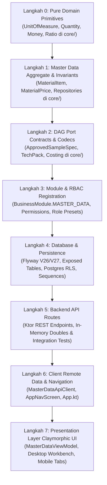

# 🎓 Modul Pembelajaran: Master Data Bahan & Harga serta Kontrak Port DAG (Sampling → Tech Pack/BOM → Costing HPP)

> **Level Target**: Junior to Mid Developer  
> **Topik Utama**: Domain-Driven Design (DDD), Kotlin Multiplatform (KMP), High-Precision Money & Measure Primitives, Modular DAG Port Contracts, PostgreSQL RLS & Atomic Sequences, Claymorphism Design System  
> **Prasyarat**: Dasar Kotlin (Value Classes, Sealed Interfaces), Konsep Dasar DDD, Ktor Routing, Compose Multiplatform  
> **Referensi Modul**: `BusinessModule.MASTER_DATA`, `BusinessModule.SAMPLING_ORDER`, `FoundationModuleCatalog.kt`

---

## 💡 1. Konsep Dasar & Masalah di Dunia Nyata

### Mengapa Master Data Bahan & Harga BUKAN Inventory?
Pertanyaan paling sering ditanyakan oleh junior developer saat membangun sistem ERP manufaktur adalah:  
*"Kenapa harga bahan baku dan daftar benang/kain tidak langsung dimasukkan ke modul Inventory saja? Kenapa kita perlu modul terpisah bernama `MASTER_DATA`?"*

Bayangkan analogi sebuah restoran:
* **Master Data (Menu & Resep Standar)**: Adalah buku resep koki. Di dalamnya tercatat bahwa 1 porsi Nasi Goreng butuh 200 gram beras, 2 butir telur, kecap manis cap X, dan harga standar acuan beras saat ini adalah Rp 15.000/kg. Buku resep ini **tidak peduli** apakah saat ini di dapur ada 50 kg beras atau berasnya lagi kosong melompong. Resep dan harga acuan tetap ada.
* **Inventory (Gudang & Kulkas)**: Adalah fisik stok di gudang pendingin. Mencatat mutasi riil: barang masuk dari truk supplier (Purchase Order), barang keluar dipotong ke wajan penggorengan (Work In Progress), opname stok rusak/busuk (*spoilage*), dan lokasi rak fisik (Gudang A, Rak 3).

Jika kita mencampuradukkan master data ke dalam inventory:
1. **Pabrik Maklon / CMT (*Cut, Make, Trim*) tidak bisa menghitung HPP**: Pabrik rajut sering kali mengerjakan kain milik klien (sistem konsinyasi / jasa ongkos rajut). Bahan bakunya **tidak dibeli oleh pabrik** dan tidak dicatat sebagai aset inventory pabrik, tetapi tim R&D tetap butuh data teknis benang (ketebalan Ne1, komposisi katun 100%, gramasi) dan nilai bahan untuk kalkulasi beban risiko cacat.
2. **Kalkulasi Desain & Estimasi Biaya Macet**: Saat desainer membuat rancangan sweater baru atau tim sampling menguji gramasi sampel, mereka butuh master harga acuan untuk menyusun penawaran harga (*quotation*) ke pembeli. Jika harga dikunci pada kartu stok inventory, desainer tidak bisa menghitung perkiraan harga pakaian untuk bahan yang belum pernah dibeli sebelumnya!

### Masalah Nyata di Rantai Produksi WeMade ERP
Sebelum arsitektur ini dibangun, sistem WeMade mengalami kebuntuan serius (*dead end*):
1. **Kontrak Data Antar Modul Buntu**: Modul `SAMPLING_ORDER` sudah selesai dan sukses mengukur data yield nyata dari mesin rajut (*PanelWeightGrams* per panel pakaian, durasi rajut *PanelKnittingMinutes*, feeder benang). Namun, output kontraknya (`ApprovedSampleSpecification`) hanya berupa **string label kosong** di `OperationalModuleCatalog.kt`. Tidak ada tipe data Kotlin murni yang bisa dibaca oleh modul hilirnya.
2. **HPP "Dukun" (Ketik Manual)**: Estimasi HPP (`estimatedHppIdr`) diketik manual oleh operator secara tebak-tebakan tanpa formula dasar. Milestone HPP hanya sebuah checkbox mati.
3. **Bahaya Floating Point IEEE 754**: Di sistem lama belum ada primitif uang dan satuan ukur yang aman. Menghitung `0.1 kg + 0.2 kg` atau mengalikan harga benang Rp 85.000,50 dengan `0.0035 kg` menggunakan tipe data bawaan `Double` menghasilkan error presisi desimal (`0.30000000000000004`). Dalam skala garmen puluhan ribu lusin, akumulasi selisih sen ini menyebabkan audit keuangan tidak seimbang puluhan juta rupiah.

### Hasil Akhir yang Kita Bangun
Sebuah rantai nilai manufaktur yang presisi dan modular:
* **Primitif Multiplatform Presisi Tinggi**: `Money` (berbasis minor-units / sen integer `Long`) dan `Quantity` (berbasis micros `1_000_000L` integer `Long`) tanpa floating-point drift, kompatibel di semua target KMP (JVM, Android, iOS, Web Wasm/JS).
* **Modul Foundation `MASTER_DATA`**: Berfungsi sebagai *Single Source of Truth* untuk material, spesifikasi rajut, konversi satuan kemasan (misal: 1 Cone = 1.2 kg), kepemilikan material, dan histori harga acuan.
* **Kontrak Port DAG Terverifikasi**: Menghubungkan modul secara *loosely coupled*:  
  $$\text{Sampling Order} \xrightarrow{\text{ApprovedSampleSpec}} \text{Tech Pack / BOM} \xrightarrow{\text{TechPackAndYieldData}} \text{Costing HPP} \xrightarrow{\text{CostingResult}} \text{Production SPK}$$

---

## 🧭 2. "Start dari Mana?" — Alur Langkah Penulisan (Order of Operations)

Jika kamu diminta membangun fitur end-to-end multiplatform seperti ini dari layar kosong, ikuti urutan berikut agar kamu tidak terjebak dalam siklus refactoring tanpa henti:



### Penjelasan Mengapa Harus Urutan Ini:
1. **Langkah 0: Pure Domain Primitives (`core/`)**  
   *Kenapa nomor nol?* Karena baik master data, sampling, BOM, maupun costing akan berbicara tentang "berapa beratnya", "berapa panjangnya", dan "berapa harganya". Jika primitif `Quantity` dan `Money` belum ada, kamu tidak akan bisa mendefinisikan entity apa pun.
2. **Langkah 1: Master Data Aggregate & Invariants (`core/`)**  
   Buat entity `MaterialItem`, `MaterialPrice`, aturan validasi bisnis (misal: bahan konsinyasi harganya selalu Rp 0), dan antarmuka repository. Lapisan ini 100% bebas framework.
3. **Langkah 2: DAG Port Contracts & Codecs (`core/`)**  
   Definisikan kontrak penghubung antar modul. Buat mapper `ApprovedSampleSpecificationMapper` yang mengekstrak yield fisik sampling ke kontrak DAG.
4. **Langkah 3: Registrasi Modul & RBAC (`core/`)**  
   Daftarkan `BusinessModule.MASTER_DATA` dengan kategori `ModuleCategory.FOUNDATION`. Atur wewenang hak aksesnya (`VIEW_MASTER_DATA`, `MANAGE_MASTER_DATA`).
5. **Langkah 4: Database & Persistence (`server/`)**  
   Buat migrasi Flyway DDL PostgreSQL (`V26`), aktifkan Row-Level Security (RLS) untuk isolasi multi-tenant, buat sequence table untuk penomoran kode material otomatis, dan implementasikan repository menggunakan Exposed.
6. **Langkah 5: Backend API Routes (`server/`)**  
   Ekspos endpoint REST Ktor (`/api/tenant/master-data/*`) dan validasi endpoint dengan Integration Tests menggunakan in-memory repository doubles.
7. **Langkah 6: Client Remote Data & Navigation (`app/shared/`)**  
   Bangun `MasterDataApiClient` menggunakan Ktor Client HTTP dan daftarkan rute navigasi `AppNavScreen.MASTER_DATA` di Compose Multiplatform.
8. **Langkah 7: Presentation Layer Claymorphic UI (`app/shared/`)**  
   Susun antarmuka adaptif MVI: Desktop 2-column workbench dan Mobile 3-tab layout dengan komponen Neo-Brutalist Claymorphism WeMade.

---

## 🧱 3. Bedah Blok per Blok Kode (Deep Code Walkthrough)

### Blok A: Primitif Presisi Tinggi Tanpa Floating Point Drift
Lokasi: [`Quantity.kt`](file:///Volumes/amalari/Projects/wemade/core/src/commonMain/kotlin/com/eventverse/app/domain/common/Quantity.kt) dan [`Money.kt`](file:///Volumes/amalari/Projects/wemade/core/src/commonMain/kotlin/com/eventverse/app/domain/common/Money.kt)

```kotlin
@Serializable
data class Quantity(
    val micros: Long,
    val uom: UnitOfMeasure
) : Comparable<Quantity> {

    init {
        require(micros >= 0L) { "Quantity cannot be negative: $micros" }
    }

    fun convertTo(targetUom: UnitOfMeasure, customRatio: Ratio? = null): Quantity {
        if (this.uom == targetUom) return this
        val ratio = customRatio ?: this.uom.conversionRatioTo(targetUom)
            ?: error("Cannot convert from ${this.uom} to $targetUom without custom ratio")
        
        // Perhitungan integer presisi: (micros * numerator) / denominator
        val convertedMicros = ratio.applyTo(this.micros)
        return Quantity(convertedMicros, targetUom)
    }

    companion object {
        const val MICROS_PER_UNIT = 1_000_000L
        fun fromDouble(value: Double, uom: UnitOfMeasure): Quantity =
            Quantity((value * MICROS_PER_UNIT).roundToLong(), uom)
        fun of(whole: Long, uom: UnitOfMeasure): Quantity =
            Quantity(whole * MICROS_PER_UNIT, uom)
    }
}
```

**Mengapa blok ini ditulis begini?**
1. **Sistem Integer Micros ($10^{-6}$)**: $1\text{ unit} = 1.000.000\text{ micros}$. Misalnya, berat kain $1,2543\text{ kg}$ disimpan sebagai integer murni `1_254_300L`. Operasi penjumlahan dan pengurangan adalah operasi aritmatika integer CPU 64-bit murni yang $100\%$ deterministik, bebas floating-point noise.
2. **KMP Compatibility**: `BigDecimal` milik Java standar (`java.math.BigDecimal`) **tidak tersedia** di Kotlin/Native (iOS) atau Kotlin/Wasm/JS tanpa library pihak ketiga yang berat. Menggunakan `Long` dengan basis micros memberikan presisi hingga 6 digit desimal di semua platform tanpa ketergantungan eksternal!
3. **Immutability & Value Semantics**: Data class immutable mencegah modifikasi tidak sengaja. Setiap operasi konversi menghasilkan instance baru yang tervalidasi.

---

### Blok B: Invariant Domain & Konsinyasi Bernilai Rp 0
Lokasi: [`MaterialItem.kt`](file:///Volumes/amalari/Projects/wemade/core/src/commonMain/kotlin/com/eventverse/app/domain/masterdata/MaterialItem.kt) dan [`PriceResolutionStrategy.kt`](file:///Volumes/amalari/Projects/wemade/core/src/commonMain/kotlin/com/eventverse/app/domain/masterdata/PriceResolutionStrategy.kt)

```kotlin
data class MaterialItem(
    val id: MaterialId,
    val tenantId: TenantId,
    val code: MaterialCode,
    val name: String,
    val category: MaterialCategory,
    val baseUom: UnitOfMeasure,
    val ownershipType: MaterialOwnershipType = MaterialOwnershipType.OWNED_INVENTORY,
    val alternateUoms: List<MaterialUomConversion> = emptyList(),
    // ...
) {
    init {
        require(name.isNotBlank()) { "Material name cannot be blank" }
        require(!baseUom.isPackagingUnit) {
            "Base UoM cannot be a packaging unit ($baseUom). Use discrete or continuous base UoM."
        }
    }
}
```

```kotlin
// Di PriceResolutionStrategy.kt
if (material.ownershipType == MaterialOwnershipType.CONSIGNED_CLIENT_MATERIAL) {
    return ResolvedMaterialCost(
        materialId = material.id,
        quantity = requestedQuantity,
        unitPrice = UnitPrice(Money.zero(currency), targetUom),
        totalCost = Money.zero(currency),
        priceSource = PriceSourceType.FREE_CONSIGNED,
        appliedAt = atInstant,
        isConsigned = true
    )
}
```

**Mengapa blok ini ditulis begini?**
1. **Base UoM Tidak Boleh Satuan Kemasan**: `CONE`, `ROLL`, `BALE`, `BOX` memiliki nilai `microsInBase = 0L` karena ukuran 1 gulung benang (*cone*) bisa berbeda antar pabrik (ada yang 1.0 kg, ada yang 1.25 kg). Base UoM wajib berupa satuan kontinu fisik pasti (`KILOGRAM`, `METER`, `PIECE`). Satuan kemasan hanya boleh ada di tabel konversi `alternateUoms` spesifik per material!
2. **Hukum Bisnis Konsinyasi (Aturan Kontrak #3 & #4)**: Jika bahan baku bertipe `CONSIGNED_CLIENT_MATERIAL` (benang titipan dari pembeli), sistem secara otomatis mengunci harganya ke **Rp 0** (`PriceSourceType.FREE_CONSIGNED`). Tim costing tidak boleh menagihkan biaya pembelian bahan ini ke klien, karena bahan tersebut milik klien sendiri.

---

### Blok C: Menghubungkan Hasil Sampling ke Tech Pack via Kontrak Port
Lokasi: [`ApprovedSampleSpecificationMapper.kt`](file:///Volumes/amalari/Projects/wemade/core/src/commonMain/kotlin/com/eventverse/app/domain/pipeline/ApprovedSampleSpecificationMapper.kt)

```kotlin
object ApprovedSampleSpecificationMapper {
    fun fromSamplingOrder(order: SamplingOrder): ApprovedSampleSpecification {
        val totalFinishedWeightGrams = order.finishedSizeCharts.firstOrNull()?.let { chart ->
            // Menghitung berat panel rajut aktual dari sampling
            order.knitSpec.panelWeights.sumOf { it.weightGrams }
        } ?: 0.0

        val totalKnittingMinutes = order.knitSpec.panelWeights.sumOf { it.knittingMinutes }

        val yarns = order.knitSpec.yarnTensions.map { yarn ->
            ApprovedSampleYarnSpec(
                yarnName = yarn.yarnName,
                yarnCount = yarn.composition,
                composition = yarn.composition,
                stitchLengthMm = yarn.stitchLengthMm,
                feeders = yarn.feederIndex.toString()
            )
        }

        return ApprovedSampleSpecification(
            samplingOrderId = order.id.value,
            spkNumber = order.spkNumber.value,
            styleName = order.styleName,
            clientName = order.clientName,
            yarnSpecifications = yarns,
            totalFinishedWeight = Quantity.fromDouble(totalFinishedWeightGrams, UnitOfMeasure.GRAM),
            totalKnittingDurationMinutes = Quantity.fromDouble(totalKnittingMinutes, UnitOfMeasure.MINUTE),
            // ...
        )
    }
}
```

**Mengapa blok ini ditulis begini?**
1. **Pemisahan Bounded Context (Loose Coupling)**: Modul `SAMPLING_ORDER` dan modul `TECH_PACK_BOM` tidak boleh saling mereferensikan entity internal satu sama lain.
2. **Kontrak Mandiri (*Autonomous DTO*)**: `ApprovedSampleSpecification` adalah dokumen kontrak yang mandiri. Begitu SPK sampel berstatus `ACC_APPROVED`, mapper ini mengekstrak yield fisik riil (gramasi per panel dan menit rajut mesin) menjadi data port yang siap diteruskan ke perhitungan kebutuhan bahan mentah di Tech Pack.

---

### Blok D: Skema Database Flyway V26 & Alokasi Kode Sekuensial Atomik
Lokasi: [`V26__create_master_data_schema.sql`](file:///Volumes/amalari/Projects/wemade/server/src/main/resources/db/migration/V26__create_master_data_schema.sql)

```sql
-- Sequence Table untuk Alokasi Nomor Kode Otomatis per Tenant & Kategori
CREATE TABLE IF NOT EXISTS material_code_sequences (
    tenant_id VARCHAR(64) NOT NULL,
    prefix VARCHAR(16) NOT NULL,
    last_number INT NOT NULL DEFAULT 0,
    updated_at TIMESTAMPTZ NOT NULL DEFAULT NOW(),
    PRIMARY KEY (tenant_id, prefix)
);

-- Master Material Items
CREATE TABLE IF NOT EXISTS material_items (
    id VARCHAR(64) PRIMARY KEY,
    tenant_id VARCHAR(64) NOT NULL,
    code VARCHAR(32) NOT NULL,
    name VARCHAR(255) NOT NULL,
    category VARCHAR(32) NOT NULL,
    base_uom VARCHAR(16) NOT NULL,
    ownership_type VARCHAR(32) NOT NULL DEFAULT 'OWNED_INVENTORY',
    conversion_rules JSONB NOT NULL DEFAULT '[]'::jsonb,
    is_active BOOLEAN NOT NULL DEFAULT TRUE,
    created_at TIMESTAMPTZ NOT NULL DEFAULT NOW(),
    updated_at TIMESTAMPTZ NOT NULL DEFAULT NOW(),
    archived_at TIMESTAMPTZ NULL,
    CONSTRAINT uq_material_tenant_code UNIQUE (tenant_id, code)
);

-- Row-Level Security (RLS)
ALTER TABLE material_items ENABLE ROW LEVEL SECURITY;
CREATE POLICY material_items_tenant_isolation ON material_items
    FOR ALL
    USING (tenant_id = CURRENT_SETTING('app.current_tenant_id', true));
```

**Mengapa blok ini ditulis begini?**
1. **Mencegah Race Condition Kode Material**: Jangan pernah menggunakan `SELECT MAX(code) FROM material_items`! Ketika 5 admin gudang membuat material baru secara bersamaan di jam sibuk, kueri `MAX` akan menghasilkan nomor yang sama untuk beberapa admin, berujung pada error duplikasi *unique constraint*. Tabel `material_code_sequences` menggunakan transaksi atomik `UPDATE ... RETURNING last_number` yang mengunci baris (*row lock*) dalam orde milidetik.
2. **Isolasi Multi-Tenant dengan RLS**: Data kain dan harga rahasia milik Tenant A tidak akan pernah bisa diintip oleh Tenant B, karena engine database PostgreSQL menolak akses di level kernel DB via `CURRENT_SETTING('app.current_tenant_id')`.
3. **JSONB untuk Konversi Satuan Fleksibel**: `conversion_rules` disimpan dalam format `jsonb` efisien, memungkinkan material memiliki banyak konversi alternatif (1 Cone = 1.2 kg, 1 Karton = 24 Cone) tanpa perlu join ke tabel relasi yang lambat.

---

### Blok E: UI Workbench Responsif Neo-Brutalism Claymorphism
Lokasi: [`MaterialDesktopWorkbench.kt`](file:///Volumes/amalari/Projects/wemade/app/shared/src/commonMain/kotlin/com/eventverse/app/presentation/masterdata/components/MaterialDesktopWorkbench.kt)

```kotlin
@Composable
fun MaterialDesktopWorkbench(
    state: MasterDataUiState,
    onSelectMaterial: (MaterialItem) -> Unit,
    onOpenCreateDialog: () -> Unit,
    // ...
) {
    Row(
        modifier = Modifier
            .fillMaxSize()
            .padding(ClaySpacing.Md),
        horizontalArrangement = Arrangement.spacedBy(ClaySpacing.Lg)
    ) {
        // Kolom Kiri: Katalog Bahan & Pencarian
        Box(
            modifier = Modifier
                .width(ClayPaneWidth.List) // Lebar baku 380dp
                .fillMaxHeight()
        ) {
            MaterialCatalogList(
                materials = state.filteredMaterials,
                selectedMaterial = state.selectedMaterial,
                onSelectMaterial = onSelectMaterial,
                // ...
            )
        }

        // Kolom Kanan: Detail Spesifikasi & Riwayat Harga Point-in-Time
        Box(
            modifier = Modifier
                .weight(1f)
                .fillMaxHeight()
        ) {
            state.selectedMaterial?.let { material ->
                MaterialDetailPanel(
                    material = material,
                    prices = state.selectedMaterialPrices,
                    onOpenSetPriceDialog = onOpenSetPriceDialog,
                    // ...
                )
            } ?: EmptyDetailPlaceholder()
        }
    }
}
```

**Mengapa blok ini ditulis begini?**
1. **Dua Kolom (*Split-Pane*) untuk Produktivitas Desktop**: Operator procurement di kantor bekerja dengan layar monitor lebar. Menampilkan daftar material di sebelah kiri dan detail spesifikasi + riwayat harga di sebelah kanan menghilangkan klik navigasi bolak-balik yang melelahkan.
2. **Token Spasi & Lebar Terstandarisasi**: Menggunakan `ClayPaneWidth.List` (380dp) dan `ClaySpacing.Md` (16dp). Tidak ada angka literal liar (`373.dp`) di dalam kode tampilan.
3. **Desain Ramah Pabrik (Neo-Brutalism Clay)**: Outline tegas 2dp–3dp (`ClayBorder.Medium`/`Thick`), sudut membulat nyaman (`ClayRadius.CardLarge`), dan bayangan datar offset tanpa blur (`ClayOffset.Rest`) memastikan tombol dan kartu sangat jelas terbaca di bawah pencahayaan lampu lantai pabrik yang terang benderang.

---

## ⚖️ 4. Teknologi & Pendekatan yang Dipilih: The "Why"

| Teknologi / Pendekatan | Alternatif yang Ada | Mengapa Kita Memilih Ini? | Risiko Jika Memakai Alternatif |
|---|---|---|---|
| **`Long` Micros ($10^{-6}$)** | `Double` / `Float` bawaan | Nilai integer deterministik 100%, bebas error pembulatan sen IEEE 754. | Terjadi selisih uang dan gramasi benang saat dikalikan ribuan meter kain. |
| **Kotlin Pure Primitives di `core/`** | `java.math.BigDecimal` | Kompatibel di seluruh target Kotlin Multiplatform (iOS, Wasm, JS, Android). | `BigDecimal` hanya jalan di JVM/Android; proyek gagal di-compile ke Web Wasm dan iOS. |
| **Pemisahan Modul `MASTER_DATA`** | Menyatu di `INVENTORY` | Master data harga & UoM tetap ada tanpa memandang apakah ada stok fisik gudang atau bahan konsinyasi. | Pabrik maklon jasa rajut tidak bisa hitung HPP; desainer tidak bisa estimasi rancangan baru. |
| **Atomic Sequence Table** | `SELECT MAX(code) + 1` | Menjamin kode material unik dan bebas *race condition* saat banyak admin menginput bersamaan. | Terjadi tabrakan nomor kode (*duplicate key error*) yang menggagalkan form input operator. |
| **DAG Port Contracts via `MeasureCodec`** | JSON String Longgar / Hard Dependency Entity | Modul saling independen (*loose coupling*); serialisasi berbasis `JsonValue` aman dari *drift*. | Jika skema internal satu modul diubah, modul lain langsung crash saat runtime. |
| **Token `WeMadeColors` & Clay Design** | Literal `Color(0xFF...)` / Material3 Default | Konsistensi identitas brand WeMade (Biru & Oranye pabrik); mudah dikonfigurasi tema gelap. | Warna ungu default Material3 bocor ke dialog; tampilan terlihat murah dan berantakan. |

---

## ⚠️ 5. Jebakan Pemula (Junior Pitfalls) & Cara Menghindarinya

### 1. Jebakan Pembulatan Floating Point pada Nilai Uang
* **Kodingan Salah**:
  ```kotlin
  val hargaPerKg = 85000.0
  val beratKg = 0.35
  val total = hargaPerKg * beratKg // Bisa menghasilkan 29749.999999999996!
  ```
* **Solusi Elegan Kita**:
  Gunakan `Money` dan `UnitPrice` berbasis minor-units (`Long`):
  ```kotlin
  val price = UnitPrice(Money.idr(85_000), UnitOfMeasure.KILOGRAM)
  val qty = Quantity.fromDouble(0.35, UnitOfMeasure.KILOGRAM)
  val totalCost = price.multiplyBy(qty) // Tepat Rp 29.750 tanpa residu desimal
  ```

### 2. Jebakan Smart Cast Kotlin Multiplatform Antar Modul
* **Gejala**: Ketika mengakses properti objek dari modul `core/` di modul `app/shared/`, compiler Kotlin memberikan error:  
  *`Smart cast to 'String' is impossible, because 'query.queryText' is a public property in another module.`*
* **Penyebab**: Compiler Kotlin tidak bisa menjamin bahwa properti publik di modul lain tidak diubah oleh thread lain di antara pengecekan `!= null` dan penggunaannya.
* **Solusi Elegan**: Selalu buat salinan lokal (`val qText = query.queryText`) sebelum melakukan pengecekan `if (!qText.isNullOrBlank())`.

### 3. Jebakan Literal Warna & `Modifier.shadow()` di UI Claymorphism
* **Kodingan Salah**:
  ```kotlin
  Box(modifier = Modifier.background(Color(0xFF2563EB)).shadow(4.dp))
  ```
* **Penyebab Melanggar Aturan**: `Modifier.shadow()` menghasilkan bayangan kabur (*blur* Gaussian), sangat bertentangan dengan bahasa visual Neo-Brutalism WeMade yang menuntut bayangan tegas (*hard solid offset shadow*). Menulis literal `Color(0xFF...)` merusak tema global.
* **Solusi Elegan**: Gunakan modifier `Modifier.claySurface(...)` atau komponen `ClayCard` yang secara otomatis menggambar outline solid dan bayangan offset non-blur.

### 4. Jebakan Lupa Menangani Bahan Konsinyasi (*Client Material*)
* **Bahaya Fatal**: Menagihkan biaya bahan baku milik klien ke dalam invoice penawaran harga. Klien akan marah besar karena merasa diminta membayar bahan yang mereka sediakan sendiri!
* **Solusi Arsitektur**: Aturan bisnis diisolasi di `PriceResolutionStrategy`: jika `material.ownershipType == MaterialOwnershipType.CONSIGNED_CLIENT_MATERIAL`, fungsi resolusi harga langsung mengembalikan `Money.zero()` dengan label `PriceSourceType.FREE_CONSIGNED`.

---

## 🧪 6. Bagaimana Cara Membuktikan Kodingan Kita Bekerja?

Pengujian di proyek ini dibagi menjadi dua benteng pertahanan:

### A. Unit Tests di `core/` (Murni, Cepat, Tanpa Framework)
Lokasi: [`QuantityTest.kt`](file:///Volumes/amalari/Projects/wemade/core/src/commonTest/kotlin/com/eventverse/app/domain/common/QuantityTest.kt) dan [`MoneyTest.kt`](file:///Volumes/amalari/Projects/wemade/core/src/commonTest/kotlin/com/eventverse/app/domain/common/MoneyTest.kt)

```kotlin
@Test
fun `quantity arithmetic and packaging units invariant`() {
    val q1 = Quantity.of(5, UnitOfMeasure.KILOGRAM)
    val q2 = Quantity.of(3, UnitOfMeasure.KILOGRAM)
    assertEquals(Quantity.of(8, UnitOfMeasure.KILOGRAM), q1 + q2)

    // Packaging unit harus memiliki microsInBase = 0
    assertTrue(UnitOfMeasure.CONE.isPackagingUnit)
    assertEquals(0L, UnitOfMeasure.CONE.microsInBase)
}

@Test
fun `consigned material resolves to zero price`() {
    val consignedMaterial = MaterialItem(/* ownershipType = CONSIGNED_CLIENT_MATERIAL */)
    val resolved = PriceResolutionStrategy.resolveCost(consignedMaterial, Quantity.of(10, UnitOfMeasure.KILOGRAM))
    assertEquals(Money.zero(), resolved.totalCost)
    assertTrue(resolved.isConsigned)
}
```

### B. Integration Tests di `server/` (Pengujian Endpoint REST Ktor)
Lokasi: [`MasterDataApiTest.kt`](file:///Volumes/amalari/Projects/wemade/server/src/test/kotlin/com/eventverse/app/MasterDataApiTest.kt)

```kotlin
@Test
fun testPriceResolutionEndpoint() = testApplication {
    setupMasterDataApp()
    
    val response = client.get("/api/tenant/master-data/price-resolution?materialId=mat-1&quantityMicros=5000000&uom=kg") {
        header("X-Tenant-Id", "tenant-test-1")
    }
    assertEquals(HttpStatusCode.OK, response.status)
    val json = JsonValue.parse(response.bodyAsText()).asObject()
    assertEquals(true, json.getBoolean("success"))
}
```

Jalankan seluruh rangkaian verifikasi dengan perintah:
```bash
./gradlew :core:jvmTest :server:test :app:shared:jvmTest
```
Semua test wajib berstatus **BUILD SUCCESSFUL** tanpa satu pun assertion failure!

---

## 🏆 7. Tantangan Mandiri untuk Kamu (Self-Study Challenge)

Untuk mengasah pemahamanmu setelah membaca modul ini, coba selesaikan tantangan berikut di workspace lokalmu:

- [ ] **Tantangan 1 (Domain)**: Tambahkan dukungan mata uang asing (misal: USD, CNY) pada `UnitPrice` dan buat `CurrencyExchangeRate` value object yang mengonversi harga benang impor menjadi IDR saat proses resolusi harga berlangsung.
- [ ] **Tantangan 2 (Business Rule)**: Implementasikan *Tiered Volume Discount* (Diskon Kuantitas Bertingkat) pada `PriceResolutionStrategy`: jika pembelian benang $\ge 100\text{ kg}$, berikan potongan harga standar sebesar $5\%$.
- [ ] **Tantangan 3 (DAG Pipeline)**: Buat mapper `TechPackToCostingMapper` yang mengonsumsi port `TechPackAndYieldData` dan menghitung HPP otomatis dengan memanggil `PriceResolutionStrategy` untuk setiap baris bahan baku.
