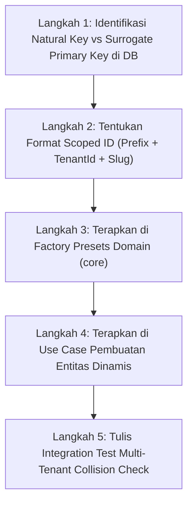

# 🎓 Modul Pembelajaran: Pencegahan Bentrok ID Antar-Tenant (Multi-Tenant ID Collision Prevention)

> **Level Target**: Junior to Mid Developer  
> **Topik Utama**: Multi-Tenancy Architecture, Primary Key Constraint Collision, Tenant-Scoped Semantic Identifiers, Row-Level Security (RLS) Isolation  
> **Prasyarat**: Pemahaman relasi database PostgreSQL (Primary Key & Foreign Key), multi-tenancy, dan Kotlin Domain-Driven Design (DDD).  
> **Referensi File**: 
> - [`core/src/commonMain/kotlin/com/eventverse/app/domain/orgchart/Department.kt`](file:///Volumes/amalari/Projects/wemade/core/src/commonMain/kotlin/com/eventverse/app/domain/orgchart/Department.kt)
> - [`core/src/commonMain/kotlin/com/eventverse/app/domain/orgchart/OrgNode.kt`](file:///Volumes/amalari/Projects/wemade/core/src/commonMain/kotlin/com/eventverse/app/domain/orgchart/OrgNode.kt)
> - [`core/src/commonMain/kotlin/com/eventverse/app/domain/rbac/CustomRole.kt`](file:///Volumes/amalari/Projects/wemade/core/src/commonMain/kotlin/com/eventverse/app/domain/rbac/CustomRole.kt)
> - [`server/src/test/kotlin/com/eventverse/app/TenantIsolationApiTest.kt`](file:///Volumes/amalari/Projects/wemade/server/src/test/kotlin/com/eventverse/app/TenantIsolationApiTest.kt)

---

## 💡 1. Konsep Dasar & Masalah di Dunia Nyata

### Masalah di Dunia Nyata
Dalam sistem SaaS Multi-Tenant (di mana ratusan pabrik konveksi berbagi satu database PostgreSQL yang sama), setiap pabrik pasti memiliki divisi yang namanya sama:
- **Pabrik Alpha** punya divisi *Sales & Marketing*.
- **Pabrik Beta** juga punya divisi *Sales & Marketing*.

Jika kita membuat starter preset dengan ID statis `id = "dept-sales"`, apa yang terjadi saat Pabrik Beta mendaftar setelah Pabrik Alpha?
PostgreSQL akan menolak pendaftaran Pabrik Beta dengan error fatal:
```text
ERROR: duplicate key value violates unique constraint "departments_pkey"
DETAIL: Key (id)=(dept-sales) already exists.
```
Pabrik Beta gagal onboard karena Primary Key `dept-sales` sudah "diklaim" lebih dulu oleh Pabrik Alpha!

### Analogi Sederhana: Nomor Rekening Bank vs Nomor Kamar Hotel
- **Pendekatan Salah (Global Static ID)**: Seperti hotel yang memberi nomor kamar "101" secara global untuk semua cabang hotel di seluruh Indonesia. Begitu cabang Bandung bikin kamar "101", cabang Surabaya dilarang punya kamar "101" karena nomornya bentrok.
- **Pendekatan Benar (Tenant-Scoped ID)**: Di level sistem pusat, kodenya digabung dengan ID cabang: `KMR-BDG-101` dan `KMR-SBY-101`. Masing-masing cabang bebas menyebutnya kamar "101" kepada tamunya (`code = "101"`), tetapi di sistem database pusat kuncinya dijamin 100% unik dan tidak pernah bentrok.

---

## 🧭 2. "Start dari Mana?" — Alur Langkah Penulisan (Order of Operations)

Jika kamu merancang sistem ID yang aman dari bentrok multi-tenant:



1. **Langkah 1: Pisahkan Kunci Alami (`code`) dan Kunci Fisik (`id`)**
   - Kunci bisnis yang dilihat user adalah `code` (misal: `"sales"`), dijaga oleh constraint `UNIQUE(tenant_id, code)`.
   - Kunci fisik di database adalah `id` yang harus unik secara global.
2. **Langkah 2: Tentukan Pola Tenant-Scoped ID**
   - Format: `[domain_prefix]-[tenant_id]-[slug/name]-[entropy]`
   - Contoh: `dept-ten-alpha-sales` vs `dept-ten-beta-sales`.
3. **Langkah 3: Perbarui Factory Presets di Domain Layer (`core`)**
   - Fungsi `Department.defaultPresets(tenantId)` dan `CustomRole.createFactoryPresets(tenantId)` wajib menerima parameter `tenantId: TenantId?` dan menyematkan prefix tenant ke dalam ID.
4. **Langkah 4: Perbarui Use Cases Pembuatan Entitas Baru**
   - `CreateDepartmentUseCase`, `CreateEmployeeUseCase`, `CreateRoleUseCase` wajib menyematkan `command.tenantId` ke dalam ID yang di-generate.
5. **Langkah 5: Buktikan dengan Automated Test**
   - Buat skenario di mana dua tenant berbeda memulihkan preset (*restore presets*) secara bersamaan.

---

## 🧱 3. Bedah Blok per Blok Kode (Deep Code Walkthrough)

### Blok A: Dynamic Tenant-Scoped ID di `Department.kt`

```kotlin
fun defaultPresets(tenantId: TenantId? = null): List<Department> {
    // Jika tenant demo bawaan atau null, pertahankan ID klasik agar backward-compatible
    val prefix = if (tenantId == null || tenantId.value == "ten-demo-001") "" else "${tenantId.value}-"
    return listOf(
        Department(
            id = DepartmentId("dept-${prefix}sales"),
            code = "sales",
            displayName = "Penjualan & CRM",
            shortName = "Sales",
            colorHex = 0xFF2563EB,
            tenantId = tenantId
        ),
        Department(
            id = DepartmentId("dept-${prefix}ppic"),
            code = "production_ppic",
            displayName = "Produksi & PPIC",
            shortName = "Produksi",
            colorHex = 0xFFEA580C,
            tenantId = tenantId
        ),
        // ... divisi lainnya
    )
}
```

**Mengapa ditulis seperti ini?**
1. **Backward Compatibility**: Untuk demo tenant `ten-demo-001`, prefix tetap kosong (`dept-sales`) sehingga database yang sudah ada tidak mengalami patah relasi.
2. **Multi-Tenant Isolation**: Untuk tenant baru (misal: `ten-alpha-001`), ID yang dihasilkan adalah `dept-ten-alpha-001-sales`. Jika tenant lain `ten-beta-002` mendaftar, ID-nya adalah `dept-ten-beta-002-sales`. Keduanya dapat hidup berdampingan di tabel database yang sama tanpa ada bentrok Primary Key.

---

### Blok B: Dynamic Creation di `CreateEmployeeUseCase.kt`

```kotlin
val slug = trimmedName.lowercase()
    .replace("[^a-z0-9]+".toRegex(), "-")
    .trim('-')
val prefix = if (command.tenantId.value == "ten-demo-001") "" else "${command.tenantId.value}-"
val newId = OrgNodeId("emp-${prefix}$slug-${(100..999).random()}")
```

**Mengapa ditulis seperti ini?**
- Jika ada dua pabrik yang sama-sama memiliki karyawan bernama "Budi Santoso", ID yang dihasilkan adalah:
  - Pabrik Alpha: `emp-ten-alpha-001-budi-santoso-712`
  - Pabrik Beta: `emp-ten-beta-002-budi-santoso-712`
- Prefix `ten-alpha-001` menjamin bahwa bahkan jika angka acak di ujungnya sama persis, kedua ID tersebut **mustahil bertabrakan** di level database PostgreSQL.

---

### Blok C: Pembuktian Lewat Integration Test (`TenantIsolationApiTest.kt`)

```kotlin
@Test
fun multipleTenants_restorePresetsConcurrently_shouldNeverCollideIds() = testApplication {
    // 1. Kedua tenant memulihkan preset divisi secara bersamaan
    val alphaRestoreDept = client.post("/api/tenant/departments/restore-presets") {
        header("X-Tenant-Slug", "pabrik-alpha")
    }
    assertEquals(HttpStatusCode.OK, alphaRestoreDept.status)

    val betaRestoreDept = client.post("/api/tenant/departments/restore-presets") {
        header("X-Tenant-Slug", "pabrik-beta")
    }
    assertEquals(HttpStatusCode.OK, betaRestoreDept.status)

    // 2. Verifikasi ID unik milik masing-masing tenant
    val alphaDepts = client.get("/api/tenant/departments") { header("X-Tenant-Slug", "pabrik-alpha") }
    val betaDepts = client.get("/api/tenant/departments") { header("X-Tenant-Slug", "pabrik-beta") }

    assertTrue(alphaDepts.bodyAsText().contains("dept-ten-alpha-001-sales"))
    assertTrue(betaDepts.bodyAsText().contains("dept-ten-beta-002-sales"))

    // Tidak ada kebocoran ID silang
    assertFalse(alphaDepts.bodyAsText().contains("dept-ten-beta-002-sales"))
    assertFalse(betaDepts.bodyAsText().contains("dept-ten-alpha-001-sales"))
}
```

---

## ⚖️ 4. Teknologi & Pendekatan yang Dipilih: The "Why"

| Pendekatan | Alternatif | Mengapa Pendekatan Kita Dipilih? | Risiko Jika Memakai Alternatif |
|---|---|---|---|
| **Tenant-Prefixed Semantic ID** | Pure Raw UUID v4 | Sangat mudah dibaca manusia saat tracing log dan debugging error relasi. | Debugging log error menjadi mimpi buruk karena harus mencocokkan string acak heksadesimal 36 karakter. |
| **Backward-Compatible Prefix Logic** | Migrasi total skema lama | Seeder database yang sudah ada tetap berjalan tanpa perlu me-reset atau mem-drop data PostgreSQL yang aktif. | Data demo lokal yang sudah tersimpan bisa korup atau gagal migrasi Flyway. |
| **Constraint `UNIQUE(tenant_id, code)`** | Hanya andalkan Primary Key | Menjamin bahwa satu pabrik tidak bisa punya dua divisi dengan kode sama (misal dua divisi `"sales"` di pabrik yang sama). | Pengguna bisa tidak sengaja membuat divisi duplikat di perusahaannya sendiri. |

---

## ⚠️ 5. Jebakan Pemula (Junior Pitfalls) & Cara Menghindarinya

1. **Jebakan 1: Asumsi ID Hanya Unik di Satu Komputer/Environment**
   - *Kenapa bahaya*: Saat di lokal dengan 1 tenant demo, semuanya lancar. Begitu deploy ke cloud dengan puluhan tenant, server langsung crash dengan `duplicate key constraint violation`.
   - *Solusi kita*: Selalu tulis integration test dengan minimal 2 tenant berbeda (Tenant Alpha & Tenant Beta).

2. **Jebakan 2: Panjang ID Melebihi Batas Kolom `VARCHAR`**
   - *Kenapa bahaya*: Jika kolom didefinisikan `VARCHAR(32)`, lalu kita menggabungkan `dept-` + `ten-pabrik-jaya-abadi-001-` + `sales-eksekutif-lapangan-` + `999`, panjang string bisa mencapai 50 karakter dan dilempar error `value too long for type character varying(32)`.
   - *Solusi kita*: Di migrasi `V4`, semua kolom ID sudah kita alokasikan sebesar `VARCHAR(64)`, yang sangat aman menampung prefix tenant + slug + random suffix.

---

## 🧪 6. Bagaimana Cara Membuktikan Kodingan Kita Bekerja?

Jalankan perintah pengujian multi-tenant berikut di terminal:
```bash
./gradlew :server:test --rerun-tasks
```
Hasil pengujian pada `TenantIsolationApiTest`:
- `multipleTenants_restorePresetsConcurrently_shouldNeverCollideIds` -> **PASS**
- Tenant Alpha dan Tenant Beta dapat memulihkan seluruh preset (*departments, roles, employees*) secara bersamaan tanpa bentrok kunci primer.
- `tenantData_shouldBeStrictlyIsolatedBetweenTenants` -> **PASS**
- Seluruh unit test murni domain layer (`./gradlew :core:jvmTest`) -> **PASS (66 tests completed, 0 failed)**.
