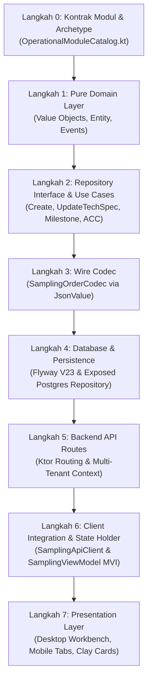

# 🎓 Modul Pembelajaran: Implementasi Full-Stack Modul SAMPLING_ORDER (SPK Sample Rajut & Garmen)

> **Level Target**: Junior to Mid Developer  
> **Topik Utama**: Domain-Driven Design (DDD), Modular Architecture, Kotlin Multiplatform (KMP), Compose Claymorphism, Flat Knitting Manufacturing  
> **Prasyarat**: Dasar Kotlin, Konsep Multi-Tenancy, Compose UI State Management, REST API  
> **Referensi Modul**: `BusinessModule.SAMPLING_ORDER` (WeMade ERP)

---

## 💡 1. Konsep Dasar & Masalah di Dunia Nyata

### Masalah Nyata
Di pabrik garmen dan konveksi rajut (*knitwear*), banyak sistem ERP gagal diadopsi karena dua kesalahan fatal:
1. **Menganggap Pembuatan Sampel Sama dengan Produksi Massal**: Developer sering langsung membuatkan modul Inventory dan memotong stok gudang saat ada order sampel. Padahal, sampel baju (1–3 pcs) dibuat di ruangan khusus (*Sample Room / R&D*) dengan sisa benang uji coba. Memaksa akuntansi stok gudang enterprise di tahap sampel hanya membuat sistem kaku dan ditinggalkan operator.
2. **Mengabaikan Karakteristik Fisik Kain Rajut (Ukuran Ganda)**: Kain rajut yang baru turun dari mesin komputer (*Flat Knitting Machine*) selalu memiliki ukuran mentah yang berbeda dari ukuran baju jadi setelah di-steam/dicuci. Jika ERP hanya punya satu kolom ukuran, programmer mesin tidak bisa menghitung kerapatan jarum (*needle & course*), dan hasil sampel pasti cacat (*reject*).

### Solusi Arsitektur
Kita membangun modul **`SAMPLING_ORDER`** sebagai modul independen (*Bounded Context*) yang mengisi slot kapabilitas `ModuleArchetype.ORDER_INGESTION`:
* **Loose Coupling dari CRM**: Berjalan paralel tanpa menunggu modul CRM selesai, dihubungkan via kontrak data longgar (`lead_id` opsional dan DTO `ProductionOrderDraft`).
* **Dual Size Chart**: Mendukung perbandingan langsung antara **Ukuran Jadi (Finished)** dan **Ukuran Rajut Mentah (Knit Raw)**, baik dalam mode *All Size* maupun *Multi-Size*.
* **Adaptive UI Claymorphism**: Tampilan *Workbench 2 Kolom* untuk desktop dan *Segmented Pill Tabs* dengan tombol ramah jempol ($\ge 48$dp) untuk operator ponsel di lantai pabrik.

---

## 🧭 2. "Start dari Mana?" — Alur Langkah Penulisan (Order of Operations)

Jika kamu diminta membangun fitur full-stack seperti ini dari nol, jangan pernah langsung membuka database atau menulis UI Composable! Ikuti urutan baku ini:



1. **Langkah 0: Kontrak Modul & Archetype**  
   Tentukan peran modul di alur pabrik: kategori (`ModuleCategory.SALES`), tahap (`PipelineStage.COMMERCIAL`), dan tipe kepemilikan stok (`NON_STOCK_SERVICE`).
2. **Langkah 1: Pure Domain Layer (`core/`)**  
   Definisikan Value Objects (`SamplingOrderId`, `SpkNumber`, `KnitSpec`, `SizeMeasurement`) dan Entity agregat `SamplingOrder`.
3. **Langkah 2: Repository Interface & Use Cases (`core/`)**  
   Buat antarmuka repositori murni bebas framework dan Use Case operasi bisnis (`CreateSamplingOrderUseCase`, `ApproveSamplingOrderUseCase`, dll).
4. **Langkah 3: Wire Codec Tanpa Library Eksternal (`core/shared/`)**  
   Gunakan parser JSON berbasis `JsonValue` agar server dan client KMP berbagi struktur format kawat yang sama persis tanpa resiko deserializer drift.
5. **Langkah 4: Database Schema & Exposed Tables (`server/`)**  
   Tulis migrasi SQL Flyway (`V23__create_sampling_orders_schema.sql`), tabel Exposed (`SamplingTables.kt`), dan repositori PostgreSQL yang aman dengan RLS.
6. **Langkah 5: Backend API Routes (`server/`)**  
   Ekspos endpoint REST Ktor (`/api/tenant/sampling/orders`) dengan validasi konteks tenant.
7. **Langkah 6: Client HTTP & MVI ViewModel (`app/shared/`)**  
   Buat `SamplingApiClient` dan `SamplingViewModel` dengan pola MVI (`UiState`, `UiEvent`).
8. **Langkah 7: Presentation Layer (`app/shared/presentation/`)**  
   Rancang antarmuka adaptif berbasis tema Claymorphism WeMade (Desktop 2-pane & Mobile tabbed cards).

---

## 🧱 3. Bedah Blok per Blok Kode (Deep Code Walkthrough)

### Blok A: Pure Domain Entity dengan State Transition yang Aman
Lokasi: [`SamplingOrder.kt`](file:///Volumes/amalari/Projects/wemade/core/src/commonMain/kotlin/com/eventverse/app/domain/sampling/SamplingOrder.kt)

```kotlin
data class SamplingOrder(
    val id: SamplingOrderId,
    val tenantId: TenantId,
    val spkNumber: SpkNumber,
    val clientName: String,
    val styleName: String,
    val status: SamplingStatus = SamplingStatus.DRAFT,
    val sizeMode: SizeMode = SizeMode.ALL_SIZE,
    val knitSpec: KnitSpec = KnitSpec(),
    val finishedSizeCharts: List<SizeMeasurement> = listOf(FactorySizePresets.ALL_SIZE_CARDIGAN_FINISHED),
    val rawKnitSizeCharts: List<SizeMeasurement> = listOf(FactorySizePresets.ALL_SIZE_CARDIGAN_RAW_KNIT),
    val machineProgram: MachineProgram = MachineProgram(feederInstructions = FactorySizePresets.DEFAULT_FEEDERS),
    val yieldAndTiming: YieldAndTiming = YieldAndTiming(),
    val milestones: List<MilestoneProgress> = defaultMilestones(),
    val createdAt: Instant,
    val updatedAt: Instant,
    val archivedAt: Instant? = null
) {
    fun approveAcc(notes: String, updatedAt: Instant): SamplingOrder = copy(
        status = SamplingStatus.ACC_APPROVED,
        accNotes = notes,
        updatedAt = updatedAt
    )
}
```
**Mental Model:**
* Entity bersifat **immutable** (semua properti `val`). Mutasi data dilakukan melalui fungsi domain (`approveAcc`, `toggleMilestone`) yang mengembalikan salinan baru (`copy`).
* Inisialisasi default langsung menyertakan **`FactorySizePresets`** standar pabrik, sehingga form pembuatan SPK instan dan tidak membebani user untuk mengetik 10 titik ukur dari nol.

---

### Blok B: Skema Database dengan RLS Multi-Tenancy
Lokasi: [`V23__create_sampling_orders_schema.sql`](file:///Volumes/amalari/Projects/wemade/server/src/main/resources/db/migration/V23__create_sampling_orders_schema.sql)

```sql
CREATE TABLE IF NOT EXISTS sampling_orders (
    id                     VARCHAR(64) PRIMARY KEY,
    tenant_id              VARCHAR(64) NOT NULL REFERENCES tenants(id) ON DELETE CASCADE,
    spk_number             VARCHAR(50) NOT NULL,
    client_name            VARCHAR(150) NOT NULL,
    style_name             VARCHAR(150) NOT NULL,
    status                 VARCHAR(30) NOT NULL DEFAULT 'DRAFT',
    size_mode              VARCHAR(20) NOT NULL DEFAULT 'ALL_SIZE',
    lead_id                VARCHAR(64) REFERENCES crm_leads(id) ON DELETE SET NULL,
    created_at             TIMESTAMPTZ NOT NULL DEFAULT CURRENT_TIMESTAMP,
    updated_at             TIMESTAMPTZ NOT NULL DEFAULT CURRENT_TIMESTAMP,
    archived_at            TIMESTAMPTZ,
    CONSTRAINT uq_sampling_order_spk UNIQUE (tenant_id, spk_number)
);

SELECT apply_tenant_rls('sampling_orders');
```
**Mental Model:**
* `lead_id` menggunakan relasi longgar (*nullable foreign key* dengan `ON DELETE SET NULL`). Ini memungkinkan modul sampling dibuat dan diuji secara independen tanpa menunggu data CRM.
* `SELECT apply_tenant_rls('sampling_orders');` secara otomatis mengunci baris data di level PostgreSQL engine sehingga tenant A tidak akan pernah bisa melihat SPK milik tenant B.

---

### Blok C: Wire Serialization Tanpa Dependensi Library Eksternal
Lokasi: [`SamplingOrderCodec.kt`](file:///Volumes/amalari/Projects/wemade/core/src/commonMain/kotlin/com/eventverse/app/shared/sampling/SamplingOrderCodec.kt)

```kotlin
object SamplingOrderCodec {
    fun encode(order: SamplingOrder): JsonValue.Obj = jsonObjectOf(
        "id" to jsonOf(order.id.value),
        "spkNumber" to jsonOf(order.spkNumber.value),
        "status" to jsonOf(order.status.name),
        "finishedSizeCharts" to jsonArrayOf(order.finishedSizeCharts.map(::encodeSizeMeasurement)),
        "tensionSettings" to JsonValue.Obj(order.machineProgram.tensionSettings.mapValues { jsonOf(it.value) })
    )
}
```
**Mental Model:**
* Alih-alih bergantung pada refleksi runtime atau plugin compiler serialization di lapisan domain murni, kita menggunakan arsitektur `JsonValue`. Ini menjamin 100% portabilitas di semua target KMP (Android, iOS, Wasm, JVM) tanpa dependensi pihak ketiga.

---

### Blok D: Presentasi Adaptif (Desktop vs Mobile)
Lokasi: [`SamplingWorkspaceScreen.kt`](file:///Volumes/amalari/Projects/wemade/app/shared/src/commonMain/kotlin/com/eventverse/app/presentation/sampling/SamplingWorkspaceScreen.kt)

```kotlin
BoxWithConstraints(modifier = Modifier.fillMaxSize()) {
    val isCompact = maxWidth < 840.dp
    if (isCompact) {
        SamplingMobileWorkbench(
            order = selectedOrder,
            activeTab = state.activeMobileTab,
            onTabSelected = { viewModel.onEvent(SamplingUiEvent.SelectMobileTab(it)) },
            ...
        )
    } else {
        SamplingDesktopWorkbench(
            order = selectedOrder,
            ...
        )
    }
}
```
**Mental Model:**
* Menggunakan `BoxWithConstraints` untuk mendeteksi lebar layar secara reaktif. Layar desktop mendapatkan tampilan *Workbench 2 Kolom* yang kaya data, sedangkan layar ponsel bertransisi menjadi *Segmented Pill Tabs* yang ringkas dan fokus per tahap kerja.

---

## ⚖️ 4. Teknologi & Pendekatan yang Dipilih: The "Why"

| Keputusan Arsitektur | Alternatif yang Ada | Mengapa Kita Memilih Ini? | Risiko Jika Memakai Alternatif |
|---|---|---|---|
| **Archetype Puzzling (Kontrak Handoff)** | Mengimpor class `CrmLead` langsung ke modul Sampling | Memungkinkan pengerjaan modul secara paralel oleh AI/developer berbeda tanpa *merge conflict*. | Kode saling mengunci (*tightly coupled*); pengerjaan sampling terhenti total menunggu CRM. |
| **Dual Size Chart (Jadi vs Mentah)** | 1 Kolom ukuran biasa | Kain rajut menyusut setelah turun mesin dan di-steam. Teknisi butuh ukuran mentah untuk program jarum. | Baju rajut jadi dengan ukuran salah total (reject massal). |
| **Factory Presets (1-Click Auto Fill)** | Mewajibkan input manual 10 titik ukur | Menghemat waktu Sales & R&D; mempercepat siklus pembuatan draft SPK. | User malas mengisi form karena terlalu rumit, SPK tidak pernah dicatat di sistem. |
| **Segmented Tabs di Mobile** | Spreadsheet table penuh di layar HP | Layar HP sempit; tabel dengan belasan kolom tidak terbaca dan sulit di-tap operator. | Operator salah tekan tombol di lantai pabrik karena ukuran elemen terlalu kecil. |

---

## ⚠️ 5. Jebakan Pemula & Cara Menghindarinya

1. **Jebakan 1: Memaksa Input Kolom S/M/L/XL saat Order "All Size"**  
   * *Bahaya*: Di rajut, cardigan/sweater sering kali hanya diproduksi 1 ukuran (*All Size*). Memaksa input S, M, L, XL membuat tabel penuh kolom kosong yang membingungkan.  
   * *Solusi Kita*: Buat toggle `SizeMode` (`ALL_SIZE` vs `MULTI_SIZE`). Jika All Size aktif, tabel otomatis meringkas menjadi 1 kolom tunggal.
2. **Jebakan 2: Memakai `Modifier.shadow()` di UI Claymorphism**  
   * *Bahaya*: `Modifier.shadow()` menghasilkan bayangan kabur (*blurred elevation*) Material Design yang merusak estetika Neo-Brutalism WeMade.  
   * *Solusi Kita*: Wajib menggunakan `ClayCard` atau `Modifier.claySurface` dengan bayangan *solid offset* tanpa blur.
3. **Jebakan 3: Menggabungkan Tanggung Jawab Sampling dengan Operator Mesin Massal**  
   * *Bahaya*: Menyuruh operator produksi massal membuat sampel akan menyebabkan *downtime* mesin produksi tinggi karena sering bongkar pasang jarum dan benang.  
   * *Solusi Kita*: Modul `SAMPLING_ORDER` dialokasikan ke divisi "Desain, Pola & Sampling" (R&D) sebagai entitas pra-produksi.

---

## 🧪 6. Bagaimana Cara Membuktikan Kodingan Bekerja?

1. **Unit Test Pure Domain (`:core:jvmTest`)**:
   * Menjalankan tes logika transisi status ACC, validasi nilai default *Factory Presets*, dan *round-trip serialization* tanpa database:
   ```bash
   ./gradlew :core:jvmTest
   ```
2. **Multiplatform Web Compilation (`:app:shared:compileKotlinWasmJs`)**:
   * Memvalidasi bahwa seluruh komponen UI Compose Multiplatform kompatibel dengan browser web berbasis WebAssembly (Wasm):
   ```bash
   ./gradlew :app:shared:compileKotlinWasmJs
   ```

---

## 🏆 7. Tantangan Mandiri untuk Kamu (Self-Study Challenge)

- [ ] **Tantangan 1 (Ekspor PDF SPK)**: Tambahkan tombol cetak di `SamplingDesktopWorkbench` yang memformat lembar SPK Sample menjadi layout siap print A4.
- [ ] **Tantangan 2 (Kalkulator Kerapatan Jarum Otomatis)**: Di form `SizeChartComparisonTable`, buat fungsi helper yang otomatis menghitung selisih persentase susut:  
  $$\text{Susut} = \frac{\text{Panjang Jadi} - \text{Panjang Mentah}}{\text{Panjang Jadi}} \times 100\%$$
- [ ] **Tantangan 3 (Integrasi Balik ke CRM)**: Saat status SPK Sample berubah menjadi `ACC_APPROVED`, buat event listener yang otomatis mengubah status deal di CRM menjadi *Sample Approved*.
