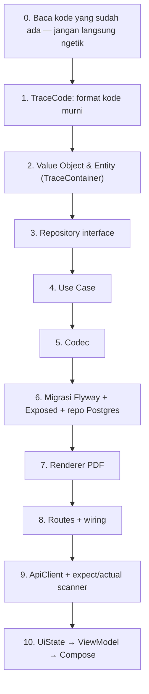

# 🎓 Modul Pembelajaran: Traceability QR Rajut — Lembar Kerja per Size → Bundel → Karung

> **Level Target**: Junior to Mid Developer
> **Topik Utama**: Domain-Driven Design, Desain Skema Kode (check digit), Idempotensi, PostgreSQL RLS, PDFBox + ZXing, Compose Multiplatform `expect/actual`, Aturan Ratchet ukuran file
> **Prasyarat**: Kotlin dasar (`value class`, `data class`, `enum`), pernah membaca `.claude/rules/module-integration-rules.md` dan `.claude/rules/file-size-rules.md`
> **Referensi Task**: Modul greenfield — lahir dari permintaan "di deals setelah admin memasukan inputan size dan buat SPK untuk mulai rajut, buatkan QR tracking dan spek size-nya"

---

## 💡 1. Konsep Dasar & Masalah di Dunia Nyata

### Masalah Nyata

Sebelum modul ini ada, **tidak ada satu pun benda fisik di lantai rajut yang punya identitas**.

Cek sendiri kalau tidak percaya: `grep` kata `bundle`, `barcode`, `lot`, `qr` ke seluruh `core/`,
`server/`, dan `app/shared/` menghasilkan nol entity. Yang ada hanya kalimat di katalog preset
(`PipelinePresetFactory.kt` menyebut *"Scan Barcode Tiket Bundel"*) — teks yang tidak pernah
dieksekusi kode apa pun.

Akibatnya berlapis:

| Yang terjadi hari ini | Akibat nyatanya di pabrik |
|---|---|
| Progres produksi cuma tiga angka per SPK (`ProductionStageProgress`) | Ada 40 pcs macet, tapi tidak ada yang tahu **yang mana** |
| QC memeriksa "Pcs ke-2", nomor urut yang dipilih sistem (`nextPieceNoFor`) | "Pcs ke-2" hari ini belum tentu baju yang sama dengan kemarin — padahal *carry-over* nilai ukur saat rework (`QcInspectionFormState.kt:61-73`) menganggapnya sama |
| Gramasi & menit rajut hanya SATU set per SPK | Operator mesin size XL menerima target gramasi size acuan, lalu menyesuaikannya dari ingatan |
| Kain jadi masuk karung tanpa jejak | Selisih antara yang keluar mesin dan yang disetor **tidak pernah bisa dihitung siapa pun** |

Yang terakhir itu paling mahal, dan paling tidak kelihatan.

### Analogi Sederhana

Bayangkan **bagasi di bandara**.

- **Bundel** adalah koper yang baru diserahkan di check-in counter: diberi tag, ditimbang, masuk ban berjalan.
- **Karung** adalah kontainer kargo di perut pesawat: puluhan koper dituang ke dalamnya, dan **tag masing-masing koper tidak lagi dibaca** sepanjang penerbangan.
- **Pertanyaannya bukan** "bagaimana caranya tag koper tetap terbaca di dalam kontainer". Itu mustahil dan tidak perlu.
- **Pertanyaannya adalah** "koper mana saja yang masuk kontainer nomor berapa". Itu yang dicatat, dan itu yang membuat koper hilang bisa dilacak sampai kontainernya.

Persis itulah yang kita bangun. Identitas tidak dipertahankan — ia **serah-terima**, dan silsilahnya
yang dijaga.

### Hasil Akhir yang Diharapkan

1. Saat SPK terbit, admin mencetak **Lembar Kerja Rajut per size** (QR + spek per panel + spek buyer) dan **setumpuk kartu bundel & karung kosong**.
2. Akhir shift, operator mengikat set lengkap, mengambil kartu berikutnya, memindainya, mengisi hitungan per panel.
3. Bagian finishing memindai kartu karung, memilih bundel yang dituang, mengisi jumlah & timbangan.
4. Sistem menampilkan `Σ(set bundel) − qty karung = susut` — angka yang selama ini mustahil diketahui.

---

## 🧭 2. "Start dari Mana?" — Alur Langkah Penulisan

Jawaban yang sama seperti selalu: **dari yang paling tidak bergantung pada apa pun**, lalu merambat keluar.



### Langkah 0: Baca dulu — dan inilah langkah yang menyelamatkan proyek ini

Rencana awal berbunyi: *"karung itu `FinishingDeposit` yang diperluas saja, entitasnya sudah ada."*

Terdengar hemat. Ternyata salah, dan salahnya fatal. Detailnya di §5 Jebakan 1 — tapi pelajarannya
sekarang: **membaca kode yang ada bukan basa-basi, dan "sudah ada entitasnya" bukan berarti "entitas
itu yang dipakai".** Di repo ini ada **dua** kelas bernama `FinishingDeposit`, dan yang punya
repository justru yang tidak pernah dipakai siapa pun.

### Langkah 1: Format kode, sebelum apa pun

Kenapa format kode duluan, bukan entity? Karena kode inilah yang **tercetak di kertas dan tidak bisa
ditarik kembali**. Entity boleh di-refactor kapan saja; 200 kartu yang sudah beredar di lantai tidak.
Yang paling mahal diubah, dirancang paling awal.

### Langkah 6: Database di urutan enam, bukan satu

Begitu Anda mulai dari tabel, cara berpikir Anda berubah jadi *"kolom apa yang saya butuh"*, dan
aturan bisnis tercecer ke `if` di route handler. Mulai dari domain memaksa Anda menjawab pertanyaan
yang benar dulu: *"apa yang membuat sebuah bundel itu sah?"*

---

## 🧱 3. Bedah Blok per Blok Kode

### Blok A: Kenapa check digit satu karakter TIDAK BISA bekerja di sini

Rancangan awalnya wajar dan terlihat benar:

```kotlin
// ❌ VERSI PERTAMA — dan ini SALAH
private const val CHECK_MODULUS = 31   // prima, supaya transposisi tertangkap
private fun checkDigit(body: String): Char {
    var sum = 0
    body.forEachIndexed { i, c -> sum += ALPHABET.indexOf(c) * (i + 1) }
    return ALPHABET[sum % CHECK_MODULUS]
}
```

Alfabetnya **32 simbol** (Crockford Base32), modulusnya **31**. Lihat apa yang terjadi kalau `0`
(nilai 0) tertukar jadi `Z` (nilai 31):

```
Δ = (31 − 0) × bobot = 31 × bobot
31 × bobot mod 31 = 0     ← selalu nol, bobot berapa pun
```

Checksum-nya **tidak bergeser sama sekali**. Kode yang salah ketik lolos sebagai kode sah, di posisi
mana pun, dan tidak ada pilihan bobot yang bisa memperbaikinya — karena masalahnya ada di selisih
nilainya, bukan di bobotnya.

Ini bukan analisis di atas kertas. Test inilah yang menemukannya:

```kotlin
@Test
fun `checksum rejects every single character substitution`() {
    val code = sample().value
    for (index in code.indices) {
        for (replacement in TraceCodec.ALPHABET) {
            if (replacement == code[index]) continue
            val mutated = code.substring(0, index) + replacement + code.substring(index + 1)
            assertNull(TraceCodec.parse(mutated), "Substitusi di posisi $index harus tertolak: $mutated")
        }
    }
}
```

> 💡 **Mental model**: test yang mencoba **seluruh** kemungkinan (16 posisi × 32 karakter = 512 kasus)
> menemukan hal yang tidak akan pernah ditemukan tiga contoh yang diketik manual. Untuk fungsi yang
> ranahnya kecil dan terbatas seperti ini, *exhaustive test* itu murah dan jauh lebih jujur.

Perbaikannya: **dua karakter, modulus 1021 (prima)**.

```kotlin
private const val CHECK_MODULUS = 1021

private fun checkChars(body: String): String {
    var sum = 0
    body.forEachIndexed { index, char ->
        sum += ALPHABET.indexOf(char).coerceAtLeast(0) * (index + 1)
    }
    return toBase32(sum % CHECK_MODULUS, CHECK_WIDTH)
}
```

**Mengapa 1021, dan kenapa ini bisa dibuktikan bukan sekadar diharapkan?**

- **Substitusi tunggal**: menggeser jumlah sebesar `δ × bobot`. Nilai maksimalnya `31 × 14 = 434`.
  Karena `0 < 434 < 1021`, hasilnya **tidak pernah** kongruen nol. Terdeteksi, selalu.
- **Transposisi dua karakter bersebelahan**: bobotnya berbeda tepat satu, jadi pergeserannya sebesar
  selisih kedua karakter itu — maksimal `31`. Juga tidak pernah kongruen nol. Terdeteksi, selalu.

Kedua kesalahan itulah yang benar-benar terjadi saat orang mengetik ulang kode dari kertas kotor.

### Blok B: Invarian yang membuat seluruh angka bisa dipercaya

```kotlin
fun completeSets(requirements: List<PanelRequirement>): Int {
    if (!isBundle) return declaredPcs
    val relevant = requirements.filter { it.piecesPerGarment > 0 }
    if (relevant.isEmpty()) return 0
    return relevant.minOf { countFor(it.panel) / it.piecesPerGarment }
}
```

Satu baris `minOf`, dan di situlah seluruh nilai fitur ini berada.

Bundel berisi **5 badan depan, 4 badan belakang, 10 lengan** punya 19 lembar. Berapa baju yang bisa
dirakit darinya? **Empat.** Bukan 19, bukan 6, bukan 5 — empat, karena badan belakangnya cuma 4.
Panel paling langka yang menentukan, dan sisanya menunggu shift berikutnya.

```kotlin
fun leftoverPanels(requirements: List<PanelRequirement>): List<PanelTally> {
    val sets = completeSets(requirements)
    return requirements.mapNotNull { requirement ->
        val remaining = countFor(requirement.panel) - (sets * requirement.piecesPerGarment)
        if (remaining > 0) PanelTally(requirement.panel, remaining) else null
    }
}
```

**Mengapa sisa ini dicetak sebagai "sisa menunggu pasangan", bukan "kurang"?** Karena kata memengaruhi
perbuatan. Operator yang membaca "kurang 1 badan belakang" cenderung merasa bersalah dan
menyembunyikannya; yang membaca "sisa 1 badan depan menunggu pasangan" akan menyimpannya untuk besok.

### Blok C: Idempotensi — operator **akan** menekan dua kali

```kotlin
override suspend fun openIfAbsent(container: TraceContainer): TraceContainer =
    DatabaseFactory.dbQuery(container.tenantId) {
        TraceContainersTable.insertIgnore {      // → ON CONFLICT DO NOTHING
            it[id] = container.id.value
            it.applyFrom(container)
            it[createdAt] = container.createdAt
        }
        TraceContainersTable.selectAll()
            .where { … (TraceContainersTable.code eq container.code.value) }
            .single()
            .let { hydrate(it, talliesFor(listOf(it[TraceContainersTable.id]))) }
    }
```

**Mengapa "sisipkan-kalau-belum-ada lalu baca", bukan "cek dulu lalu sisipkan"?**

Pola `if (findByCode(code) == null) insert(...)` **terlihat** benar dan akan lolos seluruh test
Anda — karena test-nya berjalan satu per satu. Di lantai produksi, operator dengan sinyal jelek akan
menekan tombol dua kali, dan dua permintaan itu bisa lolos pemeriksaan `== null` **bersamaan**. Yang
kedua lalu meledak dengan galat basis data mentah, dan operator melihat "terjadi kesalahan" untuk
tindakan yang sebenarnya sudah berhasil.

Tulang punggungnya ada di migrasi, bukan di Kotlin:

```sql
CREATE UNIQUE INDEX IF NOT EXISTS uq_trace_containers_code ON trace_containers(tenant_id, code);
```

Tanpa indeks unik itu, `ON CONFLICT DO NOTHING` tidak punya apa pun untuk dibenturkan, dan seluruh
mekanismenya diam-diam mati.

### Blok D: Alokasi nomor urut yang tidak bisa balapan

Repo ini punya contoh buruk yang sudah ada — jangan ditiru:

```kotlin
// PostgresSamplingOrderRepository.kt:302 — pola yang TIDAK kita ulangi
val count = SamplingOrdersTable.selectAll().where { … }.count()
SpkNumber("SPK-SMP-${(count + 1).toString().padStart(4, '0')}")
```

Dua cacatnya: dua permintaan bersamaan membaca `count` yang sama lalu menghasilkan nomor kembar; dan
`COUNT` menyusut saat ada baris terarsip, sehingga nomor lama **terpakai ulang**. Untuk nomor SPK itu
merepotkan. Untuk kode telusur itu bencana: kartu lama tiba-tiba menunjuk SPK yang salah.

Versi kita menyisipkan dan menghitung dalam **satu pernyataan**, sehingga tidak ada celah di antaranya:

```sql
INSERT INTO trace_work_orders (id, tenant_id, ordinal, work_order_kind, sampling_order_id, created_at)
SELECT 'twS_smp_123', 'tnt-1', COALESCE(MAX(ordinal), 0) + 1, 'SAMPLING', 'smp_123', NOW()
FROM trace_work_orders WHERE tenant_id = 'tnt-1'
ON CONFLICT DO NOTHING
```

### Blok E: Satu tabel yang SENGAJA tidak memakai RLS

```sql
SELECT apply_tenant_rls('trace_work_orders');
SELECT apply_tenant_rls('trace_containers');
SELECT apply_tenant_rls('trace_container_panel_tallies');
SELECT apply_tenant_rls('trace_container_links');
SELECT apply_tenant_rls('trace_allocations');
-- trace_tenant_ordinals TIDAK ada di daftar ini. Ini disengaja.
```

Aturan repo ini tegas: setiap tabel bisnis wajib RLS. Tapi `trace_tenant_ordinals` justru **rusak**
kalau diberi RLS, dan alasannya layak dipahami:

`MAX(ordinal) + 1` harus melihat baris **seluruh** tenant untuk menghasilkan angka yang unik secara
global. Dipasangi RLS, tiap tenant hanya melihat barisnya sendiri → `MAX` selalu mengembalikan nol →
**semua tenant memperoleh ordinal 1** → kode kartu antar pabrik mulai bertabrakan dan saling resolve.

Yang bocor kalau tabel ini terbaca lintas tenant hanyalah sebuah pencacah — nol data produksi. Jadi
pengecualiannya ditulis panjang lebar di KDoc `tenantOrdinal()`, supaya tidak ada yang "memperbaikinya"
enam bulan lagi dan diam-diam merusak keunikan seluruh kode.

> 💡 **Mental model**: aturan yang baik tetap punya pengecualian. Yang membedakan pengecualian sah
> dari kelalaian adalah **apakah alasannya tertulis di tempat orang berikutnya akan membacanya.**

### Blok F: QR digambar sebagai vektor, bukan gambar

```kotlin
val matrix = QRCodeWriter().encode(payload, BarcodeFormat.QR_CODE, 1, 1, hints)
for (row in 0 until matrix.height) {
    var column = 0
    while (column < modules) {
        if (!matrix.get(column, row)) { column++; continue }
        var runEnd = column
        while (runEnd + 1 < modules && matrix.get(runEnd + 1, row)) runEnd++
        content.addRect(…, moduleSize * (runEnd - column + 1), moduleSize)
        column = runEnd + 1
    }
}
content.fill()
```

ZXing dipakai **hanya untuk mendapat matriksnya**, bukan gambarnya. Tiga alasan:

1. **Ketajaman.** Modul vektor tetap tajam di resolusi printer mana pun. PNG yang di-resample bisa
   membuat tepi modul berbayang — dan pada QR 25 mm, tepi berbayang itulah yang menurunkan
   keberhasilan pemindaian.
2. **Tanpa AWT.** Merender ke gambar berarti menarik `BufferedImage`, yang merepotkan di server
   headless dan menambah permukaan masalah yang tidak perlu.
3. **Ukuran berkas.** Modul gelap yang berdampingan digabung jadi satu persegi panjang (`runEnd`).
   Satu kartu bisa punya ratusan modul; menggambarnya satu per satu memperbesar PDF tanpa mengubah
   hasil cetaknya sedikit pun.

---

## ⚖️ 4. Teknologi & Pendekatan yang Dipilih: The "Why"

| Pilihan Kita | Alternatif | Mengapa Ini | Risiko Alternatif |
|---|---|---|---|
| **Kode pra-cetak + baris DB lazy** | Buat baris saat SPK terbit | Nol printer di lantai rajut; kartu tak terpakai tetap sah besok | 200 baris kosong per SPK yang harus dibersihkan kalau kartunya hilang |
| **QR di-encode di server (ZXing JVM)** | Encoder QR multiplatform | Label toh dirender jadi PDF di server; klien cuma perlu *decode* | Menulis/mem-porting encoder QR untuk 5 target KMP demi hal yang tidak dibutuhkan klien |
| **Tautan berkuantitas (`consumed_pcs`)** | `consumedBundleIds: List<String>` di karung | Bundel set tak lengkap cepat atau lambat terpakai sebagian di dua karung | Daftar id tidak punya tempat untuk "sebagian" → butuh migrasi saat kasus itu muncul |
| **Renderer PDF tersendiri** | Generalisasi `InvoiceDocumentLayout.solve()` | Layout label kita **tetap**, bukan didesain user | Menyentuh 5 file invoicing demi fitur yang tidak diminta siapa pun |
| **Gerbang di `OPERATOR_EXEC`** | `BusinessModule` baru | Nol perubahan matriks RBAC, entitlement, dan seed tenant | Satu nilai enum baru merembet ke 5 tabel dan seed tiap tenant |
| **Dua tingkat wadah (tanpa QR per pcs)** | Serial per pcs sejak linking | Stiker tidak selamat dari proses cuci/steam | Satu pekerjaan tempel tambahan per pcs, untuk identitas yang lalu luntur |

---

## ⚠️ 5. Jebakan Pemula & Cara Menghindarinya

### Jebakan 1: "Entitasnya sudah ada, tinggal diperluas"

Rencana awal: karung = `FinishingDeposit` yang ditambah kolom. Kenyataannya, di repo ini ada **dua**
kelas dengan nama itu:

| | `SamplingOrderValueObjects.kt:84` | `domain/sampling/finishing/FinishingDeposit.kt` |
|---|---|---|
| Bentuk | Value object di dalam `SamplingOrder` | Agregat mandiri + repository |
| Persistensi | `deleteWhere` + insert ulang, id `"dep_${orderId}_$idx"` | **Tidak ada impl Postgres sama sekali** |
| Dipakai | API, dialog setoran, ViewModel | **Nol referensi** dari `server/` maupun `app/shared/` |

Yang punya repository ternyata **kode mati**. Yang hidup punya id **berbasis indeks** — hapus satu
setoran, dan id setoran berikutnya bergeser menunjuk baris lain.

*Kenapa bahaya*: QR yang tercetak di karung akan menunjuk catatan yang **berbeda** setelah SPK
disimpan ulang. Bug seperti ini tidak muncul di test mana pun dan baru ketahuan berbulan-bulan
kemudian, saat angkanya sudah dipakai menagih klien.

*Solusi kita*: karung jadi agregat sendiri dengan identitas stabil (`TraceContainer` tier `SACK`).
Dan supaya tidak ada regresi, `CloseTraceSackUseCase` **tetap** menulis satu `FinishingDeposit`
seperti biasa, sehingga `isFinishingComplete` dan antrean QC tidak berubah perilaku sedikit pun.
Satu tindakan, dua catatan, nol regresi.

### Jebakan 2: Membaca daftar panel dari `panelYields`

Terlihat rapi: `ApprovedSampleSpecification.panelYields` sudah berisi daftar panel, tinggal dipakai.

*Kenapa bahaya*: `PanelWeightGrams` hanya punya **satu** field `sleeve`, dan
`ApprovedSampleSpecificationMapper.kt:41-49` memetakannya ke `GarmentPanel.SLEEVE_LEFT` **saja** —
padahal satu baju butuh dua lengan. Bundel berisi 5 depan, 5 belakang, dan 10 lengan akan terhitung
**10 set lengkap** alih-alih 5, dan seluruh angka susut karung ikut salah ke arah yang membuat pabrik
terlihat lebih boros dari kenyataannya.

*Solusi kita*: value object eksplisit, bukan turunan.

```kotlin
data class PanelRequirement(val panel: GarmentPanel, val piecesPerGarment: Int) {
    init { require(piecesPerGarment > 0) { "Panel ${panel.displayName} minimal 1 lembar per baju" } }
}
```

### Jebakan 3: Mengira kamera web "tinggal dipanggil"

`getUserMedia` dan `BarcodeDetector` **hanya hidup di secure context**. Aplikasi yang diakses lewat
`http://192.168.x.x` di LAN pabrik tidak akan pernah menyalakan kamera — dan browser **tidak memberi
pesan apa pun**. Layarnya hanya diam.

*Kenapa bahaya*: gejalanya di lantai terbaca sebagai "aplikasinya rusak", dan developer akan mencari
bug di tempat yang salah selama berjam-jam.

*Solusi kita*: bedakan alasannya, lalu katakan apa adanya.

```kotlin
enum class TraceScannerAvailability { AVAILABLE, INSECURE_CONTEXT, UNSUPPORTED_BROWSER, NOT_ON_THIS_PLATFORM }
```

```
"Kamera tidak bisa dipakai karena halaman ini dibuka lewat http biasa.
 Browser hanya mengizinkan kamera pada alamat https. Sementara ini, ketik kodenya."
```

### Jebakan 4: Mengira "kompilasi hijau" sama dengan "selesai"

Dua cacat berikut lolos **seluruh** test dan baru ketahuan setelah PDF-nya dirender jadi gambar dan
dilihat dengan mata:

1. **Baris tulis tangan berjarak tetap.** Gaya baju berpanel banyak (kerah + placket) kehilangan dua
   baris terakhirnya di bawah tepi kartu — diam-diam, tanpa error. Operator baru menyadarinya sambil
   memegang bundel kerah tanpa tempat menuliskan jumlahnya. Diperbaiki jadi jarak adaptif:
   `gap = (available / lines.size).coerceAtMost(MAX_LINE_GAP)`.
2. **Header tabel bertabrakan.** Kolom dipas ke lebar *isi sel*, padahal yang paling panjang justru
   *header*-nya: "RAJUT MENTAH" menimpa "TOLERANSI".

*Pelajarannya*: untuk apa pun yang menghasilkan tampilan — PDF, Compose, laporan — **render lalu
lihat**. Tidak ada assertion yang bisa menggantikannya.

### Jebakan 5: Menambah baris ke file yang sudah melanggar batas

`Application.kt` sudah 698 baris (hard limit server: 500). Aturan Ratchet melarang menambahinya —
bahkan satu baris wiring pun.

*Solusi kita*: setiap penambahan disertai pemindahan keluar, sehingga ketiga file justru **menyusut**
meski fitur bertambah.

| File | Sebelum | Sesudah | Yang diekstrak |
|---|---|---|---|
| `Application.kt` | 698 | **695** | `ServerRouteWiring.kt` |
| `DealDetailDialog.kt` | 2705 | **2679** | `SpkPrintActions.kt` |
| `InvoicePdfRenderer.kt` | 349 | **341** | `PdfFonts.kt` |

---

## 🧪 6. Bagaimana Cara Membuktikan Kodingan Kita Bekerja?

### Lapis 1 — Domain murni (`core/commonTest`), nol database

Yang paling berharga di sini adalah test yang **mencoba seluruh kemungkinan**, bukan tiga contoh:

```kotlin
@Test
fun `checksum rejects transposition of adjacent characters`() { … }   // menemukan cacat mod-31

@Test
fun `sleeves count two per garment so ten sleeves are five sets not ten`() {
    val bundle = container(tallies = listOf(
        PanelTally(GarmentPanel.BODY_FRONT, 5),
        PanelTally(GarmentPanel.BODY_BACK, 5),
        PanelTally(GarmentPanel.SLEEVE_LEFT, 10)
    ))
    assertEquals(5, bundle.completeSets(requirements))
}

@Test
fun `a sack holding more than was recorded shows a negative gap rather than hiding it`() {
    // Selisih negatif TIDAK dijepit ke nol: itu tanda ada bundel yang lupa di-scan,
    // dan menyembunyikannya berarti menghapus satu-satunya petunjuk kesalahan pencatatan.
    assertEquals(-4, result.perSize.single { it.sizeLabel == "L" }.shrinkagePcs)
}
```

### Lapis 2 — Tata letak cetak, tanpa membuka PDF

```kotlin
@Test
fun `no card region escapes the paper`() { … }

@Test
fun `qr is printed at the documented physical size`() {
    assertEquals(25.0, bundle.regions.qr.width.toMillimeters())
}
```

### Lapis 3 — Renderer PDF (`server/test`)

```kotlin
Loader.loadPDF(file).use { doc ->
    assertEquals(sheet.pageCount, doc.numberOfPages)
    assertEquals(841, doc.getPage(0).mediaBox.height.toInt())  // A4 = 841,89 pt
}
```

### Lapis 4 — Mata, dan hanya mata

```bash
./gradlew :server:test --tests '*TracePrintRendererTest*'
pdftoppm -png -r 110 /tmp/wemade-trace-print/kartu-bundel.pdf /tmp/lihat
```

**Yang tetap belum terbukti dan wajib dicek di pabrik**: apakah QR 25 mm terbaca kamera HP setelah
dicetak dengan **tinta dan kertas yang dipakai pabrik**, di bawah cahaya lantai produksi. Tidak ada
test yang bisa menjawab itu — hanya mencetaknya lalu memindainya. Uji juga kartu yang sengaja diremas,
untuk membuktikan ECC level Q benar-benar bekerja.

---

## 🏆 7. Tantangan Mandiri

- [ ] **Tantangan 1 — Buka kasus bundel pecah.** Saat ini satu bundel hanya boleh masuk satu karung,
      tapi `trace_container_links.consumed_pcs` sudah disiapkan sejak hari pertama. Longgarkan
      validasinya sehingga satu bundel bisa dibagi ke dua karung dengan kuantitas masing-masing —
      **tanpa mengubah satu baris pun skema database**. Kalau Anda sampai perlu migrasi, berarti Anda
      melewatkan sesuatu.
- [ ] **Tantangan 2 — Sambungkan QC ke bundel.** Tambahkan kolom `trace_code` nullable pada
      `QcInspectionReport`, lalu pikirkan: apa yang harus terjadi pada `nextPieceNoFor`,
      `latestReportForPiece`, dan `passedPieceCountFor` saat subjek inspeksi berubah dari nomor urut
      logis menjadi identitas fisik? Tuliskan jawabannya **sebelum** menulis kode.
- [ ] **Tantangan 3 — Buktikan ada yang salah.** Ubah `CHECK_MODULUS` kembali ke `31` dan jadikan
      check digit satu karakter. Jalankan `TraceCodeTest`. Catat kasus tepat mana yang gagal, lalu
      jelaskan dengan aritmetika modular **mengapa** pasangan karakter itu yang lolos.
- [ ] **Tantangan 4 — Cari jebakan berikutnya.** `trace_tenant_ordinals` sengaja tanpa RLS. Ada
      skenario apa lagi di repo ini di mana `MAX()` atau `COUNT()` dipakai untuk menghasilkan angka
      unik, dan apakah semuanya aman terhadap arsip & konkurensi?
