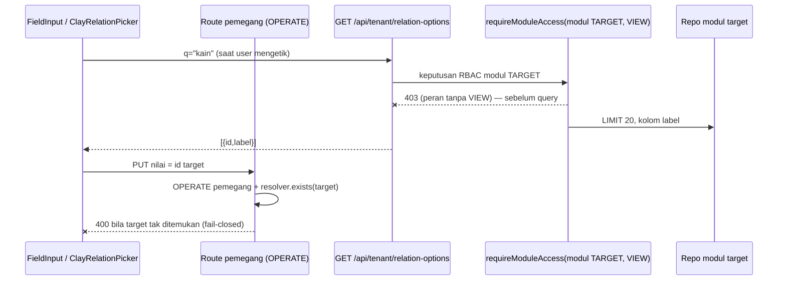

# TRD-FIELD-001: Tipe Field `RELATION` — Rujukan Antar Entitas/Modul (C7, Irisan 4a)

## 1. Document Context and Administration

- **Title & Unique ID**: TRD-FIELD-001 — Tipe Field `RELATION` (rujukan antar entitas lintas modul)
- **Status**: **Draf untuk keputusan** — gerbang awal Irisan 4a sebelum A0 boleh dimulai (wajib sesuai `PLAN-field-component-gaps.md` §2, Kontrak 8 `field-component-rules.md`)
- **Revision History**:

| Versi | Tanggal | Penulis | Catatan |
|---|---|---|---|
| 0.1 | 2026-10-08 | Kilo (riset dari kode) | TRD gerbang; belum ada kode; semua temuan dari bacaan file |

- **Summary & Business Context**: Kosakata field belum punya cara menyatakan rujukan antar entitas
  (mis. SPK merujuk PO; lead merujuk record modul lain). Plan menandai C7 ukuran **Besar** karena
  menyentuh integritas referensial dan pagar kepemilikan modul (TRD-PLAT-004 P4, pagar J3). Tanpa TRD
  ini, tipe `RELATION` **ditolak** di semua jalur (Kontrak 8); dipalsukan jadi `TEXT` dilarang.
- **Rujukan**: `PLAN-field-component-gaps.md` §1 C7, §2 Irisan 4, §3 D2; `field-component-rules.md`
  (seluruh kontrak); `module-integration-rules.md` §5.5–5.6; `TRD-PLAT-004-module-ownership-lanes.md`
  (P4, U3, FR-2); `server/src/test/kotlin/com/eventverse/app/infrastructure/J3MigrationFenceTest.kt`;
  `tenant-variability-rules.md` Kontrak 4 & 7.
- **Stakeholders & Approvers**: Tech Lead (keputusan §4.5), Product (UX pemilih rujukan), QA (tes 403 &
  paritas), integrator Irisan 4a (Track A/B/C).
- **Goals (In-Scope)**:
  1. Keputusan mekanisme rujukan lintas modul: **port/logical reference, bukan JOIN/FK lintas schema**.
  2. Keputusan pemilik integritas referensial (modul target vs modul pemegang field).
  3. Bentuk penyimpanan + pemetaan `SpecColumns` (kunci asing logis).
  4. **Kontrak A0 final** (tanda tangan tipe persis) untuk KEDUA kosakata, keputusan per kosakata (D2).
  5. Kontrak route pencarian opsi rujukan fail-closed (`requireModuleAccess` gate modul target, tes 403).
  6. Kontrak kontrol UI pemilih rujukan + titik pendaftarannya.
  7. Daftar titik pendaftaran hasil grep segar + rencana Track A/B/C + risiko.
- **Non-Goals (Out-of-Scope)**:
  - Menyatukan dua kosakata (D2: **tidak sekarang**).
  - `MULTI_SELECT`, `Formula`, `Mirror/Rollup`, `Timeline` (C5 dan lainnya — irisan lain).
  - Rollup/agregasi atas field rujukan (hitung jumlah/mirror nilai target) — sengaja ditunda.
  - Mengubah aturan B8 untuk modul garment yang sudah berjalan (FK lintas schema garment tetap seperti adanya).
  - Mengubah `custom_field_links` milik `UserRef` yang sudah berjalan (strangler: tabel baru, bukan refactor).

## 2. Functional Requirements

**FR-1 (Rujukan = data, bukan JOIN)** — Nilai `RELATION` yang tersimpan hanyalah **id baris target
( string )** pada kolom modul pemegang field. Tidak ada `REFERENCES`, tidak ada `JOIN` lintas schema,
tidak ada `SET search_path` ke schema modul lain. Pemenuhannya diuji dua lapis:
pemindai `J3MigrationFence` (sudah ada, C3) untuk migrasi J3, dan tes generator yang menegaskan
`SpecColumns` **tidak pernah** memancarkan `REFERENCES` untuk `RELATION` (baru).

**FR-2 (Target "ada dan dapat dirujuk")** — Validasi target dilakukan saat penulisan spec dan saat
penulisan nilai:
- Target ditulis `"entityId"` (satu modul) atau `"moduleId:entityId"` (lintas modul). Lintas modul sah
  hanya bila modul target dapat diresolusi `DomainPack.resolveModule` (modul sendiri pack itu, atau
  modul bersama yang ditawarkan lewat `sharedModules` — aturan R1 `ModuleReferenceRules`). Modul tata
  kelola/fondasi **tidak** bisa jadi target (ikut R1: salin identik, bukan rujukan).
- Saat penulisan nilai (Create/SetField), id target **wajib ditemukan** lewat jalur baca modul target
  dalam tenant yang sama; tidak ditemukan = 400 (fail-closed, bukan simpan diam-diam).

**FR-3 (Pemilik integritas referensial)** — **Modul pemegang field** memilikinya:
- Baris rujukan hidup di schema modul pemegang (kolomnya sendiri untuk prototype; tabel link di schema
  CRM untuk kosakata CRM). Modul **target** tetap pemilik satu-satunya keberadaan record-nya.
- Hapus record target **tidak** cascade lintas schema. Nilai rujukan yang targetnya hilang dirender
  sebagai "tidak ditemukan" (abu, seperti `SelectOption` arsip) — data pemegang tidak hilang diam-diam.
- Sweep orphan berkala = kebersihan opsional, bukan mekanisme integritas utama.

**FR-4 (Route pencarian opsi, fail-closed)** — Satu route generik baru (Track B):
`GET /api/tenant/relation-options?module={targetModuleCode}&entity={entityId}&q={kueri}`
Gerbang berurutan (pola `SpecRoutesWriter.authorized`, urutan tidak boleh diubah): konteks tenant →
modul target dikenal proses (403 bila tidak) → `requireModuleAccess(targetModule, VIEW)` (403) →
modul target ada di pack tenant (404) → baru query dijalankan (`LIMIT 20`, p95 ≤ 300 ms).
Respons: `[{"id","label"}]`; label v1 = field `TEXT` pertama baris target, fallback = id.
Tes wajib: 403 untuk peran tanpa VIEW di modul target; 403 untuk modul tak dikenal; 403 **sebelum**
body/parameter isi dibaca (Kontrak 7); pemanggil berwenang di modul pemegang **tapi** tak berwenang di
modul target tetap 403 (ini inti keputusan #2).

**FR-5 (Kosakata CRM)** — `Relation` masuk kosakata CRM sebagai tipe `isReferential = true` seperti
`UserRef`, tetapi penyimpanan rujukannya **tabel baru** `custom_field_relation_links` (schema
`crm_sales`, milik Track B, migrasi pola V20; RLS `apply_tenant_rls`). `custom_field_links` lama yang
mengunci `target_employee_id REFERENCES employees(id)` **tidak disentuh**. Kolom:
`tenant_id, owner_resource, owner_record_id, field_id, ordinal, target_resource, target_record_id,
PK(owner_resource, owner_record_id, field_id, ordinal)` — tanpa FK ke schema modul lain (FR-1).
Konversi tipe (`FieldTypeConversion.classify`): dari/ke `Relation` = `FORBIDDEN` (padanan `UserRef`).

**FR-6 (Agent & validator usulan)** — `screen_catalog.fieldTypes` memuat `RELATION` + catatan pakainya
(wajib `target`; seed kosong); prompt membaca kosakata dari enum (sudah otomatis lewat
`KoogDiscoveryFieldTypeVocabulary`). Validator usulan menolak `RELATION` tanpa `target`, target dengan
format salah, atau target yang tidak bisa diresolusi pack ("tes target tidak sah" dari plan).
AI prefill (`LeadDraftSanitizer`) **tidak boleh** mengarang nilai `RELATION` → tolak.

**FR-7 (UI pemilih rujukan)** — Komponen dasar `ClayRelationPicker` di `presentation/designsystem/`
(buta domain: `query: String`, `onQueryChange`, `options: List<RelationOption>`, `selectedId`,
`onSelect`, `enabled`, `isError`, `label`), dipakai `FieldInput` (prototype) dan kontrol CRM
(`LeadFieldControl`). Konteks tabel/kanban (`TableCell`, `InlineRowEditor`, `KanbanDetailDialog`)
menampilkan label dengan fallback id. Semua styling token Clay; dilarang literal warna.

## 3. Non-Functional Requirements (NFRs)

| Category | Requirement & Target Metrics | Rationale / Mitigation |
| :--- | :--- | :--- |
| **Performance** | Lookup opsi `LIMIT 20`, p95 ≤ 300 ms; index `(tenant_id, target_record_id)` di tabel link CRM | Pemilih rujukan mengetik → banyak query kecil |
| **Scalability** | Nilai rujukan string O(1) tersimpan; tidak ada join lintas schema saat baca daftar | Daftar 10 rb baris tidak boleh men triggering N+1 antar schema |
| **Security** | Gate modul target `VIEW` untuk mencari opsi; tulis nilai = `OPERATE` modul pemegang **dan** target terverifikasi ada; semua fail-closed + tes 403 | Rujukan jadi celah baca lintas modul kalau gate-nya modul pemegang saja |
| **Availability & Reliability** | Target hilang → render "tidak ditemukan", tidak pernah 500; codec tak mengenal nilai → **tolak**, bukan fallback | Kontrak 4 variability: fallback senyap = data berubah |
| **Maintainability & Observability** | `when (FieldType)` tanpa `else` di semua titik (Kontrak 6); tes paritas iterasi enum; ratchet `wc -l` file besar (`SpecRoutesWriter` 155, `DealRoutes` 719 — jangan tumbuh) | Kompilator = daftar pendaftaran yang tak bisa terlewat |

## 4. System Architecture & Technical Design

### 4.1 Keputusan yang diminta (dengan rekomendasi)

| # | Pertanyaan | Keputusan | Alasan singkat |
|---|---|---|---|
| K1 | Mekanisme rujukan lintas modul | **Logical FK (string id) + rujukan deklaratif `target`**; tanpa FK/JOIN lintas schema | Pagar J3 (P4/U3) melarang schema di luar daftar putih; promosi modul = salin + prefiks baru (P5) membuat FK DB pasti patah |
| K2 | Pemilik integritas referensial | **Modul pemegang field** memvalidasi keberadaan saat tulis (fail-closed) lewat jalur baca modul target; modul target tetap pemilik record | Tidak ada FK lintas schema berarti DB tidak bisa menjaga; menjaga saat tulis = satu-satunya titik yang bisa fail-closed |
| K3 | Bentuk penyimpanan prototype | Kolom `VARCHAR(64)` (id baris target) di tabel modul pemegang; `target` hanya metadata spec | Sel prototype = peta string (kontrak `PrototypeRow`); JSON polimorfik per sel menyalahi kontrak & seed |
| K4 | Bentuk penyimpanan CRM | Tabel baru `custom_field_relation_links` (strangler); `custom_field_links` (UserRef) tidak disentuh | Tabel lama mengunci FK ke `employees(id)`; mengubahnya berisiko ke fitur berjalan |
| K5 | Notasi target | `"entityId"` satu modul; `"moduleId:entityId"` lintas modul; CRM: `targetResource` (kunci resource) | Satu string, parser tunggal, tanpa fallback (Kontrak 4) |
| K6 | Dua kosakata | **Dipisah, keputusan per kosakata (D2)**; tidak ada tipe bersama | Menyatukan menyentuh CRM berjalan; manfaat baru terasa setelah tipe ke-6 |

### 4.2 Opsi yang ditolak

| Opsi | Kenapa ditolak |
|---|---|
| FK/`REFERENCES` lintas schema (manfaatkan B8 untuk garment) | Melanggar semangat FR-2 TRD-PLAT-004 untuk rujukan baru; ilegal bagi modul J3 (fence); promosi P5 (salin + ganti prefiks schema) mematahkan FK; dua aturan berbeda untuk prototype vs J3 = lubang |
| Cross-schema JOIN saat membaca label target | Sama dengan di atas + N+1 lintas schema; label di-resolve lewat route opsi/sweep, bukan JOIN |
| Menyimpan `{moduleId, recordId}` JSON per sel prototype | Sel prototype adalah peta string (`jsonStringMapOf`); JSON per sel memecah codec, seed, dan validator |
| Menyatu dengan `custom_field_links` (kolom employee dibikin nullable/generik) | Mengubah tabel berjalan milik `UserRef` + FK-nya; risiko regresi CRM tanpa kebutuhan |
| Integritas hanya lewat sweep/cron | Tidak fail-closed: nilai tak sah sudah masuk sebelum disapu; Kontrak 7 menuntut tolak saat tulis |
| `Relation` diizinkan sebagai target modul governance/foundation | R1 `ModuleReferenceRules`: modul itu diakses lewat salinan identik, bukan rujukan |

### 4.3 Kontrak A0 final (tanda tangan persis — komit pertama Track A)

```kotlin
// core/src/commonMain/.../domain/prototype/EntitySpec.kt (kosakata PROTOTYPE)
enum class FieldType { TEXT, LONG_TEXT, NUMBER, DATE, ENUM, BOOL, RELATION }

data class FieldSpec(
    // ...field lama tidak berubah...
    /** C7: target rujukan; wajib tepat bila type == RELATION, wajib null selain itu.
     *  Format: "entityId" (satu modul) atau "moduleId:entityId" (lintas modul, harus bisa
     *  diresolusi DomainPack.resolveModule — modul sendiri atau moduleReferences/sharedModules). */
    val target: String? = null
) {
    init {
        // RELATION: target != null, tidak kosong, tanpa spasi, maksimum satu ':'.
        // Selain RELATION: target == null. (gaya validasi currencyCode yang ada)
    }
    // accepts(value) untuk RELATION: value kosong sah (belum diisi); selain itu
    // value non-blank tanpa ".." — keberadaan target diverifikasi server, bukan klien.
}
```

```kotlin
// core/src/commonMain/.../domain/customfield/FieldType.kt (kosakata CRM — tetap terpisah, D2)
/** Rujukan ke satu atau lebih record modul/resource lain. Referensial — baris di
 *  `custom_field_relation_links`. Padanan USER_REF, tapi targetnya resource apa pun yang
 *  sah dirujuk (R1), bukan hanya employees. */
data class Relation(val targetResource: String, val maxCount: Int = 1) : FieldType {
    override val code: String = "RELATION"
    override val isReferential: Boolean = true
    init {
        require(targetResource.isNotBlank()) { "Relation.targetResource cannot be blank" }
        require(maxCount >= 1) { "Relation.maxCount must be at least 1: $maxCount" }
    }
}
// companion: tambah "RELATION" ke ALL_CODES sebagai STRING LITERAL polos
// (jangan rujuk Relation.code dari initializer — jebakan static-init yang sudah
//  didokumentasikan di KDoc companion FieldType).
```

Pendukung A0 (masih komit pertama, bentuk saja):
- `CustomFieldValidationError.TargetNotFound(fieldId, label, resourceId)` — varian baru.
- Port resolusi target (domain, diimplementasi server di Track B):
  `interface RelationTargetResolver { suspend fun exists(tenantId: TenantId, targetResource: String, targetRecordId: String): Boolean }`
- `SpecColumn.sqlDefinition()`: cabang `FieldType.RELATION -> "VARCHAR(64)$notNull"` — **tanpa**
  `REFERENCES`, plus KDoc alasan fence J3.
- `encodeConfig/decodeFieldType` CRM: kunci config baru `targetResource`, `maxCount`;
  `decodeFieldType` mengembalikan **null** (korupsi) bila `targetResource` hilang — bukan fallback.

### 4.4 Diagram alur (lookup opsi + tulis nilai)



### 4.5 Titik pendaftaran — hasil grep segar (2026-10-08, worktree ini)

`grep -rln "FieldType" --include='*.kt' core/src/commonMain server/src/main app/shared/src/commonMain`
→ **63 file** (daftar rules basi: kini ada `KoogDiscoveryFieldTypeVocabulary.kt`,
`KoogDiscoveryNumberFormatVocabulary.kt`, `KoogDiscoverySkeletonVocabulary.kt`, `NumberFormatting.kt`,
`ClayTextField.kt` — hasil Irisan 1/2). Rinciannya; **wajib jalankan ulang saat A0**:

| Lapis | File | Aksi 4a |
|---|---|---|
| Domain prototype | `prototype/EntitySpec.kt` | **A0**: enum + `FieldSpec.target` + validasi + `accepts` |
| Domain prototype | `prototype/PrototypeSpec.kt`, `InteractiveScreenFactory.kt` | Validasi target resolvable antar entitas; factory render |
| Domain prototype | `prototype/SpecOpApplier.kt`, `ChangeWidgetOp.kt`, `DeterministicSpecOpProposer.kt`, `PrototypeHints.kt`, `PrototypeContractSamples.kt` | Cabang `when` baru (kompilator memaksa); sampel kontrak menambah RELATION |
| Domain proposal | `proposal/ProposalEntityRules.kt`, `ProposalEdit.kt`, `ProposalViewRules.kt`, `ScreenProposal.kt` | `FieldProposal.target`; validator target tidak sah; seed RELATION wajib kosong (v1) |
| Domain proposal | `proposal/DeterministicScreenProposer.kt`, `DeterministicScreenRoles.kt`, `PackSuggestionMapping.kt` | Tidak mengusulkan RELATION salah target; pemetaan pack |
| Domain pack | `pack/GarmentScreenSuggestions.kt`, `pack/tenant/layanan/LayananPilotPack.kt` | Pilot J3 sengaja memuat semua tipe (KDoc L45) → tambah RELATION (konteks kedua, Kontrak 7) |
| Codec | `shared/pack/InteractiveScreenCodec.kt`, `SpecOpCodec.kt`, `ScreenSuggestionCodec.kt`, `shared/discovery/ScreenProposalCodec.kt` | Baca `target`; nilai tipe tak dikenal **tetap ditolak** (`requireNotNull` sudah benar) |
| Handoff | `discovery/handoff/SpecColumns.kt`, `SpecPostgresWriter.kt`, `SpecRoutesWriter.kt` | `VARCHAR(64)` tanpa REFERENCES; literal `FieldSpec` bertambah arg `target` |
| Domain CRM | `customfield/FieldType.kt` (A0), `CustomFieldValidation.kt`, `CustomAttributesCodec.kt`, `CustomAttributes.kt`, `CustomFieldDefinition.kt`, `CustomFieldIds.kt`, `FieldTypeConversion.kt`, `usecases/AddCustomFieldDefinitionUseCase.kt`, `usecases/PreviewFieldTypeChangeUseCase.kt` | A0 `Relation`; validasi sel; codec config; konversi FORBIDDEN; use case menerima tipe baru |
| Domain CRM | `crm/LeadFieldDescriptor.kt`, `crm/prefill/LeadDraftSanitizer.kt` | Prefill AI menolak RELATION (tidak mengarang rujukan) |
| Codec CRM | `shared/crm/CrmLeadCodec.kt` | Round-trip nilai sel |
| Server discovery | `infrastructure/discovery/KoogDiscoveryTools.kt`, `KoogDiscoveryPrompt.kt`, `KoogDiscoveryFieldTypeVocabulary.kt` | `note(RELATION)` (kompilator memaksa); katalog & prompt |
| Server builder | `infrastructure/builder/KoogModuleEditor.kt` | Editor spec menerima `target` + aturan R1 |
| Server CRM | `infrastructure/PostgresCustomFieldDefinitionRepository.kt` (`field_type`), `PostgresCrmLeadRepository.kt`, `routes/CrmRoutes.kt`, `tenant/layanan/LayananChangeRequestRoutes.kt` | Tulis/baca link baru; gate + **tes 403**; route opsi (FR-4) |
| Server baru | — | **`RelationTargetResolver` impl** + route `relation-options` + migrasi `custom_field_relation_links` (Track B, file baru) |
| UI discovery | `presentation/discovery/fields/FieldInput.kt` (182 l.), `TableCell.kt`, `InlineRowEditor.kt`, `KanbanDetailDialog.kt`, `InteractiveForm.kt`, `InteractiveFormState.kt`, `InteractiveTableState.kt`, `PrototypeChatEditPanel.kt` | Cabang `when` RELATION; render label/fallback id |
| UI designsystem | `presentation/designsystem/ClayTextField.kt` (sebelahnya) | **Baru**: `ClayRelationPicker.kt` (buta domain) |
| UI CRM | `presentation/crm/CrmUiState.kt`, `components/LeadCustomField.kt`, `LeadFormState.kt`, `AddCustomFieldDialog.kt`, `LeadCustomFieldInputs.kt`, `LeadFieldControl.kt`, `infrastructure/api/CrmApiClient.kt`, `CrmRemoteDataSource.kt` | Kontrol + dialog tambah field + API client |

Tanpa perubahan (verifikasi saja): `NumberFormatting.kt`, `KoogDiscoveryNumberFormatVocabulary.kt`,
`KoogDiscoverySkeletonVocabulary.kt`.

### 4.6 Rencana Track (pola §2 plan; A0 4a **berurutan** dengan A0 4b — berbagi `EntitySpec.kt`)

| Track | Isi | Direktori |
|---|---|---|
| **A** | **A0** §4.3 (kedua kosakata + resolver port + pemetaan SQL). **Sisa A:** validator proposal (target tidak sah), codec dua kosakata (tolak tak dikenal), literal generator, `SpecOp`, tes paritas iterasi enum + **tes target tidak sah** + **tes tanpa REFERENCES** + pack non-default (layanan) | `core/src/commonMain`, `core/src/commonTest` |
| **B** | Route `relation-options` fail-closed + `RelationTargetResolver` impl + migrasi `custom_field_relation_links` (RLS) + integrasi tulis CRM + **tes 403 peran tak berwenang (dua arah: target & pemegang)** + katalog/prompt agent | `server/src/main`, `server/src/test` |
| **C** | `ClayRelationPicker` + cabang `FieldInput` + konteks tabel/kanban + CRM + cek visual dua konteks & pack non-garment (`bordir-uji`) | `app/shared/src/commonMain/.../presentation` |

Urutan merge: A0(4a) → A0(4b) → [A‖B‖C per sub-irisan] (plan §2 aturan 6).

## 5. Testing, Deployment, and Operations

### Technical Acceptance Criteria
1. `SpecColumns` untuk `RELATION` tidak pernah memancarkan `REFERENCES` (tes generator).
2. Tulis nilai dengan id target tak ditemukan = 400; dengan target ditemukan = tersimpan.
3. `GET relation-options`: 403 untuk peran tanpa VIEW modul target (tes eksplisit), 403 modul tak dikenal, 403 sebelum query dibaca.
4. Codec kedua kosakata: round-trip `RELATION` lengkap; kode tak dikenal ditolak (null/throw), tanpa fallback.
5. Tes paritas iterasi `FieldType.entries`: tiap tipe punya pemetaan SQL, catatan katalog, round-trip; `RELATION` tanpa padanan menggagalkan tes; fixture pack non-default (layanan/bordir).
6. Kompilasi 5 target hijau; `scripts/audit-variability.sh` tanpa temuan baru; cek visual dua konteks.

### Testing Strategy
- core: unit validasi `FieldSpec.target`, codec, tes paritas, tes proposal (target tidak sah ×3 bentuk).
- server: tes route gate (403/404/400), resolver, migrasi fence terhadap SQL link baru (harus lolos J3 fence).
- app: tes ViewModel/pemilih dengan fake; cek visual Wasm + JVM.

### Monitoring & Error Handling
- Tolakan 403 lintas modul dicatat WARN (id pemanggil + modul target) tanpa membocorkan isi tenant lain.
- Orphan sweep berkala (opsional, Track B lanjutan): laporkan, jangan hapus diam-diam.

### Deployment & Rollback Plan
1. A0 merge dulu (bentuk tipe; tanpa perilaku baru bagi dokumen lama).
2. Migrasi `custom_field_relation_links` additive (tabel baru + RLS); rollback = drop tabel, aman.
3. Route baru additive; rollback = cabang pendaftaran route. Tidak ada perubahan data lama.

## Risiko
- **Kebocoran baca lintas modul**: route opsi membuka jalur baca modul target; gate yang keliru
  (memakai modul pemegang, bukan target) menjadikannya celah baca → tes 403 dua arah wajib (FR-4).
- **Bentrok Irisan 2** pada `EntitySpec.kt`/`FieldInput.kt` → A0 4a dan 4a-A menunggu giliran (aturan 6 plan); jangan pernah mengedit file yang sama dengan agent Irisan 2.
- `SpecRoutesWriter.entityLiteral` membangun `FieldSpec` posisional — menambah parameter `target` memecah keluaran lama; tes snapshot keluaran generator wajib diperbarui di komit yang sama.
- `DealRoutes.kt` kini 719 baris (di atas hard limit server 500, utang terdaftar): **dilarang** menambah route relasi ke sana — semua route baru di file baru (ratchet Kontrak 2 §14).
- Kebingungan label target (field `TEXT` pertama bukan label bermakna) → parametrisasi label field ditunda; dicatat sebagai keputusan terbuka R3.
- Agent memilih `RELATION` padahal `ENUM` cukup → catatan katalog memandu; tes paritas menutup celah catatan kosong.

## Keputusan terbuka (menunggu user/integrator)
- **R1**: penomoran file — konvensi repo memakai seri per domain (`TRD-FIELD-001/002`), bukan `004a/004b` sesuai nomor irisan. Dipakai di dokumen ini; konfirmasi bila ingin lain.
- **R2**: v1 membatasi seed `RELATION` = kosong (baris seed belum punya id). Terima ketidakpraktisan ini?
- **R3**: penentu label opsi (v1: field `TEXT` pertama; fallback id) — perlu konfirmasi UX.
- **R4**: CRM v1: apakah `targetResource` mencakup resource modul prototype (lintas kosakata) atau hanya resource CRM/employee? Rekomendasi: resource yang terekspos resolver saja; lintas kosakata penuh ditunda.
