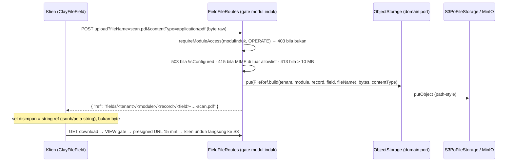

# TRD-FIELD-002: Tipe Field `FILE` — Unggah Berkas & Penyimpanan Objek (C8, Irisan 4b)

## 1. Document Context and Administration

- **Title & Unique ID**: TRD-FIELD-002 — Tipe Field `FILE` (unggah berkas, nilai = referensi objek)
- **Status**: **Disetujui — gerbang lewat, A0 boleh dimulai setelah A0 4a merge** (R1–R3 ditutup
  oleh user 2026-10-08; R4 tetap terbuka dan diputuskan Track C. Gerbang TRD wajib sesuai
  `PLAN-field-component-gaps.md` §2; Kontrak 8 `field-component-rules.md`: tanpa TRD, tipe `FILE`
  **ditolak** di semua jalur, tidak dipalsukan jadi `TEXT`)
- **Revision History**:

| Versi | Tanggal | Penulis | Catatan |
|---|---|---|---|
| 0.1 | 2026-10-08 | Kilo (riset dari kode) | Verifikasi jalur unggah selesai: **server SUDAH punya object storage** (bukti §4.1) |
| 0.2 | 2026-10-08 | User | R1–R3 disetujui dengan opsi default dokumen; R4 dititipkan ke Track C; gerbang Irisan 4b dinyatakan lewat |

- **Summary & Business Context**: Kosakata field belum punya tipe berkas (scan PO, foto, lampiran).
  C8 ditandai **Besar** karena butuh penyimpanan objek dan keputusan gate unduh. Pertanyaan plan
  "belum diverifikasi apakah server sudah punya jalur unggah" kini terjawab: **ada**, dipakai fitur PO
  deal dan mockup sampling — tinggal digeneralisasi, bukan dibangun dari nol.
- **Rujukan**: `PLAN-field-component-gaps.md` §1 C8, §2 Irisan 4; `field-component-rules.md`;
  `module-integration-rules.md` §5.4 (gate modul induk); bukti kode §4.1; TRD-FIELD-001 (A0 4a
  berurutan dengannya, berbagi `EntitySpec.kt`).
- **Stakeholders & Approvers**: Tech Lead (keputusan §4.5), Product (batas & tipe berkas), QA (tes 403,
  batas ukuran), Ops (bucket & env S3).
- **Goals (In-Scope)**:
  1. Verifikasi berbasis bukti jalur unggah/penyimpanan yang sudah ada.
  2. Keputusan antarmuka `ObjectStorage` di domain (infrastruktur yang mengimplementasikan).
  3. Kontrak A0 kedua kosakata: nilai `FILE` = **referensi objek, bukan byte** (D2: keputusan terpisah
     per kosakata, tanpa penyatuan).
  4. Batas ukuran, tipe konten yang diizinkan, dan siapa boleh mengunduh (gate modul induk,
     fail-closed, tes 403).
  5. Kontrak codec yang menolak referensi tak dikenal + titik pendaftaran + Track A/B/C + risiko.
- **Non-Goals (Out-of-Scope)**:
  - Unggah langsung browser→S3 (presigned PUT multipart) — v1 memakai pola yang sudah terbukti
    (body raw melalui server, satu request).
  - Unggah multi-berkas per sel, pratinjau PDF di kanvas, versi berkas, virus scanning.
  - Refactor `PoFileStorage`/fitur deal yang berjalan (strangler: antarmuka baru di sampingnya).
  - Antivirus/karantina konten; validasi magic-byte (v1 percaya `Content-Type` deklaratif + allowlist).

## 2. Functional Requirements

**FR-1 (Domain port)** — Antarmuka `ObjectStorage` di domain core (`domain/storage/ObjectStorage.kt`):
`put(key, bytes, contentType): Result<Unit>`, `downloadUrl(key): Result<String>` (presigned GET,
singkat), `isConfigured: Boolean`. Infrastruktur yang mengimplementasikan; SDK/kredensial/bucket tidak
pernah bocor ke domain — bentuk mengikuti `PoFileStorage` yang sudah terbukti (bukti §4.1).

**FR-2 (Nilai = referensi)** — Nilai tersimpan di sel field hanyalah **key objek** (string, format
`FileRef` §4.3). Byte TIDAK PERNAH masuk kolom/jsonb. Metadata tampilan (nama berkas, ukuran, tipe
konten) disimpan sebagai sidecar opsional di sel (prototype: dipisah dari peta nilai — lihat §4.5;
CRM: kunci tambahan dalam objek sel), validator hanya menegakkan bentuk `FileRef`.

**FR-3 (Batas & tipe konten, fail-closed)** — Mengikuti pola PO (bukti §4.1): `503` bila storage belum
`isConfigured` (pesan menyebut env yang kurang); `400` body kosong; `413` bila > **10 MB**
(`MAX_FIELD_FILE_BYTES`); `415` bila tipe konten di luar allowlist v1: `application/pdf`,
`image/png`, `image/jpeg`, `image/webp`, `text/plain`, `text/csv`. Metadata via query parameter
(`fileName`, `contentType`), body = byte raw — satu request, tanpa plugin multipart (pola yang sama
dengan PO/mockup, komentar DealRoutes L82).

**FR-4 (Siapa boleh apa)** — Modul **induk pemegang field** yang jadi gate (aturan §5.4
module-integration: fitur mewarisi modul induk):
- Unggah: `requireModuleAccess(moduleInduk, OPERATE)` → selain itu **403**.
- Unduh: `requireModuleAccess(moduleInduk, VIEW)` → **403**; respons = URL presigned (15 menit,
  pola `S3PoFileStorage.downloadUrl`), bukan berkas permanen.
- Tes wajib: 403 peran tanpa wewenang untuk unggah **dan** unduh; 403 tanpa identitas; urutan gerbang
  RBAC **sebelum** body dibaca (Kontrak 7; pola `SpecRoutesWriter.authorized`).
- Key unggah deterministik per tenant untuk memungkinkan sweep orphan (konvensi `PoFileStorage`):
  `{tenantId}/fields/{moduleCode}/{recordId}/{fieldKey}-{acak}-{fileName}`.

**FR-5 (Codec menolak referensi tak dikenal)** — Bentuk `FileRef` tervalidasi di `accepts`
(prototype) dan `CustomFieldValidation.validateType` (CRM): wajib berawalan namespace key
(`{tenantId}/fields/`), tanpa `..`, tanpa awalan `/`, tidak kosong. Referensi rusak/buatan = **tolak**
(400 / `TypeMismatch`), **tidak pernah** fallback ke teks kosong atau `TEXT` (Kontrak 4; D4).

**FR-6 (UI)** — Komponen dasar `ClayFileField` di `designsystem/` (buta domain: `fileName`,
`sizeLabel`, `state ∈ {Idle, Uploading(progress), Ready, Error(message)}`, `onPick`, `onDownload`,
`enabled`, `isError`); dipakai `FieldInput` + konteks tabel/kanban (chip nama berkas + unduh) + CRM
(`LeadFieldControl`). Unggah di sel tabel/kanban v1: hanya ganti/hapus berkas yang ada, unggah pertama
di form. Progres unggah tanpa library tambahan (Compose state).

**FR-7 (Agent)** — `note(FILE)` di `KoogDiscoveryFieldTypeVocabulary`: "unggah berkas; seed wajib
kosong; butuh server ber-S3" — kompilator memaksa cabangnya; prompt otomatis membaca enum.

## 3. Non-Functional Requirements (NFRs)

| Category | Requirement & Target Metrics | Rationale / Mitigation |
| :--- | :--- | :--- |
| **Performance** | Unggah ≤ 10 MB selesai < 5 dtk di LAN; unduh = redirect presigned (server tidak mem-proxy byte) | Server Ktor tidak jadi bottleneck aliran byte |
| **Scalability** | Byte di object storage, bukan Postgres; jsonb hanya string key ≤ ~200 karakter | Pola ini yang menyelamatkan PO dari jsonb bengkak (komentar `MAX_INLINE_MOCKUP_BYTES`) |
| **Security** | Gate modul induk unggah/unduh + tes 403; presigned 15 menit; tanpa URL permanen; nama berkas di-sanitize (tanpa `..`, tanpa `/`) | Nama berkas = input tidak tepercaya; key = satu-satunya alamat objek |
| **Availability & Reliability** | `isConfigured == false` → 503 dengan pesan env yang kurang; server tetap hidup; unggahan idempotent per key | Pola `S3PoFileStorage` terbukti; TIDAK ada fallback inline-base64 untuk field (beda dari mockup 2 MB) karena sel jsonb |
| **Maintainability & Observability** | `when` tanpa `else`; tes paritas iterasi enum; WARN untuk tolakan 413/415; ratchet `wc -l` (`DealRoutes` 719 — route baru di FILE baru) | Kompilator memaksa pendaftaran; route besar tidak ditambah ke file utang |

## 4. System Architecture & Technical Design

### 4.1 VERIFIKASI: jalur unggah/penyimpanan sudah ADA (bukti path)

Konsultasi graphify lebih dulu sesuai §16: graph repo tidak ada di worktree ini
(`graphify-out/graph.json` tidak ditemukan), query dijalankan dari checkout utama:
`graphify query "upload file storage server object storage multipart"` → menunjuk
`PoFileStorage`, `ServerRouteWiring`, `UploadSamplingMockup`. Verifikasi lanjutan (baca file):

| Bukti | Path | Isi |
|---|---|---|
| Port domain | `core/src/commonMain/kotlin/com/eventverse/app/domain/deal/storage/PoFileStorage.kt` | `put(key, bytes, contentType)`, `downloadUrl(key)` presigned, `isConfigured` |
| Adapter S3 | `server/src/main/kotlin/com/eventverse/app/infrastructure/storage/S3PoFileStorage.kt` | S3-compatible (MinIO path-style); env `S3_ENDPOINT/S3_REGION/S3_ACCESS_KEY/S3_SECRET_KEY/S3_BUCKET_PO`; presign 15 mnt; 503 bila tak terkonfigurasi |
| Endpoint unggah | `server/src/main/kotlin/com/eventverse/app/routes/DealRoutes.kt:219` (`POST /purchase-orders/upload`) | Metadata via query, byte via body raw; gate `OPERATE` (unggah) / `VIEW` (unduh, L290); 503/400/413/415 lengkap |
| Batas & MIME | `DealRoutes.kt:675-698` | `MAX_PO_FILE_BYTES` = 10 MB; allowlist PO: pdf/png/jpeg/webp; mockup 5 MB + fallback inline 2 MB (L684-691) |
| Use case | `core/.../domain/deal/usecases/AttachPurchaseOrderUseCase.kt:64-67` | key `{tenantId}/{dealId}/{poId}-{fileName}`; `require(isConfigured)` fail-closed |
| Wiring | `server/.../ServerRouteWiring.kt`, `Application.kt`, `routes/DomainRouteWiring.kt` | `poFileStorage` tersuntik; dipakai juga `SamplingRoutes.kt` (mockup) |

**Kesimpulan**: bukan greenfield. Tapi yang ada adalah port **khusus deal** (`PoFileStorage` di
`domain/deal/storage/`) — tipe field butuh port **umum**, bukan mengimpor domain deal.

### 4.2 Keputusan yang diminta (dengan rekomendasi)

| # | Pertanyaan | Keputusan | Alasan singkat |
|---|---|---|---|
| K1 | Antarmuka storage di domain? | **Ya**: `ObjectStorage` baru di `domain/storage/`; adapter S3 baru mengimplementasikannya (membag klien S3 yang lazily-dibangun dengan pola `S3PoFileStorage`); `PoFileStorage` **tidak diubah** | Domain deal tidak boleh jadi dependensi tipe field umum; strangler tanpa menyentuh jalur berjalan |
| K2 | Nilai tipe FILE | **Referensi objek (string key `FileRef`)**, metadata sidecar opsional; byte tidak pernah masuk DB | Sel = jsonb/peta string; byte di DB = bencana ukuran & backup |
| K3 | Batas ukuran | **10 MB** per berkas (sama PO), konstanta `MAX_FIELD_FILE_BYTES` di route baru | Keselarasan dengan batas yang sudah ada; jsonb hanya menyimpan key |
| K4 | Tipe konten | Allowlist tertutup v1: pdf, png, jpeg, webp, txt, csv; lainnya **415** | Allowlist, bukan denylist (fail-closed); gambar/pdf = 90% kebutuhan lapangan |
| K5 | Siapa boleh mengunduh | **Gate modul induk pemegang field**: unggah `OPERATE`, unduh `VIEW`; presigned 15 mnt; tes 403 keduanya | §5.4 module-integration: fitur mewarisi gate modul induk; konsisten dengan PO |
| K6 | Codec referensi tak dikenal | Tolak (`TypeMismatch`/400) bila bentuk `FileRef` tidak sah — tanpa fallback | Kontrak 4/5 field-component-rules: fallback senyap = data berubah |

### 4.3 Opsi yang ditolak

| Opsi | Kenapa ditolak |
|---|---|
| Byte base64 di kolom/jsonb (pola mockup inline) | Mockup memakainya hanya sebagai jalan darurat dev tanpa S3 dengan batas 2 MB (komentar DealRoutes L686-691 menyebutnya "kompromi"); untuk field umum ini membengkakkan jsonb, backup, dan query — ditolak |
| Menambah endpoint field-file ke `DealRoutes.kt` | File 719 baris, sudah di atas hard limit server (utang §14); ratchet melarang menambah — route di `FieldFileRoutes.kt` baru |
| Reuse `PoFileStorage` langsung dari tipe field | Ketergantungan domain field → domain deal; jalur deal bisa berubah sendiri; port umum lebih murah sekarang daripada dibongkar nanti |
| Presigned PUT (unggah langsung ke S3 dari klien) | Menambah permukaan konfigurasi CORS/token per platform (5 target KMP) tanpa kebutuhan v1; pola body-raw sudah teruji |
| Denylist tipe konten / tanpa batas ukuran | Fail-open; berbahaya untuk penyimpanan |
| Menyatukan kosakata untuk FILE (D2) | Sama dengan RELATION: keputusan per kosakata, tidak sekarang |

### 4.4 Kontrak A0 final (tanda tangan persis — komit pertama Track A; SETELAH A0 4a merge)

```kotlin
// core/src/commonMain/.../domain/prototype/EntitySpec.kt (kosakata PROTOTYPE)
enum class FieldType { TEXT, LONG_TEXT, NUMBER, DATE, ENUM, BOOL, RELATION, FILE }
// FieldSpec TIDAK bertambah parameter. accepts(value) untuk FILE:
//   kosong = sah (belum diisi); selain itu FileRef.isValid(value), salah = false.
// Seed v1: sel FILE wajib kosong (validator menolak seed berisi referensi yang tak ada).
```

```kotlin
// core/src/commonMain/.../domain/storage/FileRef.kt (file baru, Track A)
/** Key objek berkas field. Nilai sel = string ini; byte hidup di ObjectStorage. */
@JvmInline
value class FileRef private constructor(val value: String) {
    companion object {
        const val PREFIX = "fields/"
        fun isValid(raw: String): Boolean =
            raw.startsWith(PREFIX) && !raw.contains("..") && !raw.startsWith("/") &&
                raw.length <= 300 && raw.none { it == '\n' || it == '\r' }
        /** Dipakai server saat menyusun key (bukan klien): "{tenantId}/{PREFIX}/..." */
        fun build(tenantId: String, moduleCode: String, recordId: String, fieldKey: String, fileName: String): FileRef
    }
}
```

```kotlin
// core/src/commonMain/.../domain/storage/ObjectStorage.kt (file baru, Track A)
/** Port penyimpanan objek umum (bukan lagi milik deal). Byte tidak pernah melewati domain
 *  selain sebagai argumen put(); nilai field hanyalah FileRef. */
interface ObjectStorage {
    suspend fun put(key: String, bytes: ByteArray, contentType: String): Result<Unit>
    suspend fun downloadUrl(key: String): Result<String>   // presigned GET singkat
    val isConfigured: Boolean
}
```

```kotlin
// core/src/commonMain/.../domain/customfield/FieldType.kt (kosakata CRM — tetap terpisah, D2)
/** Berkas terunggah. Nilai sel = FileRef (bukan byte); byte di ObjectStorage (server). */
data object File : FieldType {
    override val code: String = "FILE"
}
// companion: tambah "FILE" ke ALL_CODES sebagai STRING LITERAL polos
// (jebakan static-init yang didokumentasikan di KDoc companion).
// Codec: encodeConfig(File) = objek kosong; decode "FILE" -> FieldType.File
// (abaikan config asing; kode tak dikenal TETAP null/korupsi).
// CustomFieldValidation.validateType(File): v Str && FileRef.isValid(v.value), selain itu mismatch.
```

Kontrak endpoint (Track B, file baru `FieldFileRoutes.kt`, pola gerbang `authorized` yang ada):

```
POST /api/tenant/modules/{moduleCode}/records/{recordId}/fields/{fieldKey}/upload
     ?fileName=&contentType=      → gate OPERATE modul induk; 503/400/413/415; → { "ref": "<FileRef>" }
GET  /api/tenant/modules/{moduleCode}/records/{recordId}/fields/{fieldKey}/download
                                  → gate VIEW modul induk; 403/404; → { "url": "<presigned>" }
POST /api/tenant/crm/leads/{leadId}/fields/{fieldId}/upload|download   → gate modul CRM (pola CrmRoutes)
```

### 4.5 Alur unggah & penyimpanan



Catatan prototype: metadata tampilan (`fileName`, `sizeBytes`) tidak masuk peta nilai sel (tetap peta
string murni); klien memintanya dari route `GET .../meta` atau menampilkannya dari sesi unggah —
detail kecil dititipkan ke Track C dengan kontrak: **peta nilai tetap bersih** (hanya ref).

### 4.6 Titik pendaftaran — hasil grep segar (2026-10-08, worktree ini)

`grep -rln "FieldType" --include='*.kt' core/src/commonMain server/src/main app/shared/src/commonMain`
→ **63 file** (jalankan ulang saat A0; daftar rules basi). Aksi 4b:

| Lapis | File | Aksi 4b |
|---|---|---|
| Domain prototype | `prototype/EntitySpec.kt` | **A0**: enum + `FILE` + `accepts` via `FileRef` |
| Domain baru | `domain/storage/ObjectStorage.kt`, `domain/storage/FileRef.kt` | **A0**: file baru |
| Domain prototype | `PrototypeSpec.kt`, `InteractiveScreenFactory.kt`, `SpecOpApplier.kt`, `ChangeWidgetOp.kt`, `DeterministicSpecOpProposer.kt`, `PrototypeHints.kt`, `PrototypeContractSamples.kt` | Cabang `when` baru (kompilator memaksa); sampel menambah FILE |
| Domain proposal | `ProposalEntityRules.kt`, `ProposalEdit.kt`, `ProposalViewRules.kt`, `ScreenProposal.kt`, `DeterministicScreenProposer.kt`, `DeterministicScreenRoles.kt`, `PackSuggestionMapping.kt` | Seed FILE wajib kosong; validator menolak ref tak sah |
| Domain pack | `GarmentScreenSuggestions.kt`, `pack/tenant/layanan/LayananPilotPack.kt` | Pilot J3 memuat semua tipe (KDoc L45) → konteks kedua FILE |
| Codec | `shared/pack/InteractiveScreenCodec.kt`, `SpecOpCodec.kt`, `ScreenSuggestionCodec.kt`, `shared/discovery/ScreenProposalCodec.kt`, `shared/crm/CrmLeadCodec.kt` | Round-trip FILE; tak dikenal tetap ditolak (pola `requireNotNull`/null sudah benar) |
| Handoff | `SpecColumns.kt`, `SpecPostgresWriter.kt`, `SpecRoutesWriter.kt` | `FILE -> TEXT NOT NULL/CHECK` penyimpanan **ref** (kolom tetap TEXT, isi tervalidasi `FileRef`); literal generator |
| Domain CRM | `customfield/FieldType.kt` (A0 `File`), `CustomFieldValidation.kt`, `CustomAttributesCodec.kt`, `CustomAttributes.kt`, `CustomFieldDefinition.kt`, `CustomFieldIds.kt`, `FieldTypeConversion.kt`, `usecases/AddCustomFieldDefinitionUseCase.kt`, `usecases/PreviewFieldTypeChangeUseCase.kt` | A0 + validasi + konversi FORBIDDEN |
| Domain CRM | `crm/LeadFieldDescriptor.kt`, `crm/prefill/LeadDraftSanitizer.kt` | Prefill AI menolak FILE (tidak mengarang referensi) |
| Server discovery | `KoogDiscoveryTools.kt`, `KoogDiscoveryPrompt.kt`, `KoogDiscoveryFieldTypeVocabulary.kt` | `note(FILE)`; katalog & prompt |
| Server builder | `infrastructure/builder/KoogModuleEditor.kt` | Editor menerima FILE |
| Server infra | `infrastructure/storage/` (baris S3 klien dibagi), `PostgresCustomFieldDefinitionRepository.kt`, `PostgresCrmLeadRepository.kt`, `routes/CrmRoutes.kt`, `tenant/layanan/LayananChangeRequestRoutes.kt`, `ServerRouteWiring.kt`/`Application.kt` (suntik `ObjectStorage`) | Adapter `S3ObjectStorage` (bucket `S3_BUCKET_FILES`, default `wemade-files`); gate + **tes 403** unggah & unduh |
| Server baru | `routes/FieldFileRoutes.kt` | Endpoint §4.4 (file baru — bukan DealRoutes, ratchet) |
| UI discovery | `fields/FieldInput.kt`, `TableCell.kt`, `InlineRowEditor.kt`, `KanbanDetailDialog.kt`, `InteractiveForm.kt`, `InteractiveFormState.kt`, `InteractiveTableState.kt`, `PrototypeChatEditPanel.kt` | Cabang FILE: unggah/unduh/progres/error; tabel & kanban = chip nama + unduh |
| UI designsystem | `presentation/designsystem/` | **Baru**: `ClayFileField.kt` (buta domain) |
| UI CRM | `CrmUiState.kt`, `LeadCustomField.kt`, `LeadFormState.kt`, `AddCustomFieldDialog.kt`, `LeadCustomFieldInputs.kt`, `LeadFieldControl.kt`, `infrastructure/api/CrmApiClient.kt`, `CrmRemoteDataSource.kt` | Kontrol + dialog + API client |

Tanpa perubahan (verifikasi): `NumberFormatting.kt`, `KoogDiscoveryNumberFormatVocabulary.kt`,
`KoogDiscoverySkeletonVocabulary.kt`, `presentation/designsystem/ClayTextField.kt`.

### 4.7 Rencana Track (pola §2 plan; A0 4b **berurutan setelah** A0 4a)

| Track | Isi | Direktori |
|---|---|---|
| **A** | **A0** §4.4 (enum+`FileRef`+`ObjectStorage`+CRM `File`+codec). **Sisa A:** validasi seed kosong, pemetaan `SpecColumns`, `SpecOp`, tes paritas iterasi enum + tes ref tak sah + pack non-default | `core/src/commonMain`, `core/src/commonTest` |
| **B** | `S3ObjectStorage` (bucket terpisah), `FieldFileRoutes` + integrasi CRM, env/ops `.env`/`dev.sh`, **tes 403 unggah & unduh + 413/415/503**, katalog & prompt agent | `server/src/main`, `server/src/test` |
| **C** | `ClayFileField` + cabang `FieldInput` + tabel/kanban + CRM; cek visual dua konteks & pack non-garment; uji unggah nyata di dev (MinIO) | `app/shared/src/commonMain/.../presentation` |

## 5. Testing, Deployment, and Operations

### Technical Acceptance Criteria
1. Nilai sel `FILE` selalu berupa string `FileRef` sah; byte tidak pernah tersimpan di DB (tes repository).
2. Unggah: 403 (tanpa OPERATE), 503 (storage tak terkonfigurasi), 413 (> 10 MB), 415 (MIME di luar allowlist), 400 (body kosong / `fileName` kosong); sukses = `Created` + ref.
3. Unduh: 403 (tanpa VIEW), 404 (record/ref tak ada); sukses = URL presigned berumur ≤ 15 menit.
4. Codec kedua kosakata: round-trip FILE; ref rusak → tolak tanpa fallback; kode tak dikenal → korupsi.
5. Tes paritas iterasi `FieldType.entries` hijau termasuk FILE; fixture pack non-default (layanan).
6. Kompilasi 5 target hijau; cek visual dua konteks; `scripts/audit-variability.sh` tanpa temuan baru.

### Testing Strategy
- core: unit `FileRef.isValid` (kasus `..`, awalan `/`, kosong, panjang), codec, paritas.
- server: tes route gate dengan fake `ObjectStorage` (in-memory) + satu integrasi MinIO opsional;
  J3 fence terhadap migrasi (tidak ada migrasi skema modul lain — hanya env/bucket).
- app: tes ViewModel unggah (fake storage), cek visual Wasm + JVM, uji manual dev MinIO.

### Monitoring & Error Handling
- WARN untuk 413/415/503 (tanpa isi body); log put/download URL tidak pernah membawa byte.
- Sweep orphan `{tenantId}/fields/**` berkala (opsional lanjutan): laporkan, hapus manual.

### Deployment & Rollback Plan
1. A0 merge (bentuk tipe; dokumen lama tidak terpengaruh — codec menolak FILE lama? tidak ada FILE lama).
2. Infra: tambahkan env `S3_BUCKET_FILES` + bucket MinIO dev; additive, tanpa migrasi SQL baru.
3. Route additive; rollback = cabut pendaftaran route. Berkas yang sudah terunggah tinggal orphan — aman.

## Risiko
- **Env S3 wajib di semua lingkungan** sebelum fitur dipakai: tanpa `isConfigured`, seluruh tipe FILE =
  503 — harus terdokumentasi di onboarding dev (`.env`/`dev.sh`, Track B).
- **Sanitasi nama berkas**: `fileName` dari klien tidak tepercaya (path traversal, kontrol karakter) →
  hanya `FileRef.build` server yang menyusun key; tes hostile-name wajib.
- **Ratchet `DealRoutes.kt` (719 baris > hard 500)**: semua route & konstanta baru di file baru;
  dilarang menambah baris ke file utang.
- **Bentrok Irisan 2 / 4a** di `EntitySpec.kt` & `FieldInput.kt` → A0 berurutan (aturan 6 plan §2).
- **Allowlist terlalu sempit untuk beberapa tenant** (mis. `.xlsx`, `.dwg`) → konstanta terpusat di satu
  file route; perluasan = satu perubahan + tes; jangan longgarkan per fitur.
- **Kompresi/ukuran gambar di klien** belum ada — foto kamera HP bisa 8 MB langsung; Track C wajib
  menampilkan sisa batas + error jelas; kompresi gambar di luar cakupan v1 (dicatat).

## Keputusan (disetujui user, 2026-10-08)
- **R1** ✅: penomoran seri per domain (`TRD-FIELD-001/002`) dipertahankan; konsisten dengan keputusan R1 TRD-FIELD-001.
- **R2** ✅: terima v1 — allowlist `pdf/png/jpeg/webp/txt/csv`, batas **10 MB**; melonggarkan belakangan = satu perubahan konstanta + tes.
- **R3** ✅: terima bucket terpisah `S3_BUCKET_FILES` (default `wemade-files`); isolasi sweep/retensi dari berkas PO, biaya nol.

## Keputusan terbuka (diputuskan Track C)
- **R4**: metadata tampilan prototype (nama berkas/ukuran) via route meta vs disimpan di state sesi klien — kontraknya sudah terkunci: peta nilai sel tetap murni ref.
