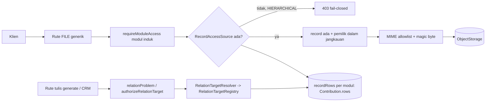

# TRD-FIELD-004: Hardening Server Tipe FILE & RELATION (sisa temuan audit setelah KRITIS-1)

## 1. Document Context and Administration

- **Title & ID**: TRD-FIELD-004 — Penyamaan gerbang DataScope/keberadaan record pada unggah-unduh FILE generik, validasi RELATION di modul hasil generate, guard tulis RELATION CRM, mitigasi MIME/header objek, dan jaring pengaman rute tulis berbasis spec
- **Status**: **DRAFT — menunggu persetujuan.** Belum ada kode yang diubah. Semua bukti `file:baris` diambil dari HEAD `bf9fbe65` (= `main`, sudah memuat `ef51931c`); yang tidak bisa dipastikan dari kode ditandai **[TAK TERVERIFIKASI]**.
- **Basis**: `main` @ `bf9fbe65`. Pola acuan: TRD-PLAT-011/012 (audit rute -> gerbang -> level -> tes, Track A/B/C).
- **Dokumen terkait**: `TRD-FIELD-001-relation.md`, `TRD-FIELD-002-file.md` (v0.4), `docs/teaching/teaching-field-file-tenant-ref-guard.md`, `.claude/rules/tenant-variability-rules.md` Kontrak 6/7, `field-component-rules.md`.

### Revision History

| Versi | Tanggal | Penulis | Catatan |
| :--- | :--- | :--- | :--- |
| 0.1 | 2026-10-10 | Claude Sonnet 5.5 (atas permintaan Achmad) | Draft awal dari audit kode HEAD `bf9fbe65` |

### Summary & Business Context

KRITIS-1 (`ef51931c`) menutup kebocoran **lintas tenant**: `FileRef.isValidFor` (`FileRef.kt`), `EntitySpec.fileOwnershipProblem`
(`EntitySpec.kt:214-221`), `requireOwnFileRef` (`FieldFileGuards.kt:74-82`) dan pembatasan memori unggah (`readBoundedBody`,
`FieldFileGuards.kt:54-66`). Audit lanjutan menemukan lima sisa celah yang **bukan** lintas tenant tetapi lintas record /
lintas jangkauan data / lintas modul **dalam tenant yang sama**, ditambah satu jebakan wiring produksi yang membuat sebagian
perbaikan tak berefek:

| # | Temuan | Berat | Bukti utama |
| :-- | :-- | :-- | :-- |
| F1 | Unggah/unduh FILE generik tanpa DataScope, unggah tanpa cek record ada, ref tulis tak terikat `recordId` | **Tinggi** (celah DataScope di modul HIERARCHICAL; objek yatim) | `FieldFileRoutes.kt:88-89,98-131,149-150`; `FileRef.kt` KDoc `isValidFor` |
| F2 | RELATION di modul hasil generate hanya divalidasi bentuk; id tak ada / dari tenant lain tersimpan | **Tinggi** (integritas data) | `EntitySpec.kt:152`; `SpecRoutesWriter.kt:99,110` (tak ada `relation*`) |
| F0 | Wiring produksi: `fieldFileRecordRows` default `emptyMap()`; tak ada pemasok di `main` | **Tinggi** (bukan celah keamanan; membuat unduh generik selalu 404 dan resolver RELATION modul handoff selalu `false`) | `Application.kt:161`, `DomainRouteWiring.kt:115,147-148,250` |
| F3 | Guard tulis RELATION CRM hanya cek keberadaan, bukan VIEW/DataScope pemanggil atas modul target | Sedang (oracle keberadaan; bedakan dari rute opsi yang sudah benar) | `CrmRelationWriteGuard.kt:23-44` vs `RelationRoutes.kt:68-100` |
| F4 | MIME dari klien tak di-sniff; header objek (disposition/nosniff) tak diatur adapter S3 | Sedang-Rendah (allowlist tanpa HTML/SVG meredam) | `FieldFileRoutes.kt:105-109`; `S3ObjectStorage.kt:83-89,95-104` |
| F5 | `LayananChangeRequestRoutes` belum memanggil `fileOwnershipProblem` & tidak punya kolom/field FILE-RELATION: **spec rute basi terhadap pack** | Sedang (jebakan; tak bisa dieksploitasi hari ini) | `LayananChangeRequestRoutes.kt:46,92,103`; `LayananPilotPack.kt:151,154`; `LayananChangeRequestTables.kt` |

### Stakeholders & Approvers

Product/pemilik platform, Tech Lead (RBAC/guard/generator), QA (probe 403 & isolasi), Developer pelaksana.

### Goals (In-Scope)

- G1: Unggah/unduh FILE generik menghormati DataScope modul induk, mensyaratkan record ada, dan ref tersimpan terikat ke record pemiliknya.
- G2: Rute modul hasil generate memvalidasi **keberadaan** target RELATION lewat `RelationTargetResolver`, sebelum menyimpan.
- G3: Wiring produksi menyuplai sumber baris per modul (satu sumber untuk unduh FILE dan resolver RELATION).
- G4: Guard tulis RELATION CRM setara rute opsi: VIEW + DataScope atas modul target.
- G5: Mitigasi MIME/header minimal tanpa mengubah kontrak endpoint §4.4.
- G6: Tes penjaga yang mengiterasi semua modul hasil generate (`TenantPackContributions.all`) dan mendeteksi drift spec-rute.

### Non-Goals (Out-of-Scope)

- Mengubah kontrak endpoint FILE §4.4 TRD-FIELD-002 (path, query, bentuk respons) — hanya menambah penolakan.
- Antivirus / pemindaian malware isi berkas; kuota penyimpanan per tenant; sweep objek yatim (FR-4 TRD-FIELD-002, tiket tersendiri).
- Menyatukan dua kosakata tipe field (keputusan D2 terpisah) dan migrasi CRM ke kosakata prototype.
- Memigrasikan jalur deal/PO (`PoFileStorage`) — strangler, tidak disentuh.
- Menambah DataScope ke SELURUH rute CRUD hasil generate (lihat Q4; hanya dicatat).

## 2. Functional Requirements

### 2.1 Audit F1 — Unggah/unduh FILE generik

**Peta rute -> gerbang -> level -> status (HEAD `bf9fbe65`)**

| Rute | Handler | Gerbang | Level | Cek record ada | DataScope | Terikat `recordId` | Status |
| :-- | :-- | :-- | :-- | :-- | :-- | :-- | :-- |
| `POST /api/tenant/modules/{m}/records/{r}/fields/{f}/upload` | `FieldFileRoutes.kt:80` | `requireModuleAccess(module)` `:88-89`; modul tak dikenal 403 `:84-87`; `pack.module` 404 `:90` | OPERATE | **Tidak** (`recordId` hanya masuk `FileRef.build` `:122`) | **Tidak ada** (tak ada `sanitizeFor`/`reach`) | n/a | **Celah**: objek yatim di bawah `fields/<tenant>/<modul>/<recordId-bebas>/...`; di modul HIERARCHICAL (`crm_sales`, `sampling_order`, `operator_exec` — `GarmentModules.kt:107,118` dst.) pengguna OWN_DATA_ONLY boleh unggah ke record milik orang lain |
| `GET .../download` (generik) | `:142` | `requireModuleAccess(VIEW)` `:149-150` | VIEW | Ya, lewat `recordRows[module]` `:160-165` | **Tidak ada** | **Tidak**: hanya tenant+modul (`requireOwnFileRef` `:172`) | Celah sempit: baris ber-`ref` modul sama di record lain dapat ditulis ke record sendiri (lihat F1-c) |
| `POST /api/tenant/crm/leads/{l}/fields/{f}/upload` | `:187` | `crmDecision`/`requireCrmAccess(OPERATE)` `:189-190` | OPERATE | Ya `:213-217` | Ya `crmOwnerReach`+`requireReachableOwner` `:218-219` | `recordId = lead.id` `:225` | **Benar** — acuan penyamaan |
| `GET /api/tenant/crm/leads/{l}/fields/{f}/download` | `:245` | `requireCrmAccess(VIEW)` `:248` | VIEW | Ya `:254-258` | Ya `:259-260` | Tidak (modul saja `:271`) | Benar kecuali pencocokan `recordId` |
| Tulis nilai FILE di modul hasil generate | `SpecRoutesWriter.kt:99,110` -> `fileProblem` `:157-158` | `authorized()` | OPERATE | n/a | **Tidak ada** (`repository.list/find` hanya `tenantId`) | **Tidak** (`fileOwnershipProblem` tak membandingkan record) | Pencocokan record hilang |
| Tulis nilai FILE di CRM | lewat `CustomFieldValidation` (KRITIS-1; tes `FieldFileTenantIsolationTest.kt:225,236`) | gerbang CRM | OPERATE | ya | ya | **Tidak** | Pencocokan record hilang |

**Rincian bukti**

- F1-a (DataScope): `FieldFileRoutes.kt:88-89` memanggil `moduleDecision` lalu `requireModuleAccess` saja; seluruh berkas tidak memanggil `sanitizeFor`
  (grep `sanitizeFor` di `routes/` hanya muncul di `CrmAccessGuard.kt:145`, `CrmRoutes.kt:125,155`, `DealRoutes.kt:111`, `RelationRoutes.kt:95`).
- F1-b (record ada): `FileRef.build` hanya menolak `recordId` kosong/berisi `/` (`FileRef.kt` `build`); klien juga **tidak** mengunggah untuk record baru
  (`FieldInput.kt:328`, `FileFieldOps.kt:12`), jadi menegakkan "record harus ada" **tidak merusak alur klien yang ada** [diverifikasi dari komentar kode; perilaku runtime tidak dijalankan].
- F1-c (ikatan `recordId`): KDoc `FileRef.isValidFor` menyatakan "recordId sengaja tidak dicocokkan — alur 'record baru' mengunggah dengan id sementara". Klaim itu **tidak lagi benar**
  (klien tak mengunggah untuk record baru), sehingga alasan pengecualiannya gugur. Tanpa ikatan, pemilik record Y yang mengetahui `ref` berkas record X
  (mis. dari rekan, log) dapat menulisnya ke sel Y lalu mengunduhnya melalui gerbang record Y. Eksploitasi sulit (ref memuat acak 24-bit + nama berkas) tetapi ini melanggar niat DataScope.
- Catatan modul tak-hierarkis: modul `GLOBAL_ONLY` otomatis `ALL_TENANT_DATA`, jadi DataScope tidak berefek; yang tetap relevan hanya F1-b dan F1-c.

**Persyaratan**

- **FR-1.1** Unggah generik: setelah RBAC, urutan baru: (1) modul punya `RecordAccessSource` (lihat §4) — bila **tidak**, modul HIERARCHICAL = **403 fail-closed**, modul `GLOBAL_ONLY` = 404 "Record tidak ditemukan" (sama dengan unduh); (2) record ada (404); (3) bila HIERARCHICAL, pemilik record dalam jangkauan pemanggil (403); baru kemudian storage/`fileName`/MIME/body.
- **FR-1.2** Unduh generik: pemeriksaan (3) yang sama dipakai; urutan tetap RBAC -> record -> scope -> ref sah.
- **FR-1.3** Ikatan record: `FileRef.isValidFor(tenantId, raw, moduleCode, recordId)` — parameter `recordId` opsional **hanya di domain**; semua rute server mewajibkannya (unduh generik, unduh CRM, `fileOwnershipProblem` menerima `recordId`: untuk POST record baru id baru yang dibuat server tidak mungkin sudah punya berkas, jadi FILE terisi pada **create** = 400; pada PUT wajib sama dengan `{id}`).
- **FR-1.4** Tidak ada perubahan kontrak respons; tolakan baru memakai 403/404/400 yang sudah ada.

### 2.2 Audit F2/F0 — RELATION di modul hasil generate

- `FieldSpec.accepts` untuk RELATION hanya `value.isNotBlank() && !value.contains("..")` (`EntitySpec.kt:152`); KDoc `EntitySpec.kt:126-127` mengakui bahwa "keberadaan baris target divalidasi server saat tulis nilai" — **tetapi rute generate tidak melakukannya**:
  `SpecRoutesWriter.kt:99,110` merangkai `dateProblem ?: timeProblem ?: textProblem ?: multiProblem ?: fileProblem ?: reducer`; tak ada `relationProblem`, dan fungsi rute (`:60-64`) tidak menerima `RelationTargetResolver`.
  Akibat: id sembarang, id dari tenant lain, atau id record yang telah dihapus tersimpan.
- Resolver sudah ada dan tenant-aman: `RegistryRelationTargetResolver.exists` (`RelationTargetRegistry.kt:~139-146`) memeriksa modul dikenal + operasional + `registry.sourceFor(..).exists(tenantId, id)`.
- **Ketidakcocokan semantik (temuan baru)**: `FieldSpec.target` berbentuk `"entityId"` atau `"moduleId:entityId"` (`EntitySpec.kt` `relationTargetFormatError`), tetapi resolver menafsirkan `targetResource.substringBefore(':')` sebagai **kode modul** (`resolvableTarget`, `RelationTargetRegistry.kt`). Untuk pilot `target = "change_request"` (`LayananPilotPack.kt:154`, tanpa `:`), resolver memperlakukan `change_request` sebagai kode modul -> `BusinessModules.fromCode` `null` -> **selalu `false`**. Memanggil resolver apa adanya akan menolak SEMUA nilai. Generator wajib menerjemahkan: tanpa `:` -> `"<MODULE>:<target>"`, dengan `:` -> apa adanya.
- **F0**: `Application.kt:161` (`fieldFileRecordRows ... = emptyMap()`) diteruskan `Application.kt:309` ke `DomainRouteWiring.kt:115`; satu-satunya pemasok nilai non-kosong adalah tes (`FieldFileRoutesTest.kt:109`, `FieldFileTenantIsolationTest.kt:133`, `RelationRoutesTest.kt:72`). Di produksi (dari kode; [TAK TERVERIFIKASI] jika ada wiring di luar `server/src/main`):
  unduh generik selalu 404, `RelationTargetRegistry.default(...)` (`DomainRouteWiring.kt:147`) hanya berisi `crm_sales`, jadi RELATION CRM ke modul handoff selalu 400 dan `relation-options` ke modul handoff kosong. `TenantPackContributions.Contribution` (`TenantPackContributions.kt:25-31`) tidak membawa penyimpan baris; `PostgresLayananChangeRequestRepository()` dibuat di dalam lambda `registerRoutes` (`:39`), tak terlihat registri.
- **Persyaratan**
  - **FR-2.1** Generator memancarkan `relationProblem(tenantId, values, resolver)` untuk setiap field RELATION, dipanggil **sebelum** reducer pada POST dan PUT; nilai kosong dilewati; tidak ditemukan = **400** dengan pesan yang tidak membedakan "tak ada" dan "milik tenant lain" (tak ada oracle).
  - **FR-2.2** Rute hasil generate menerima `RelationTargetResolver` (non-null, tanpa default) hanya bila entitas punya RELATION; spec tanpa RELATION menghasilkan kode identik hari ini (kompatibel dengan golden lama).
  - **FR-2.3** `Contribution` membawa `rows: Map<String, PrototypeRowRepository>` (kode modul -> penyimpan) yang digabung ke `fieldFileRecordRows` produksi, sehingga unduh FILE dan resolver RELATION melihat modul hasil generate (menutup F0). Tanpa entri = tetap fail-closed (404/false), bukan fallback.
  - **FR-2.4** Target RELATION ke modul HIERARCHICAL dari modul generate mengikuti FR-3.1 (VIEW + DataScope target) — v1 generator boleh **menolak di build** (pack ditolak saat registrasi) target hierarkis sampai F3 selesai; lihat Q3.

### 2.3 Audit F3 — Guard tulis RELATION CRM

- `rejectMissingRelationTargets` (`CrmRelationWriteGuard.kt:23-44`): hanya `findActiveByResource(CRM_SALES)` lalu `resolver.exists(tenantId, targetResource, recordId)`.
  Tidak ada `moduleDecision`/`requireModuleAccess(VIEW)` atas modul target dan tidak ada filter jangkauan. Pemanggil dipanggil di `CrmRoutes.kt:176-177` (POST) dan `:224-225` (PATCH), **setelah** gerbang CRM sendiri.
- Pembanding yang benar: `RelationRoutes.kt:62-76` (modul target dikenal + operasional + VIEW atas modul **target**, 403), `:95-100` (DataScope target) dan `RelationTargetSource.options(..., reachableOwnerIds, ...)` (`RelationTargetRegistry.kt:33-39`).
- `RelationTargetSource.exists(tenantId, recordId)` (`:42`) tak punya parameter jangkauan; `CrmLeadRelationSource.exists` (`:111-112`) memakai `findById` tanpa pemilik.
- Dampak: pengguna CRM dengan VIEW modul A tetapi tanpa VIEW modul target B (atau OWN_DATA_ONLY atas lead) dapat menguji keberadaan id (200 vs 400) dan menautkan record di luar jangkauannya (lalu opsi/label tak terbaca, tetapi tautan tersimpan). Tidak membocorkan isi record.
- **Persyaratan**
  - **FR-3.1** Sebelum `exists`, guard memanggil gerbang modul target: modul target dikenal+operasional (403), `requireModuleAccess(VIEW)` (403) — sama dengan `RelationRoutes.kt:62-76`; DataScope target dihitung sekali dan diteruskan.
  - **FR-3.2** `RelationTargetSource.exists` menerima `reachableOwnerIds: Set<OrgNodeId>?` (parameter wajib, tanpa default, agar kompilator memaksa setiap sumber memutuskan); `CrmLeadRelationSource.exists` menolak lead di luar jangkauan; `PrototypeRowRelationSource` mengabaikan (kolektif).
  - **FR-3.3** Target di luar jangkauan dilaporkan **400 yang sama** dengan "tidak ditemukan" (tanpa oracle); ketiadaan VIEW atas modul target = **403**.
  - **FR-3.4** Logika gerbang target dipakai bersama `RelationRoutes` dan guard (satu fungsi, mis. `authorizeRelationTarget`), bukan salinan ketiga (cf. utang "tiga salinan guard" di TRD-PLAT-012).

### 2.4 Audit F4 — MIME dan header objek

Bukti: `FieldFileRoutes.kt:105-109` — `contentType` diambil dari **query klien** dan hanya dicocokkan ke allowlist (`:35-42`: pdf, png, jpeg, webp, text/plain, text/csv); **tidak ada** pemeriksaan magic byte; `readBoundedBody` (`FieldFileGuards.kt:54-66`) hanya ukuran.
`S3ObjectStorage.put` (`:83-89`) mengatur `contentType` saja — tidak `contentDisposition`, `cacheControl`, atau metadata; `downloadUrl` (`:95-104`) memakai presign tanpa override `response-content-disposition`/`response-content-type`.
- Yang **tak bisa dipastikan dari kode**: header respons objek MinIO/S3 sebenarnya (apakah `X-Content-Type-Options: nosniff` ditambahkan oleh gateway/CDN/bucket policy) **[TAK TERVERIFIKASI]**. S3/MinIO sendiri tidak menambahkan `nosniff`; `response-*` override pada presign tidak mencakup `nosniff`.
- Risiko nyata kecil: allowlist tidak memuat HTML/SVG/JS, dan presigned URL berasal dari origin storage (bukan origin aplikasi), sehingga XSS ke sesi aplikasi tidak langsung. Sisanya: berkas HTML berlabel `image/png` yang di-sniff peramban lama di origin storage; unduh terbuka inline; nama berkas dipakai peramban sebagai judul.
- **Persyaratan (minimal)**
  - **FR-4.1** Pemeriksaan **magic byte** terpusat (`FileSignature.matches(contentType, bytes)`) untuk pdf/png/jpeg/webp; text/plain & csv = valid UTF-8 tanpa byte NUL. Tidak cocok = **415** (kode yang sama dengan allowlist), dicatat WARN tanpa isi. Dilakukan setelah body terbaca (batas 10 MB sudah menjaga memori), sebelum `objectStorage.put`.
  - **FR-4.2** `ObjectStorage.put` tetap bertanda tangan sama; adapter menambah `contentDisposition("attachment")` + `cacheControl("private, no-store")` pada `PutObjectRequest`; `downloadUrl` menambah `responseContentDisposition("attachment; filename=...")` dan `responseContentType` = tipe tersimpan (port diberi parameter opsional `fileName: String?` — perubahan antarmuka domain kecil; Q5).
  - **FR-4.3** `nosniff`: **dicatat sebagai syarat deployment** (bucket/proxy), bukan kode aplikasi; ditulis di runbook TRD-FIELD-002 dan dicek manual pada MinIO dev.

### 2.5 Audit F5 — Jebakan `LayananChangeRequestRoutes` dan tes penjaga

- `LayananChangeRequestRoutes.kt:46` (SPEC) tidak memuat field FILE/RELATION; `:92` dan `:103` merangkai `dateProblem` saja tanpa `fileProblem`/`multiProblem`/`textProblem`.
  Sedangkan pack sumber **memuat** `lampiran` (FILE, `LayananPilotPack.kt:151`) dan `rujukan` (RELATION, `:154`); tabel (`LayananChangeRequestTables.kt:10-20`) tak punya kolom keduanya. Jadi berkas "KANDIDAT PR" tersebut **basi terhadap pack** dan tidak dihasilkan ulang setelah TRD-FIELD-001/002 Track A.
  Hari ini aman (field tak ada di SPEC -> reducer menolak field tak dikenal [TAK TERVERIFIKASI secara dinamis; dari pembacaan `PrototypeReducer`]). Jebakan: begitu seseorang menghasilkan ulang tanpa memperbarui, atau menyalin pola rute ini untuk modul lain, `fileProblem` tidak ikut.
- Pada hari yang sama `SpecScaffoldGeneratorTest.kt:94-98,191` hanya menguji **bentuk keluaran** generator (kolom `VARCHAR(64)` tanpa `REFERENCES`), tidak menguji perilaku rute hasil generate untuk ref asing / target tak ada.
- **Persyaratan**
  - **FR-5.1** Tes penjaga **berbasis spec** (`GeneratedRouteWriteGuardTest`) yang mengiterasi `TenantPackContributions.all` x entitas x field bertipe FILE/RELATION; untuk setiap pasangan: tulis nilai ref asing / id tak ada -> **400** dan tidak tersimpan. Modul baru ikut otomatis; tidak ada daftar tulis tangan.
  - **FR-5.2** Tes drift: kode hasil `generateFromSpec(pack.spec, ...)` untuk berkas rute **sama** (setelah normalisasi) dengan berkas terkomit; gagal bila SPEC/pemeriksa tertinggal (mendeteksi kondisi saat ini: `lampiran`/`rujukan` hilang).
  - **FR-5.3** `LayananChangeRequestRoutes`, `...Tables`, dan migrasinya **dihasilkan ulang** (Track C) agar sesuai pack; karena modul pilot belum dipakai produksi dengan data FILE/RELATION (kolom tidak ada), tidak ada data yang dimigrasi.

### Tabel target rute/jalur -> gerbang -> level -> tes yang dibutuhkan

Semua tes: **merah dulu terhadap kode lama**, lalu hijau. Setiap baris wajib punya pasangan: (a) peran tak berwenang 403, (b) template/pack non-default, (c) isolasi tenant. Tenant uji: garmen (modul `crm_sales`/`sampling_order`) **dan** pack non-garmen (`layanan`).

| Jalur | Gerbang target (berurutan) | Level | Tes wajib (nama usulan, `[what]_[condition]_[expected]`) |
| :-- | :-- | :-- | :-- |
| Unggah generik, modul HIERARCHICAL | RBAC -> sumber record ada? -> record ada -> pemilik dalam jangkauan -> storage/MIME/body | OPERATE | `upload_hierarchical_otherOwnersRecord_403`; `upload_recordMissing_404`; `upload_noRecordSource_hierarchical_403`; `upload_unauthorizedRole_403_beforeBody` |
| Unggah generik, modul GLOBAL_ONLY (pack `layanan`) | RBAC -> record ada -> ... | OPERATE | `upload_globalModule_recordMissing_404`; `upload_layananOwnRecord_201`; `upload_otherTenantRecordId_404` |
| Unduh generik | RBAC -> record ada -> jangkauan -> ref sah **dan terikat recordId** | VIEW | `download_refOfAnotherRecord_403`; `download_hierarchical_outOfScope_403`; `download_ownRecord_200` |
| Unduh CRM | (sudah) + ikatan recordId | VIEW | `crmDownload_refOfAnotherLead_403` |
| Tulis FILE (POST/PUT generate & CRM) | `fileOwnershipProblem(tenant, recordId?, values)` | OPERATE | `write_fileRefOfAnotherRecord_400`; `create_withFileValue_400`; `put_fileRefSameRecord_200` |
| Tulis RELATION generate (POST/PUT) | RBAC -> `relationProblem` (resolver; target ternormalisasi `MODULE:entity`) -> reducer | OPERATE | `write_relationIdMissing_400`; `write_relationIdOfOtherTenant_400`; `write_relationSameModuleOwnTenant_201` (membuktikan normalisasi); `write_relationNoResolverSource_400` |
| Tulis RELATION CRM | gerbang CRM -> `authorizeRelationTarget` (VIEW target 403 -> DataScope target -> exists) | OPERATE | `crmRelation_noViewOnTarget_403`; `crmRelation_leadOutOfReach_400`; `crmRelation_visibleTarget_200` |
| Unggah semua jalur: MIME | allowlist -> magic byte | OPERATE | `upload_pngLabelHtmlBytes_415`; `upload_pdfLabelPng_415`; `upload_textWithNul_415` |
| Adapter S3 | atribut `PutObjectRequest`/presign | - | `S3ObjectStorageTest` (pakai `S3Presigner` lokal tanpa jaringan: URL memuat `response-content-disposition=attachment`) |
| Penjaga spec | iterasi `TenantPackContributions.all` | - | `GeneratedRouteWriteGuardTest`, `GeneratedRouteMatchesPackSpecTest` |

## 3. Non-Functional Requirements (NFRs)

| Kategori | Persyaratan | Catatan |
| :-- | :-- | :-- |
| Security | Semua tolakan baru fail-closed; 403 sebelum body dibaca (Kontrak 7); tak ada oracle keberadaan lintas tenant/jangkauan | Pola `RelationRoutes` urutan gerbang |
| Compatibility | Kontrak endpoint §4.4 tak berubah; klien `FieldFileApiClient` tak perlu diubah; dua pengecualian: FILE pada create (FR-1.3) dan MIME yang tak cocok magic byte | Klien tidak mengunggah untuk record baru (`FieldInput.kt:328`) |
| Performance | Magic byte = 12 byte pertama; resolver = satu `find` per field RELATION; unggah menambah satu `find` record | Tanpa N+1 |
| Maintainability | Gerbang record/jangkauan **satu** fungsi (dipakai unggah, unduh, dan relasi); `when` tanpa `else` pada kosakata tipe | Ratchet berkas (lihat §4.5) |
| Reliability | Generator mempertahankan keluaran identik untuk spec tanpa RELATION (golden lama hijau) | FR-2.2 |
| Observability | WARN (tanpa isi) untuk 415 magic byte, 403 DataScope unggah, 400 relasi; hitung 403/415 per rute selama sepekan pasca-rilis | Pola `FieldFileGuards.kt` |

## 4. System Architecture & Technical Design

### 4.1 Arsitektur

### 4.2 Komponen (usulan)

- `server/.../routes/FieldFileRecordGate.kt` (baru, ~70 baris): `RecordAccessSource` (= `PrototypeRowRepository` + opsional `ownerOf(record)` untuk modul HIERARCHICAL) dan `ApplicationCall.requireReachableRecord(tenant, module, recordId, decision)`.
  Sengaja **bukan** menambah ke `FieldFileRoutes.kt` (283 baris, soft 300, hard 500; ratchet: tak boleh melewati soft limit).
- `core/.../storage/FileRef.kt`: tambah overload `isValidFor(tenantId, raw, moduleCode, recordId)`; KDoc lama ("record baru") diperbarui.
- `EntitySpec.fileOwnershipProblem(tenantId, recordId, values)`: `recordId` **wajib** (tanpa default) -> kompilator memaksa semua pemanggil; `SpecRoutesWriter` ikut berubah (POST memberi id yang baru dibuat -> berkas apa pun ditolak).
- `SpecRoutesWriter.kt` (193 baris, core soft 250): tambah blok RELATION (+~25 baris emisi). Jika > 250 pisahkan `SpecRoutesRelationEmitter.kt` (satu tanggung jawab: emisi validator relasi).
- `server/.../relation/RelationTargetRegistry.kt`: `exists(tenantId, recordId, reachableOwnerIds)`; file sudah ~160 baris, aman.
- `server/.../routes/RelationTargetAuthorization.kt` (baru, ~60 baris): `authorizeRelationTarget(call, tenant, targetModuleCode)` -> `RelationTargetAccess(decisionScope)`; dipakai `RelationRoutes.kt` dan `CrmRelationWriteGuard.kt` (hilangkan duplikasi `:62-100`).
- `TenantPackContributions.Contribution`: tambah `rows: Map<String, PrototypeRowRepository>`; `DomainRouteWiring` menggabungkannya dengan `fieldFileRecordRows` (parameter tes tetap menang).
- `FileSignature` (core/shared, ~40 baris, fungsi murni + tes commonTest).
- `S3ObjectStorage.kt` (122 baris) + `ObjectStorage.downloadUrl(key, fileName)`.

### 4.3 Data Model & Schema

- **Tanpa migrasi skema untuk F1/F3/F4.** F2: kolom RELATION sudah `VARCHAR(64)` tanpa FK (J3). 
- **Dampak ke modul yang sudah digenerate**: hanya `layanan_change_request` (`TenantPackContributions.kt:35-43`), dan komitnya basi (tak ada kolom `lampiran`/`rujukan`, `LayananChangeRequestTables.kt:10-20`). Hasil regenerasi (FR-5.3) membutuhkan **satu migrasi Flyway baru** pola V76 yang menambah dua kolom nullable (`lampiran VARCHAR(512)`, `rujukan VARCHAR(64)`) pada `layanan_change_request.change_requests` — aditif, tanpa backfill. [Nomor migrasi: ditentukan saat implementasi; cek urutan terakhir di `server/.../db/migration`.]
- Objek yatim yang mungkin sudah ada akibat F1 (unggah ke `recordId` bebas) **tidak dibersihkan** oleh TRD ini; sweep orphan (FR-4 TRD-FIELD-002) di luar cakupan. Ditulis di risiko.
- Klien: tidak ada perubahan; pack baru dengan RELATION tak mengubah `FieldInput`.

### 4.4 API Specifications

Rute tidak berubah. Perubahan kode status:

| Kasus | Sebelum | Sesudah |
| :-- | :-- | :-- |
| Unggah, record tak ada | 201 | 404 |
| Unggah, modul hierarkis, di luar jangkauan / tanpa sumber record | 201 | 403 |
| Unduh, ref milik record lain | 200 | 403 |
| Tulis RELATION generate, target tak ada / tenant lain | 201/200 | 400 |
| Tulis RELATION CRM, tanpa VIEW target | 200 | 403 |
| Unggah, byte tak cocok MIME | 201 | 415 |

### 4.5 Estimasi ukuran file (ratchet, CLAUDE.md §14)

| File | Sekarang | Setelah (target) | Batas |
| :-- | :-- | :-- | :-- |
| `FieldFileRoutes.kt` | 283 | <= 283 (logika baru di `FieldFileRecordGate.kt`) | server soft 300 / hard 500 |
| `FieldFileGuards.kt` | 82 | ~100 | 300 |
| `CrmRelationWriteGuard.kt` | 45 | ~60 | 300 |
| `RelationRoutes.kt` | 138 | ~110 (menurun) | 300 |
| `RelationTargetRegistry.kt` | ~160 | ~170 | 300 |
| `CrmRoutes.kt` | 489 | **tidak boleh bertambah** (hard 500; perubahan hanya pada pemanggil guard, bila perlu parameter ditukar 1:1) | 500 |
| `SpecRoutesWriter.kt` (core) | 193 | ~225 (jika >250 pisah emitter) | 250/400 |
| `EntitySpec.kt` (core) | 221 | <= 230 | 250/400 |
| `S3ObjectStorage.kt` | 122 | ~135 | 300 |
| Tes baru | - | tiap berkas <= 500 | 500/800 |

### 4.6 Technology Usage & Tradeoff

- **Gerbang record di server, bukan di reducer**: reducer sengaja tenant-buta dan dipakai klien/port in-memory (KDoc `fileOwnershipProblem`); tetap begitu.
- **Magic byte sederhana vs pustaka deteksi (Tika)**: pilih fungsi sempit 4 tipe + teks; Tika menambah dependensi besar untuk allowlist 6 tipe.
- **Menolak FILE saat create vs unggah sementara**: pilih menolak (klien memang tak mengunggah saat create); id sementara membuka kategori orphan dan meminta aturan baru.
- **Satu sumber baris (`Contribution.rows`)** menggantikan dua jalur terpisah (unduh vs resolver), mengikuti Kontrak 4 variability (satu pintu, tanpa fallback).

### 4.7 Assumptions, Constraints, Dependencies

- Berkas `.env` tidak disentuh; konfigurasi S3 hanya dibaca dari kode (`S3ObjectStorage.kt:41-45`).
- Bergantung pada `PrototypeRowRepository.find(tenantId, id)` (sudah ada, dipakai `FieldFileRoutes.kt:161`); `ownerOf` untuk modul hierarkis **belum ada** di repositori baris prototype — modul HIERARCHICAL generik tanpa sumber pemilik = fail-closed (FR-1.1), sehingga hari ini unduh/unggah modul `sampling_order`/`operator_exec` lewat rute generik tetap ditolak sampai modulnya menyuplai sumber (dapat diterima: unduh generik toh 404 untuk modul tanpa `recordRows`).
- Modul hasil generate hari ini `GLOBAL_ONLY` (`LayananPilotPack.kt:66`). Pack hasil generate ber-`HIERARCHICAL` **tidak** disaring DataScope-nya oleh `SpecRoutesWriter.authorized` (`:60-75`) — dicatat sebagai Q4, bukan cakupan.
- Verifikasi sedang berjalan di worktree lain: dokumen ini tidak menjalankan gradle/server.

## 5. Testing, Deployment, and Operations

### Technical Acceptance Criteria

- AC1: Semua tes pada tabel §2 merah terhadap `bf9fbe65`, hijau setelah perbaikan; tiap baris punya pasangan 403 peran tak berwenang.
- AC2: Tenant garmen dan pack `layanan` (non-default) lulus matriks yang sama; ref/id tenant A tak pernah diterima di tenant B (404/400/403 sesuai tabel).
- AC3: Dalam produksi-setara (bukan hanya tes), unduh FILE modul `layanan_change_request` dan RELATION ke `layanan_change_request:change_request` bekerja (`Contribution.rows` terdaftar) — dibuktikan tes wiring yang **tidak** menyuntik `fieldFileRecordRows`.
- AC4: `GeneratedRouteMatchesPackSpecTest` hijau (rute/tabel layanan terkomit == keluaran generator).
- AC5: `GeneratedRouteWriteGuardTest` mengiterasi `TenantPackContributions.all`; menambahkan modul baru dengan field FILE/RELATION tanpa guard -> merah.
- AC6: Golden generator untuk spec tanpa RELATION tidak berubah (selain sisipan `fileProblem` baru bila ada perubahan tanda tangan).
- AC7: `scripts/audit-variability.sh` tak menambah temuan; kompilasi 5 target; `graphify update .`.

### Testing Strategy

1. Probe merah lebih dulu terhadap kode lama untuk F1/F2/F3 (tes yang menunjuk perilaku salah saat ini).
2. Perluas `FieldFileTenantIsolationTest` (268 baris; batas 500) bila muat, selain itu berkas baru `FieldFileRecordScopeTest`.
3. Fixture HIERARCHICAL: `crm_sales` dengan dua karyawan + `OWN_DATA_ONLY`; fixture non-default: pack `layanan` (GLOBAL_ONLY) dan pack uji `bordir-uji` bila relevan.
4. Penjaga spec & drift (FR-5.1/5.2) di `server/src/test` (butuh `TenantPackContributions`).
5. Tes generator di `core/commonTest` (`SpecRoutesWriter*Test`): spec dengan RELATION -> kode memuat `relationProblem` dan normalisasi target; spec tanpa -> identik.
6. Tes S3 adapter dengan presigner lokal (tanpa jaringan). Header objek aktual (`nosniff`) **diperiksa manual** di MinIO dev (curl `-I` ke URL presigned) — hasilnya dicatat di teaching doc.
7. Cek visual: tidak ada perubahan UI; cukup smoke login superadmin demo + unggah/unduh lampiran di `layanan`.

### Monitoring & Error Handling

WARN tanpa isi untuk tolakan baru; metrik hitung 403/415/400-relasi per rute. Pesan galat tidak membedakan "tak ada" vs "di luar jangkauan/tenant lain".

### Deployment & Rollback Plan

- **Track A (server, tanpa migrasi, menutup celah):** A1 tes merah F1/F3; A2 `FieldFileRecordGate` + penyamaan unggah/unduh generik (FR-1.1/1.2); A3 ikatan `recordId` (FR-1.3, perubahan domain + `fileOwnershipProblem`); A4 `authorizeRelationTarget` + `exists(reach)` (FR-3.x). Satu PR per butir bila diff besar.
- **Track B (generator + wiring):** B1 `Contribution.rows` + `DomainRouteWiring` (F0, FR-2.3); B2 emisi `relationProblem` + normalisasi target (FR-2.1/2.2) + tes generator; B3 FR-4.x (magic byte + header adapter).
- **Track C (regenerasi & penjaga):** C1 regenerasi `layanan_change_request` (rute, tabel, repositori, migrasi aditif); C2 `GeneratedRouteMatchesPackSpecTest` + `GeneratedRouteWriteGuardTest` (FR-5.x); C3 teaching doc, `scripts/sync-agent-config.sh` bila aturan berubah.
- Urutan berat: A (F1, F3) -> B1/B2 (F0, F2) -> B3 (F4) -> C. F0 mendahului F2 karena tanpa sumber baris produksi resolver menolak semuanya.
- **Rollback**: Track A/B revert PR (tanpa migrasi). C1: migrasi aditif; rollback = abaikan kolom (nullable); tidak ada data tertulis di kolom itu sebelum rilis.
- Pasca-implementasi: teaching doc (CLAUDE.md §12) dan `graphify update .`.

### Risiko

- Mengetatkan unggah generik (404/403) memutus klien yang mengunggah ke id yang belum ada — dimitigasi: klien terverifikasi tidak melakukannya (`FieldInput.kt:328`); tapi klien pihak-ketiga/skrip mungkin; umumkan di catatan rilis.
- Objek yatim historis (F1) tidak terdeteksi/terhapus.
- Normalisasi target RELATION salah (modul vs entitas) = semua tulis ditolak; ditutup tes `write_relationSameModuleOwnTenant_201`.
- `Contribution.rows` mengubah bentuk registri tenant; pack ber-tenant lain (J3) harus mengikuti — hanya satu kontribusi hari ini.
- Magic byte menolak berkas sah yang berformat tidak lazim (mis. JPEG dengan prefiks) — pertahankan daftar tanda tangan sempit dan dapat diperluas dengan tes.
- Tidak bisa dipastikan: header `nosniff`/lifecycle bucket di lingkungan nyata; konfigurasi S3 produksi.

### Pertanyaan Terbuka (dengan rekomendasi)

- **Q1 — FILE pada create ditolak (400)?** Rekomendasi: ya (FR-1.3); klien tak mengunggah untuk record baru. Alternatif (id sementara + ikatan lunak) ditolak karena membuka kategori orphan baru.
- **Q2 — Modul HIERARCHICAL tanpa sumber pemilik di rute generik: 403 atau 404?** Rekomendasi: 403 fail-closed (bukan 404) supaya perbedaan "tak ada sumber" vs "tak ada record" tidak tersamar; CRM tetap lewat rute lead-nya.
- **Q3 — Target RELATION dari modul generate ke modul HIERARCHICAL (mis. `crm_sales`)?** Rekomendasi: v1 ditolak saat registrasi pack/generator sampai FR-3.x selesai, lalu diizinkan dengan gerbang target yang sama. Alternatif: izinkan langsung memakai `authorizeRelationTarget` (Track A dahulu).
- **Q4 — Rute CRUD generate mengabaikan DataScope untuk modul HIERARCHICAL** (`SpecRoutesWriter.kt:60-75,85-90`: `repository.list(tenantId)`), terlepas dari FILE/RELATION. Rekomendasi: tiket terpisah; sementara itu generator menolak pack HIERARCHICAL (catat di KDoc generator).
- **Q5 — Mengubah `ObjectStorage.downloadUrl` (antarmuka domain) menambah `fileName`?** Rekomendasi: ya, parameter opsional dengan default `null` (tanpa override disposition bila null) agar fake di tes tetap valid.
- **Q6 — `nosniff` di mana ditegakkan?** Rekomendasi: bucket policy/reverse proxy (infra), dicatat di runbook; bukan kode aplikasi. Perlu keputusan pemilik infra.
- **Q7 — Magic byte: 415 atau 400?** Rekomendasi: 415 (sama dengan allowlist) agar klien punya satu penanganan.
- **Q8 — Wiring produksi (F0) benar-benar kosong?** Dari `server/src/main` ya; **[TAK TERVERIFIKASI]** terhadap konfigurasi deployment di luar repo. Rekomendasi: konfirmasi ke pemilik deployment sebelum A/B1, karena menentukan apakah unduh generik hari ini 404 di produksi.

---

## Status Track B (ditulis oleh pelaksana Track B; Track A dicatat oleh pelaksana lain — seksi ini sengaja terpisah agar tak konflik)

| Butir | Status | Bukti |
| :-- | :-- | :-- |
| **B1** `Contribution.rows` + `DomainRouteWiring` (FR-2.3, F0) | **Selesai** | `TenantPackContributions.Contribution.rows` (wajib, tanpa default), `mergeRows` (fail-loud: kunci di luar pack / modul ganda ditolak; parameter tes `fieldFileRecordRows` menang), dipakai `DomainRouteWiring` untuk unduh FILE **dan** `RelationTargetRegistry`. Tes: `TenantPackContributionsRowsTest` (6). |
| **B2** `relationProblem` generator + normalisasi target (FR-2.1/2.2) + Q3 | **Selesai** | `relationTargetResource` / `EntitySpec.relationTargetProblem` (core, `prototype/RelationTargets.kt`); emisi di `SpecRoutesRelationEmitter` (kosong bila tanpa RELATION = keluaran identik); `registerRoutes` menerima resolver; Q3 ditolak di generator dan validator usulan (`RelationTargetPolicy`). Tes: `RelationTargetRulesTest` (9), `SpecRoutesRelationEmissionTest` (7). |
| **B3** magic byte + header adapter (FR-4.x) | **Ditunda** | menyentuh berkas Track A (`FieldFileRoutes`, `S3ObjectStorage`). |

**Verifikasi F0 dari kode HEAD (bukan salinan TRD)**: `Application.kt` mendeklarasikan `fieldFileRecordRows = emptyMap()`
sebagai default dan meneruskannya ke `DomainRouteWiring`; pemasok non-kosong satu-satunya hanya tiga tes
(`FieldFileRoutesTest`, `FieldFileTenantIsolationTest`, `RelationRoutesTest`). Tidak ada kode `server/src/main` lain yang
mengisinya. Benar untuk `server/src/main`; **Q8 tetap terbuka** untuk konfigurasi deployment di luar repo (asumsi:
tidak ada wiring di luar repo yang menyuntik `fieldFileRecordRows`; bila ada, parameter tetap menang atas kontribusi).

**Catatan keputusan**: validasi keberadaan RELATION ditaruh di core (`relationTargetProblem`) dan kode yang digenerate hanya
memanggilnya (pola `fileOwnershipProblem`), jadi aturan normalisasi/keberadaan teruji tanpa mengompilasi kode hasil generate.
Q3 diberlakukan juga di validator usulan (jalur "registrasi" pack hasil generate) agar ditolak sedini mungkin.

**Dampak ke `layanan_change_request`**: berkas terkomit `LayananChangeRequestRoutes.kt` **tidak diubah** (masih basi: tanpa
`lampiran`/`rujukan`, = Track C1). Keluaran generator terbaru untuk pilot kini memuat `relationProblem`; diverifikasi
dikompilasi (dicoba sementara lalu dikembalikan). Kontribusi layanan sudah menyuplai `rows` sehingga unduh FILE dan resolver
RELATION punya sumber baris produksi begitu C1 menerapkan hasil regenerasi.
