# TRD-FLOW-001: Template Industri & Kerangka Alur Dinamis per Tenant

## 1. Document Context and Administration

- **Title & Unique ID**: Template Industri & Kerangka Alur Dinamis per Tenant — `TRD-FLOW-001`
- **Revision History**

| Versi | Tanggal | Penulis | Catatan |
|---|---|---|---|
| 0.1 | 2026-09-28 | Achmad Jamaludin (dibantu Claude) | Draf awal dari analisis codebase |
| 0.2 | 2026-09-28 | Achmad Jamaludin (dibantu Claude) | Tahap 1 diimplementasi; koreksi skema (`tenant_id` VARCHAR), `CUSTODY_NODE` ditunda, kolom `tenants.industry_template` pindah ke Tahap 3 |
| 0.3 | 2026-09-29 | Achmad Jamaludin (dibantu Claude) | Keputusan: kerangka **beku per SPK** (bersama tag fase, saat masuk Program CAM; kolom V73) dan `shortLabel` + `colorHex` sebagai field `StageDefinition`. Trait baru `OPERATOR_DESK`. |
| 0.4 | 2026-09-29 | Achmad Jamaludin (dibantu Claude) | R2 selesai: aturan domain & server berbasis peran/trait pada kerangka SPK; `remainingWorkFactor` di `StageDefinition` (nilai rajut dipertahankan persis). Sisa: pembaca presentasi (R3). |
| 0.5 | 2026-09-29 | Achmad Jamaludin (dibantu Claude) | R3a: papan sampling dari kerangka tenant (`GET /api/tenant/stage-flow`), kolom dari peran tahap, warna = `colorHex`. Keputusan: label timeline disamakan ke nama tahap. V72/V73 teraplikasi di dev. |
| 0.6 | 2026-09-29 | Achmad Jamaludin (dibantu Claude) | R3b: meja operator, dialog, deal, QC, panel alur dari kerangka; label ringkas rajut = istilah lantai (Linking, QC). **Tahap 2 selesai**: nol pembacaan jembatan enum yang bisa melempar. Sisa sengaja: `FlowNodeRef.parse` ketat, lembar CAM/turun mesin khas rajut, picker RBAC memakai meja rajut default. |

### Summary & Business Context

WeMade ERP menjanjikan arsitektur *Composable "Lego"* (CLAUDE.md §11): setiap tenant menyusun
alurnya sendiri. Kenyataannya, **kerangka alur sampling masih enum Kotlin** yang khas pabrik
rajut/sweater:

```kotlin
// core/.../domain/sampling/SamplingOrderValueObjects.kt
enum class SamplingPipelineStage(val displayName: String, val order: Int) {
    NEW_INTAKE, FLOW_REVIEW, CAM_PROGRAMMING, MACHINE_KNITTING, LINKING_ASSEMBLY,
    CUCI_SOFTENER, SETRIKA_UAP, QC_FINISHING, PENGEMASAN, STORAGE_HOLDING,
    IN_DELIVERY, ACC_APPROVED
}
```

Fleksibilitas yang ada sekarang (`TenantOptionalProcess`) hanya bisa **menyisipkan** proses
setelah salah satu tahap enum di atas. Akibatnya:

- Perusahaan **bordir** (Digitizing → Hooping → Bordir → Trimming) tetap dipaksa melewati
  "Rajut Turun Mesin" dan "Linking", dan proses intinya justru menjadi sisipan.
- Konveksi **cut-and-sew** dan **sablon** mengalami hal yang sama.
- Kanvas Factory Flow tidak mencerminkan alur nyata tenant karena yang dirender adalah 9
  `BusinessModule`, bukan tahap kerja.

Pemicu: diskusi 2026-09-28 — "setiap konveksi alurnya berbeda, nanti perusahaan bordir akan
beda lagi". Keputusan yang diambil: **modul tetap sedikit dan stabil (unit lisensi & RBAC);
kerangka alur menjadi data per tenant yang disalin dari Template Industri.**

Referensi: `.claude/rules/module-integration-rules.md`,
`docs/teaching/teaching-pipeline-catalog-sync.md`.

### Stakeholders & Approvers

| Peran | Pihak |
|---|---|
| Product Owner | Achmad Jamaludin |
| Tech Lead | *(TBD)* |
| QA | *(TBD)* |
| Developer | Tim core/server/app-shared |

### Goals (In-Scope)

1. Entity domain `TenantStageFlow` (kerangka tahap per tenant) + `IndustryStageTemplate`
   (4 template: `KNIT_SWEATER`, `CUT_AND_SEW`, `EMBROIDERY`, `SCREEN_PRINT`).
2. Kode tahap berupa value object `StageCode` (string tervalidasi), menggantikan
   `SamplingPipelineStage` di seluruh pembaca — bertahap, tanpa big-bang.
3. **Kompatibilitas data nol-migrasi**: template `KNIT_SWEATER` memakai kode yang identik
   dengan nama enum sekarang, sehingga kolom yang sudah tersimpan
   (`STAGE:MACHINE_KNITTING`, `current_stage`, dll.) tetap valid.
4. Tahap terkunci (anchor) **masuk** (`NEW_INTAKE`, `FLOW_REVIEW`) dan **keluar**
   (`STORAGE_HOLDING`, `IN_DELIVERY`, `ACC_APPROVED`) tetap ada di setiap template, karena
   invoice, surat jalan, custody storage, dan traceability bergantung padanya.
5. Semantik yang saat ini tertanam di enum (`isOnFinishingFloor`, `isWetOrPressWork`,
   `nextStage`, `PhaseTaggableStage`) dipindah menjadi **properti tahap**
   (archetype + `StageTraits`), bukan perbandingan `order`.
6. API baca/tulis kerangka tahap tenant + editor tahap di layar Penentuan Alur.
7. Kanvas Factory Flow dua level: node modul → drill-down tahap tenant.

### Non-Goals (Out-of-Scope)

- Menambah entri `BusinessModule` baru (Washing/Bordir/dll. **tidak** menjadi modul).
- Mengubah kuota `SubscriptionTier.maxActivePipelineModules` atau matriks RBAC.
- Kerangka alur **produksi masal** (`WorkStationCatalog`) — sudah semi-dinamis via
  `WorkStationSpec` + anchor; disentuh hanya untuk menyelaraskan kode, desain penuhnya TRD
  terpisah (`TRD-FLOW-002`).
- Percabangan paralel (DAG) di dalam alur sampling; tetap urutan linear + sisipan.
- Editor visual drag-drop kanvas (cukup daftar yang bisa diurutkan ulang).
- Template industri buatan tenant sendiri (tenant boleh mengubah salinannya, bukan
  menerbitkan template).

---

## 2. Functional Requirements

### FR-1 — Template industri sebagai data

- Sistem menyediakan 4 `IndustryStageTemplate` read-only di `core` (seed data; boleh
  `FILE-SIZE-EXEMPT` bila >400 baris sesuai file-size-rules §3):

| Template | Tahap kerja (di antara anchor masuk & keluar) |
|---|---|
| `KNIT_SWEATER` | `CAM_PROGRAMMING` → `MACHINE_KNITTING` → `LINKING_ASSEMBLY` → `CUCI_SOFTENER` → `SETRIKA_UAP` → `QC_FINISHING` → `PENGEMASAN` |
| `CUT_AND_SEW` | `PATTERN_MAKING` → `CUTTING` → `SEWING` → `OVERLOCK` → `BUTTON_ATTACH` → `SETRIKA_UAP` → `QC_FINISHING` → `PENGEMASAN` |
| `EMBROIDERY` | `DIGITIZING` → `HOOPING` → `MACHINE_EMBROIDERY` → `THREAD_TRIMMING` → `QC_FINISHING` → `PENGEMASAN` |
| `SCREEN_PRINT` | `COLOR_SEPARATION` → `SCREEN_EXPOSURE` → `SCREEN_PRINTING` → `CURING` → `QC_FINISHING` → `PENGEMASAN` |

- Anchor masuk: `NEW_INTAKE`, `FLOW_REVIEW`. Anchor keluar: `STORAGE_HOLDING`,
  `IN_DELIVERY`, `ACC_APPROVED`. Ditambahkan otomatis oleh domain, tidak disimpan dalam
  daftar tahap kerja template.

### FR-2 — Provisioning kerangka tenant

- Saat tenant belum punya `TenantStageFlow`, sistem menyalin template default `KNIT_SWEATER`
  (Tahap 1). Pemilihan template per tenant lewat kolom `tenants.industry_template` menyusul di
  Tahap 3, bersamaan dengan template kedua.
- **Semua tenant eksisting** ter-provision `KNIT_SWEATER` → perilaku identik dengan hari ini.
- Pola provisioning mengikuti `GetTenantPipelineUseCase` (baca → kosong? salin & simpan).

### FR-3 — Edit kerangka oleh admin tenant

Operasi (masing-masing satu use case, `Result<TenantStageFlow>`):

| Use case | Aturan |
|---|---|
| `AddStageUseCase` | Kode unik per tenant; disisipkan setelah tahap jangkar; tidak boleh sebelum `FLOW_REVIEW` atau sesudah `PENGEMASAN`-equivalen terakhir |
| `RemoveStageUseCase` | Ditolak bila ada SPK aktif yang `currentStage`-nya tahap itu, atau leg custody belum `DITERIMA` menuju tahap itu |
| `ReorderStageUseCase` | Anchor tidak bisa dipindah; hanya tahap kerja |
| `RenameStageUseCase` | Mengubah `displayName` saja; `StageCode` immutable (dipakai sebagai key tersimpan) |
| `ResetStageFlowToTemplateUseCase` | Hanya jika tidak ada SPK aktif di tahap yang akan hilang |

`TenantOptionalProcess` **dilebur**: proses opsional = tahap dengan `origin = OPTIONAL`.
Selama transisi (Tahap 2), keduanya dibaca bersamaan lewat `ResolveActiveProcessesUseCase`.

### FR-4 — Semantik tahap sebagai properti

```kotlin
data class StageDefinition(
    val code: StageCode,
    val displayName: String,
    val archetype: ModuleArchetype,        // SEWING, FINISHING, QUALITY_CONTROL, FULFILLMENT, CUSTOM_EXTENSION
    val traits: Set<StageTrait>,           // FINISHING_FLOOR, WET_OR_PRESS, PHASE_TAGGABLE
    val kind: StageKind,                   // ENTRY_ANCHOR | WORK | EXIT_ANCHOR
    val executionMode: WorkExecutionMode = WorkExecutionMode.IN_HOUSE,
    val piecerateTariffIdr: Long = 0L,
    val standardMinutesPerPiece: Double = 0.0,
)
```

Pemetaan dari perilaku enum sekarang:

| Perilaku lama | Pengganti |
|---|---|
| `isOnFinishingFloor` (`order in LINKING..PENGEMASAN`) | `StageTrait.FINISHING_FLOOR` |
| `isWetOrPressWork` | `StageTrait.WET_OR_PRESS` |
| `nextStage` (`entries[ordinal+1]`) | `TenantStageFlow.next(code)` |
| `PhaseTaggableStage` (WASHING, PRESSING) | `StageTrait.PHASE_TAGGABLE` |
| `LEGACY_ALIASES` (`FINISHING_QC → CUCI_SOFTENER`) | `StageCodeAliases` di parser tunggal, dipertahankan |
| QC memicu rework & `DefectLiability` | `archetype == QUALITY_CONTROL` |

### FR-5 — Kemajuan SPK & custody

- `AdvanceSamplingStageUseCase` menentukan tahap berikutnya dari `TenantStageFlow` milik
  tenant SPK, bukan dari enum.
- Invarian custody tetap: kenaikan tahap ditolak selama leg serah terima menuju simpul
  `FlowNodeRef.Stage(code)` belum `DITERIMA`.
- `FlowNodeRef.Stage` berubah dari membungkus enum menjadi membungkus `StageCode`; format key
  tersimpan `STAGE:<code>` **tidak berubah**.

### FR-5b — Kerangka beku per SPK (keputusan 2026-09-29)

- `SamplingOrder.frozenStageFlow: List<StageDefinition>?` disalin dari `TenantStageFlow` saat SPK
  masuk lantai (target ≥ Program CAM), **bersamaan** dengan pembekuan `stagePhaseTags` — satu titik
  beku, bukan dua. `null` = belum beku → kerangka rajut default.
- Mengubah kerangka pabrik **tidak** me-rute ulang SPK yang sudah beku. Konsekuensinya, aturan
  `STAGE_OCCUPIED` di FR-3 hanya berlaku untuk SPK yang **belum** beku.
- Semua pembaca peran tahap (R2/R3) wajib membaca `order.stageFrame`, bukan template global.
- Label ringkas & warna tahap adalah field `StageDefinition.shortLabel` / `colorHex` — data tenant
  yang boleh dirender sebagai `Color(colorHex)` (design-system-rules Kontrak 1, pengecualian 1).

### FR-6 — Kanvas dua level

- Level 1 (sudah ada): node `BusinessModule` dari `CustomTenantPipeline`.
- Level 2 (baru): klik node `SAMPLING_ORDER` → panel/sub-kanvas berisi `TenantStageFlow`
  tenant, dengan telemetri per tahap (`wipPieces` = jumlah SPK di tahap itu,
  `cycleTimeHours` = median durasi tahap 30 hari terakhir, `healthStatus` dari ambang yang
  sama dengan node modul).
- Node `PRODUCTION_MRP` / `OPERATOR_EXEC` → daftar stasiun lini (`WorkStationCatalog.line`)
  pada Tahap 4; desain penuh di TRD-FLOW-002.

---

## 3. Non-Functional Requirements (NFRs)

| Category | Requirement & Target Metrics | Rationale / Mitigation |
| :--- | :--- | :--- |
| **Performance** | `GET /api/tenant/stage-flow` p95 < 50 ms; kerangka di-cache per request di server (satu baca per SPK advance) | Dibaca di hampir setiap aksi meja operator; satu baris JSONB per tenant |
| **Scalability** | ≤ 40 tahap per tenant (validasi domain); payload < 16 KB | Batas wajar alur garmen; mencegah UI kanban tak terbaca |
| **Security** | Tulis kerangka butuh `FACTORY_FLOW` level `MANAGE`; RLS `tenant_id` seperti tabel pipeline; `StageCode` regex `^[A-Z][A-Z0-9_]{1,47}$` | Kontrak 7 isolasi tenant; kode dipakai sebagai key tersimpan & bagian `FlowNodeRef.key` (dilarang `:`) |
| **Availability & Reliability** | Tenant tanpa kerangka → auto-provision `KNIT_SWEATER`; parser kode tak dikenal **menolak**, tidak jatuh ke `NEW_INTAKE` | Mengulang pelajaran `SamplingPipelineStage.parseOrNull`: fallback diam-diam = regresi paling senyap |
| **Maintainability & Observability** | Nol `when (stage)` bercabang per tahap di luar template seed; log `stage_flow.changed` (tenant, op, code); file baru patuh file-size-rules | Semantik lewat trait mencegah "lupa satu cabang" saat tahap bertambah |
| **Backward Compatibility** | Seluruh SPK, leg transfer, stage work, storage record eksisting terbaca tanpa migrasi data | Kode `KNIT_SWEATER` = nama enum lama |

---

## 4. System Architecture & Technical Design

### High-Level Architecture

```mermaid
flowchart TD
    subgraph core["core (domain murni)"]
        TPL[IndustryStageTemplate<br/>KNIT / CUT_SEW / EMBROIDERY / SCREEN_PRINT]
        TSF[TenantStageFlow<br/>agregat per tenant]
        SC[StageCode · StageDefinition · StageTrait]
        UC[Get/Add/Remove/Reorder/Rename/Reset<br/>StageFlow UseCases]
        ADV[AdvanceSamplingStageUseCase]
        FNR[FlowNodeRef.Stage&#40;StageCode&#41;]
        TPL -->|salin saat provisioning| TSF
        UC --> TSF
        ADV -->|next&#40;code&#41;| TSF
        ADV --> FNR
    end
    subgraph server["server (Ktor)"]
        RT[StageFlowRoutes]
        REPO[PostgresTenantStageFlowRepository]
        DB[(tenant_stage_flows<br/>JSONB)]
        RT --> UC
        REPO --> DB
    end
    subgraph app["app/shared (Compose)"]
        FF[FactoryFlowScreen<br/>Level 1: modul]
        SFP[StageFlowPanel<br/>Level 2: tahap]
        PA[Penentuan Alur<br/>editor tahap]
        KB[Kanban Sampling / Meja Operator]
    end
    UC -. interface .-> REPO
    FF --> SFP
    SFP --> RT
    PA --> RT
    KB --> RT
```



### Detailed Component Design

```kotlin
// core/.../domain/stageflow/StageFlowValueObjects.kt
@JvmInline value class StageCode(val value: String) {
    init { require(PATTERN.matches(value)) { "StageCode tidak valid: $value" } }
    companion object { private val PATTERN = Regex("^[A-Z][A-Z0-9_]{1,47}$") }
}
enum class StageKind { ENTRY_ANCHOR, WORK, EXIT_ANCHOR }
enum class StageTrait { FINISHING_FLOOR, WET_OR_PRESS, PHASE_TAGGABLE }
// CUSTODY_NODE sengaja belum ada: hari ini simpul custody ditentukan pemanggil
// FlowLegDerivation.resolveNodes, bukan properti tahap. Diputuskan di Tahap 2 (paket transfer).
enum class StageOrigin { TEMPLATE, OPTIONAL }
enum class IndustryTemplateCode { KNIT_SWEATER, CUT_AND_SEW, EMBROIDERY, SCREEN_PRINT }

// core/.../domain/stageflow/TenantStageFlow.kt
data class TenantStageFlow(
    val tenantId: TenantId,
    val template: IndustryTemplateCode,
    val stages: List<StageDefinition>,   // urutan = urutan eksekusi, anchor termasuk
) {
    init { /* anchor masuk di awal, anchor keluar di akhir, kode unik, ≤ 40 tahap */ }
    fun next(code: StageCode): StageDefinition?
    fun find(code: StageCode): StageDefinition?
    fun insertAfter(anchor: StageCode, stage: StageDefinition): TenantStageFlow
    fun remove(code: StageCode): TenantStageFlow        // anchor ditolak
    fun move(code: StageCode, after: StageCode): TenantStageFlow
    fun rename(code: StageCode, displayName: String): TenantStageFlow
    val workStages: List<StageDefinition>
}

// core/.../domain/stageflow/TenantStageFlowRepository.kt
interface TenantStageFlowRepository {
    suspend fun findByTenantId(tenantId: TenantId): TenantStageFlow?
    suspend fun save(flow: TenantStageFlow): Result<TenantStageFlow>
}

// Guard domain untuk RemoveStage — diimplementasi server dengan query SPK & leg transfer
interface StageOccupancyQuery {
    suspend fun activeOrdersAt(tenantId: TenantId, code: StageCode): Int
    suspend fun openLegsTowards(tenantId: TenantId, code: StageCode): Int
}
```

Layer rule (CLAUDE.md §2) tetap: `stageflow` tidak mengimpor `sampling`; justru `sampling`
bergantung pada `stageflow`.

### Data Model & Schema

Migrasi `V72__tenant_stage_flows.sql`:

```sql
CREATE TABLE tenant_stage_flows (
    tenant_id     VARCHAR(64) PRIMARY KEY REFERENCES tenants(id),
    template_code VARCHAR(32) NOT NULL DEFAULT 'KNIT_SWEATER',
    stages        JSONB       NOT NULL,
    updated_at    TIMESTAMPTZ NOT NULL DEFAULT NOW()
);
ALTER TABLE tenant_stage_flows ENABLE ROW LEVEL SECURITY;
-- policy tenant_stage_flows_tenant_isolation, pola sama dengan V71

-- Tahap 3 (bukan V72): ALTER TABLE tenants ADD COLUMN industry_template ...
```

- JSONB (bukan tabel baris-per-tahap) karena kerangka selalu dibaca & ditulis utuh, urutannya
  bagian dari nilai, dan pola ini sama dengan `tenant_pipelines`.
- **Tidak ada** `UPDATE` pada `sampling_orders`, leg transfer, stage work, atau storage record.
- Migrasi Tahap 3 (`V7x`) memindahkan baris `tenant_optional_processes` menjadi tahap
  `origin = OPTIONAL`; tabel lama dipertahankan read-only satu rilis sebelum di-drop.

### API Specifications & External Contracts

| Method | Path | Body | Respons | Error |
|---|---|---|---|---|
| GET | `/api/tenant/stage-flow` | — | `StageFlowResponse` | 401, 403 |
| POST | `/api/tenant/stage-flow/stages` | `AddStageRequest{code, displayName, archetype, afterCode, traits}` | `StageFlowResponse` | 400 kode duplikat/invalid, 409 anchor |
| DELETE | `/api/tenant/stage-flow/stages/{code}` | — | `StageFlowResponse` | 409 `STAGE_OCCUPIED{activeOrders, openLegs}` |
| POST | `/api/tenant/stage-flow/stages/{code}/move` | `{afterCode}` | `StageFlowResponse` | 409 anchor |
| PATCH | `/api/tenant/stage-flow/stages/{code}` | `{displayName}` | `StageFlowResponse` | 400 |
| POST | `/api/tenant/stage-flow/reset` | `{template}` | `StageFlowResponse` | 409 `STAGE_OCCUPIED` |
| GET | `/api/stage-templates` | — | daftar 4 template (read-only) | — |

```json
// StageFlowResponse
{ "template": "EMBROIDERY",
  "stages": [
    {"code":"NEW_INTAKE","displayName":"SPK Masuk (Sales Deal)","kind":"ENTRY_ANCHOR","archetype":"ORDER_INGESTION","traits":[]},
    {"code":"DIGITIZING","displayName":"Digitizing Desain","kind":"WORK","archetype":"CUSTOM_EXTENSION","traits":["CUSTODY_NODE"],"origin":"TEMPLATE"},
    {"code":"MACHINE_EMBROIDERY","displayName":"Bordir Mesin","kind":"WORK","archetype":"SEWING","traits":["CUSTODY_NODE"],"origin":"TEMPLATE"}
  ] }
```

Kontrak lama yang **tidak berubah**: seluruh payload SPK tetap mengirim `currentStage` sebagai
string yang sama; `FlowNodeRef.key` tetap `STAGE:<code>`.

### Technology Usage & Tradeoff Justification

| Keputusan | Alternatif | Alasan | Risiko alternatif |
|---|---|---|---|
| Tahap = data per tenant, modul = enum | Setiap proses jadi `BusinessModule` | Industri baru tanpa rilis kode; kuota & RBAC stabil | Enum membengkak per industri, harga paket berubah tiap rilis |
| `StageCode` value class string | Tetap enum + tambah entri per industri | Tenant bisa menambah tahap sendiri | Enum = kunci mati; bertentangan dengan §11 |
| Kode `KNIT_SWEATER` = nama enum lama | Kode baru + migrasi data | Nol migrasi baris; rollback aman | Migrasi ratusan baris lintas 6+ tabel, rollback sulit |
| Semantik via `StageTrait` | Perbandingan `order` rentang | Tahap sisipan ikut terhitung tanpa `when` baru | Tahap baru "menghilang" dari antrean finishing |
| JSONB satu baris | Tabel `tenant_stages` per baris | Konsisten dengan `tenant_pipelines`, tulis atomik | Reorder = banyak UPDATE, rawan urutan ganda |
| Migrasi bertahap 4 tahap | Big-bang ganti enum | 71 file / ±230 referensi; tiap tahap bisa di-merge & di-rollback | PR raksasa tak bisa direview (file-size-rules §1) |

### Assumptions, Constraints & Dependencies

- **Asumsi**: semua tenant eksisting adalah pabrik rajut/sweater (seed V9, V43) → aman
  di-provision `KNIT_SWEATER`.
- **Asumsi**: anchor keluar (`STORAGE_HOLDING` → `IN_DELIVERY` → `ACC_APPROVED`) berlaku di
  semua industri garmen karena berupa alur serah-terima ke buyer, bukan proses produksi.
- **Constraint**: jejak `SamplingPipelineStage` saat ini **71 file produksi, ±230 referensi**
  (domain/sampling 28, presentation/sampling 20, presentation/operator 8, domain/process 7,
  domain/transfer 6, dst.). Tahap 2 wajib dipecah per paket.
- **Constraint**: file yang sudah di atas hard limit (mis.
  `PostgresSamplingOrderRepository.kt` 698, `OperationalModuleContract.kt` 514) tunduk Aturan
  Ratchet — tidak boleh bertambah panjang.
- **Constraint (ditemukan di Tahap 2, `sampling` 1/3)**: jembatan enum pada `SamplingRoute`
  (`nextAfter(SamplingPipelineStage)`) mengembalikan `null` bila tahap berikutnya tidak punya
  padanan enum. Karena itu template kedua (Tahap 3) **tidak boleh** diaktifkan sebelum
  `SamplingOrder.pipelineStage` dan seluruh pemanggil `SamplingRoute` memakai `StageCode`.
- **Dependency**: `ModuleArchetype`, `WorkExecutionMode`, `FlowNodeRef`,
  `AdvanceSamplingStageUseCase`, `PhaseTaggableStage`, `SamplingOrderCodec`.

### Rencana Migrasi Bertahap

| Tahap | Isi | Perubahan perilaku | Bisa di-rollback |
|---|---|---|---|
| **1** ✅ | `stageflow` domain + template `KNIT_SWEATER` + tabel V72 + API GET; adapter `SamplingPipelineStage.toStageCode()` | **Tidak ada** | Ya, drop tabel |
| **2** ✅ (data, domain, server, papan R3a, meja operator & dialog R3b) | Pindahkan pembaca per paket: `transfer` → `process` → `sampling` use case → `operator`/`sampling` presentation → codec/repository. Enum jadi `@Deprecated` | Tidak ada (tenant tetap KNIT) | Ya, per PR |
| **3** | Template `CUT_AND_SEW`, `EMBROIDERY`, `SCREEN_PRINT`; use case edit; editor di Penentuan Alur; lebur `TenantOptionalProcess`; hapus enum | Tenant baru bisa pilih industri | Ya, sebelum enum dihapus |
| **4** | Kanvas dua level + telemetri per tahap | Visual Factory Flow | Ya |

---

## 5. Testing, Deployment, and Operations

### Technical Acceptance Criteria

- [ ] **AC-1**: Setelah Tahap 1 & 2, seluruh test `:core:jvmTest`, `:server:test`,
      `:app:shared:jvmTest` hijau **tanpa mengubah assertion** yang ada.
- [ ] **AC-2**: SPK eksisting di tahap mana pun (termasuk alias `FINISHING_QC`) terbaca dan
      bisa di-advance persis seperti sebelumnya.
- [ ] **AC-3**: Tenant `EMBROIDERY` bisa membuat SPK yang berjalan `NEW_INTAKE → … →
      MACHINE_EMBROIDERY → … → ACC_APPROVED` tanpa pernah menyentuh `MACHINE_KNITTING`.
- [ ] **AC-4**: `RemoveStage` pada tahap berisi SPK aktif mengembalikan 409 dengan jumlah SPK &
      leg terbuka.
- [ ] **AC-5**: Mengubah kerangka tenant A tidak mengubah respons `GET /stage-flow` tenant B.
- [ ] **AC-6**: Tahap sisipan ber-trait `FINISHING_FLOOR` muncul di antrean meja finishing.
- [ ] **AC-7**: Kanvas level 2 menampilkan tahap tenant dengan `wipPieces` sesuai jumlah SPK.
- [ ] **AC-8**: `grep -rn "SamplingPipelineStage" --include='*.kt'` = 0 di akhir Tahap 3.

### Testing Strategy

- **Domain (unit murni)**: invarian `TenantStageFlow` (anchor, keunikan, batas 40), `next()`,
  `insertAfter/move/remove`, parser `StageCode` + alias. Uji paritas: untuk setiap entri
  enum lama, `KNIT_SWEATER.next(code)` == `enum.nextStage`, dan trait == properti enum.
- **Application (mock repo)**: tiap use case edit, termasuk penolakan `STAGE_OCCUPIED` via
  fake `StageOccupancyQuery`.
- **Infrastructure (Postgres nyata)**: round-trip JSONB, RLS antar-tenant, auto-provision.
- **Presentation**: ViewModel Penentuan Alur & `StageFlowPanel` dengan fake use case.
- **Visual**: jalankan app, login superadmin demo, cek kanban sampling, meja operator, dan
  Factory Flow level 2 di lebar ~1280dp (design-system-rules DoD).
- **Kompilasi 5 target** setiap PR Tahap 2–4.

### Monitoring & Error Handling

- Log terstruktur `stage_flow.provisioned`, `stage_flow.changed{op, code}`,
  `stage_flow.unknown_code{raw}` — yang terakhir adalah alarm: berarti ada data tersimpan
  yang tidak dikenali kerangka tenant.
- Error domain dipetakan: `IllegalArgumentException` → 400; `StageOccupiedException` → 409.
- Klien: kerangka gagal dimuat → kanban tetap tampil dengan label "kerangka default" (mirip
  `isOfflineFallback` Factory Flow), tidak kosong.

### Deployment & Rollback Plan

1. Tiap tahap = PR sendiri; Tahap 2 = satu PR per paket.
2. Migrasi Flyway maju-saja; `V72` aditif (tabel & kolom baru), aman tanpa downtime.
3. Rollback Tahap 1–2: revert PR; tabel baru dibiarkan (tidak dibaca). Tidak ada data lama
   yang diubah, jadi tidak perlu restore.
4. Rollback Tahap 3 hanya aman **sebelum** enum dihapus dan sebelum ada tenant non-KNIT;
   setelah itu rollback = forward-fix.
5. Setelah tiap tahap: dokumentasi `docs/teaching/` (CLAUDE.md §12).
