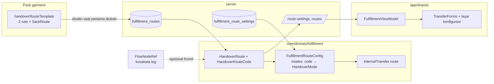

# TRD-FLOW-003: Rute Serah Terima Karung sebagai Data per Tenant

## 1. Document Context and Administration

- **Title & Unique ID**: TRD-FLOW-003 — Rute Serah Terima Karung sebagai Data per Tenant
- **Status**: Draf untuk ditinjau (belum ada kode)
- **Revision History**:

| Versi | Tanggal | Penulis | Catatan |
|---|---|---|---|
| 0.1 | 2026-10-08 | Claude (draf) + Achmad Jamaludin | Dari Discovery Note rute serah terima; satu koreksi atas saran awal (lihat §4.5, keputusan D2) |

- **Summary & Business Context**:
  `SackRoute` adalah enum dengan dua nilai khas rajut (`QC_RAJUT_TO_FINISHING`,
  `FINISHING_TO_QC_FINISHING`). Mode serah terima per rute (`HandoverMode`) sudah per tenant
  (`FulfillmentRouteConfig`, V61), tetapi **daftar rutenya** masih kode. Akibatnya tenant bordir
  atau sablon tidak bisa punya rute sendiri tanpa mengubah kode, dan kode mesin menyebut konsep
  satu industri (melanggar CLAUDE.md §1 butir 4 dan `tenant-variability-rules.md` Kontrak 1).
  Dokumen ini memindahkan **daftar rute** menjadi data per tenant dengan template bawaan pack
  `garment`, memakai Strangler Fig (Kontrak 8) dengan paritas penuh untuk tenant konveksi.
- **Rujukan**: `teaching-dua-mode-serah-terima-per-rute.md`, V58 (`leg_key`), V61, TRD-FLOW-001,
  TRD-FLOW-002, `PLAN-handover-routes-as-data.md`.
- **Stakeholders & Approvers**: Product (pemilik alur Fulfillment), Tech Lead (keputusan D1–D5),
  QA (test paritas dan tenant kedua), pengembang track A/B/C.

### Discovery Note (ringkas)
- **Siapa memakai**: admin pabrik (menyetel rute/mode), operator meja dan admin produksi (memakai
  perjalanan karung). **Data milik**: tenant. **Berubah kapan**: sekali saat onboarding, lalu jarang;
  perjalanan yang sudah berangkat membeku (`handover_mode`, V61).
- **Fitur serupa**: sudah ada → **extend** (`FulfillmentRouteConfig`, V61, `FlowLegDerivation`).
  Ini migrasi enum menjadi data, bukan fitur paralel.
- **Jenis**: **fitur dalam modul `FULFILLMENT`** (`module-integration-rules.md` §5.4), bukan modul baru.
  Tidak ada entri `BusinessModule`, `ModuleArchetype`, backfill entitlement, maupun kuota baru.
  Alasannya: tidak ada tenant yang membeli atau mematikan "rute serah terima" terpisah dari
  Packing & Surat Jalan; memisahkannya memecah kuota dan RBAC.
- **Governance**: gate modul `FULFILLMENT`, `ScopeCapability.GLOBAL_ONLY`, entitlement ikut modul induk.

| Operasi | Level minimum | Peran yang ditolak (dites 403) |
|---|---|---|
| Lihat konfigurasi rute | konteks tenant (perilaku sekarang; VIEW = usulan, lihat §4.6) | peran tanpa akses modul bila VIEW diberlakukan |
| Ubah daftar rute / mode rute | MANAGE `FULFILLMENT` | operator, peran tanpa wewenang, keputusan RBAC tak terhitung (fail-closed) |
| Ajukan / terima karung | OPERATE `FULFILLMENT` | peran tanpa akses modul |

### Goals (In-Scope)
1. Value object `HandoverRouteCode` dan entitas `HandoverRoute` (data per tenant).
2. Template rute bawaan pack `garment` yang **identik** dengan `SackRoute` hari ini.
3. `FulfillmentRouteConfig` memetakan **kode rute → mode**, bukan enum → mode.
4. Persistensi daftar rute per tenant (migrasi aditif V96) dan CRUD fail-closed.
5. Perjalanan karung (`InternalTransfer`) menyimpan kode rute; rute yang kemudian dihapus tidak
   merusak riwayat.
6. UI formulir dan layar konfigurasi dibangun dari data rute, bukan `SackRoute.entries`.
7. Test paritas yang mengiterasi `SackRoute.entries` dan test tenant kedua (`bordir-uji`).
8. Menutup fallback senyap `InternalTransferCodec` (`?: SackRoute.QC_RAJUT_TO_FINISHING`).

### Non-Goals (Out-of-Scope)
- Menyatukan agregat `InternalTransfer` (karung, kg) dan `SuratJalanManifest` (dokumen, pcs).
  Pemisahan itu sengaja dan sudah tertulis di KDoc keduanya.
- Mode serah terima baru. `HandoverMode` tetap enum sistem (menentukan invarian bukti).
- Penurunan rute otomatis dari leg alur. Ditolak di D2.
- **Jalur narasi/builder** (operasi pada spec yang menghasilkan rute). `SpecOp` beroperasi pada
  `PrototypeSpec` (entitas dan layar), sedangkan rute adalah konfigurasi tenant; titik sambungnya
  belum diverifikasi. Ditangani TRD terpisah setelah Tahap S3. TRD ini hanya menjamin bahwa
  parser dan validasi rute **tunggal dan bisa dipanggil pihak lain** (§4.2).
- Telemetri node kanvas untuk fitur ini.

## 2. Functional Requirements

### FR-1 Daftar rute per tenant
- Satu tenant punya 0..N `HandoverRoute`. Tiap rute: `code`, `label`, `from`/`to` opsional
  (`FlowNodeRef`, kosakata yang sama dengan leg), `sortOrder`, `active`.
- `code` unik per tenant, huruf besar/angka/underscore, maks 40 karakter (selebar kolom
  `fulfillment_route_settings.route` yang ada).
- Rute **tidak pernah dihapus keras** bila pernah dipakai perjalanan; hanya `active = false`.

### FR-2 Template dan salinan (Kontrak 5)
- Pack menyediakan `handoverRouteTemplate: List<HandoverRoute>`. Default kosong; pack `garment`
  mengisi dua rute lama dengan kode **persis** nama enum.
- Tenant tanpa baris rute memakai template pack secara **efektif tanpa menyimpan apa pun**
  (paritas, tidak ada seed diam-diam, selaras V61 §4). Salinan baru disimpan saat admin pertama
  kali mengubah daftar.
- KDoc wajib menyatakan: mengubah template pack **tidak** sampai ke tenant yang sudah punya
  salinan; mengubah salinan tenant **tidak** mengubah perjalanan yang sudah berangkat.

### FR-3 Mode per rute
- `FulfillmentRouteConfig.modes: Map<HandoverRouteCode, HandoverMode>`.
- `modeFor(code)`: entri ada → nilainya; **kode dikenal tapi tanpa entri** → `ADMIN_HUB`
  (perilaku tenant lama); **kode tidak dikenal oleh tenant** → `error`, bukan `ADMIN_HUB`.
- `hasAdminHubRoute` dan `routesAccepting` beroperasi atas rute **aktif** tenant.

### FR-4 Perjalanan karung
- `InternalTransfer.leg: SackRoute` menjadi `route: HandoverRouteCode`.
- Snapshot mode per baris (`handover_mode`, V61) tidak berubah. Label rute **tidak** di-snapshot;
  rute nonaktif tetap bisa dibaca karena barisnya tidak dihapus.
- Dekode kode yang tak dikenal tenant **ditolak** dengan pesan; tidak jatuh ke rute lain
  (menutup `InternalTransferCodec.kt:70`).

### FR-5 API
- `GET /api/tenant/fulfillment/route-settings` — daftar rute efektif + mode efektif + `isExplicit`.
- `PUT /api/tenant/fulfillment/route-settings` — ubah mode per kode; MANAGE; fail-closed.
- `GET/PUT /api/tenant/fulfillment/routes` — baca/ubah daftar rute; MANAGE; fail-closed.
- Payload tidak pernah membawa `tenantId`; diambil dari sesi.

### FR-6 UI
- Chip rute di `TransferForms` dan layar konfigurasi dirender dari daftar rute yang dikirim server.
- Tidak ada `when (SackRoute)` maupun `SackRoute.entries` di `presentation/**`.
- Tenant tanpa rute melihat keadaan kosong yang menjelaskan cara menambah rute (bukan layar rusak).

### FR-7 Strangler Fig (Kontrak 8)
- Selama S0–S2 `SackRoute` hidup berdampingan; jembatan `SackRoute.toRouteCode()` satu arah.
- Selesai bila pemindai "pembacaan `SackRoute` yang bisa melempar" kosong di semua lapisan (S3).

### State machine
`SackTransferStatus` tidak berubah. Tidak ada status baru.

## 3. Non-Functional Requirements (NFRs)

| Category | Requirement & Target Metrics | Rationale / Mitigation |
| :--- | :--- | :--- |
| **Performance** | `GET route-settings` ≤ 1 query tambahan (daftar rute + mode di-join per tenant); daftar rute ≤ 50 baris per tenant | Layar kerja memanggilnya tiap buka; rute jumlahnya kecil |
| **Scalability** | Tidak ada tabel yang tumbuh per transaksi; hanya per tenant × rute | Rute adalah konfigurasi, bukan transaksi |
| **Security** | Tulis = MANAGE `FULFILLMENT`, fail-closed bila keputusan RBAC tak terhitung; `tenantId` dari sesi; RLS pada tabel baru; test 403 wajib | Kontrak 7. Siapa pun yang menulis rute/mode bisa mematikan gerbang ACC |
| **Availability & Reliability** | Migrasi aditif dan idempoten; tenant tanpa baris berperilaku persis seperti kemarin; tanpa fallback senyap untuk kode tak dikenal | Kontrak 4; pelajaran SPK bordir dibaca ulang sebagai `NEW_INTAKE` |
| **Maintainability & Observability** | Satu parser `HandoverRouteCode`; tiap PR memindahkan satu paket; log `WARN` saat kode rute tak dikenal ditolak | Pemindai Strangler Fig dapat dijalankan per lapisan |

## 4. System Architecture & Technical Design

### 4.1 High-Level Architecture



`transfer/` (leg, `SuratJalanManifest`) tidak berubah perilakunya. Satu-satunya titik temu adalah
kosakata `FlowNodeRef` pada `from`/`to` opsional.

#### Pemetaan modul

| Yang terlibat | Jenis | Peran |
|---|---|---|
| **`FULFILLMENT`** | Modul operasional, `GLOBAL_ONLY` | **Diubah.** Tuan rumah rute, mode, perjalanan karung; `/api/tenant/fulfillment/*`; tabel `fulfillment_*` |
| **`FACTORY_FLOW`** | Modul governance | **Dirujuk, tidak diubah.** `RouteOwnership` memetakan `/api/tenant/locations` dan `/api/tenant/pipeline` ke modul ini; sumber simpul alur (`FlowNodeRef`) dan pemetaan lokasi untuk `from`/`to` |
| Paket `transfer/` (leg, Surat Jalan) | Paket domain, bukan modul | Tidak diubah; hanya berbagi kosakata `FlowNodeRef` |
| Domain Pack `garment` | Platform, bukan modul | Menambah `handoverRouteTemplate`; dilayani `/api/tenant/pack` (Platform) |
| `QUALITY_CONTROL` dan modul lain | Modul operasional | Tidak terlibat secara kode; "QC Rajut" hanya label di template |

Matriks RBAC, entitlement, dan kuota hanya menyentuh `FULFILLMENT`.

#### Alur data

Konfigurasi (admin pabrik, jarang berubah):
```
Domain Pack garment ── template 2 rute ──► (dipakai efektif bila tenant tanpa baris; disalin saat pertama diubah)
        │
        ▼
MODUL FULFILLMENT ◄── from/to opsional ── MODUL FACTORY_FLOW (simpul alur, pemetaan simpul → gedung)
  fulfillment_routes (daftar rute, V96)               │ (tidak diubah)
  fulfillment_route_settings (kode rute → mode)       ▼
  PUT /routes, PUT /route-settings (MANAGE, 403)   paket transfer/: leg hanya bila gedungnya berbeda
```

Operasional (operator, tiap serah terima):
```
Operator ► layar Fulfillment ► GET /route-settings (rute aktif + mode efektif) ► pilih rute
   ├─ DIRECT    : kartu bundel (TALLIED) + foto + nama penerima
   └─ ADMIN_HUB : karung ditutup ► timbang + foto ► ajukan ► admin ACC ► DIANTAR
        ▼
   diterima di tujuan ► InternalTransfer menyimpan kode rute + handover_mode (beku per baris)
        ▼ (hanya multi-gedung dan leg ada)
   Surat Jalan per-leg (transfer/) mengumpulkan karung ber-ACC sebagai item, dikaitkan lewat legKey
```

#### Kenapa rute tidak diturunkan dari leg (D2): dua pabrik, alur sama

Alur: Rajut → Linking → QC Rajut → Finishing → QC Finishing.

- **Pabrik A, satu atap.** Semua simpul berujung `Gedung Utama`. `FlowLegDerivation` hanya membuat leg
  saat ujungnya berganti, jadi **leg = 0** (perpindahan antar meja di satu gedung sengaja tidak
  menjadi leg; sudah tercatat sebagai `WorkDeposit`). Operator mengantar sendiri (`DIRECT`). Bila
  rute wajib diturunkan dari leg, pabrik ini **tidak punya rute sama sekali**, padahal ini profil
  pengguna `DIRECT`.
- **Pabrik B, dua gedung** (Rajut dan QC Rajut di Gedung 1; Finishing di Gedung 2). Ada **1 leg**
  `Gedung 1 → Gedung 2`; rute punya leg untuk ditempeli.

Dengan D2 pabrik A tetap punya rute `QC_RAJUT_TO_FINISHING` (dengan `from`/`to` menunjuk simpulnya,
tanpa leg), dan pabrik B memakai rute yang sama, `from`/`to`-nya dapat dicocokkan ke leg bila perlu.
Masalah kedua: karung sudah ada **sebelum** Surat Jalan terbit, sedangkan `legKey` baru berpasangan
dengan SJ setelah terbit.

#### Default satu atap dan bahan narasi multi-gedung

`TenantLocationConfig` bawaannya `isMultiSiteEnabled = false` dan `nodeLocations` kosong; simpul tanpa
pemetaan transparan (tidak melahirkan leg). Jadi tenant baru **dianggap satu atap**; rute karung tetap
ada, hanya leg yang kosong. Untuk multi-gedung, yang harus diketahui sistem (dan kelak dinarasikan):
1. daftar gedung (minimal 2; ada `require` di `TenantLocationConfig`);
2. simpul/stasiun mana berada di gedung mana (`nodeLocations`);
3. proses makloon cukup menyebut vendornya (ujung diturunkan dari `vendorRef`, bukan dari lokasi).

Leg diturunkan otomatis dari ketiganya; narasi tidak perlu menyebut "kirim dari A ke B". Jalur narasi →
konfigurasi (lokasi maupun rute) **belum diverifikasi** dan di luar scope TRD ini (§1 Non-Goals).

### 4.2 Detailed Component Design (core)

```kotlin
@JvmInline value class HandoverRouteCode(val value: String) {
    init { require(PATTERN.matches(value)) { "Kode rute tidak valid: '$value'" } }
    companion object {
        val PATTERN = Regex("^[A-Z][A-Z0-9_]{0,39}$")
        fun parse(raw: String?): Result<HandoverRouteCode>   // parser TUNGGAL; menolak, tidak fallback
    }
}

data class HandoverRoute(
    val code: HandoverRouteCode,
    val label: String,
    val from: FlowNodeRef? = null,
    val to: FlowNodeRef? = null,
    val sortOrder: Int = 0,
    val active: Boolean = true,
)

data class TenantHandoverRoutes(val tenantId: TenantId, val routes: List<HandoverRoute>) {
    fun find(code: HandoverRouteCode): HandoverRoute?
    val active: List<HandoverRoute>
}

fun SackRoute.toRouteCode(): HandoverRouteCode = HandoverRouteCode(name)   // jembatan S0–S2, dihapus di S3
```

- `FulfillmentRouteConfig` menerima `TenantHandoverRoutes` untuk validasi `modeFor`.
- Aturan domain memakai **peran**: `routesAccepting` tidak menyebut nama rute apa pun.
- File: tiap file di `core/` ≤ 250 baris. `InternalTransfer.kt` sudah 262 (di atas soft 250); perubahan
  ke file ini **tidak boleh menambah baris** (ratchet) — pecah aturan bukti ke file sendiri bila perlu.

### 4.3 Data Model & Schema (V96, aditif, idempoten)

```sql
CREATE TABLE IF NOT EXISTS fulfillment.fulfillment_routes (   -- schema modul, pola V76
    tenant_id    VARCHAR(64)  NOT NULL,
    code         VARCHAR(40)  NOT NULL,
    label        VARCHAR(120) NOT NULL,
    from_node    VARCHAR(120),                            -- FlowNodeRef.key, opsional
    to_node      VARCHAR(120),
    sort_order   INT          NOT NULL DEFAULT 0,
    active       BOOLEAN      NOT NULL DEFAULT TRUE,
    updated_at   TIMESTAMPTZ  NOT NULL DEFAULT NOW(),
    PRIMARY KEY (tenant_id, code),
    CONSTRAINT ck_fulfillment_route_code CHECK (code ~ '^[A-Z][A-Z0-9_]{0,39}$')
);
SELECT apply_tenant_rls_in('fulfillment', 'fulfillment_routes');
```

- **Tanpa seed.** Tenant tanpa baris memakai template pack (FR-2).
- `fulfillment_route_settings.route` dan `fulfillment_transfers.leg` **sudah `VARCHAR`**; nilai lama
  (`QC_RAJUT_TO_FINISHING`, dst.) sudah sah sebagai kode. **Tidak ada backfill nilai.**
- Tidak ada `CHECK` pada kolom `leg`/`route` yang membatasi nilai (terverifikasi di PR-0), jadi V96
  tidak melepas constraint apa pun.
- Daftarkan tabel baru di `ModuleSchemaMap` untuk `fulfillment` (dijaga `ModuleSchemaOwnershipTest`).

### 4.4 API Specifications

`GET /api/tenant/fulfillment/route-settings` → 200
```json
{ "tenantId": "…", "hasAdminHubRoute": true,
  "routes": [ { "route": "QC_RAJUT_TO_FINISHING", "routeLabel": "QC Rajut ke Finishing",
                "mode": "ADMIN_HUB", "modeLabel": "Lewat Meja Admin",
                "isExplicit": false, "active": true, "sortOrder": 0 } ] }
```
Kontrak ini **kompatibel mundur** dengan `FulfillmentRouteConfigCodec` sekarang (kunci `route`,
`routeLabel`, `mode`, `modeLabel`, `isExplicit`); hanya menambah `active`/`sortOrder`. Itu yang
memungkinkan track C berjalan paralel (lihat PLAN).

`PUT …/route-settings` body `{ "routes": [ { "route": "CODE", "mode": "DIRECT" } ] }`:
- 400 bila `route` tidak dikenal tenant, atau `mode` bukan nilai `HandoverMode` (tidak ada
  pengabaian baris tak dikenal seperti `mapNotNull` hari ini).
- 403 bila bukan MANAGE; 403 bila keputusan RBAC tak terhitung.

`GET/PUT …/routes` body `{ "routes": [ { "code", "label", "from"?, "to"?, "sortOrder", "active" } ] }`:
- 400 pada kode duplikat/tidak valid; 409 bila mencoba menghapus (bukan menonaktifkan) rute yang
  pernah dipakai perjalanan.

### 4.5 Keputusan Desain dan Tradeoff

| # | Keputusan | Alasan | Alternatif ditolak |
|---|---|---|---|
| **D1** | Kunci rute = `HandoverRouteCode` string yang **disimpan**, bukan enum | Uji Variabilitas: beda per tenant/industri/admin | Tetap enum: melanggar Kontrak 1 |
| **D2** | Rute adalah **data sendiri**, bukan diturunkan dari `FlowTransferLeg`. `from`/`to` opsional memakai `FlowNodeRef` | Leg hanya lahir pada **pergantian ujung** (`FlowLegDerivation`): perpindahan antar meja di satu gedung **sengaja tidak** menghasilkan leg. Tenant satu atap (kasus umum konveksi kecil, justru yang memakai `DIRECT`) tidak punya leg sama sekali, jadi rute turunan leg tidak bisa menutupi QC→Finishing mereka. Karung juga sudah ada sebelum SJ terbit | Menurunkan dari leg (**koreksi atas saran saya sebelumnya**): kehilangan semua tenant satu atap |
| **D3** | Kode rute lama = nama enum (`QC_RAJUT_TO_FINISHING`) | Nilai tersimpan tidak perlu diubah → paritas tanpa backfill | Kode baru + backfill: risiko dan tanpa manfaat |
| **D4** | Tenant tanpa baris → template pack, tanpa menyimpan | V61 §4: tanpa seed diam-diam; paritas | Seed saat migrasi: mengubah tenant berjalan |
| **D5** | `HandoverMode` tetap enum | Konsep sistem; menentukan invarian bukti di `InternalTransfer` | Mode sebagai data: aturan domain jadi tabel |

### 4.6 Assumptions, Constraints, & Dependencies
- Asumsi: `FlowNodeRef.key` stabil dan dapat disimpan (dipakai `legKey` sekarang).
- Konstrain: file-size (CLAUDE.md §14). `TransferForms.kt` 392 baris (soft 400) — **dipecah dulu**
  sebelum diubah. `FulfillmentTransferRoutes.kt` 365 (soft 300 server) — endpoint rute baru masuk
  `FulfillmentRouteRoutes.kt`, route lama dicicil keluar bukan ditambah.
- Dependensi: `DomainPack` (tambah `handoverRouteTemplate`); `RouteOwnership` sudah memiliki
  `/api/tenant/fulfillment` → modul `FULFILLMENT`.
- **Terjawab di PR-0 (2026-10-08):**
  (a) **Gerbang** tidak memakai `requireModuleAccess` per route; tiap handler `FulfillmentTransferRoutes`
  memanggil `hasFulfillmentAccess(minimum)` (OPERATE untuk aksi kerja, MANAGE untuk ACC/tolak/ubah
  konfigurasi). `GET /route-settings` **hanya mensyaratkan konteks tenant** (sengaja: layar kerja
  butuh bentuk formulir sebelum operator mengisi apa pun), jadi VIEW **bukan** syarat baca yang ada
  hari ini; tabel governance di §1 mencantumkan VIEW sebagai target dan itu **perubahan perilaku**
  yang harus diputuskan eksplisit di Track B (default: pertahankan perilaku sekarang, paritas).
  Catatan: `hasFulfillmentAccess` juga meloloskan MANAGE bagi peran dengan
  `Permission.APPROVE_COSTING`; endpoint rute baru mewarisi aturan itu, tidak mengubahnya.
  (b) **Tidak ada `CHECK`** pada `fulfillment_transfers.leg` (`VARCHAR(40) NOT NULL`), dan
  `fulfillment_route_settings.route` (`VARCHAR(40)`) hanya punya `CHECK` pada `handover_mode`. V96
  tidak perlu melepas constraint apa pun.
  (c) Tabel fulfillment sudah di schema **`fulfillment`** sejak V76 (`ALTER TABLE … SET SCHEMA`),
  nama tabel tetap berprefiks. V96 membuat `fulfillment.fulfillment_routes`, memakai
  `apply_tenant_rls_in('fulfillment', 'fulfillment_routes')`, grant dan `ALTER DEFAULT PRIVILEGES`
  untuk `wemade_app` mengikuti pola V76, dan mendaftarkannya di `ModuleSchemaMap`.
- **Masih belum diverifikasi:** (d) apakah use case Surat Jalan benar-benar mengumpulkan karung ber-ACC
  sebagai item (sejauh ini hanya terbaca di KDoc `SuratJalanManifest`); (e) modul penjaga
  `SuratJalanRoutes` (prefiksnya tidak ada di `RouteOwnership.moduleRoutes`, mungkin lewat
  `ModuleFeatureRegistry`) — relevan hanya bila Surat Jalan kelak ikut disentuh.

## 5. Testing, Deployment, and Operations

### Acceptance Criteria
1. **Paritas**: test mengiterasi `SackRoute.entries`; tiap entri punya `HandoverRoute` di template
   `garment` dengan `code == name` dan `label == displayName`. Entri baru tanpa padanan → gagal.
2. **Perilaku identik**: untuk tenant konveksi tanpa baris, `modeFor`, `hasAdminHubRoute`,
   `routesAccepting`, dan JSON `route-settings` identik byte-per-field dengan sebelum migrasi
   (selain kunci tambahan `active`, `sortOrder`).
3. **Tenant kedua**: fixture `bordir-uji` dengan rute sendiri (mis. `DIGITIZING_TO_HOOPING`) lolos
   siklus ajukan → ACC → terima, dan `DIRECT` pada rute itu tidak menuntut timbang/foto.
4. **Tanpa fallback senyap**: kode tak dikenal pada dekode `InternalTransfer`, `PUT route-settings`,
   dan `PUT routes` ditolak dengan pesan; tidak ada yang jatuh ke `QC_RAJUT_TO_FINISHING`/`ADMIN_HUB`.
5. **Fail-closed**: peran tanpa MANAGE → 403 pada kedua `PUT`; keputusan RBAC tak terhitung → 403;
   peran berwenang → 200.
6. **Riwayat awet**: perjalanan pada rute yang kemudian dinonaktifkan tetap terbaca dan tampil.
7. **S3 selesai**: `grep -rn "SackRoute" core server app` (di luar test paritas bila dipertahankan)
   kosong; jembatan `toRouteCode()` terhapus.
8. `scripts/audit-variability.sh` tidak menambah temuan; tidak ada `when (enum)` baru di `presentation/**`.

### Testing Strategy
- **core (commonTest)**: unit murni — VO parser, template paritas, `FulfillmentRouteConfig`
  dengan template non-default, invarian `InternalTransfer` pada rute data.
- **server**: test route + test gerbang (403/200) mengikuti `RouteGateTest`; integrasi repository
  dengan Postgres nyata; migrasi dicoba di dev dalam `BEGIN … ROLLBACK`.
- **app/shared**: test ViewModel dengan API palsu yang mengembalikan rute non-garment.
- **Visual**: tenant `wemade-demo` (rajut) dan `bordir-uji`, lebar ~1280dp; login lewat tombol
  "Demo Mode: Masuk Cepat (Superadmin Apps)".
- Kompilasi: `./gradlew :core:compileKotlinJvm :core:compileKotlinJs :core:compileKotlinWasmJs
  :app:shared:compileKotlinJvm :app:shared:compileKotlinJs :app:shared:compileKotlinWasmJs
  :server:compileKotlin :server:compileTestKotlin`, ditambah test `core`, `app:shared`, server
  relevan dengan **bukti kesegaran**.

### Monitoring & Error Handling
- Penolakan kode tak dikenal dicatat `WARN` dengan `tenantId` dan kode (tanpa payload mentah).
- Layar kerja menampilkan rute nonaktif pada perjalanan lama sebagai "(nonaktif)", bukan menyembunyikan.

### Deployment & Rollback Plan
1. Urutan merge: A (core) → B (server + V96) → C (client) → S3 (pembersihan). Tiap tahap lulus
   test paritas sebelum tahap berikutnya.
2. V96 aditif; rollback aplikasi aman karena tabel baru tidak dibaca kode lama dan kolom lama
   tidak berubah. Rollback V96 = `DROP TABLE fulfillment_routes` (tidak ada data lain bergantung).
3. S3 (hapus `SackRoute`) tidak dapat di-rollback tanpa revert kode; dijalankan hanya setelah
   pemindai kosong dan dua rilis tanpa kejadian `WARN` kode tak dikenal.
4. Setelah mengubah rules/skill apa pun: `scripts/sync-agent-config.sh`. Setelah mengubah kode:
   `graphify update .`. Dokumentasi pasca-fitur: skill `teaching`.
