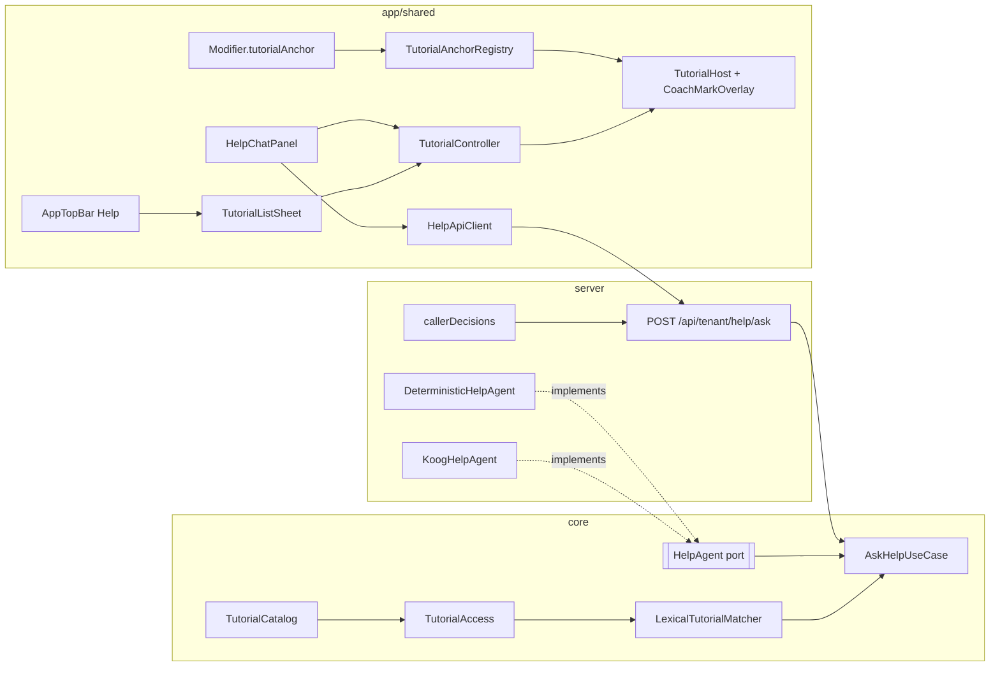

# TRD-HELP-001: Tutorial Modul (Coach Mark) + AI Help Agent

## 0. Discovery Note

**Tanggal**: 2026-09-30 · **Penulis**: Achmad Jamaludin (dibantu Claude)

### 0.1 Kebutuhan
- **Siapa memakai**: semua pengguna tenant, yaitu staf modul, admin pabrik, dan (khusus Builder) pemegang `MANAGE_BUILDER`.
- **Data milik siapa**: platform/pack. Isi tutorial ditulis developer dan dirilis bersama kode, bukan data tenant.
- **Kapan berubah**: per rilis, saat UI modul berubah atau saat modul baru dipasangi anchor.

### 0.2 Fitur serupa
- Perintah: `scripts/find-similar-feature.sh tutorial panduan bantuan help coachmark` → **tidak ada temuan**.
- Pola yang ditiru:
  - Katalog pack: `core/.../domain/pack/GarmentModules.kt`
  - Agent + fallback: `server/.../infrastructure/discovery/DiscoveryAgents.kt`, `KoogDiscoveryAgent.kt`
  - Usul-lalu-terapkan: Builder Chat M1 (`domain/builder/BuilderChatUseCases.kt`)
- Keputusan: **Baru**, dengan meniru pola di atas.

### 0.3 Jenis
**Fitur lintas modul, bukan `BusinessModule`.**
- Tutorial tidak dijual dan tidak dihitung kuota.
- Setiap tutorial mewarisi RBAC dan entitlement dari modul atau layar yang dituju.
- Karena itu tidak ada entri `BusinessModule`, migrasi entitlement, atau node di kanvas.

### 0.4 Uji Variabilitas
| Konsep | Tenant? | Industri? | Admin ubah? | Kode/Data | Template & titik beku |
|---|---|---|---|---|---|
| Isi tutorial (judul, langkah, kata kunci) | Tidak | **Ya** | Tidak (keputusan 2026-09-30) | **Data per DomainPack** | Tidak disalin ke tenant dan tidak dibekukan: dibaca langsung dari rilis |
| Tutorial modul bersama (`org_chart`, `dynamic_rbac`, `factory_flow`) | Tidak | Tidak | Tidak | Data platform (`PlatformTutorials`) | Sama dengan baris di atas |
| `TutorialScope` (Module / Surface) | Tidak | Tidak | Tidak | Kode (konsep sistem) | — |
| `CalloutPlacement` (TOP/BOTTOM/START/END/CENTER) | Tidak | Tidak | Tidak | Kode (konsep teknis UI) | — |
| `TutorialAnchorId` | Tidak | Tidak | Tidak | Value object string; konstanta di `TutorialAnchorIds` | — |

Konsekuensinya: pack dari DB (bukan pack bawaan) belum punya tutorial dan hanya mendapat tutorial platform. Ini dicatat sebagai batasan, lihat Non-Goals.

### 0.5 Core & extend
- **Core**: `core/.../domain/tutorial/` (model, katalog, akses, pencocok) dan `core/.../domain/help/` (port agent, use case).
- **Titik extend**:
  - Implementasi `TutorialSource` per pack.
  - `TutorialAnchorIds` per modul.
  - `HelpAgent` (deterministik / Koog).
- **Jangan disentuh tanpa Ratchet**:
  - `App.kt` (576, hard limit 600)
  - `server/Application.kt` (697)
  - `CostingWorkspaceScreen.kt` (825)
- **Tidak disentuh**:
  - `ModuleDefinition`, karena modul bersama wajib identik antar-pack.
  - `DomainPackCodec`, karena belum ada serialisasi tutorial.

### 0.6 I/O & kanvas
Tidak ada port, tidak ada node kanvas, tidak ada telemetri.

### 0.7 Governance
| Operasi | Level minimum | Ditolak (dites) |
|---|---|---|
| Melihat tutorial `Module(m)` | `AccessDecision(m).config.level ≥ tutorial.requiredLevel` (default VIEW) | Peran dengan `NONE` pada `m`; modul yang tidak di-entitle |
| Melihat tutorial `Surface(builder)` | `Permission.MANAGE_BUILDER` atau superadmin | Staf biasa tanpa izin |
| `POST /api/tenant/help/ask` (read-only) | Principal + tenant | Tanpa login → 401; tanpa akses modul → kandidat modul itu tidak pernah muncul |

- **Gate**: filter per tutorial di use case.
- **ScopeCapability**: tidak berlaku.
- **Entitlement**: ikut modul.
- **Migrasi DB**: tidak ada.

### 0.8 Ukuran
Agregat baru: `ModuleTutorial`. Tidak ada migrasi. Karena ada 4 fase dan 3 lapisan, **TRD perlu** (dokumen ini).

---

## 1. Document Context and Administration

- **Title & Unique ID**: TRD-HELP-001, Tutorial Modul (Coach Mark) + AI Help Agent
- **Revision History**:

| Versi | Tanggal | Penulis | Catatan |
|---|---|---|---|
| 0.1 | 2026-09-30 | Achmad Jamaludin / Claude | Draf awal dari rencana dan Discovery Note |
| 0.2 | 2026-09-30 | Achmad Jamaludin / Claude | Fase 1 (katalog + coach mark, pilot CRM) dan Fase 2 (pencocok leksikal, `POST /api/tenant/help/ask`, `HelpApiClient`) selesai |
| 0.3 | 2026-09-30 | Achmad Jamaludin / Claude | Fase 3: `KoogHelpAgent` (DeepSeek), `HELP_AGENT`/`HELP_AGENT_MODEL`, live evals 3/3 PASS |
| 0.4 | 2026-09-30 | Achmad Jamaludin / Claude | Fase 4: jendela Bantuan (tab Panduan / Tanya AI), `HelpChatViewModel`, saran AI → coach mark; pencocok membuang kandidat < ½ skor teratas |

- **Summary & Business Context**:
  - Pengguna baru kesulitan memakai modul (CRM, Sampling, Costing, dan lainnya), dan saat ini tidak ada panduan di dalam aplikasi sama sekali.
  - Fitur ini menambahkan tutorial per modul berupa **coach mark interaktif** yang menyorot elemen UI asli.
  - Tutorial itu dihubungkan ke **AI chat helper**: dari pertanyaan bebas pengguna, AI memilih tutorial dan langkah yang relevan, lalu bisa langsung menjalankannya.
- **Stakeholders**:
  - Product: Achmad Jamaludin
  - Tech Lead: tim platform
  - QA: verifikasi visual di `wemade-demo` dan `bordir-uji`
- **Goals (In-Scope)**:
  1. Model `ModuleTutorial` sebagai data per DomainPack plus tutorial platform (Fase 1).
  2. Coach mark: `Modifier.tutorialAnchor`, `TutorialController`, overlay spotlight, dan daftar tutorial dari tombol Help (Fase 1).
  3. Pencocok leksikal deterministik + `POST /api/tenant/help/ask` dengan filter RBAC (Fase 2).
  4. `KoogHelpAgent` (DeepSeek) dengan anti-halusinasi dan fallback deterministik (Fase 3).
  5. Panel chat helper dengan tombol "Mulai tutorial" (Fase 4).
- **Non-Goals (Out-of-Scope)**:
  - Tutorial yang bisa diedit admin tenant, atau tutorial untuk pack dari DB.
  - AI yang menulis data. Fase 5 hanya prefill form dan akan punya TRD sendiri.
  - Tutorial Builder (Fase 6, setelah UI Builder stabil).
  - Riwayat chat persisten, streaming, dan retrieval berbasis vektor.

## 2. Functional Requirements

**FR-1 Katalog.** `TutorialCatalog.forPack(packCode)` mengembalikan tutorial platform ditambah tutorial pack itu. Setiap tutorial memenuhi invarian berikut:
- `id` unik.
- Minimal 1 langkah.
- `Module(m)` dengan `m` ada di pack.
- `step.screen` (bila diisi) ada di pack.
- `step.anchor` (bila diisi) terdaftar di `TutorialAnchorIds.all`.

**FR-2 Akses.** `TutorialAccess.accessible(tutorials, decisions, allowedSurfaces)`:
- Tutorial `Module(m)` lolos hanya bila `decisions[m]?.config?.level?.isAtLeast(requiredLevel) == true`. Bila keputusan tidak ada, tutorial ditolak.
- Tutorial `Surface(s)` lolos hanya bila `s ∈ allowedSurfaces`.

**FR-3 Menjalankan tutorial.** `TutorialController` memiliki state machine berikut:
```
Idle ─start(id, step)→ Navigating ─anchor siap / timeout 1,5 s→ Showing(step)
Showing ─next→ Navigating(step+1) | Finished (langkah terakhir)
Showing ─back→ Navigating(step-1) (tidak di bawah 0)
Showing/Navigating ─dismiss→ Idle
```
- Bila `step.screen` berbeda dengan layar aktif, controller navigasi dulu ke `/m/{code}` atau ke `AppNavScreen` terkait.
- Bila anchor tidak muncul sebelum timeout, callout tetap tampil di tengah (`CENTER`) tanpa spotlight.

**FR-4 Tombol Help.** `AppTopBar` menampilkan ikon Help yang membuka `TutorialListSheet`. Isinya tutorial yang bisa diakses untuk modul atau layar aktif; bila modul aktif tidak punya tutorial, sheet menampilkan semua tutorial yang bisa diakses.

**FR-5 Pencocokan.** `LexicalTutorialMatcher.rank(question, candidates, currentModule)` mengembalikan maksimal 5 `TutorialMatch(tutorialId, stepIndex?, score)` dengan `score > 0`, urut menurun.
- Tokenisasi: lowercase, buang tanda baca dan stopword Indonesia.
- Bobot:

| Sumber | Bobot |
|---|---|
| `sampleQuestions` | 3 |
| `keywords` | 3 |
| judul | 2 |
| summary | 1 |
| judul langkah | 1 |

- Tutorial modul aktif mendapat bonus +1.

**FR-6 Tanya.** `AskHelpUseCase(question, currentModule, decisions, allowedSurfaces)` berjalan dengan urutan:
1. Validasi panjang pertanyaan: 1–500 karakter.
2. Filter akses (FR-2).
3. Ambil top‑5 dari matcher.
4. Panggil `HelpAgent.answer`.
5. Validasi `tutorialId` ∈ kandidat dan `stepIndex` ada di rentang langkah. Bila tidak valid, pakai kandidat teratas dan langkah 0.

Bila tidak ada kandidat, balas dengan jawaban "tidak menemukan tutorial" tanpa saran.

**FR-7 Chat.** `HelpChatPanel` mengirim pertanyaan bersama modul aktif. Jawaban asisten yang punya saran menampilkan tombol "Mulai tutorial", yang menutup panel lalu memanggil `TutorialController.start`.

## 3. Non-Functional Requirements

| Category | Requirement & Target Metrics | Rationale / Mitigation |
| :--- | :--- | :--- |
| **Performance** | Overlay 60 fps. Matcher < 5 ms untuk ≤ 200 tutorial. `/help/ask` p95 < 300 ms (deterministik) dan < 6 s (Koog). | Katalog kecil dan berada di memori, jadi tidak perlu vektor. LLM satu putaran tanpa tool. |
| **Scalability** | Katalog per pack dimuat sekali. Satu permintaan mengirim paling banyak 5 kandidat ke LLM. | Membatasi jumlah token dan biaya. |
| **Security** | RBAC difilter **sebelum** pencocokan, sehingga LLM tidak pernah melihat tutorial yang tidak boleh diakses. Pertanyaan diperlakukan sebagai data, bukan instruksi, dan dibatasi 500 karakter. Key tetap di env (`DEEPSEEK_API_KEY`). | Mencegah bocornya keberadaan modul yang tidak di-entitle, dan prompt injection yang meminta tutorial lain. |
| **Availability & Reliability** | Tanpa key atau saat LLM gagal, fallback ke `DeterministicHelpAgent`. Anchor yang hilang ditampilkan sebagai callout tengah. | Server dan UI tidak pernah buntu. |
| **Maintainability & Observability** | `agentRef` ada di respons. Anchor hanya lewat konstanta. Test invarian katalog menangkap anchor atau modul yang tidak valid. Batas ukuran file per lapisan dipatuhi. | Tutorial yang rusak ketahuan di CI, bukan di tangan user. |

## 4. System Architecture & Technical Design

### 4.1 High-Level



### 4.2 Komponen

**Core `domain/tutorial/`**

| File | Isi |
|---|---|
| `TutorialValueObjects.kt` | `TutorialId`, `TutorialAnchorId`, `SurfaceCode` (value class, pola `ModuleId`); `enum CalloutPlacement` |
| `TutorialScope.kt` | `sealed interface TutorialScope { Module(ModuleId); Surface(SurfaceCode) }` |
| `ModuleTutorial.kt` | `ModuleTutorial`, `TutorialStep` |
| `TutorialCatalog.kt` | `TutorialSource`, `TutorialCatalog` |
| `PlatformTutorials.kt` | Tutorial modul bersama |
| `TutorialAccess.kt` | Filter akses (FR-2) |
| `TutorialAnchorIds.kt` | Konstanta anchor |
| `TutorialMatcher.kt` | Port pencocok |
| `LexicalTutorialMatcher.kt` | Implementasi FR-5 |

**Core `domain/help/`**

| File | Isi |
|---|---|
| `HelpAgent.kt` | Port, `HelpQuestion`, `HelpAnswer` |
| `DeterministicHelpAgent.kt` | Jawaban dari summary kandidat teratas |
| `usecases/AskHelpUseCase.kt` | FR-6 |

**Pack**: `domain/pack/GarmentTutorials.kt`, dengan tanda `FILE-SIZE-EXEMPT` karena berupa seed data.

**Server**

| File | Isi |
|---|---|
| `routes/HelpRoutes.kt` | Endpoint `/help/ask` |
| `infrastructure/help/HelpAgents.kt` | Pemilihan agent dari env |
| `infrastructure/help/KoogHelpAgent.kt` | Agent LLM |
| `infrastructure/help/KoogHelpPrompt.kt` | Prompt |

**app/shared**

| Lokasi | File |
|---|---|
| `presentation/designsystem/` | `ClaySpotlightScrim.kt`, ikon `Help` di `ClayIcons` |
| `presentation/tutorial/` | `TutorialAnchor.kt`, `TutorialController.kt`, `TutorialHost.kt`, `CoachMarkOverlay.kt`, `CoachMarkCallout.kt`, `TutorialListSheet.kt` |
| `presentation/help/` | `HelpChatUiState.kt`, `HelpChatViewModel.kt`, `HelpChatPanel.kt`, `HelpMessageBubble.kt` |
| `infrastructure/api/` | `HelpApiClient.kt` |

### 4.3 Data Model

```kotlin
data class ModuleTutorial(
    val id: TutorialId,
    val scope: TutorialScope,
    val title: String,
    val summary: String,
    val sampleQuestions: List<String>,
    val keywords: List<String>,
    val requiredLevel: AccessLevel = AccessLevel.VIEW,
    val steps: List<TutorialStep>,
)
data class TutorialStep(
    val title: String,
    val body: String,
    val anchor: TutorialAnchorId? = null,
    val screen: ModuleId? = null,
    val placement: CalloutPlacement = CalloutPlacement.BOTTOM,
)
```
Tidak ada tabel DB.

### 4.4 API

`POST /api/tenant/help/ask`

Request:
```json
{ "question": "gimana cara bikin lead baru?", "currentModule": "crm_sales" }
```

Response 200:
```json
{ "answer": "…", "suggestion": { "tutorialId": "crm_new_lead", "stepIndex": 0, "title": "…", "module": "crm_sales" },
  "alternatives": [ { "tutorialId": "…", "title": "…", "module": "…" } ], "agentRef": "deterministic/help-v1" }
```

| Status | Kondisi |
|---|---|
| 400 | Pertanyaan kosong atau > 500 karakter |
| 401 | Tanpa principal |
| 404 | Tanpa konteks tenant |

Tanpa akses modul apa pun, respons tetap 200 dengan `suggestion = null`.

### 4.5 Tradeoff

| Pilihan | Alasan |
|---|---|
| Leksikal + LLM pilih-dari-kandidat, bukan embedding/pgvector | Katalog berisi puluhan item. Hasilnya deterministik, bisa dites, dan tanpa infrastruktur baru. |
| Koog + DeepSeek | Infrastruktur, fallback, dan fake executor sudah ada dari Discovery. |
| Coach mark dengan anchor konstanta, bukan pencarian semantik elemen | Tahan refactor karena anchor yang hilang ditangkap test, dan mudah degradasi dengan anggun. |
| Tutorial tidak disimpan di `DomainPack`/codec | Codec-nya ketat, dan tutorial bukan bagian kontrak pack yang dikunci. Bisa dipindah nanti lewat `TutorialSource`. |

### 4.6 Asumsi & Batasan
- Koordinat anchor diambil dari `boundsInRoot`, dan overlay harus berada di root yang sama (`TutorialHost` membungkus konten di `App.kt`).
- Elemen di dalam dialog atau popup berada di window lain, sehingga tidak bisa disorot. Langkah untuk elemen seperti itu memakai `CENTER` tanpa anchor.

## 5. Testing, Deployment, and Operations

**Acceptance Criteria**
1. Tutorial CRM berjalan end-to-end di `wemade-demo`: spotlight tepat, callout tidak keluar layar di lebar 1280dp, dan navigasi lintas layar berjalan.
2. Di `bordir-uji` (pack/modul berbeda) hanya tutorial yang sah yang tampil.
3. Peran tanpa akses Costing tidak pernah menerima tutorial Costing, baik dari sheet maupun dari `/help/ask`.
4. `HELP_AGENT=koog` dengan ID hasil halusinasi jatuh ke kandidat teratas.

**Testing Strategy**

| Lapisan | Test |
|---|---|
| `core/commonTest` | Invarian katalog, `TutorialAccess` (termasuk keputusan yang hilang), matcher (pertanyaan Indonesia), `AskHelpUseCase` (validasi ID, kandidat kosong), fixture pack non-garment |
| `app/shared/commonTest` | State machine `TutorialController`, `HelpChatViewModel` dengan fake client |
| `server/test` | Route 401 / 400 / filter RBAC; `KoogHelpAgentTest` dengan `ScriptedPromptExecutor`; `HelpAgentsTest` |
| Build | Kompilasi 5 target |
| Visual | Cek dengan mata lewat Playwright, login superadmin demo |

**Monitoring**: log `agentRef`, jumlah kandidat, dan fallback (tanpa isi pertanyaan) di level INFO.

**Deployment & Rollback**:
- Default `HELP_AGENT=deterministic`; LLM diaktifkan per lingkungan lewat env.
- Tidak ada migrasi, jadi rollback cukup dengan revert commit.
- Tiap fase di-merge terpisah.
