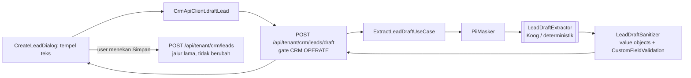

# TRD-HELP-002: AI Mengisi Form Lead CRM (Pilot Prefill)

> **Status: DIIMPLEMENTASI (pilot CRM).** K1 = B (samarkan), K2 = B (`created_via`), K3 = A (tombol di dialog), K4 = Teks/Angka/Pilihan — disetujui 2026-09-30.

## 0. Discovery Note

**Tanggal**: 2026-09-30 · **Penulis**: Achmad Jamaludin (dibantu Claude)

### 0.1 Kebutuhan
- **Siapa**: staf sales dengan akses CRM minimal *Input & Kerja* (OPERATE).
- **Masalah**: data calon pembeli datang sebagai teks bebas (chat WA, catatan pameran). Staf mengetik ulang ke 6 field form lead satu per satu.
- **Data milik**: tenant (lead CRM). Ini fitur pertama di platform yang mengirim **data pelanggan** ke LLM, dan karena itu menjadi keputusan utama di dokumen ini.
- **Berubah kapan**: per lead, sekali saat dibuat.

### 0.2 Fitur serupa
- `scripts/find-similar-feature.sh prefill isi otomatis draft` tidak menemukan fitur prefill form.
- Pola yang ditiru:
  - **Builder Chat M1** (`domain/builder/BuilderChatUseCases.kt`): agent hanya mengusulkan (`proposedDraft`), manusia yang menerapkan.
  - **AI helper** (TRD-HELP-001): Koog + DeepSeek, kill-switch env, fallback deterministik, `ScriptedPromptExecutor`.
- **Preseden yang berlawanan**: `docs/teaching/teaching-invoice-ai-automap-designer-and-crm-connect.md:329`. Auto-map invoice sengaja memakai heuristik Kotlin murni, **bukan LLM**, "agar data prospek tidak keluar dari pabrik". Fase ini harus menjawab preseden itu secara eksplisit (§0.9 K1).

### 0.3 Jenis
**Fitur di dalam modul CRM** (`crm_sales`). Bukan modul baru, jadi RBAC, entitlement, dan katalog ikut CRM (module-integration-rules §5.4). Tidak di kanvas, tanpa port.

### 0.4 Uji Variabilitas
| Konsep | Tenant? | Industri? | Admin ubah? | Kode/Data | Catatan |
|---|---|---|---|---|---|
| Field bawaan lead (brand, kontak, WA, email, kategori, pcs) | Tidak | Tidak | Tidak | Kode (sudah ada di `CrmLead`) | — |
| **Field kustom lead** | **Ya** | Ya | **Ya** | **Data** (`CustomFieldDefinition`, skema per tenant) | Prompt dibangun dari skema `GET /api/tenant/crm/leads/schema`, bukan daftar field tertulis di kode |
| Kategori produk | Ya | Ya | Ya | Data (teks bebas `ProductCategory`) | AI tidak boleh "menebak" dari daftar konveksi |
| Asal pembuatan lead (manual / AI) | Tidak | Tidak | Tidak | Kode (konsep sistem) | Lihat §0.9 K2 |

### 0.5 Core & extend
- **Core yang dipakai ulang**:
  - `CreateLeadUseCase` dan validasinya (`CrmLeadValueObjects`, `CustomFieldValidation.validateForCreate`)
  - `POST /api/tenant/crm/leads` (gate OPERATE, `requireReachableOwner`)
  - Semuanya **tidak diubah**. Penyimpanan tetap lewat jalur ini.
- **Baru**:
  - `domain/crm/prefill/`: `LeadDraft`, `LeadDraftExtractor` (port), `LeadDraftSanitizer`
  - Server: `KoogLeadDraftExtractor`, route draf
  - UI: kotak "Tempel teks, isi dengan AI" di `CreateLeadDialog`
- **Tidak disentuh**: `CrmRoutes.kt` (sudah besar, jadi route baru dibuat di file sendiri), audit log platform.

### 0.6 I/O & kanvas
Tidak ada port atau node kanvas. Masukan berupa teks bebas; keluaran berupa **draf** form lead yang tidak pernah disimpan server.

### 0.7 Governance
| Operasi | Level minimum | Ditolak (dites) |
|---|---|---|
| `POST /api/tenant/crm/leads/draft` (ekstraksi, tidak menyimpan) | CRM **OPERATE** (sama dengan membuat lead) | Tanpa login → 401; peran VIEW saja → 403; tanpa akses CRM → 403; tenant tanpa entitlement CRM → 403 |
| Menyimpan lead dari draf | Tidak berubah: `POST /api/tenant/crm/leads` (OPERATE) | Sudah dites di CRM |

Gate: `crmDecision` + `requireCrmAccess(OPERATE)` **sebelum** body dibaca (fail-closed). ScopeCapability tidak berubah. Entitlement ikut CRM.

### 0.8 Ukuran
Satu agregat kecil baru (`LeadDraft`, tidak disimpan). Migrasi hanya bila K2 = opsi B. Karena menyentuh 3 lapisan dan menambah alur data keluar baru, **TRD perlu**.

### 0.9 Keputusan yang dibutuhkan dari Anda (blok implementasi)

**K1 — Data pelanggan ke LLM.** Teks tempelan berisi nama, nomor WA, email, dan nama perusahaan pelanggan.

| Opsi | Isi | Konsekuensi |
|---|---|---|
| A. Kirim apa adanya | Paling akurat | Bertentangan dengan preseden auto-map invoice; data pelanggan tenant keluar ke DeepSeek |
| **B. Samarkan dulu (rekomendasi)** | Nomor telepon dan email diganti placeholder (`{TELP_1}`, `{EMAIL_1}`) **sebelum** dikirim, lalu dikembalikan lokal setelah jawaban tiba. Nomor dan email diekstrak dengan regex lokal, yang memang lebih andal daripada LLM untuk pola ini | Nama orang dan perusahaan tetap terkirim. Butuh keputusan bisnis bahwa itu dapat diterima |
| C. Tanpa LLM | Ekstraksi heuristik saja (regex + kata kunci) | Konsisten dengan preseden, tapi mutu rendah untuk nama, kategori, dan jumlah pcs dari kalimat bebas |

Apa pun pilihannya: fitur ini **mati secara default per tenant** (opt-in admin pabrik), dan isi teks **tidak pernah dicatat di log**.

**K2 — Penanda "diisi AI".** Audit log yang ada hanya untuk aksi platform, dan pembuatan lead saat ini tidak diaudit sama sekali.

| Opsi | Isi | Konsekuensi |
|---|---|---|
| A. Tanpa penanda | Lead dari draf AI tidak bisa dibedakan dari lead manual | Paling murah, tapi mutu AI tidak bisa diukur |
| **B. Kolom asal di lead (rekomendasi)** | `CrmLead.createdVia` = `MANUAL` / `AI_DRAFT`, migrasi aditif (default `MANUAL`) | Tampil di detail lead ("Dibuat dari draf AI oleh X"). Bisa dipakai mengukur berapa draf yang dikoreksi |
| C. Audit log tenant baru | Tabel audit per-tenant | Cakupannya jauh lebih besar dari fitur ini; sebaiknya proyek sendiri |

**K3 — Pintu masuk untuk pilot.**

| Opsi | Isi |
|---|---|
| **A. Tombol di dialog (rekomendasi untuk pilot)** | Di `CreateLeadDialog`: kotak "Tempel chat / catatan", lalu "Isi dengan AI". Field terisi, dan user bisa mengoreksi sebelum menekan Simpan |
| B. Dari chat Tanya AI | "catat lead PT Maju…" di chat membuka dialog yang sudah terisi. Butuh klasifikasi niat (bertanya vs meminta input). Disarankan sebagai **Fase 5b** setelah A terbukti |

**K4 — Field kustom tenant di pilot.** Dialog saat ini tidak punya input field kustom sama sekali. Rekomendasi: pilot hanya field bawaan plus field kustom bertipe TEXT, NUMBER, dan SINGLE_SELECT, dan dialog diberi input untuk ketiganya. DATE, CHECKBOX, dan USER_REF ditunda.

---

## 1. Document Context and Administration

- **ID**: TRD-HELP-002 · **Induk**: TRD-HELP-001 (Non-Goal "AI yang menulis data" menjadi fitur ini, dengan batas "AI tidak pernah menyimpan")

| Versi | Tanggal | Penulis | Catatan |
|---|---|---|---|
| 0.1 | 2026-09-30 | Achmad Jamaludin / Claude | Draf + Discovery; menunggu K1–K4 |
| 0.2 | 2026-09-30 | Achmad Jamaludin / Claude | Diimplementasi sesuai rekomendasi K1–K4; V84; log pustaka LLM/HTTP diturunkan ke INFO (temuan cek visual) |

- **Goals**:
  1. Dari teks bebas, hasilkan draf form lead (field bawaan + field kustom yang didukung) dalam < 6 detik.
  2. Draf divalidasi dengan aturan yang **sama** dengan form manual; field tidak sah dikosongkan dan diberi tanda, bukan disimpan.
  3. User selalu menjadi pihak yang menyimpan, lewat endpoint yang sudah ada.
- **Non-Goals**:
  - AI menyimpan atau mengubah lead yang sudah ada.
  - Form modul lain (vendor, invoice, stok, costing).
  - Membaca gambar atau tangkapan layar WA.
  - Mendeteksi lead ganda (dicatat untuk fase berikutnya).

## 2. Functional Requirements

- **FR-1 Draf**: `ExtractLeadDraftUseCase(text, schema, tenantSettings)` → `LeadDraft(core: fields?, custom: Map<CustomFieldId, value>, issues: List<DraftIssue>)`.
  - Teks 1–4000 karakter.
  - Fitur mati untuk tenant menghasilkan `FeatureDisabled`.
- **FR-2 Penyamaran (bila K1 = B)**: `PiiMasker` mengganti nomor telepon Indonesia dan email dengan placeholder. Pemetaannya hanya ada di memori request. Setelah jawaban tiba, placeholder dikembalikan ke nilai aslinya.
- **FR-3 Sanitasi**: setiap nilai draf dilewatkan ke value object atau validator yang ada (`WhatsappNumber`, `BrandName` ≤150, `ProductCategory` ≤100, `estimatedPcs ≥ 0`, `CustomFieldValidation`).
  - Nilai yang gagal: field dikosongkan dan `DraftIssue(field, alasan)` ditambahkan.
  - Field kustom yang tidak ada di skema atau sudah diarsipkan dibuang.
  - Opsi SINGLE_SELECT yang tidak ada di daftar dibuang, **tidak** dicocokkan paksa.
- **FR-4 Tahap**: draf **selalu** `NEW_LEAD`. AI tidak memilih tahap, karena Qualified harus melewati `QualifyLeadUseCase`.
- **FR-5 UI**:
  - Field yang diisi AI diberi penanda "AI" sampai disentuh user.
  - `DraftIssue` tampil di bawah field terkait.
  - Tombol Simpan memakai alur `CreateLead` yang sama, ditambah `createdVia = AI_DRAFT` bila K2 = B.
- **FR-6 Fallback**: LLM mati atau gagal membuat ekstraksi deterministik (regex telepon/email, angka + "pcs") tetap mengisi yang bisa diisi. User diberi tahu bahwa hasilnya parsial.

## 3. Non-Functional Requirements

| Category | Requirement | Mitigasi |
|---|---|---|
| **Security & Privacy** | Gate CRM OPERATE sebelum body dibaca. Opt-in per tenant. Isi teks tidak pernah masuk log. Penyamaran bila K1 = B | Test 401/403; test log bahwa teks yang mengandung nomor tidak muncul di output logger |
| **Integrity** | Nol jalur tulis baru; draf tidak disimpan server | Test: endpoint draf tidak memanggil `CrmLeadRepository.save` |
| **Performance** | p95 < 6 s (LLM), < 50 ms (deterministik) | Satu panggilan tanpa alat, `maxRounds = 2` |
| **Reliability** | LLM gagal → draf deterministik parsial, bukan error | Pola `AskHelpUseCase` |
| **Maintainability** | Prompt dibangun dari skema tenant; tidak ada nama field yang tertulis di prompt | Test dengan skema field kustom tenant non-garment |

## 4. Architecture

**Komponen**:
- **core** `domain/crm/prefill/`: `LeadDraft`, `DraftIssue`, `LeadDraftExtractor` (port), `DeterministicLeadDraftExtractor`, `PiiMasker`, `LeadDraftSanitizer`, `ExtractLeadDraftUseCase`; codec di `shared/crm/`.
- **server**: `infrastructure/crm/prefill/KoogLeadDraftExtractor`, `LeadDraftAgents.fromEnv()` (`LEAD_DRAFT_AGENT`), `routes/CrmLeadDraftRoutes.kt`, pengaturan opt-in tenant (pola JSONB per tenant V71).
- **app/shared**: `CreateLeadDialog` (kotak tempel + penanda AI), input field kustom (K4), `CrmUiEvent.DraftFromText`.
- **Migrasi**: `crm.leads.created_via` bila K2 = B (aditif, default `MANUAL`), dan pengaturan opt-in tenant.

**API**: `POST /api/tenant/crm/leads/draft` `{text}` → 200 `{draft:{brandName?, contactPerson?, whatsappNumber?, email?, productCategory?, estimatedPcs?, customValues:{…}}, issues:[{field, message}], agentRef, partial:boolean}`.

| Status | Kondisi |
|---|---|
| 400 | Teks kosong atau > 4000 karakter |
| 401 / 403 | Tanpa login, atau tanpa akses CRM OPERATE |
| 409 | Fitur belum diaktifkan tenant |

## 5. Testing, Deployment, Operations

**Acceptance Criteria**
1. Teks chat WA contoh menghasilkan brand, kontak, WA, dan pcs terisi. User mengoreksi satu field, lalu Simpan membuat lead lewat endpoint lama.
2. Peran VIEW mendapat 403, dan tombol "Isi dengan AI" tidak tampil.
3. Tenant uji dengan field kustom SINGLE_SELECT: opsi yang tidak ada di daftar tidak pernah terisi.
4. Dengan K1 = B, prompt yang dikirim (`ScriptedPromptExecutor.lastPromptText`) tidak memuat nomor telepon atau email asli.
5. Tenant yang belum opt-in mendapat 409, dan tombol tidak tampil.

**Test**:

| Lapisan | Isi |
|---|---|
| core | Sanitizer (setiap value object), masker (bolak-balik), use case dengan skema tenant non-garment |
| server | Gate 401/403/409, tidak ada panggilan `save`, log bersih dari PII |
| UI | ViewModel draf, penanda AI |
| Live | Evals opt-in `LEAD_DRAFT_LIVE_EVALS=1` |

**Rollout**: `LEAD_DRAFT_AGENT=deterministic` sebagai default, opt-in per tenant, pilot di `wemade-demo` lalu satu tenant nyata. Rollback cukup dengan mematikan opt-in; migrasi `created_via` aditif sehingga aman dibiarkan.
