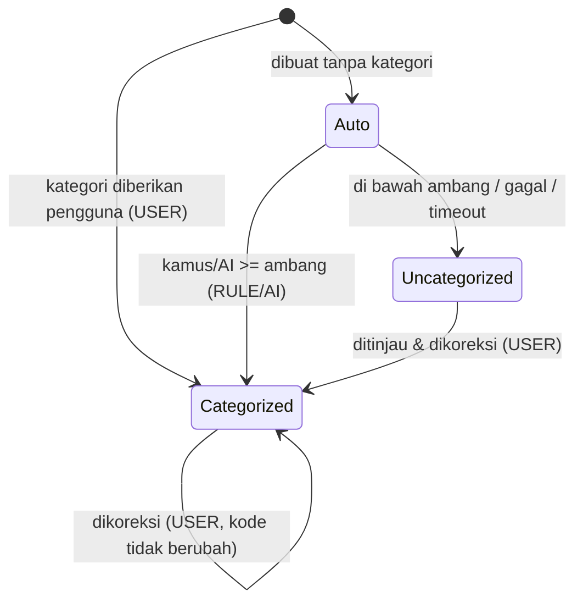
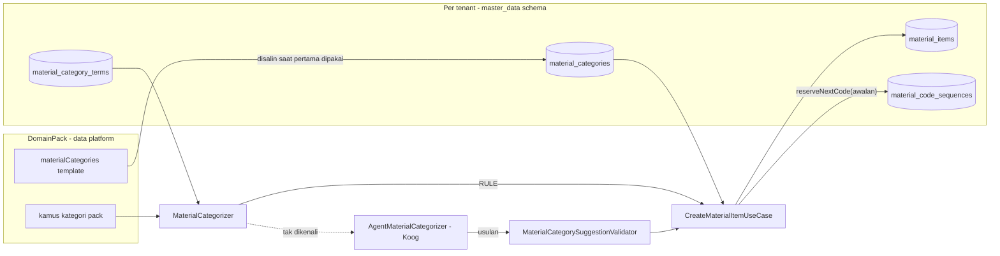
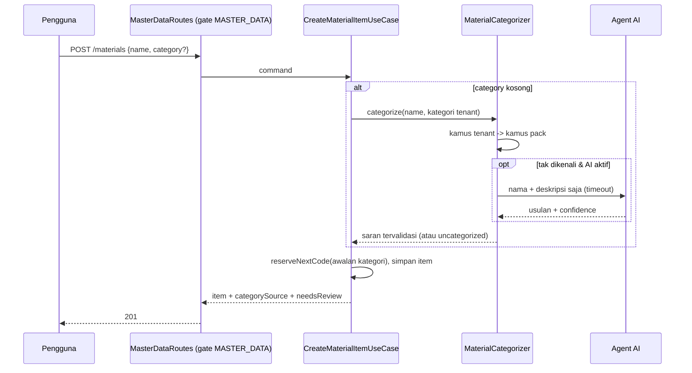

# TRD-MDATA-001: Master Data Bersama — Kategori Material sebagai Data + Kategorisasi Otomatis

## 1. Document Context and Administration

- **Title & Unique ID**: TRD-MDATA-001 — Master Data Bersama: Kategori Material sebagai Data + Kategorisasi Otomatis
- **Revision History**

| Versi | Tanggal | Penulis | Catatan |
|---|---|---|---|
| 0.1 | 2026-10-07 | Agent B | Draf awal dari [PLAN-master-data-shared-categories](../plannings/PLAN-master-data-shared-categories.md), keputusan §5 plan sudah dijawab |

- **Summary & Business Context**: `master_data` (modul fondasi, katalog item + harga) hanya bisa dipakai garment karena **kategori material adalah enum** (`MaterialCategory`: benang, kain, trim, aksesoris, kemasan, bahan kimia, jasa subkon). Kategori menentukan awalan kode item, satuan dasar bawaan, dan filter katalog, dan wajib diisi saat membuat item. Tenant non-garment (klinik, bengkel) membutuhkan himpunan kategori sendiri. Pengisian kategori juga membingungkan pengguna, sehingga harus terisi otomatis.
- **Stakeholders & Approvers**: Pemilik produk (keputusan fitur), Koordinator (merge, rules), Agent B (penulis/implementator awal), Agent A (UI master data), Agent C (agent AI), QA.
- **Goals (In-Scope)**
  - Kategori material sebagai **data**: template per pack, salinan per tenant, dikelola admin tenant (MANAGE).
  - Migrasi enum ke data dengan **Strangler Fig** dan tes paritas; tenant garment berperilaku identik.
  - Kategori **wajib di DB tetapi selalu terisi otomatis**: kamus deterministik per pack/tenant, lalu agent AI untuk sisanya, dengan fallback kategori sistem "Belum dikategorikan".
  - Dimensi satuan **volume** (liter, ml).
  - `master_data` dibagikan ke pack lain lewat salinan identik dengan teks netral.
- **Non-Goals (Out-of-Scope)**
  - Label modul per pack (ditunda; bila dibangun, sekali untuk semua modul bersama).
  - Menjadikan BOM/sampling/tech pack generik; mereka tetap fitur garment.
  - Mengubah kebijakan harga (`PriceSource`, point-in-time) selain yang disentuh kategori.
  - Integrasi RBAC untuk `moduleReferences` (keputusan terpisah).
  - Pembelajaran model (fine-tuning); yang dipelajari hanya kamus tenant.

## 2. Functional Requirements

### FR-1 — Kategori sebagai data
- `MaterialCategoryCode`: value object slug `^[a-z][a-z0-9_]{0,31}$`, kunci tersimpan, satu parser, **tolak bukan fallback** (Kontrak 4).
- `MaterialCategoryDefinition(code, displayName, defaultUom, codePrefix, role, status)`:
  - `codePrefix` `^[A-Z0-9]{2,8}$`, **unik per tenant**, **beku setelah kode pertama terbit** (sekuens kode dikunci oleh awalan).
  - `role` (`CategoryRole`, enum **milik sistem**, lolos Uji Variabilitas karena itu konsep mesin): `PRIMARY_MATERIAL`, `TRIM`, `PACKAGING`, `CONSUMABLE`, `SERVICE`, `UNSPECIFIED`. Logika lintas-modul membaca **peran**, bukan nama kategori (Kontrak 3).
  - `status` `ACTIVE`/`ARCHIVED`; kategori yang dipakai item **tidak boleh dihapus**, hanya diarsipkan.
- Kategori sistem `uncategorized` ("Belum dikategorikan"): ada di setiap tenant, tidak bisa dihapus, kodenya tetap, nama tampil boleh diganti, `role = UNSPECIFIED`.
- Batas: ≤ 50 kategori aktif per tenant; nama ≤ 60 karakter.

### FR-2 — Template pack → salinan tenant
- `DomainPack.materialCategories: List<MaterialCategoryDefinition>`: opsional, kompatibel mundur (kunci JSON ditulis hanya bila ada; pack lama terbaca kosong).
- Template garment = **tujuh kategori sekarang, identik** (kode, nama, satuan, awalan), dikunci tes paritas yang mengiterasi `MaterialCategory.entries`.
- Pack **tanpa template** ⇒ tenant hanya mendapat `uncategorized` (tidak meminjam template garment).
- Template **disalin** ke tenant saat pertama dibutuhkan (Kontrak 5); mengubah template tidak mengubah tenant lama.

### FR-3 — Pembuatan item
- `CreateMaterialCommand.category: MaterialCategoryCode?`. Bila null ⇒ kategorisasi otomatis (FR-5); item **selalu** tersimpan dengan kategori valid.
- Kode item: `reserveNextCode(tenant, definition)` memakai `codePrefix`; sekuens per (tenant, awalan).
- `baseUom` bawaan = `definition.defaultUom`.
- Koreksi kategori sesudahnya **tidak mengubah kode** yang sudah terbit.

### FR-4 — Kelola kategori (admin tenant, MANAGE)
- Tambah, ubah nama/satuan bawaan, arsipkan. Ubah awalan hanya selama belum ada kode terbit.
- Menolak: kode ganda, awalan ganda, hapus kategori terpakai, arsip `uncategorized`.

### FR-5 — Kategorisasi otomatis
- **Port** `MaterialCategorizer.categorize(tenantCategories, inputs): Result<List<CategorySuggestion>>` — pola `InterviewGuesser`: pelaksana hanya mengusulkan, **validator menegakkan**.
- `CategorySuggestion(inputKey, categoryCode, confidence 0..100, source ∈ {RULE, AI}, reason ≤ 200)`.
- **Urutan**: (1) kamus tenant (istilah yang pernah dikonfirmasi), (2) kamus template pack, (3) agent AI hanya bila (1) dan (2) tidak mengenali.
- **Kebijakan terap**: `confidence ≥ ambang` ⇒ dipakai (`categorySource` = RULE/AI); di bawah ambang atau gagal/timeout ⇒ `uncategorized` + `needsReview = true`. Ambang awal **0,8** (konfigurasi, wajib dikalibrasi di P6).
- Koreksi pengguna ⇒ `categorySource = USER`, istilah masuk kamus tenant (`hits++`), `needsReview = false`.
- Dua fungsi AI terpisah: **A. usulan himpunan kategori** untuk tenant/pack baru (dikonfirmasi pemilik), **B. penentuan kategori item** (satu per satu dan massal).
- Hasil AI **di luar himpunan kategori tenant ditolak** (berpath), bukan dipetakan senyap.

### FR-6 — Dimensi volume
- `MeasureDimension.VOLUME`; `LITER`, `MILLILITER` (additif; kode string `l`, `ml`). Pemeriksaan: setiap daftar yang mengiterasi `UnitOfMeasure` dan pembaca kode satuan ikut ditinjau.

### FR-7 — Berbagi modul
- Nama/deskripsi `master_data` dinetralkan (satu teks untuk semua pack), mengikuti prosedur netralisasi (pack + UI + tes paritas + migrasi katalog guarded + `SupersededModuleText`). Modul dipakai pack lain lewat **salinan identik**.

### State machine item (kategori)


## 3. Non-Functional Requirements (NFRs)

| Category | Requirement & Target Metrics | Rationale / Mitigation |
| :--- | :--- | :--- |
| **Performance** | Daftar kategori tenant dibaca dari cache per tenant; kategorisasi deterministik < 10 ms per item; panggilan AI punya **timeout keras** (target awal 4 s) lalu fallback `uncategorized`; impor massal diproses per batch ≤ 30 item | Pembuatan item tidak boleh menunggu AI. Angka = target awal, dikalibrasi di P6 |
| **Scalability** | ≤ 50 kategori aktif/tenant; kamus tenant ≤ 5.000 istilah; cache nama ternormalisasi → kategori | Mencegah kategori menjamur dan biaya AI berulang |
| **Security** | **Awalan kode kini disusun ke string SQL** di `reserveNextCode` (tenantId dan awalan di-interpolasi). Begitu awalan jadi data admin, **wajib divalidasi regex `^[A-Z0-9]{2,8}$` dan diparameterisasi**. Hanya nama + deskripsi item dikirim ke AI (tanpa harga, pemasok, tenant). Tulis fail-closed; kunci API tidak pernah di repo/log | Mencegah injeksi SQL lewat data admin dan kebocoran data bisnis |
| **Availability & Reliability** | AI mati/habis kuota ⇒ tetap tersimpan sebagai `uncategorized` (tidak ada kegagalan simpan); kill-switch env + saklar per tenant; tes otomatis tidak memanggil LLM | Pola `DiscoveryAgents`/`HelpAgents`; kategorisasi tidak boleh menjadi titik gagal |
| **Maintainability & Observability** | Satu parser kategori; tidak ada fallback senyap (hapus `getOrDefault`/`getOrNull` yang ada di jalur kategori); metrik: % diterima tanpa diubah, rasio RULE/AI/USER, jumlah antrean tinjau, biaya AI per tenant; ukuran file mengikuti §14 | Kualitas diukur dari tebakan yang diterima, bukan jumlah kategori |
| **Compatibility** | Dokumen lama tetap terbaca (kolom opsional); kode item, satuan bawaan, dan awalan tenant garment **identik** sebelum/sesudah | Pelajaran regresi draf garment: setiap kolom baru diuji dengan dokumen lama |

## 4. System Architecture & Technical Design

### High-Level Architecture




### Detailed Component Design
- **core/domain/masterdata**: `MaterialCategoryCode`, `MaterialCategoryDefinition`, `CategoryRole`, `TenantMaterialCategories` (agregat per tenant: aturan unik, beku awalan, tidak hapus terpakai), `MaterialCategorizer` (port), `CategorySuggestion`, `MaterialCategorySuggestionValidator`, `DeterministicMaterialCategorizer`.
- **core/domain/pack**: `DomainPack.materialCategories` + codec; `GarmentMaterialCategories` (data template + konstanta kode untuk fitur garment).
- **server**: `PostgresMaterialCategoryRepository`, `PostgresCategoryTermRepository`; rute baru di **berkas baru** `MasterDataCategoryRoutes.kt` (`MasterDataRoutes.kt` sudah 363 baris, di atas batas lunak 300 — tidak ditambah); `AgentMaterialCategorizer` (Koog) di `infrastructure/`.
- **Pembaca enum yang dipindahkan (inventaris saat ini)**
  - Master data: `MaterialItem`, `MaterialItemRepository`, `CreateMaterialItemUseCase`, `UpdateMaterialItemUseCase`, `MaterialItemCodec`, `PostgresMaterialItemRepository`, `InMemoryMaterialItemRepository`, `MasterDataRoutes`, UI master data (`MasterDataUiState`, `MaterialEditorDialog`, `MaterialCatalogList`).
  - **Bergantung pada kategori tertentu (semantik garment)**: `ApprovedSampleSpecificationMapper` (YARN, TRIM), `SampleSpecToTechPackAdapter` (YARN, TRIM), `TechPackDraftFactory` (YARN, TRIM), `QuickEstimateRatesAssembler` (YARN, TRIM, ACCESSORY), UI sampling (`AdditionalMaterialsSection`, `MaterialSearchableDropdown` warna per kategori, `RdResultSection` urutan prioritas), `BomLineEditorDialog`.
  - Kontrak & BOM: `MaterialRef`, `TechPackAndYieldData(+Codec)`, `BomCostPreview(+Codec)`, `PostgresTechPackRepository`.
  - **Keputusan desain**: fitur garment (sampling rajut, draf tech pack, estimasi cepat) merujuk **konstanta kode garment** (`GarmentMaterialCategories.YARN`, dst.) — sah karena fitur itu bagian pack garment — dan wajib **aman bila kategori tidak ada** di tenant (hasil null/lewati, bukan melempar). Kode generik (master data, kontrak BOM, costing) memakai **`CategoryRole`**, bukan nama kategori. Warna per kategori di UI menjadi data (role → token warna), bukan `when` atas enum.

### Data Model & Schema
```sql
-- migrasi baru (nomor = V-berikutnya saat implementasi; cek bentrok antar-agent)
CREATE TABLE master_data.material_categories (
  tenant_id     VARCHAR(64) NOT NULL REFERENCES tenants(id),
  code          VARCHAR(32) NOT NULL,
  display_name  VARCHAR(60) NOT NULL,
  default_uom   VARCHAR(20) NOT NULL,
  code_prefix   VARCHAR(8)  NOT NULL,
  role          VARCHAR(24) NOT NULL,
  status        VARCHAR(16) NOT NULL DEFAULT 'ACTIVE',
  created_at    TIMESTAMPTZ NOT NULL, updated_at TIMESTAMPTZ NOT NULL,
  PRIMARY KEY (tenant_id, code),
  CONSTRAINT ck_prefix CHECK (code_prefix ~ '^[A-Z0-9]{2,8}$')
);
CREATE UNIQUE INDEX uq_material_categories_prefix ON master_data.material_categories (tenant_id, code_prefix);
-- RLS: apply_tenant_rls_in('master_data','material_categories'); grant + ALTER DEFAULT PRIVILEGES untuk wemade_app

CREATE TABLE master_data.material_category_terms (
  tenant_id VARCHAR(64) NOT NULL, term VARCHAR(120) NOT NULL, category_code VARCHAR(32) NOT NULL,
  hits INT NOT NULL DEFAULT 1, updated_at TIMESTAMPTZ NOT NULL, PRIMARY KEY (tenant_id, term)
);

ALTER TABLE master_data.material_items
  ADD COLUMN category_source VARCHAR(8)  NOT NULL DEFAULT 'USER',   -- USER | RULE | AI (item lama = USER)
  ADD COLUMN category_confidence SMALLINT,
  ADD COLUMN needs_review BOOLEAN NOT NULL DEFAULT FALSE;
```
- **Backfill**: sisipkan tujuh kategori template + `uncategorized` untuk tenant garment dan tenant yang punya item; nilai `category` item yang ada **sudah** berupa kode (`yarn`) sehingga tidak diubah.
- **Dua format kunci tersimpan yang berbeda hari ini**: `material_items.category` memakai **kode** (`yarn`), `tech_pack_bom_lines.category` memakai **NAME** enum (`YARN`) dan dibaca dengan `valueOf` + `getOrDefault` (jatuh senyap). Kunci baku baru = **kode**; pembaca menerima kedua bentuk untuk data lama lalu menulis kode; jatuh senyap diganti penolakan berpath. Perlu pemeriksaan data riil sebelum menutup jalur lama.
- `material_code_sequences.category_code` sebenarnya menyimpan **awalan**, bukan kode kategori; tetap, dan itu alasan awalan harus unik per tenant dan beku.

### API Specifications & External Contracts
| Method & Path | Level | Fungsi |
|---|---|---|
| `GET /api/tenant/master-data/categories` | VIEW | daftar kategori tenant (+ jumlah item) |
| `POST /api/tenant/master-data/categories` | MANAGE | tambah kategori `{code, displayName, defaultUom, codePrefix, role}` |
| `PUT /api/tenant/master-data/categories/{code}` | MANAGE | ubah nama, satuan bawaan (awalan hanya bila belum terpakai); `status: ARCHIVED` untuk mengarsipkan |
| `POST /api/tenant/master-data/categories/suggest` | OPERATE | `{items:[{key,name,description?}]}` → saran per item (tanpa menyimpan) |
| `POST /api/tenant/master-data/categories/proposal` | MANAGE | fungsi A: usulan himpunan kategori dari deskripsi usaha |
| `GET /api/tenant/master-data/materials?needsReview=true` | VIEW | antrean tinjau |
| `POST /api/tenant/master-data/materials` | OPERATE | `category` kini opsional; balasan memuat `category`, `categorySource`, `needsReview` |
| `PUT /api/tenant/master-data/materials/{id}` | OPERATE | koreksi kategori ⇒ `categorySource = USER`, kamus tenant bertambah |

Galat: `400` kode/awalan tidak sah atau di luar himpunan (berpath, mis. `$.items[3].category`), `401` tanpa login, `403` peran tak berwenang atau data tenant lain, `404` kategori tak ada, `409` hapus kategori terpakai / awalan sudah dikunci. Semua tulis **fail-closed**.

### Technology Usage & Tradeoff Justification
| Pilihan | Alternatif | Alasan |
|---|---|---|
| Kategori = tabel per tenant + template di pack | Enum yang diperluas | Beda per industri dan per tenant (Kontrak 1); enum baru = pelanggaran |
| `CategoryRole` enum sistem | Logika berdasar nama kategori | Aturan lintas-modul harus memakai peran (Kontrak 3) dan aman bila peran tak ada |
| Deterministik dulu, AI sisanya | AI untuk semua | Murah, konsisten, bisa dites tanpa LLM; AI untuk ekor panjang |
| Himpunan tertutup + validator | Teks bebas dari AI | Mencegah katalog pecah ("Benang", "benang jahit") |
| Awalan beku + unik per tenant | Awalan bebas diubah | Sekuens kode dikunci oleh awalan |
| Strangler Fig per paket | Ganti enum sekaligus | ≥ 12 pemakai, termasuk fitur garment dan UI |

### Assumptions, Constraints, & Dependencies
- Tenant garment berperilaku identik (kode, satuan bawaan, awalan) — gerbang setiap PR.
- Skema `master_data` dan RLS memakai pola `apply_tenant_rls_in` (§5.1 rules); nomor migrasi dicek terhadap worktree lain sebelum dibuat.
- Agent AI memakai infrastruktur Koog yang ada; kunci dan kuota mengikuti kill-switch yang sama.
- **Belum diverifikasi**: apakah `MaterialCatalogSnapshot` (tipe rujukan milik `master_data` di `FoundationModuleCatalog`) memuat kategori; data riil `tech_pack_bom_lines.category` di lingkungan nyata; seberapa besar `UnitOfMeasure` dipakai di daftar yang mengiterasi `entries`.

## 5. Testing, Deployment, and Operations

### Technical Acceptance Criteria (AC)
1. **AC-1 Paritas**: template garment identik dengan enum; tes mengiterasi `MaterialCategory.entries` — nilai baru tanpa padanan ⇒ gagal.
2. **AC-2 Tenant garment identik**: kode item, satuan bawaan, awalan, filter katalog sama sebelum/sesudah tiap PR migrasi.
3. **AC-3 Tenant kedua**: tenant klinik/bengkel membuat kategori sendiri, membuat item, dan kode memakai awalannya; dicek **dengan mata** di tenant uji non-garment.
4. **AC-4 Dokumen lama**: pack tanpa `materialCategories` dan item/BOM lama terbaca; tidak ada penolakan "wajib identik" pada draf garment lama.
5. **AC-5 Tanpa fallback senyap**: kode kategori tak dikenal ditolak berpath; pemindai jembatan yang bisa melempar kosong sebelum enum dihapus.
6. **AC-6 Otomatis**: item tanpa kategori selalu tersimpan dengan kategori valid; AI mati/timeout ⇒ `uncategorized` + `needsReview`.
7. **AC-7 Tertutup**: usulan AI di luar himpunan ditolak validator.
8. **AC-8 Keamanan**: awalan di luar regex ditolak; `reserveNextCode` diparameterisasi; peran tak berwenang 403; data tenant lain tak terbaca.
9. **AC-9 Mutu**: laporan % tebakan diterima per pack (set emas ≥ 10 kasus per pack: garment, klinik, bengkel); ambang dikalibrasi dan dicatat.
10. **AC-10 Volume**: `LITER`/`MILLILITER` terkonversi benar; daftar yang mengiterasi satuan tetap lolos.

### Testing Strategy
- **Domain murni** (`commonTest`): agregat kategori (unik, beku awalan, tak hapus terpakai), validator saran, kategorisasi deterministik byte-per-byte, paritas enum, codec pack + dokumen lama.
- **Fixture non-garment wajib** (klinik, bengkel, + katering/retail untuk kamus) pada setiap fitur; tes yang hanya memakai garment tidak dianggap bukti.
- **Server** (DB scratch `*_scratch_*`): repository, RLS lintas tenant, rute (401/403/404/409/400), backfill migrasi, `reserveNextCode` terhadap awalan berbahaya.
- **AI**: tes otomatis **tanpa LLM** (double deterministik); eval live opt-in dengan estimasi biaya dicetak **dan diverifikasi**, margin 2×, saldo dicek sebelum/sesudah.
- **UI**: kompilasi 5 target; lihat dengan mata di tenant non-garment; font Nunito hanya Latin-1.
- **Audit**: `scripts/audit-variability.sh` tanpa temuan baru; `wc -l` sebelum/sesudah untuk berkas di atas batas lunak.

### Monitoring & Error Handling
- Log terstruktur per kategorisasi: sumber (RULE/AI/USER), confidence, durasi, hasil validator; tanpa isi nama item di log level info.
- Metrik/diagnostik: rasio diterima tanpa diubah, ukuran antrean tinjau, tingkat timeout/kegagalan AI, biaya AI per tenant per hari.
- Kegagalan AI tidak menggagalkan permintaan: fallback + `needsReview`. Kegagalan validator: dicatat, saran dibuang.

### Deployment & Rollback Plan
- Semua migrasi **additif** (tabel baru, kolom ber-default); enum **dihapus paling akhir** (P7) setelah pemindai kosong.
- Urutan: P1 (data + backfill, enum masih jadi sumber) → P2 per paket → P3 → P4 → P5 → P6 → P7. Tiap tahap dapat dirilis dan dikembalikan sendiri; selama enum masih ada, rollback = mengembalikan pembaca ke enum.
- AI dirilis di belakang kill-switch (mati secara bawaan); deterministik dirilis lebih dulu.
- Checklist rollback: matikan kill-switch AI; pembaca kembali ke enum (sebelum P7); migrasi tidak perlu dibalik karena additif; verifikasi tenant garment dengan tes paritas.
- Dokumentasi: teaching doc per tahap (`docs/teaching/`), pembaruan `module-integration-rules.md` bila anatomi pendaftaran berubah.
