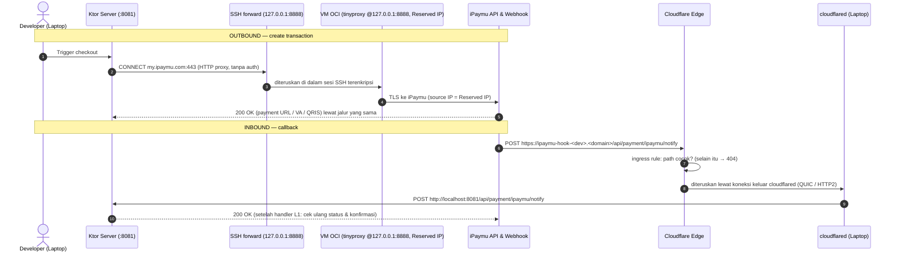

# TRD-PAY-001: iPaymu Testing Bridge & Egress Gateway (OCI Jakarta + Pulumi Kotlin + Cloudflare Tunnel)

## 1. Document Context and Administration

- **Title & Unique ID**: iPaymu Testing Bridge & Egress Gateway — `TRD-PAY-001`
- **Revision History**

| Versi | Tanggal | Penulis | Catatan |
|---|---|---|---|
| 1.0 | 2026-10-01 | Principal Architect (Antigravity) | Spesifikasi awal testing gateway iPaymu (Pulumi Kotlin, OCI Jakarta, Cloudflare Tunnel). Rujukan: [`PLAN-ipaymu-testing-bridge.md`](../plannings/PLAN-ipaymu-testing-bridge.md). |
| 1.1 | 2026-10-01 | Review (Claude Code) | Revisi pasca-review: (a) proxy tidak lagi publik — tinyproxy di `127.0.0.1` + SSH local forward, port 8888 ditutup; (b) ingress tunnel dibatasi ke path `/notify`, sisanya 404 di edge; (c) prasyarat OCI (home region, PAYG, reklamasi idle) & `protect` pada Reserved IP; (d) **lingkup dipersempit ke infrastruktur** — integrasi Ktor (client iPaymu + handler webhook) dipindah ke fase **L1 Billing iPaymu** di [`PLAN-builder-console.md`](../plannings/PLAN-builder-console.md) §8, TRD ini hanya mendefinisikan kontrak serah-terimanya (§2 FR-PAY-3). |

### Summary & Business Context

Integrasi payment gateway **iPaymu** (tagihan langganan platform — `SubscriptionInvoice`, V85 — dan kelak
transaksi tenant) membutuhkan dua hal yang tidak bisa dipenuhi laptop developer:

1. **Outbound IP Whitelist**: request API (create transaction, VA, QRIS, cek status) wajib berasal dari IP
   publik statis yang terdaftar di dashboard iPaymu. IP dinamis ISP ditolak.
2. **Inbound HTTPS Domain**: `notifyUrl` wajib domain ber-SSL; raw IP dan `localhost` ditolak.

VPN sewaan manual mengganggu koneksi lokal, tidak menyediakan jalur webhook masuk, dan tidak
*reproducible*. TRD ini mendefinisikan **jembatan pengujian** berbasis IaC **Pulumi Kotlin**: VM OCI
Jakarta dengan Reserved IP sebagai egress statis, dan **Cloudflare Tunnel** sebagai ingress webhook ke
laptop.

> **Posisi terhadap roadmap**: billing via iPaymu adalah fase **L1** di `PLAN-builder-console.md` §8 (setelah
> gerbang 3–5 design partner membayar). Jembatan ini adalah **prasyarat infrastruktur** L1 dan boleh
> disiapkan lebih awal karena tidak menyentuh kode aplikasi. Kode Ktor (port `PaymentGateway`,
> `IpaymuPaymentGateway`, handler callback) **bukan** bagian TRD ini dan wajib melewati
> `wemade-feature-discovery` → `wemade-feature-workflow` saat L1 dimulai.

### Stakeholders & Approvers
- **Product & Tech Lead**: Achmad Jamaludin
- **Implementasi**: Lead Platform / Infrastructure Engineer
- **QA & Verification**: Integration & Payment Gateway Test Suite

### Prasyarat & Asumsi (wajib dicek sebelum implementasi)

| # | Prasyarat / Asumsi | Kenapa penting | Status |
|---|---|---|---|
| P1 | **Home region tenancy OCI = `ap-jakarta-1`** | Sumber daya Always Free hanya bisa dibuat di home region, dan home region **tidak bisa diganti** setelah akun dibuat. Bila home region lain, pilih: VM berbayar di Jakarta, atau egress dari home region (IP tetap statis; hanya latensi yang berubah). | Cek di console OCI |
| P2 | **Akun di-upgrade ke Pay As You Go** | (a) Kapasitas A1 Jakarta sering habis untuk akun free; (b) VM Always Free yang menganggur (CPU/jaringan/memori < 20% selama 7 hari) **direklamasi** oleh OCI — tinyproxy hampir selalu menganggur. Akun PAYG tidak terkena reklamasi idle; tagihan tetap Rp 0 selama di dalam kuota Always Free. | Wajib |
| P3 | **Apakah sandbox iPaymu memberlakukan IP whitelist?** | Bila tidak, egress OCI baru diperlukan menjelang production; ingress tunnel tetap diperlukan untuk menguji callback. | Belum diverifikasi — tanyakan ke iPaymu / uji dengan request langsung dari laptop |
| P4 | **Biaya Reserved Public IP** di bawah PAYG | Klaim "Rp 0" perlu dipastikan di halaman pricing OCI saat implementasi. | Belum diverifikasi |
| P5 | **State backend Pulumi** dipilih: Pulumi Cloud (individual, gratis) atau backend objek (OCI Object Storage/S3-compatible) | Menentukan di mana state & secret terenkripsi disimpan dan siapa yang bisa `pulumi up`. | Putuskan sebelum Fase 1 |
| P6 | Domain `wemakeerp.com` dikelola di Cloudflare; API token punya izin `Zone.DNS:Edit` + `Account.Cloudflare Tunnel:Edit` | Pulumi membuat tunnel, konfigurasi ingress, dan DNS record. | — |

### Goals (In-Scope)
- **IaC Pulumi Kotlin** — build Gradle **mandiri** di `infra/ipaymu-bridge/` (tidak di-`include` oleh
  `settings.gradle.kts` root, agar build KMP 5 target tidak tersentuh).
- **OCI Egress Gateway (`ap-jakarta-1`)**: VCN, Internet Gateway, Route Table, Security List (hanya SSH),
  Subnet publik, Reserved Public IPv4 ber-`protect`, VM A1 Flex dengan cloud-init `tinyproxy` yang
  mendengar di `127.0.0.1` dan memfilter domain tujuan.
- **Cloudflare Ingress Tunnel**: satu tunnel **per developer**, konfigurasi ingress yang hanya meneruskan
  path webhook, DNS record, dan token sebagai output secret.
- **Kontrak serah-terima** ke fase L1: env var, kebutuhan engine HTTP client, dan syarat handler webhook.

### Non-Goals (Out-of-Scope)
- **Implementasi kode Ktor** (client iPaymu, handler `/api/payment/ipaymu/notify`, transisi status invoice)
  — milik fase L1 Billing iPaymu.
- Desain egress **production** (apakah server production memakai bridge ini atau punya IP statis sendiri)
  — diputuskan di L1, bersama Docker + Caddy (sisa M2).
- Penyimpanan kartu (PCI-DSS) — iPaymu menangani via Hosted Checkout, VA, QRIS, e-wallet.
- Migrasi database ke OCI.
- Pendaftaran merchant & pengisian whitelist/URL notifikasi di dashboard iPaymu (manual, sekali).

---

## 2. Functional Requirements

### FR-PAY-1: Egress Proxy (Outbound)
- **FR-PAY-1.1**: VM OCI menjalankan `tinyproxy` pada `127.0.0.1:8888` (**`Listen 127.0.0.1`**). Port 8888
  **tidak** dibuka di Security List maupun `iptables` host.
- **FR-PAY-1.2**: Developer mengakses proxy lewat SSH local forward
  `ssh -N -L 8888:127.0.0.1:8888 ubuntu@<RESERVED_IP>`; aplikasi lokal memakai
  `http://127.0.0.1:8888` sebagai HTTP proxy **tanpa kredensial**. Autentikasi = kunci SSH.
- **FR-PAY-1.3**: tinyproxy hanya meneruskan ke domain yang diizinkan (`Filter` + `FilterDefaultDeny Yes`):
  `my.ipaymu.com`, `sandbox.ipaymu.com`, dan `api.ipify.org` (verifikasi egress). Tujuan lain ditolak.
  `ConnectPort 443` saja.
- **FR-PAY-1.4**: Request yang keluar dari proxy membawa source IP = Reserved Public IP yang didaftarkan
  di whitelist iPaymu.
- **FR-PAY-1.5**: SSH hanya menerima autentikasi kunci (password login dimatikan oleh image bawaan; jangan
  diaktifkan). Kunci publik developer dikirim lewat metadata `ssh_authorized_keys` dari konfigurasi stack.

> **Kenapa bukan proxy publik + BasicAuth (desain v1.0)**: (1) kredensial proxy berjalan tanpa enkripsi
> di setiap request; (2) bocornya kredensial menjadikan IP yang di-whitelist iPaymu open proxy — risiko
> IP itu masuk daftar hitam; (3) untuk tujuan HTTPS, `Proxy-Authorization` harus ikut di request
> `CONNECT` — `ProxyBuilder.http()` Ktor tidak memakai `user:pass@` dari URL, dan engine Java
> menonaktifkan Basic untuk tunneling secara bawaan (`jdk.http.auth.tunneling.disabledSchemes`);
> (4) image Ubuntu OCI memasang `iptables` yang hanya membuka port 22, sehingga 8888 tetap tertutup
> walau Security List dibuka. SSH forward menghapus keempatnya sekaligus.

### FR-PAY-2: Webhook Tunnel (Inbound)
- **FR-PAY-2.1**: Pulumi membuat **satu Cloudflare Tunnel per developer** dari config `developers`
  (mis. `["achmad"]`), masing-masing dengan hostname `ipaymu-hook-<dev>.<domain>`.
  *Alasan*: satu token yang dijalankan di dua laptop membuat Cloudflare membagi webhook ke keduanya
  secara acak. iPaymu menerima `notifyUrl` per transaksi, jadi setiap developer memakai hostname-nya
  sendiri.
- **FR-PAY-2.2**: Konfigurasi ingress tunnel dikelola Pulumi (remotely-managed), berisi tepat dua aturan:
  1. `hostname = ipaymu-hook-<dev>.<domain>`, `path = ^/api/payment/ipaymu/notify$` → `http://localhost:8081`
  2. catch-all → `http_status:404`

  Seluruh route lain server dev (`/api/*`, `/health`, …) **tidak** terjangkau dari internet.
- **FR-PAY-2.3**: Developer menjalankan `cloudflared tunnel run --token <TOKEN>` (tanpa `--url`; ingress
  diambil dari konfigurasi remote). Tidak perlu port-forwarding router.
- **FR-PAY-2.4**: POST iPaymu ke path webhook diteruskan utuh (header, body, content-type) ke `:8081`.
- **FR-PAY-2.5**: `returnUrl`/`cancelUrl` **tidak** memakai hostname tunnel — keduanya dibuka browser
  pembeli dan harus mengarah ke aplikasi web (mis. `http://localhost:3001/builder/billing` saat dev).

### FR-PAY-3: Kontrak Serah-Terima ke Fase L1 (bukan implementasi TRD ini)
Bagian ini adalah **syarat masuk** untuk TRD L1, ditulis di sini agar bridge dirancang sesuai pemakaiannya.

- **FR-PAY-3.1 Proxy kondisional**: `IPAYMU_OUTBOUND_PROXY` (dibaca lewat `EnvLoader`, sama seperti
  variabel server lain). Terisi → client memakai `ProxyBuilder.http(url)`; kosong → koneksi langsung
  (server yang sudah berada di host ber-IP statis). Nilainya **tanpa** kredensial (`http://127.0.0.1:8888`).
- **FR-PAY-3.2 Engine HTTP client**: server saat ini belum punya engine Ktor client (katalog baru memuat
  `ktor-client-core` + `ktor-client-mock`). L1 wajib memilih engine yang mendukung HTTP proxy + `CONNECT`
  untuk HTTPS, dan membuktikannya dengan AC-PAY-3 di bawah.
- **FR-PAY-3.3 Handler callback** `POST /api/payment/ipaymu/notify` (publik, tanpa JWT):
  1. Terima `application/x-www-form-urlencoded` **dan** JSON.
  2. **Jangan percaya isi callback**: sebelum menandai lunas, cek ulang status transaksi ke API iPaymu
     berdasarkan `trx_id` (lewat proxy yang sama). Verifikasi signature callback **hanya bila** format
     signature callback terdokumentasi resmi oleh iPaymu — rumus HMAC di v1.0 adalah rumus *request
     keluar*, belum terbukti berlaku untuk callback.
  3. Idempoten per `trx_id`.
  4. Petakan `reference_id` → `SubscriptionInvoiceId`; tolak bila **nominal ≠ `totalIdr`** invoice.
  5. Transisi status memakai **`ConfirmSubscriptionPaymentUseCase` yang sudah ada** (sudah idempoten untuk
     PAID, menolak VOID) — bukan transisi baru — dengan identitas audit sistem (mis. `system:ipaymu`),
     karena use case itu kini diasumsikan dipanggil superadmin.
  6. Route berada di luar `/api/tenant/` sehingga **tidak** dijaga `RouteOwnershipTest`; daftarkan
     eksplisit sebagai route publik dan uji bahwa route itu tidak membuka data lain.
  7. Laptop mati/tidur = callback hilang. L1 wajib punya rekonsiliasi (cek status berkala untuk invoice
     yang punya `trx_id` tapi masih `ISSUED`).

---

## 3. Non-Functional Requirements (NFRs)

| Kategori | Kebutuhan | Cara memenuhi / mengukur |
| :--- | :--- | :--- |
| **Security** | Tidak ada port publik selain SSH (kunci saja); proxy tidak bisa dipakai ke domain selain allowlist; tunnel hanya mengekspos satu path. | Security List ingress = TCP 22 saja; `Listen 127.0.0.1`; `FilterDefaultDeny Yes`; ingress catch-all 404. Diverifikasi AC-PAY-2, -4, -7. |
| **Secrets** | Token tunnel & data sensitif tidak tersimpan plaintext di repo. | Output Pulumi bertanda secret; `Pulumi.<stack>.yaml` hanya berisi nilai terenkripsi; `.env` sudah di-ignore (`**/.env`). User_data cloud-init **tidak** berisi rahasia (tidak ada lagi password proxy). |
| **Durability IP** | IP yang sudah di-whitelist iPaymu tidak boleh hilang karena redeploy. | `PublicIp` dengan `protect = true`; mengganti VM tidak mengganti IP (IP di-reassign ke VNIC baru). AC-PAY-8. |
| **Reproducibility** | Seluruh resource OCI & Cloudflare bisa dibuat ulang dari kode. | `pulumi up` dari stack kosong; tidak ada klik manual di console OCI/Cloudflare (dashboard iPaymu tetap manual). |
| **Biaya** | Rp 0 dalam kuota Always Free. | VM `VM.Standard.A1.Flex` 1 OCPU / 6 GB (atau `VM.Standard.E2.1.Micro`); Cloudflare Free. Lihat P2, P4. |
| **Ketersediaan** | Bridge untuk **pengujian**, tanpa SLA. | Bila VM mati, developer menjalankan `pulumi up` ulang; IP tetap. Tidak dipakai jalur production sampai diputuskan di L1. |

---

## 4. System Architecture & Technical Design

### 4.1 High-Level Architecture & Data Flow



---

### 4.2 Detailed Component Design (Pulumi Kotlin)

Build Gradle mandiri di `infra/ipaymu-bridge/` (punya `settings.gradle.kts` sendiri; **tidak** di-include root):

```
infra/ipaymu-bridge/
├── Pulumi.yaml                      # runtime: java (Pulumi Java SDK, dipakai dari Kotlin)
├── Pulumi.dev.yaml                  # config stack dev (nilai secret terenkripsi)
├── build.gradle.kts                 # com.pulumi:pulumi, com.pulumi:oci, com.pulumi:cloudflare — versi di-pin
├── settings.gradle.kts
└── src/main/kotlin/com/eventverse/infra/
    ├── Main.kt                      # Pulumi.run { … }: baca config, rakit dua komponen, ekspor output
    ├── BridgeConfig.kt              # config bertipe: compartment, domain, developers, sshPublicKeys, shape
    ├── OciEgressGateway.kt          # jaringan, VM, Reserved IP
    ├── TinyproxyCloudInit.kt        # teks cloud-init (konfigurasi tinyproxy) — terpisah agar bisa diuji/dibaca
    └── CloudflareWebhookTunnel.kt   # tunnel + ingress + DNS per developer
```

#### Komponen 1: `OciEgressGateway`
1. `Vcn` `10.0.0.0/16`, `InternetGateway`, `RouteTable` (`0.0.0.0/0` → IGW), `Subnet` publik `10.0.1.0/24`.
2. `SecurityList`: egress semua; ingress **hanya TCP 22**. (Port 8888 tidak dibuka.)
3. Lookup: availability domain (`getAvailabilityDomains`) dan image Canonical Ubuntu 24.04 aarch64 terbaru
   (`getImages`, filter OS + shape) — **jangan** menulis OCID image secara manual.
4. `Instance` `VM.Standard.A1.Flex` (1 OCPU, 6 GB), `createVnicDetails.assignPublicIp = false`
   (Reserved IP tidak bisa dipasang bila VNIC sudah punya ephemeral IP), metadata
   `ssh_authorized_keys` + `user_data` (base64 cloud-init).
5. `PublicIp` `lifetime = RESERVED`, `privateIpId` = private IP utama VNIC instance (lookup
   `getVnicAttachments` → `getPrivateIps`), **`protect = true`**.
6. Cloud-init (tanpa rahasia):
   ```yaml
   #cloud-config
   package_update: true
   packages:
     - tinyproxy
   write_files:
     - path: /etc/tinyproxy/tinyproxy.conf
       permissions: '0644'
       content: |
         User tinyproxy
         Group tinyproxy
         Listen 127.0.0.1
         Port 8888
         Timeout 600
         LogLevel Info
         MaxClients 50
         Allow 127.0.0.1
         ConnectPort 443
         Filter "/etc/tinyproxy/filter"
         FilterDefaultDeny Yes
         FilterExtended Yes
     - path: /etc/tinyproxy/filter
       permissions: '0644'
       content: |
         ^my\.ipaymu\.com$
         ^sandbox\.ipaymu\.com$
         ^api\.ipify\.org$
   runcmd:
     - systemctl enable tinyproxy
     - systemctl restart tinyproxy
   ```
   `iptables` bawaan image (hanya port 22) **dibiarkan** — memang itu yang diinginkan.
   Sintaks `Filter*` dicocokkan dengan versi tinyproxy di Ubuntu 24.04 saat implementasi (AC-PAY-4 yang
   membuktikannya).

#### Komponen 2: `CloudflareWebhookTunnel` (per developer)
1. Tunnel cloudflared (remotely-managed) dengan secret 32-byte acak (`RandomBytes`/`RandomPassword`).
2. Konfigurasi tunnel (ingress) sesuai FR-PAY-2.2.
3. DNS record `CNAME` `ipaymu-hook-<dev>` → `<tunnel_id>.cfargotunnel.com`, `proxied = true`.
4. Output: token tunnel (secret) dan URL webhook lengkap.

> **Versi provider**: nama resource Cloudflare berubah antar major version (`Tunnel` → `ZeroTrustTunnelCloudflared`,
> `Record` → `DnsRecord`, dan cara mengambil token tunnel). Pin satu versi `com.pulumi:cloudflare` di
> `build.gradle.kts` dan cocokkan nama resource dengan versi itu — jangan mencampur contoh dari versi lain.

#### Output stack
| Output | Isi | Dipakai untuk |
|---|---|---|
| `egressIp` | Reserved Public IP | Whitelist iPaymu, `EXPECTED_STATIC_IP` di skrip verifikasi |
| `sshForwardCommand` | `ssh -N -L 8888:127.0.0.1:8888 ubuntu@<ip>` | Dijalankan developer |
| `webhookUrls` | map dev → `https://ipaymu-hook-<dev>.<domain>/api/payment/ipaymu/notify` | `IPAYMU_NOTIFY_URL` per developer |
| `tunnelTokens` | map dev → token (**secret**) | `cloudflared tunnel run --token` |

---

### 4.3 Konfigurasi Environment Lokal (`.env`, tidak di-commit)

Nilai di bawah adalah **placeholder**.

```bash
# Kredensial iPaymu (sandbox)
IPAYMU_VA=<VA_SANDBOX>
IPAYMU_API_KEY=<API_KEY_SANDBOX>
IPAYMU_BASE_URL=https://sandbox.ipaymu.com/api/v2   # production: https://my.ipaymu.com/api/v2

# Bridge
IPAYMU_OUTBOUND_PROXY=http://127.0.0.1:8888          # aktif selama SSH forward berjalan; kosong = langsung
IPAYMU_NOTIFY_URL=https://ipaymu-hook-<dev>.wemakeerp.com/api/payment/ipaymu/notify
IPAYMU_RETURN_URL=http://localhost:3001/builder/billing   # browser pembeli → aplikasi web, bukan tunnel
```

Payload callback (contoh field, untuk L1 — wajib dicocokkan dengan dokumentasi iPaymu terbaru):
`trx_id`, `sid`, `reference_id`, `status`, `status_code`, `via`, `channel`, `amount`, `fee`.

---

### 4.4 Justifikasi Teknologi & Trade-off

1. **Pulumi Kotlin vs Terraform HCL** — Pulumi (Java SDK dipakai dari Kotlin). Satu bahasa & build tool
   dengan codebase; konfigurasi bertipe. *Trade-off*: contoh komunitas lebih sedikit dari HCL, dan nama
   resource mengikuti versi provider (lihat catatan §4.2).
2. **SSH local forward vs proxy publik + BasicAuth** — SSH forward. Nol port publik tambahan, tidak ada
   kredensial proxy, bekerja dengan engine HTTP client apa pun (proxy tanpa auth). *Trade-off*: developer
   harus menjalankan satu perintah `ssh` sebelum menguji, dan kunci SSH tiap developer didaftarkan di stack.
3. **OCI Jakarta vs AWS/GCP** — OCI: VM A1 + IP statis dalam kuota Always Free; region Jakarta dekat
   dengan iPaymu. *Trade-off*: prasyarat P1/P2 (home region, PAYG).
4. **Cloudflare Tunnel vs ngrok** — Cloudflare: hostname tetap di domain sendiri, gratis, ingress bisa
   dibatasi per path. *Trade-off*: butuh zona domain di Cloudflare (P6).

---

## 5. Testing, Deployment, and Operations

### 5.1 Acceptance Criteria (AC)

- [ ] **AC-PAY-1**: Dengan prasyarat P1–P6 terpenuhi, `pulumi up` pada stack kosong membuat seluruh resource
      OCI dan Cloudflare tanpa klik di console OCI/Cloudflare.
- [ ] **AC-PAY-2**: Dari internet, `nc -vz <egressIp> 8888` **gagal** (timeout/ditolak); SSH ke `<egressIp>`
      hanya berhasil dengan kunci terdaftar.
- [ ] **AC-PAY-3**: Dengan SSH forward aktif, `curl -x http://127.0.0.1:8888 https://api.ipify.org`
      mengembalikan `egressIp`.
- [ ] **AC-PAY-4**: Dengan SSH forward aktif, `curl -x http://127.0.0.1:8888 https://example.com` **ditolak**
      oleh filter tinyproxy.
- [ ] **AC-PAY-5**: Request API iPaymu lewat proxy tidak lagi ditolak karena IP (berlaku bila P3 = whitelist
      memang ditegakkan; bila tidak, catat hasilnya dan tandai N/A).
- [ ] **AC-PAY-6**: Dengan `cloudflared` berjalan, `POST https://ipaymu-hook-<dev>.<domain>/api/payment/ipaymu/notify`
      sampai ke proses lokal di `:8081` (terlihat di log server, atau di `nc -l 8081` bila server dimatikan).
- [ ] **AC-PAY-7**: `GET https://ipaymu-hook-<dev>.<domain>/health` → **404 dari edge**, padahal
      `GET http://localhost:8081/health` → 200. (Membuktikan ingress hanya meloloskan path webhook.)
- [ ] **AC-PAY-8**: `pulumi destroy` **gagal** pada `PublicIp` karena `protect`; mengganti shape VM lalu
      `pulumi up` mempertahankan `egressIp` yang sama.

### 5.2 Strategi Verifikasi

1. **Skrip `scripts/test-ipaymu-bridge.sh`** (deliverable Fase 3) — AC-PAY-2/3/4/7 otomatis:
   ```bash
   #!/usr/bin/env bash
   set -euo pipefail
   : "${EXPECTED_STATIC_IP:?}" "${IPAYMU_NOTIFY_URL:?}"
   PROXY=http://127.0.0.1:8888
   HOOK_HOST=$(echo "$IPAYMU_NOTIFY_URL" | awk -F/ '{print $3}')

   echo "==> AC-PAY-2: port 8888 tidak terbuka ke publik"
   if nc -z -w 5 "$EXPECTED_STATIC_IP" 8888 2>/dev/null; then echo "GAGAL: 8888 terbuka"; exit 1; fi

   echo "==> AC-PAY-3: egress IP"
   OUT=$(curl -fsS -x "$PROXY" https://api.ipify.org)
   [ "$OUT" = "$EXPECTED_STATIC_IP" ] || { echo "GAGAL: egress $OUT ≠ $EXPECTED_STATIC_IP"; exit 1; }

   echo "==> AC-PAY-4: domain di luar allowlist ditolak"
   if curl -fsS -o /dev/null -x "$PROXY" https://example.com 2>/dev/null; then echo "GAGAL: filter bocor"; exit 1; fi

   echo "==> AC-PAY-7: ingress hanya path webhook"
   CODE=$(curl -s -o /dev/null -w "%{http_code}" "https://$HOOK_HOST/health")
   [ "$CODE" = "404" ] || { echo "GAGAL: /health lewat tunnel = $CODE"; exit 1; }

   echo "OK"
   ```
2. **Unit test Kotlin** (`IpaymuCallback…Test`, transisi invoice) — milik **L1**, bukan TRD ini.
   Transisi `ISSUED → PAID` sudah diuji di `SubscriptionBillingUseCaseTest` lewat
   `ConfirmSubscriptionPaymentUseCase`.

### 5.3 Runbook

#### Setup awal (sekali)
1. Penuhi P1–P6. Login backend state (`pulumi login …`), siapkan `~/.oci/config` untuk tenancy.
2. Deploy:
   ```bash
   cd infra/ipaymu-bridge
   pulumi stack init dev
   pulumi config set ociCompartmentId "<OCID_COMPARTMENT>"
   pulumi config set cfAccountId "<CF_ACCOUNT_ID>"
   pulumi config set cfZoneId "<CF_ZONE_ID>"
   pulumi config set domain "wemakeerp.com"
   pulumi config set --path 'developers[0]' achmad
   pulumi config set --path 'sshPublicKeys[0]' "$(cat ~/.ssh/id_ed25519.pub)"
   pulumi config set --secret cloudflare:apiToken "<CF_API_TOKEN>"
   pulumi up
   ```
3. Di dashboard iPaymu: daftarkan `pulumi stack output egressIp` ke IP Whitelist. URL notifikasi dikirim
   per transaksi (`notifyUrl`) — bila dashboard tetap meminta URL default, isi dengan webhook URL developer
   utama.

#### Pemakaian harian (dua terminal)
```bash
ssh -N -L 8888:127.0.0.1:8888 ubuntu@$(pulumi stack output egressIp)
cloudflared tunnel run --token "$(pulumi stack output tunnelTokens --show-secrets | jq -r .achmad)"
```

#### Menambah developer
Tambahkan nama ke `developers` dan kuncinya ke `sshPublicKeys`, lalu `pulumi up`. IP egress tidak berubah,
jadi whitelist iPaymu tidak perlu disentuh.

#### Teardown
- **Hentikan biaya/komputasi saja** (IP tetap): `pulumi destroy` akan berhenti di `PublicIp` yang
  ter-`protect`; ini disengaja.
- **Hapus total** (IP hilang → **wajib daftar ulang whitelist iPaymu**):
  `pulumi state unprotect <urn PublicIp>` lalu `pulumi destroy`.

### 5.4 Risiko Operasional

| Risiko | Mitigasi |
|---|---|
| Kapasitas A1 Jakarta habis | PAYG (P2); cadangan `VM.Standard.E2.1.Micro`. |
| VM Always Free direklamasi karena idle | PAYG (P2). |
| Callback hilang saat laptop mati/tidur | Rekonsiliasi cek status di L1 (FR-PAY-3.3 butir 7). |
| Kunci SSH developer bocor | Hapus dari `sshPublicKeys`, `pulumi up` (metadata diperbarui; bila tidak diterapkan ulang oleh cloud-init, ganti VM — IP tetap). |
| Konfigurasi bridge menyimpang dari production | Desain egress production diputuskan di L1; bridge ini hanya untuk pengujian. |

---

## 6. Pertanyaan Terbuka (diselesaikan sebelum/selama Fase 1)

1. Apakah sandbox iPaymu menegakkan IP whitelist? (P3)
2. Format verifikasi keaslian callback iPaymu yang resmi — ada signature callback, atau hanya cek status?
3. Harga Reserved Public IP di bawah PAYG. (P4)
4. Production: server memakai bridge ini, atau IP statis sendiri bersama Docker + Caddy?
