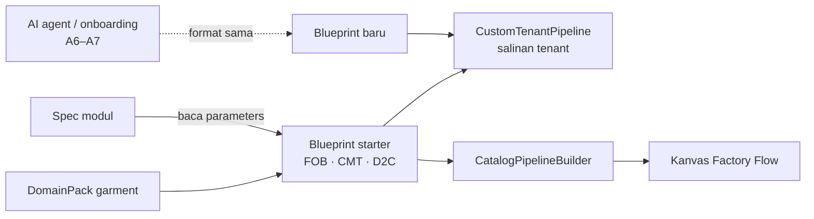

# TRD-PLAT-001: Blueprint — Starter Alur Pabrik sebagai Data Pack

## 1. Document Context and Administration

- **Title & Unique ID**: Blueprint — `TRD-PLAT-001` (bagian Blueprint; bagian `BusinessModule`/B6 ditulis kemudian)
- **Revision History**

| Versi | Tanggal | Penulis | Catatan |
|---|---|---|---|
| 0.1 | 2026-09-29 | Achmad Jamaludin (dibantu Claude) | Dari [`discovery-B4-blueprint.md`](../plannings/discovery-B4-blueprint.md); Q1–Q5 disetujui |
| 0.2 | 2026-09-29 | Achmad Jamaludin (dibantu Claude) | B4a–B4c selesai. Koreksi sumber bug header. Risiko baru: `BlueprintCode` di string template (dikunci test klien) |
| 0.3 | 2026-09-29 | Achmad Jamaludin (dibantu Claude) | **B4 selesai.** B4d: `GarmentBlueprints.parse` ketat untuk data tersimpan, `findByCode` + 400 untuk route reset. Data A & B diaudit: hanya 3 kode dikenal, tak ada yang mengandalkan fallback |

### Summary & Business Context

`GarmentBusinessPreset` (FOB / CMT / D2C) adalah enum konveksi, dan **arah pengetahuannya terbalik**: setiap
spec modul menyebut nama preset (`supportedPresets`, `costingBehaviorFor(preset)`, …). Akibatnya:

1. Modul dari pack lain (e-learning) terpaksa "tahu FOB".
2. Tidak ada satu objek yang bisa ditulis AI agent sebagai "alur pabrik ini" (plan A6/A7).
3. `fromCode` diam-diam jatuh ke FOB; `exampleCompanyName` bocor menjadi header tenant.

**Blueprint** membalik arahnya: satu objek data yang menyatakan modul mana yang aktif dan parameternya.
Pack mengirim Blueprint starter, tenant menyalinnya (`CustomTenantPipeline`), dan AI agent menulis
Blueprint baru dengan format yang sama.

> **Koreksi (B4c, 2026-09-29):** `exampleCompanyName` ternyata **tidak dipakai di mana pun**. Badge header "PT WeMade Garmen Ekspor" berasal dari daftar perusahaan demo yang ditulis tangan di `CompanySwitcherDropdown` (`CompanyTenantProfile.ALL`), dan teks "FOB Full Package" jujur secara data: `bordir-uji` memang tersimpan `business_preset = fob_full_package`. Perbaikan tetap di Jalur A (A1).

### Stakeholders & Approvers

Product & Tech Lead: Achmad Jamaludin · Implementasi: Claude (Jalur B) · QA: test paritas + cek visual `bordir-uji`

### Goals (In-Scope)

- Tipe mesin netral `Blueprint`, `BlueprintCode`, `BlueprintModule` di `core/domain/blueprint/`.
- 3 Blueprint starter garment yang **identik** dengan perilaku preset hari ini (tabel emas).
- Builder, projector, reconciler, wiring, dan katalog modul membaca Blueprint; spec modul tidak lagi menyebut preset.
- `GarmentBusinessPreset` dihapus; kode tersimpan tidak berubah.
- Perbaikan fallback senyap `fromCode` (commit terpisah, perubahan perilaku yang dites).

### Non-Goals (Out-of-Scope)

- AI agent penulis Blueprint (A7) dan validator Blueprint untuk masukan tak tepercaya (A6) — TRD ini hanya menetapkan formatnya.
- Pemilihan pack per tenant (B7) dan `BusinessModule` sebagai data (B6).
- Perbaikan header `exampleCompanyName` — dikerjakan di Jalur A (A1) lalu di-cherry-pick (Q4).
- Mengubah mesin HPP; ia tetap membaca konfigurasi tenant sendiri (`CostingParameterCodec`).

## 2. Functional Requirements

- **FR-1 Identitas**: `BlueprintCode` value object; nilai garment = kode lama persis (`fob_full_package`,
  `cmt_makloon`, `brand_d2c`). Kode tak dikenal **ditolak** (setelah B4d).
- **FR-2 Isi**: Blueprint memuat **semua modul katalog pack**, masing-masing dengan `active: Boolean` dan
  `parameters: Map<String,String>`. Modul non-aktif tetap membawa parameter karena tenant/skenario bisa
  mengaktifkannya. Contoh nyata: Gudang di-bypass pada CMT, tapi stoknya tetap `CONSIGNED_CLIENT_MATERIAL`.
- **FR-3 Parameter garment** (kunci string, ditafsirkan modul garment dengan parser ketat):

| Modul | Kunci | Nilai per starter (tabel emas) |
|---|---|---|
| `inventory` | `stockOwnership` | FOB `OWNED_RAW_MATERIAL` · CMT `CONSIGNED_CLIENT_MATERIAL` · D2C `OWNED_RAW_MATERIAL` |
| `costing_hpp` | `costingBehavior` | FOB `FULL_PACKAGE_COGS` · CMT `SERVICE_FEE_ONLY` · D2C `RETAIL_VALUATION_WITH_FEES` |
| `production_mrp` | `stockOwnership` | CMT `CONSIGNED_CLIENT_MATERIAL` · lainnya `OWNED_RAW_MATERIAL` |
| `quality_control` | `defectLiability` | FOB `SUPPLIER_VENDOR_DEFECT` · CMT `CLIENT_SUPPLIED_DEFECT` · D2C `FACTORY_WORKMANSHIP` |
| `fulfillment` | `stockOwnership` | CMT `CONSIGNED_CLIENT_MATERIAL` · lainnya `INTERNAL_FINISHED_GOODS` |
| modul lain | (default spec) | nilai `stockOwnership`/`costingBehavior`/`defectLiability` bawaan spec |

  Nilai persis dibangun dari `*For(preset)` saat B4a, lalu dibekukan.
- **FR-4 Satu-satunya perilaku runtime**: port masuk HPP menyertakan `VerifiedMaterialStock` hanya bila
  `costingBehavior = FULL_PACKAGE_COGS`. Pindah dari `inputsFor(preset)` ke `inputsFor(parameters)`.
- **FR-5 Aktif/bypass**: kanvas, wiring, reconciler, dan katalog modul (`recommendedFor`) membaca
  `blueprint.module(code).active`, bukan `preset in spec.supportedPresets`.
- **FR-6 Tampilan starter**: `displayName`, `shortBadge`, `description`, `targetClientProfile` pindah ke Blueprint.
  `exampleCompanyName`/`exampleCompanySlug` **tidak** ikut (Q4).

## 3. Non-Functional Requirements (NFRs)

| Category | Requirement & Target Metrics | Rationale / Mitigation |
| :--- | :--- | :--- |
| **Performance** | Blueprint dibangun sekali (`lazy`), lookup modul O(n≤20) | Setara enum; tidak ada I/O |
| **Scalability** | Tambah starter/pack = data, tanpa ubah mesin | Tujuan Jalur B |
| **Security** | Tidak menyentuh RBAC/entitlement; parameter tak dikenal ditolak parser modul | Keluaran AI kelak = input tak tepercaya |
| **Availability & Reliability** | Nol migrasi; kode tersimpan identik; DB B terpisah (`wemake_erp`) | Rollback = revert commit |
| **Maintainability & Observability** | Paritas tabel emas per starter; `core/**` ≤ 400 baris per file | Pola B1–B3 |

## 4. System Architecture & Technical Design

### High-Level Architecture



### Detailed Component Design

```kotlin
// core/domain/blueprint/ — mesin, netral
@JvmInline value class BlueprintCode(val value: String)

data class BlueprintModule(val moduleCode: String, val active: Boolean, val parameters: Map<String, String> = emptyMap())

data class Blueprint(
    val code: BlueprintCode,
    val pack: DomainPackCode,
    val displayName: String,
    val shortBadge: String,
    val description: String,
    val targetClientProfile: String,
    val modules: List<BlueprintModule>
) {
    // invariant: moduleCode unik; tak kosong
    fun module(code: String): BlueprintModule?
    val activeModuleCodes: Set<String>
}

// core/domain/pack/ — vertikal garment
object GarmentBlueprints { val FOB_FULL_PACKAGE; val CMT_MAKLOON; val BRAND_D2C; val all; val DEFAULT; fun find(code) }
```

Kontrak spec modul (`OperationalModuleSpecification`) sesudah B4b:
- **Hapus**: `supportedPresets`, `recommendedStarterPresets`, `getExecutionPolicy`, `*For(preset)`.
- **Tambah**: `inputsFor(parameters: Map<String,String>)` / `outputsFor(...)`, default = port statis.
- `stockOwnership` / `costingBehavior` / `defectLiability` tetap sebagai **default** spec (dipakai untuk modul tanpa parameter).

`CatalogPipelineBuilder.build(blueprint, scenario)`, `CatalogPortWiring.edges(blueprint)`,
`CustomTenantPipeline.baseStarterPreset: BlueprintCode?` (nama field JSON tetap `baseStarterPreset`).

### Data Model & Schema

| Penyimpanan | Kolom/kunci | Sebelum | Sesudah |
|---|---|---|---|
| `tenants` | `business_preset` | `fob_full_package` | sama (`BlueprintCode.value`) |
| `tenant_pipelines` | `base_preset` | code | sama |
| JSON pipeline | `baseStarterPreset` | code | sama |

Tidak ada migrasi.

### API Specifications & External Contracts

- `POST /api/tenant/pipeline/reset {"preset":"cmt_makloon"}` — body sama; kode tak dikenal: hari ini jatuh ke FOB,
  setelah B4d → **400**.
- Payload pipeline & katalog modul: tidak berubah.

### Technology Usage & Tradeoff Justification

- `Map<String,String>` alih-alih tipe per modul (Q2): mesin tetap netral; `CustomPipelineNode.customFormulaParameters`
  sudah memakai bentuk ini, sehingga Blueprint → salinan tenant tidak perlu konversi.
- Blueprint memuat modul non-aktif (FR-2): lebih verbose, tapi satu-satunya cara parameter bypass tetap terdefinisi.

### Assumptions, Constraints, & Dependencies

- `costingBehaviorFor`/`stockOwnershipFor`/`defectLiabilityFor` **tidak dipanggil di runtime** (scan 2026-09-29);
  hanya `inputsFor` HPP yang hidup. Bila scan B4b menemukan pembaca lain, TRD ini direvisi.
- Bergantung B0–B3 (pack, fase, port, slot).

## 5. Testing, Deployment, and Operations

### Technical Acceptance Criteria (AC)

- **AC-1**: Untuk 3 starter × semua modul katalog: `active` dan setiap parameter = nilai preset lama (tabel emas dibekukan dari commit sebelum B4b).
- **AC-2**: Kanvas 3 starter × 3 skenario identik dengan sebelum B4 (`CatalogPipelineBuilderTest` paritas tetap hijau tanpa diubah maknanya).
- **AC-3**: `grep GarmentBusinessPreset` hanya di KDoc/test tabel emas.
- **AC-4**: Nilai tersimpan tak berubah: round-trip `tenants.business_preset` & JSON pipeline.
- **AC-5 (B4d)**: `reset` dengan kode tak dikenal → 400; baca DB dengan kode tak dikenal → gagal keras, bukan FOB.
- **AC-6**: Test lama hijau (core ≥ 944, app 158, server 231); JVM/Wasm/JS terkompilasi; visual `wemade-demo` & `bordir-uji` identik.

### Testing Strategy

Unit (core): tabel emas Blueprint, invariant Blueprint (modul ganda ditolak), `inputsFor(parameters)` HPP.
Fixture Blueprint **e-learning** (modul fiktif) membuktikan mesin tidak mengasumsikan garment. Server: route reset (B4d).

### Monitoring & Error Handling

Kode Blueprint tak dikenal (B4d): log peringatan berisi tenant & kode, respons 400. Tanpa fallback senyap.

### Deployment & Rollback Plan

Empat commit berurutan B4a → B4d, masing-masing hijau & bisa di-revert sendiri. Tanpa migrasi, jadi rollback = `git revert`.
