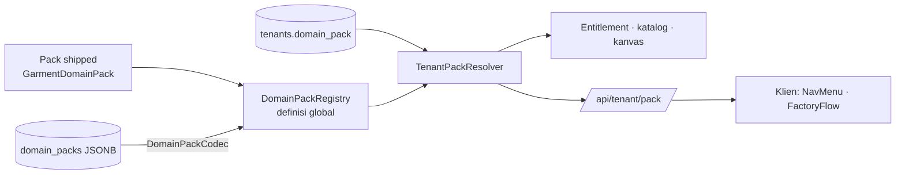

# TRD-PLAT-001 (B7): Domain Pack Dinamis per Tenant

## 1. Document Context and Administration

- **Title & Unique ID**: Domain Pack per tenant, `TRD-PLAT-001` bagian B7. Discovery:
  [`discovery-B7-tenant-pack.md`](../plannings/discovery-B7-tenant-pack.md) (Q1–Q5 disetujui 2026-09-29).

| Versi | Tanggal | Penulis | Catatan |
|---|---|---|---|
| 0.1 | 2026-09-29 | Achmad Jamaludin (dibantu Claude) | Draf dari discovery B7 |

### Summary & Business Context

Target platform: calon klien menjalani *self-service discovery*, lalu AI menerjemahkan kebutuhannya menjadi modul,
alur, dan wireframe. Tim developer mengimplementasikan modul itu di atas chassis. Syaratnya, **vertikal harus
menjadi data**. Sampai B6, satu pack garment dipakai semua tenant (`soleActivePack`). B7 membuat setiap tenant
menunjuk pack-nya sendiri. Pack bisa shipped (kode) atau tersimpan (JSON tervalidasi, format yang nanti ditulis AI).

**Stakeholders**:
- Product & Tech Lead: Achmad Jamaludin
- Implementasi: Claude (Jalur B)
- QA: snapshot akses B6 + tenant uji `klinik-uji`

### Goals

- Setiap tenant punya `domain_pack`. Pack diresolusi dari pack shipped ∪ tabel `domain_packs`.
- `DomainPackCodec` sebagai parser tunggal JSON ⇄ `DomainPack`, dengan validasi = invarian `DomainPack.init` +
  aturan namespace.
- `soleActivePack` dan `withSoleActivePackForTest` dihapus.
- Klien memuat pack tenant dari `GET /api/tenant/pack`.
- Superadmin mengelola pack dan menetapkannya ke tenant (fail-closed).

### Non-Goals

- Generator AI dan wizard discovery. B7 hanya menyiapkan kontraknya.
- Layar khusus untuk modul pack DB (memakai `/m/{code}`).
- Memindahkan tenant yang sudah punya data ke pack lain.

## 2. Functional Requirements

- **FR-1 Identitas global**: `ModuleId` dan `SlotCode` unik di seluruh platform. Pack DB wajib memberi prefiks
  kode pack (`klinik.antrean`). Tabrakan dengan pack yang sudah dikenal ditolak saat disimpan.
- **FR-2 Definisi tanpa tenant**: `ModuleId.displayName` dan extension sejenisnya mencari definisi di **semua**
  pack yang dikenal. Id yang tidak ditemukan tetap `error` seperti hari ini.
- **FR-3 Daftar milik tenant**: menu, sentinel entitlement "semua modul", katalog modul, kanvas, dan
  `PortCompatibility` memakai `pack(tenant)`.
- **FR-4 Resolusi**: `tenants.domain_pack` → pack shipped → `domain_packs` (versi terbaru `LOCKED`, atau `DRAFT`
  bila belum ada yang dikunci). Kode tak dikenal → 409 berisi pesan, bukan fallback garment.
- **FR-5 Versi**: pack `LOCKED` tidak berubah. Revisi = baris versi baru.
- **FR-6 API**:
  - `GET /api/tenant/pack` → JSON pack tenant (anggota tenant, *open by design*).
  - `GET/PUT /api/platform/domain-packs/{code}` → simpan draf / kunci (superadmin).
  - `PUT /api/platform/tenants/{id}/domain-pack` → tetapkan pack (superadmin, ditolak bila tenant sudah punya
    SPK/deal).

## 3. Non-Functional Requirements

| Category | Requirement | Rationale |
| :--- | :--- | :--- |
| **Security** | Snapshot akses B6 (690 keputusan) identik | Tenant garment tidak boleh berubah akses |
| **Security** | Endpoint platform fail-closed, dengan test 403 untuk owner tenant | Kontrak 7 |
| **Availability** | Migrasi aditif, dengan default `garment` yang benar untuk semua baris | Rollback = revert kode; kolom tanpa pembaca aman |
| **Performance** | Pack DB di-cache per `code+version`, invalidasi saat simpan | Resolusi pack ada di setiap request bergerbang |
| **Maintainability** | Satu codec, satu resolver | Kontrak 4 |

## 4. System Architecture

- `DomainPackRegistry` berisi pack shipped + `register(pack)` untuk pack yang dimuat (server: dari DB; klien: dari
  `/api/tenant/pack`). `registerAll` memvalidasi keunikan id global.
- `BusinessModules.entries` (tanpa tenant) diganti `pack.moduleIds`. Pemanggil yang tidak punya tenant (seed
  garment, test) memakai `GarmentDomainPack.pack` secara eksplisit.

## 5. Testing, Deployment, and Operations

| # | Tahap | Isi |
|---|---|---|
| B7a | Core registry | Registry multi-pack, lookup global, namespace, `DomainPackCodec` + round-trip garment |
| B7b | Hapus `soleActivePack` | Setiap pemakai dapat pack eksplisit (tenant / garment); test seam dihapus |
| B7c | Persistensi | V75 + `DomainPackRepository` + `TenantPackResolver` (+ cache) |
| B7d | Server | Entitlement/katalog dari pack tenant; `/api/tenant/pack`; endpoint platform + test 403 |
| B7e | Klien | Muat pack saat login; NavMenu & FactoryFlow memakai pack tenant |
| B7f | Bukti | `klinik-uji` dengan pack JSON: menu, `/m/…`, 403, snapshot garment identik |

**AC**:
- Snapshot B6 identik di setiap tahap.
- Round-trip codec garment identik.
- Pack JSON dengan id bertabrakan / tanpa prefiks / port tak terdaftar ditolak.
- `klinik-uji` di browser: menu dari pack klinik, 0 error console.
- core/app/server hijau, JVM/Wasm/JS terkompilasi.
