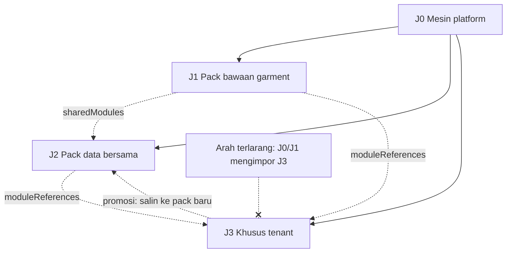

# TRD-PLAT-004: Jalur Kepemilikan Modul — Mesin, Pack Bersama, dan Khusus Tenant

## 1. Document Context and Administration

- **Title & Unique ID**: TRD-PLAT-004 — Jalur Kepemilikan Modul
- **Status**: **Draf usulan.** Bagian "Temuan terverifikasi" berasal dari kode; bagian "Usulan" butuh keputusan.
- **Revision History**:

| Versi | Tanggal | Penulis | Catatan |
|---|---|---|---|
| 0.1 | 2026-10-08 | Claude (draf) + Achmad Jamaludin | Dari diskusi TRD-FLOW-003: bagaimana modul builder, modul spesialis yang dipakai ulang, dan modul khusus satu tenant tidak bercampur |

- **Summary & Business Context**: Platform akan punya tiga jenis modul yang lahir dari proses berbeda
  (mesin platform; modul spesialis yang dipakai ulang; modul khusus satu tenant) dan dua cara berjalan
  (data-driven lewat DB, code-backed lewat kode). Tanpa pagar yang tegas, kode satu tenant bocor ke mesin,
  modul spesialis tak bisa dipakai ulang, dan alur lewat-DB dan lewat-kode saling mengintip tabel.
  Dokumen ini memetakan pagar yang **sudah ada**, menunjukkan **lubangnya**, dan mengusulkan aturan penutupnya.
- **Rujukan**: TRD-PLAT-001 (blueprint, business-module, tenant-pack), TRD-PLAT-002 (builder), PLAN-builder-console,
  `module-integration-rules.md` §5, `tenant-variability-rules.md`, TRD-FLOW-003 §1 (Non-Goals: jalur narasi).
- **Stakeholders & Approvers**: Tech Lead (keputusan §4.5), Product (definisi "modul bersama"), QA (tes arsitektur),
  tim software house (alur permintaan pembuatan).

### Goals (In-Scope)
1. Definisi **tiga jalur kepemilikan** dan **dua mode implementasi**, dengan aturan arah ketergantungan.
2. Daftar pagar yang sudah ada dan lubang yang terverifikasi.
3. Aturan penutup lubang yang dapat diuji otomatis (tes arsitektur, penegakan `owner_tenant_id`).
4. Jalur promosi modul khusus-tenant menjadi modul bersama.
5. Pertanyaan Discovery tambahan: "dapat dipakai ulang?" saat modul lahir.

### Non-Goals (Out-of-Scope)
- Memecah binary per tenant atau repo per tenant (lihat §4.5, keputusan P3: tidak disarankan sekarang).
- Marketplace modul antar organisasi, penagihan modul bersama.
- Jalur narasi → konfigurasi (TRD lanjutan; dokumen ini hanya menyiapkan kepemilikannya).
- Mengubah `BusinessModule`/RBAC; kepemilikan di sini tidak menambah modul baru ke kuota.

## 2. Functional Requirements

**Jalur kepemilikan** (tiap artefak — modul, tabel, route, kelas — punya tepat satu):

| Jalur | Isi | Cara lahir | Boleh bergantung pada |
|---|---|---|---|
| **J0 Mesin platform** | RBAC, kanvas, entitlement, builder, `DomainPack` | Kode, dirilis bersama | tidak ada jalur lain |
| **J1 Pack bawaan** | `garment` (+ modul bersama `sharedModules`) | Kode, dirilis bersama | J0 |
| **J2 Pack data bersama** | Modul spesialis yang dipakai ulang antar tenant | Data (pack LOCKED) dan/atau kode | J0, J1 yang ditawarkan `sharedModules` |
| **J3 Khusus tenant** | Modul satu tenant (`layanan_*`, `klinik_*`) | Data (builder), lalu permintaan pembuatan bila perlu kode | J0, serta J1/J2 hanya lewat `moduleReferences` |

**Mode implementasi** (atribut terpisah dari jalur):
- **DATA_DRIVEN**: didefinisikan `ModuleDefinition` di pack; dilayani runtime generik (`/m/{code}`); baris di
  penyimpanan generik.
- **CODE_BACKED**: punya route, layar, dan tabel sendiri yang terdaftar di `RouteOwnership` dan `ModuleSchemaMap`.

**FR-1** Kedua mode memakai **kontrak yang sama di perbatasan**: `ModuleDefinition` (id, slot, port, scope). Kanvas,
RBAC, dan entitlement hanya membaca itu.
**FR-2** Modul saling bicara **hanya lewat port bertipe** (`PortType`) dan `moduleReferences`; tidak ada panggilan
langsung, dan tidak ada akses tabel lintas jalur (kecuali tabel platform pada daftar putih, §4.3).
**FR-3** Jalur sebuah artefak **dapat diturunkan secara mekanis** dari id modulnya (prefiks pack), bukan dari
catatan manual.
**FR-4** Pack ber-`owner_tenant_id` **hanya dapat dipasang pada tenant pemilik itu**; selainnya ditolak (fail-closed).
**FR-5** Promosi J3 → J2 = **menyalin** ke pack baru dengan prefiks baru, mencatat asal; tidak mengganti nama
modul yang sudah punya tabel.
**FR-6** Modul CODE_BACKED yang belum dirilis tampil sebagai belum tersedia (mengikuti alur `QUEUED` →
`SHIPPED` yang ada), bukan gagal diam-diam.

## 3. Non-Functional Requirements (NFRs)

| Category | Requirement & Target Metrics | Rationale / Mitigation |
| :--- | :--- | :--- |
| **Performance** | Penegakan kepemilikan (cek prefiks, `owner_tenant_id`) O(1) per resolusi pack; tes arsitektur ≤ 30 dtk di CI | Resolusi pack terjadi di tiap request tenant |
| **Scalability** | Jumlah pack data tumbuh per tenant; tidak ada penyebaran kode per tenant di luar satu pohon sumber | Menghindari matriks rilis N tenant |
| **Security** | Pack milik tenant lain tidak dapat dipasang atau dibaca; RLS tabel modul tetap; tulis fail-closed dengan tes 403 | Isolasi data pelanggan adalah syarat dasar |
| **Availability & Reliability** | Rollback modul data = pin `domain_pack_version`; rollback modul kode = rilis ulang. Keduanya independen | Mode berbeda harus bisa dibalik tanpa saling mengunci |
| **Maintainability & Observability** | Kepemilikan dapat dilaporkan: skrip audit mencetak artefak per jalur; pelanggaran arah ketergantungan menggagalkan CI | "Dilaporkan, tidak memblokir" tidak cukup untuk pagar yang menjaga isolasi |

## 4. System Architecture & Technical Design

### 4.1 Temuan terverifikasi (2026-10-08, dari kode)

| # | Temuan | Sumber |
|---|---|---|
| T1 | Pack bawaan (`shipped`, kode) dan pack data (`domain_packs`) adalah dua sumber terpisah; kode pack bawaan tidak boleh dipakai pack data | `DomainPackRegistry.identityViolations` |
| T2 | Modul/slot **baru** di pack data wajib berprefiks `<kode pack>_`; id yang dipakai banyak pack wajib berdefinisi identik | idem |
| T3 | `sharedModules` opt-in dan `moduleReferences` mengatur berbagi antar pack | `DomainPack`, `ModuleReferenceRules` |
| T4 | Satu schema DB per modul bernama kode modulnya; dijaga `ModuleSchemaOwnershipTest`; schema `builder` untuk konsol | `ModuleSchemaMap` |
| T5 | Tiap route `/api/tenant/*` punya pemilik; route tanpa pemilik menggagalkan `RouteOwnershipTest` | `RouteOwnership` |
| T6 | **Satu tenant = satu pack** (`tenants.domain_pack`), versi dipin lewat `tenants.domain_pack_version`; pack data berversi `DRAFT`/`LOCKED` | V75, V81 |
| T7 | Pilot J3 (`layanan_*`) **hidup di pohon sumber dan binary yang sama**: `LayananPilotPack` ada di `core`, dirujuk `RouteOwnership` di server, schema `layanan_change_request` lewat V90 | `RouteOwnership`, V90 |
| T8 | Permintaan pembuatan kode modul memakai antrean `builder.build_requests` (`QUEUED → … → SHIPPED`, `SUPERSEDED` saat deploy ulang), dengan brief beku | V83, V94–V95, `BuildRequest` |
| T9 | Generator handoff menghasilkan **kandidat PR untuk ditinjau manusia**, bukan menulis ke database atau pohon sumber | `SpecScaffoldGenerator` |
| T10 | Arsitektur B8 sengaja **mempertahankan FK dan JOIN lintas schema modul** | `ModuleSchemaMap` KDoc |

### 4.2 Lubang yang terverifikasi

| # | Lubang | Bukti | Akibat |
|---|---|---|---|
| **H1** | `domain_packs.owner_tenant_id` hanya **disimpan dan ditampilkan**; tidak ada yang menegakkannya saat tenant dipasangi pack | grep: dipakai hanya di repository dan `DomainPackRoutes` (baca/tulis). `ResolveDomainPackUseCase.invoke(code)` menerima **hanya kode pack, tanpa tenant**, dan `DomainPackRegistry.find` bersifat global per proses, jadi pemilik tidak mungkin diperiksa di titik resolusi (diverifikasi dengan membaca use case-nya) | Pack "milik" satu tenant secara teknis dapat dipasang pada tenant lain |
| **H2** | Tidak ada tes yang melarang kode J0/J1 mengimpor kode J3 | `RouteOwnership` sudah mengimpor `LayananPilotPack` secara langsung | Setiap modul tenant baru menambah impor dari mesin ke kode tenant |
| **H3** | Karena T10, modul J3 boleh JOIN ke tabel modul lain | B8 | Modul khusus tenant bisa bergantung diam-diam pada skema modul bersama |
| **H4** | Jalur sebuah artefak tidak punya label eksplisit; hanya konvensi prefiks | T2 | Audit "apa saja milik tenant X" tidak bisa dijawab mesin |
| **H5** | Tidak ada pertanyaan "dapat dipakai ulang?" saat modul lahir; promosi nanti = ganti nama schema = migrasi | `ModuleSchemaMap` (schema = kode modul) | Modul yang ternyata berguna lintas tenant terkunci pada nama tenant-nya |

### 4.3 Usulan aturan penutup (butuh keputusan, §4.5)

- **U1 (H1)** `ResolveDomainPackUseCase` menolak pack ber-`owner_tenant_id` ≠ tenant yang meminta; penulisan
  `tenants.domain_pack` juga menolak. Fail-closed, tes 403/penolakan dengan tenant lain.
- **U2 (H2)** Tes arsitektur (pemindai sumber, pola `audit-variability.sh` tetapi **memblokir**): paket J0/J1
  tidak boleh mengimpor paket J3. Untuk memungkinkannya, J3 dikumpulkan di satu paket per pack
  (`…/pack/tenant/<kodepack>/…`), dan `RouteOwnership` membaca J3 lewat **registri terdaftar**, bukan impor langsung.
- **U3 (H3)** Pemindai migrasi J3: referensi lintas schema hanya ke daftar putih — `public.tenants`, `public.users`,
  schema miliknya sendiri, dan schema modul yang ia rujuk lewat `moduleReferences`.
- **U4 (H4)** Skrip audit mencetak artefak per jalur (modul, schema, route) dari prefiks; keluarannya dilampirkan di PR.
- **U5 (H5)** Tambahkan satu pertanyaan di `wemade-feature-discovery`: "Mungkin dipakai tenant lain? Jika ya,
  lahirkan di pack bersama sejak awal." Promosi = salin ke pack baru (`derivedFrom` dicatat), bukan ganti nama.
- **U6** Atribut mode (DATA_DRIVEN/CODE_BACKED) **diturunkan dari pendaftaran** (ada di `ModuleSchemaMap` dan
  `RouteOwnership` ⇒ CODE_BACKED), bukan field baru di `ModuleDefinition` (menghindari menyentuh aturan identitas
  global). Tes: modul yang punya tabel tetapi tidak terdaftar ⇒ gagal.



### 4.4 Alur lewat-DB dan lewat-kode

```
Narasi/brief ─► draf pack (DRAFT, domain_packs, owner = tenant)
                    │ LOCKED + dipin ke tenant (domain_pack_version)
                    ├─ modul DATA_DRIVEN ──► runtime generik /m/{code}   (siap pakai)
                    └─ modul butuh kode ───► builder.build_requests QUEUED ─► brief beku
                                              ─► kandidat PR (ditinjau manusia) ─► rilis ─► SHIPPED
                                              ─► modul pindah ke CODE_BACKED tanpa mengubah ModuleDefinition
Kedua mode ──► port bertipe / moduleReferences ──► modul lain   (tidak pernah tabel langsung)
```

Pindah dari DATA_DRIVEN ke CODE_BACKED **tidak mengubah id modul** dan karena itu tidak mengubah schema,
RBAC, atau entitlement; yang berubah hanya siapa yang melayaninya.

### 4.5 Keputusan yang diperlukan

| # | Keputusan | Rekomendasi | Alasan |
|---|---|---|---|
| **P1** | Tegakkan `owner_tenant_id` (U1) | **Ya, segera** | Satu-satunya lubang yang membuka kebocoran antar tenant; murah |
| **P2** | Tes arsitektur memblokir (U2) | Ya, setelah J3 dikumpulkan satu paket | Pagar tanpa gigi tidak menahan modul ke-2, ke-3 |
| **P3** | Kode J3 tetap di pohon sumber yang sama | **Ya untuk sekarang** | Memecah binary/repo per tenant menggandakan beban rilis; pagar P2 memberi isolasi yang cukup sampai ada tenant yang menuntut kode tertutup (kontrak, NDA) |
| **P4** | Batasi FK/JOIN lintas schema untuk J3 (U3) | Ya, hanya untuk J3 | Tidak mengubah B8 untuk modul garment |
| **P5** | Promosi = salin | Ya | Nama schema = kode modul |
| **P6** | Pertanyaan "dapat dipakai ulang?" di Discovery | Ya | Murah, mencegah H5 |

### 4.6 Assumptions, Constraints, & Dependencies
- Satu tenant = satu pack (T6) tetap berlaku; modul spesialis dipakai ulang lewat `sharedModules`/`moduleReferences`,
  bukan lewat pemasangan dua pack.
- Belum diverifikasi: (a) semantik `owner_tenant_id = NULL` untuk pack data (milik platform? bersama?); (b) apakah
  `moduleReferences` sudah menyertakan RBAC/kanvas atau baru data (KDoc B6 menyebut "data saja, belum ke RBAC/kanvas");
  (c) bagaimana kandidat PR J3 dari generator diberi lokasi paket saat ini.

## 5. Testing, Deployment, and Operations

### Technical Acceptance Criteria
1. Memasang pack ber-`owner_tenant_id` = A pada tenant B ditolak; pada tenant A diterima (tes dua arah).
2. Tes arsitektur gagal bila paket J0/J1 mengimpor paket J3 (diuji dengan fixture pelanggar).
3. Migrasi J3 yang mereferensikan schema modul di luar daftar putih gagal di pemindai.
4. Skrip audit mencetak artefak per jalur untuk `garment` dan `layanan`; modul bertabel tanpa pendaftaran ⇒ gagal.
5. Modul yang berpindah DATA_DRIVEN → CODE_BACKED mempertahankan id, schema, entitlement, dan hak akses peran.
6. Tenant kedua: pack J3 kedua (non-`layanan`) lolos semua tes di atas.

### Testing Strategy
- core: tes `DomainPackRegistry`/resolusi pack dengan pack berpemilik; pemindai sumber untuk U2.
- server: tes route dengan tenant tak berwenang (403) untuk pemasangan pack; `ModuleSchemaOwnershipTest` diperluas.
- Tidak ada UI baru; tidak ada cek visual.

### Monitoring & Error Handling
- Penolakan pack berpemilik lain dicatat `WARN` (tenant peminta, kode pack), tanpa membocorkan pemiliknya ke peminta.
- Audit kepemilikan dijalankan di CI dan sebelum merge.

### Deployment & Rollback Plan
1. U1 lebih dulu (perubahan perilaku kecil, tanpa migrasi; cek dulu bahwa tidak ada tenant yang kini memakai pack milik
   tenant lain — kueri sebelum rilis).
2. U2–U4 setelah J3 dikumpulkan; mulai dengan mode **melapor** satu rilis, lalu memblokir.
3. Rollback U1 = revert kode; tidak ada data yang diubah.
