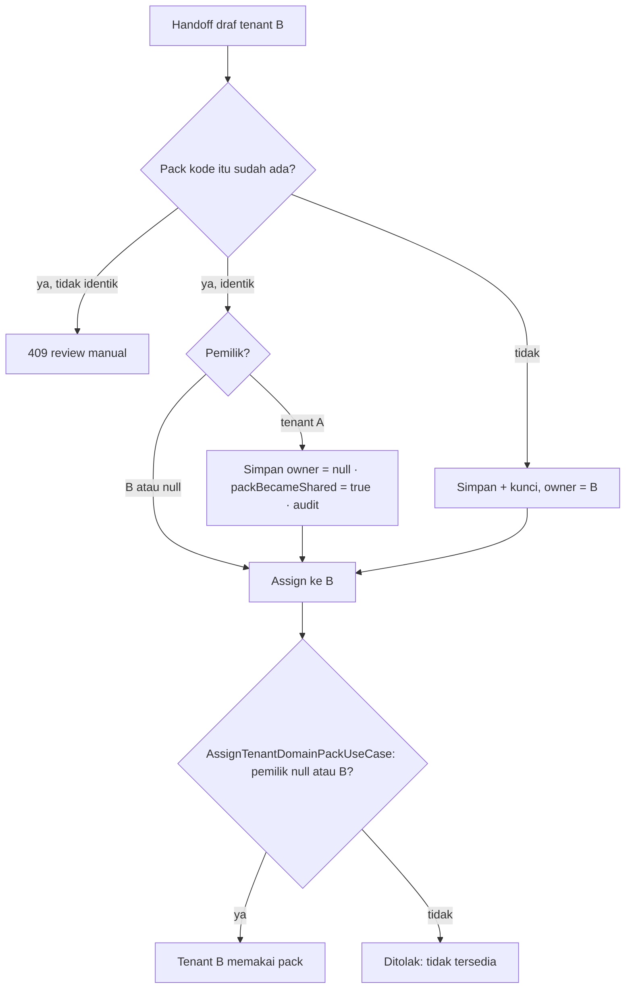

# TRD-PLAT-005: Penegakan Kepemilikan Pack dan Reuse Pack Identik

## 1. Document Context and Administration

- **Title & Unique ID**: TRD-PLAT-005 — Penegakan Kepemilikan Pack
- **Status**: Draf untuk ditinjau. Sebagian kode sudah ada di branch `feat/plat-004-p1-enforce-pack-owner` (belum di-commit, belum ditinjau).
- **Revision History**:

| Versi | Tanggal | Penulis | Catatan |
|---|---|---|---|
| 0.1 | 2026-10-08 | Claude (draf) + Achmad Jamaludin | Menjabarkan keputusan P1 TRD-PLAT-004. Fork per tenant dibatalkan: pack = kosakata + daftar modul, reuse yang identik wajar |

- **Summary & Business Context**: `domain_packs.owner_tenant_id` hanya disimpan dan ditampilkan; tidak ada yang
  menegakkannya (TRD-PLAT-004 lubang H1). Di sisi lain alur handoff **sengaja** memakai ulang pack terkunci bila
  draf prospek berikutnya identik. Penegakan pemilik apa adanya akan mematikan reuse itu. Pack adalah kosakata dan
  daftar modul, bukan data tenant (`garment` sendiri dipakai semua tenant), sehingga reuse identik sah. Keputusan:
  **pack berpemilik tetap privat; reuse identik oleh tenant lain melepasnya menjadi bersama, eksplisit dan tercatat.**
- **Rujukan**: TRD-PLAT-004 §4.2 H1, §4.5 P1; `DiscoveryHandoffUseCasesTest`; V75.
- **Stakeholders & Approvers**: Tech Lead (keputusan D1–D4), Product (arti "pack bersama"), QA, superadmin platform.

### Goals (In-Scope)
1. `AssignTenantDomainPackUseCase` menolak pemasangan pack milik tenant lain (dua arah, fail-closed).
2. Handoff yang memakai ulang pack identik milik tenant lain melepasnya menjadi bersama (`owner = null`) dan melaporkannya.
3. Pelepasan tercatat di audit, dan terlihat di respons API handoff.
4. Tes dua arah di core dan tes route di server (peran tak berwenang → 403 sudah dijamin gerbang superadmin; tambah kasus 409).
5. Kueri pemeriksaan data produksi sebelum rilis.

### Non-Goals (Out-of-Scope)
- Fork pack per tenant (kode pack baru, penulisan ulang prefiks modul): tidak perlu, lihat D1.
- Penegakan pada setiap request (`TenantResolutionPlugin`): ditunda, lihat D3.
- Membuat pack privat kembali setelah dibagikan, UI kelola kepemilikan, penagihan pack bersama.

## 2. Functional Requirements

**FR-1 Penegakan saat pemasangan.** `assign(tenantId, code)`: pemilik dibaca dari **versi tertinggi** pack itu
(`findLatest`). Bila pemilik ≠ null dan ≠ `tenantId` → gagal dengan "Pack X tidak tersedia untuk tenant ini."
Pesan tidak menyebut pemilik. Pemeriksaan berjalan **sebelum** jalan pintas "pack sudah sama", sehingga data lama
yang melanggar gagal keras saat dipasang ulang. Pack bawaan (tanpa baris repository) dan pack bersama (`null`)
tidak terpengaruh.

**FR-2 Reuse identik menjadi bersama.** Pada handoff, bila versi terkunci yang ada **identik** dengan draf
(aturan yang sudah ada) dan pemiliknya tenant lain: simpan ulang versi tertinggi dengan `ownerTenantId = null`,
tandai `packBecameShared = true`, baru lanjut `assign`. Bila pemiliknya tenant yang sama atau sudah `null`: tidak ada
perubahan, `packBecameShared = false`.

**FR-3 Draf tidak identik tetap ditolak.** Perilaku "butuh review manual" (409) tidak berubah; pelepasan hanya
terjadi pada reuse yang identik.

**FR-4 Pelaporan.** Respons handoff memuat `packBecameShared`. Pelepasan dicatat audit
(`TENANT_DOMAIN_PACK_SHARED`, tenant pemicu, kode pack), tanpa membocorkan id pemilik lama ke pemanggil non-superadmin.

**FR-5 Revisi pack.** Pemilik dibaca dari versi tertinggi; draf revisi yang disimpan lewat `PUT /api/admin/domain-packs/{code}`
mengikuti `ownerSlug` yang dikirim superadmin (tanpa `ownerSlug` = bersama). Konsekuensinya didokumentasikan di D4.

## 3. Non-Functional Requirements (NFRs)

| Category | Requirement & Target Metrics | Rationale / Mitigation |
| :--- | :--- | :--- |
| **Performance** | +1 baca `findLatest` per pemasangan pack (jarang, jalur superadmin) | Bukan jalur request tenant |
| **Scalability** | Tidak ada tabel atau kolom baru | `owner_tenant_id` sudah ada (V75) |
| **Security** | Pack milik tenant lain tidak dapat dipasang; pesan tidak membocorkan pemilik; pelepasan tercatat audit | Isolasi antar tenant; pelepasan adalah keputusan yang harus terlacak |
| **Availability & Reliability** | Tanpa migrasi; rollback = revert kode. Tenant yang sudah terpasang tidak berubah | Penegakan hanya pada penulisan, bukan pembacaan |
| **Maintainability & Observability** | Satu tempat aturan (use case di `core`); `packBecameShared` terlihat di respons dan audit | Mengikuti DDD: aturan di domain, bukan route |

## 4. System Architecture & Technical Design

### 4.1 Alur



Jalur pemasangan langsung (`PUT /api/admin/tenants/{slug}/domain-pack`) hanya melewati kotak terakhir.

### 4.2 Perubahan komponen
- `core/.../pack/usecases/DomainPackUseCases.kt`: `AssignTenantDomainPackUseCase(tenants, probe, packRepository)`.
- `core/.../discovery/usecases/DiscoveryHandoffUseCases.kt`: cabang reuse + `HandoffResult.packBecameShared`.
- `core/.../audit/AuditAction.kt`: `TENANT_DOMAIN_PACK_SHARED`.
- `server/.../routes/DomainPackRoutes.kt`: meneruskan `packRepository`.
- `server/.../routes/DiscoveryRoutes.kt` dan `DiscoveryRouteFactory.kt`: respons dan audit pelepasan.
- Tidak ada perubahan schema, `ModuleSchemaMap`, `RouteOwnership`, RBAC, atau entitlement.

### 4.3 Data Model & Schema
Tidak ada. `domain_packs.owner_tenant_id VARCHAR(64) NULL REFERENCES tenants(id)` dipakai apa adanya.

### 4.4 API Specifications
- `PUT /api/admin/tenants/{slug}/domain-pack` — gagal dengan **409** + "Pack X tidak tersedia untuk tenant ini." bila pack berpemilik lain.
- `POST /api/discovery/drafts/{id}/handoff` (path mengikuti `DiscoveryRoutes`) — respons 201 ditambah `"packBecameShared": true|false`.

### 4.5 Keputusan Desain dan Tradeoff

| # | Keputusan | Alasan | Alternatif ditolak |
|---|---|---|---|
| **D1** | Reuse identik melepas pack menjadi bersama; **tidak** fork per tenant | Pack = kosakata + modul; konten identik berarti tenant B tidak mempelajari apa pun dari A. Fork menulis ulang 23+ file referensi `ModuleId`, mengubah id modul, schema, RBAC | Fork per tenant: biaya besar tanpa manfaat isolasi nyata di kasus ini. Tolak reuse: mematikan alur handoff yang disengaja |
| **D2** | Pemilik dibaca dari versi tertinggi | `assign` memakai `findLatest`; revisi draf tidak melepas kepemilikan | Membaca versi efektif: draf revisi bisa dilewati |
| **D3** | Tidak menegakkan pada request-time sekarang | Tenant sandbox pratinjau (`DiscoveryPreviewUseCases`) sengaja memakai kode pack milik tenant lain; menolaknya merusak pratinjau. Perlu pengecualian yang dirancang, bukan konvensi prefiks id | Menegakkan di `TenantResolutionPlugin` dengan pengecualian id `ten-sandbox-*`: rapuh |
| **D4** | Pelepasan satu arah; `PUT ... ?ownerSlug=` dapat memprivatkan kembali | Tidak ada kasus bisnis "tarik kembali" yang diminta; superadmin yang menulis ulang kepemilikan harus sadar efeknya | UI kelola kepemilikan: di luar scope |
| **D5** | Pelepasan hanya menulis versi tertinggi | Repository tidak punya daftar versi; `assign` hanya membaca versi tertinggi | Menulis semua versi: butuh perluasan port |

### 4.6 Assumptions, Constraints, & Dependencies
- Asumsi: pack yang identik **tidak** membocorkan konten privat A ke B, karena B yang menyuplai draf identiknya.
- Konstrain: `DomainPackUseCases.kt` dan `DiscoveryHandoffUseCases.kt` tetap di bawah soft limit lapisan `core/` (diperiksa di review; ratchet bila di atas).
- Belum diverifikasi: ukuran baris kedua file setelah perubahan; ada tidaknya konsumen lain `HandoffResult` di luar `DiscoveryRoutes`; apakah `AuditLogRepository` mudah dijangkau dari `DiscoveryRouteFactory`.

## 5. Testing, Deployment, and Operations

### Technical Acceptance Criteria
1. Pemilik boleh dipasangi pack miliknya; tenant lain ditolak; tenant tidak berubah; pesan tidak memuat id pemilik.
2. Pack bersama (`null`) dan pack bawaan `garment` dapat dipasang pada tenant mana pun.
3. Pemasangan ulang pack yang sama oleh bukan pemilik gagal (tidak lolos lewat jalan pintas "sudah sama").
4. Revisi draf (versi tertinggi DRAFT) tidak melepas kepemilikan.
5. Handoff kedua yang identik oleh tenant lain **berhasil**, `packBecameShared = true`, `owner = null`, dan tenant kedua memakai pack itu.
6. Handoff oleh pemilik sendiri atau atas pack sudah bersama: `packBecameShared = false`.
7. Draf tidak identik tetap 409 "review manual"; tidak ada tenant yatim.
8. `PUT /api/admin/tenants/{slug}/domain-pack` untuk pack milik tenant lain → 409; superadmin sah dan pemilik → 200.
9. Pelepasan menghasilkan satu entri audit `TENANT_DOMAIN_PACK_SHARED`.

### Testing Strategy
- **core (commonTest)**: `AssignTenantDomainPackOwnerTest` (6 kasus, sudah ada di branch); `DiscoveryHandoffUseCasesTest`
  diperbarui (reuse berhasil + dibagikan; pemilik sendiri tidak dibagikan).
- **server**: tambah kasus ke `DomainPackApiTest` (409/200) dan tes respons handoff; tes gerbang peran tak berwenang
  (non-superadmin → 403) pada kedua endpoint.
- Tenant kedua: kasus memakai pack `klinik` (non-garment); tidak ada UI, tidak ada cek visual.
- Kompilasi: core JVM/JS/Wasm, `app:shared` JVM/JS/Wasm, `server` main dan test.

### Monitoring & Error Handling
- Penolakan pemasangan dicatat `WARN` (tenant peminta, kode pack), tanpa id pemilik.
- Pelepasan dicatat audit, dan muncul di respons handoff untuk superadmin.

### Deployment & Rollback Plan
1. **Sebelum rilis**, jalankan di DB produksi (hanya baca):
   ```sql
   SELECT t.id AS tenant, t.domain_pack, p.owner_tenant_id
   FROM tenants t
   JOIN (SELECT DISTINCT ON (code) code, owner_tenant_id FROM domain_packs ORDER BY code, version DESC) p
     ON p.code = t.domain_pack
   WHERE p.owner_tenant_id IS NOT NULL AND p.owner_tenant_id <> t.id;
   ```
   Hasil kosong = aman. Hasil ada = putuskan per baris (lepas jadi bersama, atau pindahkan tenant) **sebelum** rilis,
   karena tenant itu tidak bisa dipasang ulang setelah rilis.
2. Rilis: tanpa migrasi, tanpa urutan khusus.
3. Rollback: revert kode. Pack yang telah dilepas menjadi bersama **tetap** bersama (data, tidak dikembalikan otomatis).
   Bila perlu, kembalikan manual lewat `PUT /api/admin/domain-packs/{code}?ownerSlug=…`.
4. Pada DB dev yang diperiksa (`wemake_erp`, `wemake_dp_c_scratch`, `wemake_erp_scratch_b`): 0 pelanggaran (2026-10-08).
