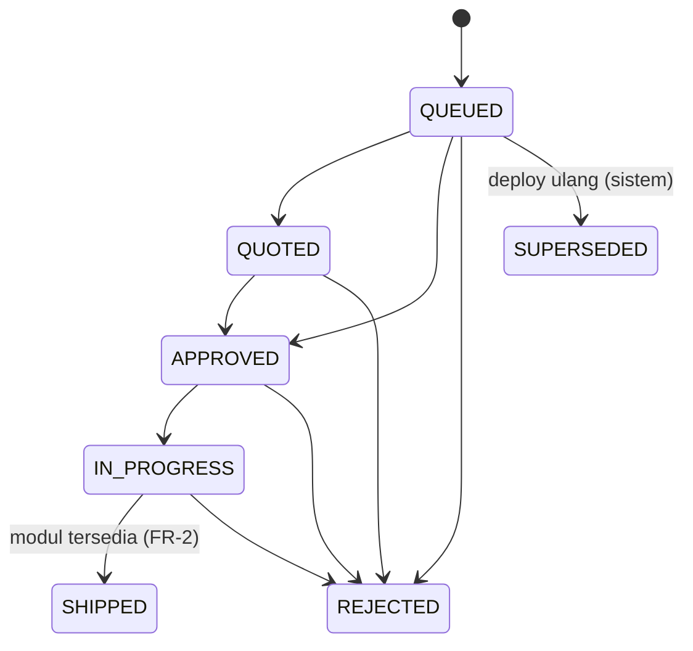

# TRD-PLAT-006: Siklus Permintaan Build dan Aktivasi Deployment (Jalur 1 Builder)

## 1. Document Context and Administration

- **Title & Unique ID**: TRD-PLAT-006 — Siklus Build ↔ Registri ↔ Deployment
- **Status**: **Draf usulan.** Fakta di §4.1 dibaca dari kode (2026-10-08); keputusan di §4.5 menunggu persetujuan. Belum ada kode.
- **Revision History**:

| Versi | Tanggal | Penulis | Catatan |
|---|---|---|---|
| 0.1 | 2026-10-08 | Claude (draf) + Achmad Jamaludin | Dari `PLAN-builder-next-three-tracks.md` Jalur 1 |

- **Summary & Business Context**: Saat sebuah tenant men-deploy pack kustom, platform membuat satu `BuildRequest` per modul dan deployment `BLOCKED_ON_BUILD`. Tim platform lalu membangun kodenya. Hari ini **tidak ada yang menghubungkan "kode selesai dibangun" dengan "tenant boleh jalan"**: status `SHIPPED` hanya mengubah satu kolom, tidak ada kode yang memindahkan deployment ke `ACTIVE`, dan tidak ada pemeriksaan bahwa modulnya benar-benar ada di rilis. Akibatnya modul bisa tercatat "shipped" padahal tidak hidup, dan go-live tenant bergantung pada langkah yang tidak ada di sistem.
- **Rujukan**: TRD-PLAT-002 (builder, FR-M2-1/2/4), TRD-PLAT-004 (jalur kepemilikan, registri `TenantPackContributions`), TRD-PLAT-005 (kepemilikan pack), `PLAN-builder-next-three-tracks.md` Jalur 1.
- **Stakeholders & Approvers**: Tech Lead (keputusan §4.5), Product (aturan go-live), tim software house (operator antrean), QA.

### Goals (In-Scope)
1. Mesin status `BuildRequestStatus` yang eksplisit; lompatan ilegal ditolak.
2. `SHIPPED` hanya sah bila modulnya **tersedia** (milik pack bawaan atau terdaftar di registri modul tenant).
3. Go-live eksplisit untuk deployment `BLOCKED_ON_BUILD`: satu use case yang dapat diaudit, memakai langkah aktivasi yang sama dengan jalur `ACTIVE` langsung.
4. Audit tiap perubahan status dan tiap go-live.
5. Penjaga agar draf yang berubah setelah brief dibekukan tidak diaktifkan diam-diam.

### Non-Goals (Out-of-Scope)
- Runtime generik untuk modul pack data (tidak ada di kode; lihat PLAN F4).
- Penegakan pemilik pack di deploy dan rollback (Jalur 2).
- Penagihan, penawaran harga, dan ledger `moduledev` (tidak diubah).
- Self-service tenant untuk mengubah status build (tetap khusus superadmin platform).
- Mengubah aturan "pack bukan bawaan = semua modul masuk antrean" (dicatat sebagai pertanyaan terbuka Q1, bukan diubah di sini).

## 2. Functional Requirements

**FR-1 Mesin status build.** Transisi sah (selain itu 409):

| Dari | Ke |
|---|---|
| `QUEUED` | `QUOTED`, `APPROVED`, `REJECTED` |
| `QUOTED` | `APPROVED`, `REJECTED` |
| `APPROVED` | `IN_PROGRESS`, `REJECTED` |
| `IN_PROGRESS` | `SHIPPED`, `REJECTED` |
| `SHIPPED`, `REJECTED`, `SUPERSEDED` | *(final)* |

Status sama dengan status sekarang = no-op sukses (idempoten). `SUPERSEDED` tetap hanya dikelola sistem (deploy ulang). `QUEUED→APPROVED` diizinkan karena build internal tanpa penawaran tetap sah (keputusan J1-3).

**FR-2 Keberadaan modul.** `→ SHIPPED` ditolak (409) kecuali modul permintaan **tersedia**: `moduleId` ada di pack bawaan (`DomainPackRegistry.shipped`) **atau** diklaim oleh sebuah kontribusi `TenantPackContributions` (kunci `tables`). Pesan menyebut modul dan alasan, tanpa membocorkan data tenant lain.

**FR-3 Go-live deployment `BLOCKED_ON_BUILD`.** Use case `ActivateBlockedDeploymentUseCase(deploymentId)` (khusus superadmin):
1. Deployment harus berstatus `BLOCKED_ON_BUILD` dan milik tenant yang sama dengan permintaan-permintaannya.
2. Semua `BuildRequest` deployment itu yang tidak `SUPERSEDED` harus `SHIPPED`. Satu saja `REJECTED`/belum selesai ⇒ 409 dengan daftar modul penghalang.
3. Semua kode modul aktif di blueprint draf harus **tersedia** (definisi FR-2).
4. Penjaga draf (FR-5) lolos.
5. Aktivasi memakai **langkah yang sama dengan jalur `ACTIVE` langsung** (diekstrak menjadi satu fungsi bersama): deployment aktif lama `SUPERSEDED` (mewarisi versi), deployment baru `ACTIVE`, draf `LOCKED`, `tenants.domainPackVersion` di-pin, jam trial dimulai bila belum.
6. Audit `BUILDER_DEPLOYMENT_ACTIVATED` (aksi yang sudah ada), aktor = superadmin.

**FR-4 Audit status.** Aksi audit baru `BUILD_REQUEST_STATUS_CHANGED` (aktor, tenant sasaran, modul, dari, ke). Kegagalan menulis audit tidak menggagalkan perubahan yang sudah sah (pola yang sudah dipakai `recordAudit`).

**FR-5 Penjaga draf basi.** Saat deployment `BLOCKED_ON_BUILD` dibuat, simpan **sidik jari** (SHA-256) dokumen draf pada deployment. Saat go-live, sidik jari draf sekarang harus sama; bila beda ⇒ 409 "draf berubah sejak brief; deploy ulang sebagai revisi". Deployment lama tanpa sidik jari (`null`) memerlukan konfirmasi eksplisit `acknowledgeUnverifiedDraft=true` dan dicatat di audit.

**FR-6 Tampilan operator.** Panel antrean (Track C) menampilkan transisi yang sah per baris, alasan penolakan dari server, dan tombol go-live per deployment yang semua permintaannya `SHIPPED`.

## 3. Non-Functional Requirements (NFRs)

| Category | Requirement & Target Metrics | Rationale / Mitigation |
| :--- | :--- | :--- |
| **Performance** | Perubahan status ≤ 3 query (baca permintaan, tulis, audit); go-live ≤ 8 query; antrean puluhan permintaan | Konsol operator, bukan jalur panas tenant |
| **Scalability** | Pemeriksaan "tersedia" O(jumlah kontribusi), dibaca dari objek statis | Registri dikompilasi, tidak ada I/O |
| **Security** | Semua endpoint baru fail-closed: tanpa sesi 401, selain `PLATFORM_SUPERADMIN` 403; isolasi tenant lewat RLS tabel `builder`; pesan galat tidak memuat data tenant lain | Antrean lintas tenant hanya untuk platform |
| **Availability & Reliability** | Go-live atomik terhadap invarian "tepat satu deployment aktif" (ditegakkan `save` repository); kegagalan di tengah tidak boleh meninggalkan dua aktif atau nol aktif | Urutan: supersede lama → simpan baru; bila simpan baru gagal, pulihkan yang lama (lihat §4.2) |
| **Maintainability & Observability** | Satu fungsi aktivasi bersama untuk dua jalur; log `INFO` tiap transisi dan go-live; audit tersimpan | Dua salinan logika aktivasi akan menyimpang |

## 4. System Architecture & Technical Design

### 4.1 Temuan terverifikasi (2026-10-08)

| # | Temuan | Sumber |
|---|---|---|
| T1 | Pack bukan bawaan ⇒ semua kode modul aktif blueprint → `BuildRequest QUEUED`, deployment `BLOCKED_ON_BUILD`; pack bawaan ⇒ `ACTIVE` langsung (draf dikunci, versi di-pin, trial mulai) | `DeployTenantUseCase` |
| T2 | Jalur `BLOCKED_ON_BUILD` **tidak mengunci draf** dan tidak mem-pin `tenants.domainPackVersion`; hanya jalur `ACTIVE` melakukannya. Draf tetap bisa diubah dan deploy ulang = revisi | idem |
| T3 | `POST /api/builder/build-queue/{id}/status` mengganti status begitu saja (`existing.copy(status = status)`), tanpa mesin status dan tanpa audit | `BuilderBuildQueueRoutes.kt` |
| T4 | Tidak ada kode yang mengubah deployment `BLOCKED_ON_BUILD` menjadi `ACTIVE` | grep `BLOCKED_ON_BUILD`/`SHIPPED` seluruh `core` dan `server/src/main` |
| T5 | `BuilderApiClient` hanya punya `buildQueue()` dan `brief`; **tidak ada panggilan klien untuk mengubah status** — endpoint status hanya terjangkau lewat API langsung | `BuilderApiClient.kt` |
| T6 | `Deployment.isActive` = `ACTIVE` atau `IMPORTED`; `BLOCKED_ON_BUILD` bukan aktif, jadi selama diblokir tenant tetap berjalan di deployment sebelumnya | `BuilderDeployment.kt` |
| T7 | Deploy builder tidak menyimpan pack kustom ke `domain_packs` dan tidak memakai `ResolveDomainPackVersionUseCase` (tidak dipanggil di `core`/`server/src/main` di luar paketnya); penyimpanan pack hanya terjadi di jalur handoff dan route admin | grep `SaveDomainPackDraftUseCase`, `ResolveDomainPackVersionUseCase` |
| T8 | Modul tenant didaftarkan saat kompilasi lewat `TenantPackContributions` (`tables` per modul) | TRD-PLAT-004 Track B |

### 4.2 Desain

**Komponen (core, `domain/builder`)**
- `BuildRequestTransitions` — tabel transisi murni dan `check(from, to)`.
- `ModuleAvailability` — `fun interface { fun isAvailable(moduleId: ModuleId): Boolean }`. Port domain; implementasi server memeriksa pack bawaan dan `TenantPackContributions`. Domain **tidak** mengimpor registri server, dan tes dapat memasang fake — inilah cara menguji tenant/modul kedua.
- `ChangeBuildRequestStatusUseCase(requests, availability)` — FR-1, FR-2.
- `ActivateDeploymentSteps` — fungsi bersama aktivasi (diekstrak dari `DeployTenantUseCase`; perilaku jalur `ACTIVE` tidak boleh berubah — dijaga tes paritas yang sudah ada).
- `ActivateBlockedDeploymentUseCase` — FR-3, FR-5.

**Urutan aktivasi dan pemulihan** (FR-3.5): supersede lama → simpan baru `ACTIVE` → kunci draf → pin versi tenant. Bila langkah setelah supersede gagal, deployment lama dikembalikan `ACTIVE` dan galat dilempar; tidak ada keadaan "nol aktif". Pemulihan adalah kompensasi, bukan transaksi, dan celahnya dicatat di KDoc.

### 4.3 Data Model & Schema
- **V97 (aditif, nullable)**: `builder.deployments.draft_fingerprint VARCHAR(64) NULL`. Tidak ada tabel baru, tidak ada backfill. Rollback: `DROP COLUMN` (tidak ada data lain bergantung).
- Tidak ada perubahan pada `builder.build_requests` (status `SHIPPED` sudah ada di `CHECK`).
- Aksi audit baru `BUILD_REQUEST_STATUS_CHANGED` (enum core; kolom audit menyimpan kode string, diperiksa dulu apakah ada `CHECK` yang membatasi nilai).

### 4.4 API Specifications
- `POST /api/builder/build-queue/{id}/status?status=…` — kontrak lama dipertahankan. Tambahan: 404 permintaan tak ada (tetap), 409 transisi ilegal atau modul belum tersedia (`{"error": "...", "from": "...", "to": "..."}`), 400 `SUPERSEDED` (tetap). Respons 200 menyertakan `from`.
- `POST /api/builder/build-queue/deployments/{deploymentId}/activate` — body opsional `{"acknowledgeUnverifiedDraft": true}`. 200 → deployment aktif; 409 → `{"blockers": [{"moduleId","reason"}]}`; 404; 401/403.
- Keduanya di belakang `superadminGate()` yang sudah ada.

### 4.5 Keputusan yang diperlukan

| # | Keputusan | Rekomendasi | Alasan |
|---|---|---|---|
| **J1-1** | Go-live manual atau otomatis saat build terakhir `SHIPPED` | **Manual** | Ada verifikasi manusia di antara rilis kode dan tenant berjalan; otomatis menjadikan satu klik status sebagai go-live |
| **J1-2** | `SHIPPED` untuk modul yang belum tersedia | **Ditolak** | Inilah celah utama (T3/T4) |
| **J1-3** | `QUEUED→APPROVED` tanpa `QUOTED` | **Diizinkan** | Build internal tanpa penawaran |
| **J1-4** | Penjaga draf basi lewat sidik jari (FR-5) | **Ya, dengan konfirmasi eksplisit untuk deployment lama** | T2: draf tidak dikunci pada jalur blocked, jadi brief bisa menyimpang dari kode yang dikirim |
| **J1-5** | Mengunci draf saat deploy `BLOCKED_ON_BUILD` | **Tidak** | Akan memecah alur revisi (deploy ulang = revisi) yang baru dibangun |

### 4.6 Assumptions, Constraints, & Dependencies
- Pertanyaan terbuka **Q1**: T1 memasukkan *semua* kode modul aktif ke antrean, termasuk modul platform yang dipakai bersama (mis. `org_chart`) bila blueprint memuatnya. Belum diverifikasi apakah blueprint kustom memuatnya. Bila ya, FR-2/FR-3 tetap benar (modul pack bawaan dianggap tersedia), tetapi antreannya berisik; memperbaiki pembuatan antrean di luar scope.
- Pertanyaan terbuka **Q2** (menyangkut T7): bagaimana pack kustom milik tenant builder tersimpan di `domain_packs` dan dipilih `tenants.domain_pack` bila tidak lewat handoff. Go-live di TRD ini mengaktifkan **deployment**; kecukupan penyimpanan pack ditangani Jalur 2.
- Bergantung pada TRD-PLAT-004 Track B (registri) dan TRD-PLAT-005.

## 5. Testing, Deployment, and Operations

### Technical Acceptance Criteria
1. Setiap pasangan (dari, ke) pada tabel FR-1 diuji: sah ⇒ berhasil, tidak sah ⇒ 409; idempoten pada status sama.
2. `→ SHIPPED` untuk modul tidak tersedia ⇒ 409; untuk modul tersedia ⇒ 200. Diuji dengan **dua** modul tenant berbeda (fake `ModuleAvailability`) dan satu modul pack bawaan.
3. Go-live ditolak bila ada permintaan non-final, `REJECTED`, atau modul tak tersedia; daftar penghalang akurat.
4. Go-live sukses menghasilkan: tepat satu deployment `ACTIVE`, lama `SUPERSEDED`, draf `LOCKED`, `domainPackVersion` terpin, trial dimulai (tidak diatur ulang bila sudah ada), audit tercatat.
5. Kegagalan di tengah aktivasi mengembalikan deployment lama `ACTIVE` (tes dengan repository yang gagal pada langkah ke-N).
6. Draf berubah setelah deploy blocked ⇒ go-live 409; deployment lama tanpa sidik jari memerlukan `acknowledgeUnverifiedDraft`.
7. **403** untuk non-superadmin dan **401** tanpa sesi pada kedua endpoint; tidak ada kebocoran data tenant lain pada pesan galat.
8. Paritas: tes `DeployTenantUseCase` jalur `ACTIVE` yang ada tetap hijau tanpa diubah.

### Testing Strategy
- core: unit murni untuk tabel transisi dan use case dengan fake repository.
- server: tes HTTP (pola `BuilderBuildQueue*`/`BuilderRouteGateTest`), tes migrasi V97 dalam `BEGIN … ROLLBACK`.
- app/shared: tes ViewModel panel antrean dengan API palsu (Track C). Cek visual panel antrean (login superadmin demo).

### Monitoring & Error Handling
- Log `INFO` per transisi dan go-live (id permintaan/deployment, aktor); `WARN` pada pemulihan aktivasi.
- Audit `BUILD_REQUEST_STATUS_CHANGED` dan `BUILDER_DEPLOYMENT_ACTIVATED`.

### Deployment & Rollback Plan
1. **Sebelum rilis**: kueri pemeriksaan produksi — daftar `build_requests` berstatus `SHIPPED` atau `IN_PROGRESS` dan deployment `BLOCKED_ON_BUILD` yang ada, supaya mesin status baru tidak mengejutkan siapa pun (mesin hanya menegakkan transisi **baru**, data lama tidak ditulis ulang).
2. Rilis berurutan: migrasi V97 → kode core/server → UI.
3. Rollback: revert kode; V97 aditif dan dapat dibiarkan; tidak ada data yang diubah oleh rilis ini selain baris baru.
