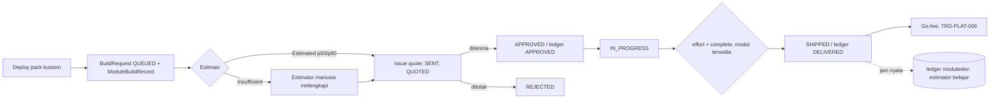

# TRD-PLAT-007: Estimasi dan Penawaran Terhubung ke Antrean Build (Jalur 0 Builder)

## 1. Document Context and Administration

- **Title & Unique ID**: TRD-PLAT-007 — Estimasi → Penawaran → Persetujuan → Build → Selesai, terhubung ke `BuildRequest`
- **Status**: **Draf usulan.** Fakta §4.1 dibaca dari kode (2026-10-08); keputusan §4.5 menunggu persetujuan. Belum ada kode.
- **Revision History**:

| Versi | Tanggal | Penulis | Catatan |
|---|---|---|---|
| 0.1 | 2026-10-08 | Claude (draf) + Achmad Jamaludin | Dari pertanyaan "penawaran harga itu bagaimana konsepnya"; produk belum launch, jadi tanpa migrasi kompatibilitas |

- **Summary & Business Context**: Platform sudah punya mesin harga yang matang di ledger `moduledev`: estimasi dari build serupa (`BuildEstimator`, p50/p90), penawaran dari p90 (`QuoteModulePriceUseCase`), dan pencatatan jam nyata. Tetapi **semua itu terputus dari antrean build tenant**: `BuildRequest` lahir tanpa estimasi, `quoteId`-nya tidak pernah diisi, `ModulePricingQuote.send()`/`accept()` tidak dipanggil di mana pun, dan jam nyata tidak pernah kembali ke ledger lewat jalur antrean. Akibatnya status `QUOTED`/`APPROVED` di antrean hanyalah label, pratinjau tagihan tidak pernah menerima penawaran baru, dan estimator tidak belajar dari build tenant.
- **Rujukan**: TRD-PLAT-002 (builder; FR-M2-4), TRD-PLAT-006 (siklus build dan go-live; bergantung pada dokumen ini), ledger `moduledev` (V-migrasi `moduledev`), `PriceDiscoveryDraftUseCase` (perkiraan di builder).
- **Stakeholders & Approvers**: Tech Lead, Product (aturan harga dan persetujuan), tim software house (estimator manusia), QA.

### Goals (In-Scope)
1. Setiap `BuildRequest` punya `ModuleBuildRecord` di ledger dan, bila mungkin, estimasi otomatis.
2. Mesin status `BuildRequest` didasarkan pada keadaan nyata: penawaran ada, penawaran diterima, build selesai dengan jam tercatat.
3. `ModulePricingQuote` benar-benar bergerak: `DRAFT → SENT → ACCEPTED/REJECTED/SUPERSEDED`, dengan aktor dan audit.
4. Penawaran diterima ⇒ ditagihkan lewat pratinjau tagihan yang sudah ada.
5. Build yang selesai mengembalikan jam nyata ke ledger, supaya estimator belajar.
6. Jalur build internal (tanpa tagihan) tanpa melompati mesin status.

### Non-Goals (Out-of-Scope)
- Mengubah rumus harga (`AmortizedBuildCostFormula`), bobot sizing, atau estimator.
- Penagihan dan pembayaran (iPaymu), invoice langganan (sudah ada; hanya dibaca).
- Estimasi dengan LLM; yang dipakai tetap estimator deterministik yang ada.
- Siklus go-live deployment (TRD-PLAT-006) dan penegakan pemilik pack (Jalur 2).

## 2. Functional Requirements

**FR-1 Pembuatan ledger saat permintaan lahir.** Saat `DeployTenantUseCase` membuat `BuildRequest` untuk modul `M`: pastikan ada `ModuleCatalogEntry` untuk `M` (dibuat bila belum, atas nama tenant pemesan), buat `ModuleBuildRecord` (`BuildType.NEW_MODULE`, `requirementText` dari brief beku, `requirementSource = TENANT_REQUEST`), dan simpan `BuildRequest.buildRecordId`.

**FR-2 Estimasi otomatis.** Jalankan `EstimateModuleBuildUseCase` dengan *feature vector* turunan draf (jumlah layar kustom dan sejenisnya, memakai logika yang sudah dipakai `PriceDiscoveryDraftUseCase`, **bukan rumus kedua**). Hasil:
- `Estimated` ⇒ rekaman membawa p50/p90 dan kepercayaan; permintaan berstatus `QUEUED` dengan `estimateState = ESTIMATED`.
- `InsufficientEvidence` ⇒ rekaman tanpa jam; permintaan tetap `QUEUED` dengan `estimateState = NEEDS_HUMAN_ESTIMATE`. Estimator manusia melengkapi rekaman yang sama (alur yang sudah dirancang ledger).
- Kegagalan estimasi apa pun tidak menggagalkan deploy (pola pembeku brief): permintaan lahir dengan `estimateState = FAILED`.

**FR-3 Penawaran (`QUEUED → QUOTED`).** Use case `IssueBuildQuoteUseCase(buildRequestId, inputs)` (superadmin): memanggil `QuoteModulePriceUseCase` (menolak estimasi `LOW` dan rekaman belum diestimasi, seperti sekarang), mengaitkan `tenantId` pemesan, mengubah penawaran `DRAFT → SENT`, mengisi `BuildRequest.quoteId`, dan mengubah status ke `QUOTED`. Penawaran sebelumnya untuk rekaman yang sama menjadi `SUPERSEDED`.

**FR-4 Persetujuan (`QUOTED → APPROVED`).** `AcceptBuildQuoteUseCase(quoteId)`: penawaran `SENT → ACCEPTED`, `ModuleBuildRecord.status ESTIMATING → APPROVED`, `BuildRequest → APPROVED`. **Hanya pemilik kuasa atas tenant pemesan** (peran yang sah memutuskan pengeluaran; lihat keputusan K-2) atau superadmin yang mencatat persetujuan atas nama tenant (dicatat di audit sebagai "atas nama"). Penolakan: `SENT → REJECTED`, `BuildRequest → REJECTED`.

**FR-5 Build internal tanpa tagihan.** Tidak ada lompatan `QUEUED → APPROVED`. Build internal memakai penawaran berdiskon 100 % (`discountPercent = 100`) dengan alasan wajib; ia tetap melewati `QUOTED → APPROVED`, tercatat, dan menghasilkan harga bulanan nol. Pratinjau tagihan menampilkannya sebagai nol, bukan menyembunyikannya.

**FR-6 Pengerjaan dan selesai.** `APPROVED → IN_PROGRESS` menyetel rekaman ledger `IN_PROGRESS`. `→ SHIPPED` mensyaratkan: (a) rekaman ledger `DELIVERED` melalui alur `effort` + `complete` yang sudah ada (jam nyata tercatat) dan (b) modul tersedia (TRD-PLAT-006 FR-2). Dengan begitu tiap modul yang dikirim menambah data pelajaran estimator.

**FR-7 Revisi.** Deploy ulang yang menggantikan permintaan (`SUPERSEDED`): rekaman ledger lama `CANCELLED`, penawaran lama `SUPERSEDED`, dan permintaan baru memulai estimasi baru. Estimasi yang sudah ditulis tidak pernah ditimpa (invarian ledger).

**FR-8 Tampilan.** Antrean memuat per permintaan: `estimateState`, p50/p90 (bila ada), status dan harga penawaran, dan `quoteId`. Builder tenant menampilkan penawaran yang menunggu keputusannya.

## 3. Non-Functional Requirements (NFRs)

| Category | Requirement & Target Metrics | Rationale / Mitigation |
| :--- | :--- | :--- |
| **Performance** | Deploy dengan N modul tidak boleh bergantung linear pada estimasi sinkron: estimasi dijalankan per modul dengan batas waktu, kegagalan dicatat `FAILED` dan tidak memblokir; target deploy ≤ 3 detik untuk ≤ 10 modul | Estimasi melibatkan embedding dan pencarian tetangga |
| **Scalability** | Pencarian tetangga dibatasi `candidateLimit` (50, sudah ada) dan difilter per archetype | Mesin ledger yang sudah ada |
| **Security** | Persetujuan penawaran fail-closed: hanya peran berwenang tenant pemesan atau superadmin; tenant lain tidak dapat melihat atau menyetujui penawaran tenant ini (RLS + gerbang); semua tulis di belakang gerbang dan diaudit | Persetujuan = komitmen uang berjalan selama kontrak |
| **Availability & Reliability** | Estimasi gagal ≠ deploy gagal; transisi status dan sinkron status ledger dilakukan dalam satu use case dengan kompensasi bila langkah kedua gagal | Hindari `BuildRequest` APPROVED tetapi rekaman ledger masih ESTIMATING |
| **Maintainability & Observability** | Satu mesin status (TRD-PLAT-006) yang membaca status ledger dan penawaran; log INFO tiap transisi; audit aksi baru untuk penawaran | Dua sumber kebenaran status akan menyimpang |

## 4. System Architecture & Technical Design

### 4.1 Temuan terverifikasi (2026-10-08)

| # | Temuan | Sumber |
|---|---|---|
| T1 | `BuildRequest` memiliki `quoteId` (kolom `quote_id`), tetapi hanya dibaca dan disalin ulang oleh repository; **tidak ada kode yang mengisinya** | `PostgresBuilderBuildRequestRepository`, grep `quoteId` |
| T2 | `ModulePricingQuote.send()` dan `.accept()` ada di domain tetapi **tidak dipanggil** di `core` maupun `server/src/main` | grep |
| T3 | `ModulePricingQuote.isBillable` hanya untuk `ACCEPTED`; pratinjau tagihan (`/api/tenant/billing-preview`) memakai itu | `ModulePricingQuote.kt`, `ModuleDevRoutes.kt` |
| T4 | `POST /quotes` menerima `buildId` ledger (`ModuleBuildRecord`), bukan id `BuildRequest` | `ModuleDevRoutes.kt:249` |
| T5 | Penawaran dihitung dari **p90**, ditolak bila kepercayaan estimasi `LOW` atau rekaman belum diestimasi; parameter harga dibekukan di penawaran | `QuoteModulePriceUseCase` |
| T6 | `EstimateModuleBuildUseCase` dapat menolak (`InsufficientEvidence`, tanpa jam) dan estimasi tidak pernah ditimpa | `EstimateModuleBuildUseCase` |
| T7 | `DeployTenantUseCase` membuat `BuildRequest` tanpa `ModuleBuildRecord` dan tanpa estimasi | `DeploymentUseCases.kt` |
| T8 | Perkiraan di builder (`PriceDiscoveryDraftUseCase`) mendelegasikan ke `PriceProspectFlowUseCase`, satu sumber rumus; rentang ditahan bila bukti kurang | `PriceDiscoveryDraftUseCase` |
| T9 | Ledger: `BuildStatus` = `ESTIMATING, APPROVED, IN_PROGRESS, DELIVERED, CANCELLED`; `QuoteStatus` = `DRAFT, SENT, ACCEPTED, REJECTED, SUPERSEDED` | `ModuleDevValueObjects.kt` |

### 4.2 Pemetaan status (satu mesin, tiga sumber)

| `BuildRequest` | Syarat | Rekaman ledger | Penawaran |
|---|---|---|---|
| `QUEUED` | rekaman ada; estimasi `ESTIMATED` / `NEEDS_HUMAN_ESTIMATE` / `FAILED` | `ESTIMATING` | — |
| `QUOTED` | penawaran `SENT`, `quoteId` terisi | `ESTIMATING` | `SENT` |
| `APPROVED` | penawaran diterima | `APPROVED` | `ACCEPTED` |
| `IN_PROGRESS` | — | `IN_PROGRESS` | `ACCEPTED` |
| `SHIPPED` | rekaman `DELIVERED` + modul tersedia | `DELIVERED` | `ACCEPTED` |
| `REJECTED` | penawaran ditolak atau ditolak operator | `CANCELLED` | `REJECTED` / — |
| `SUPERSEDED` | deploy ulang (sistem) | `CANCELLED` | `SUPERSEDED` |

### 4.3 Data Model & Schema
- `builder.build_requests`: tambah `build_record_id VARCHAR(…) NULL` dan `estimate_state VARCHAR(24) NULL` (CHECK: `ESTIMATED`, `NEEDS_HUMAN_ESTIMATE`, `FAILED`). Aditif, nullable. Karena produk belum launch, kolom boleh dijadikan `NOT NULL` pada migrasi lanjutan setelah semua jalur membuatnya; di sini tetap nullable demi tes dan jalur lama.
- Tidak ada tabel baru; ledger dan penawaran memakai tabel `moduledev` yang ada. Perlu diperiksa apakah `module_pricing_quotes.tenant_id` sudah terisi untuk penawaran per-tenant (T3).
- Aksi audit baru: `BUILD_QUOTE_ISSUED`, `BUILD_QUOTE_ACCEPTED`, `BUILD_QUOTE_REJECTED` (kolom audit menyimpan kode string; diperiksa dulu apakah ada `CHECK` yang membatasi nilai).

### 4.4 API
- `POST /api/builder/build-queue/{id}/quote` (superadmin) — body: parameter harga (`PricingInputs` yang sudah dikenal `POST /quotes`) + `reason` wajib bila `discountPercent = 100`. 200 → penawaran dan `QUOTED`; 409 bila estimasi belum ada/`LOW`/transisi ilegal.
- `POST /api/builder/quotes/{quoteId}/accept` dan `/reject` — gerbang: peran berwenang tenant pemesan atau superadmin (atas nama). 403 untuk lainnya; 404 untuk penawaran tenant lain (tidak membocorkan keberadaan).
- `POST /api/builder/build-queue/{id}/estimate` (superadmin) — mengisi estimasi manusia pada rekaman `NEEDS_HUMAN_ESTIMATE` (memakai use case ledger yang ada).
- `GET /api/builder/build-queue` memuat `estimateState`, `p50/p90`, `quote {id,status,monthlyIdr}`.
- Endpoint status lama (`POST …/status`) hanya untuk transisi yang tidak berkaitan dengan harga (`IN_PROGRESS`, `SHIPPED`); transisi `QUOTED`/`APPROVED`/`REJECTED` lewat endpoint di atas supaya syaratnya ditegakkan.

### 4.5 Keputusan yang diperlukan

| # | Keputusan | Rekomendasi | Alasan |
|---|---|---|---|
| **K-1** | Build internal | Penawaran diskon 100 % + alasan wajib, tanpa lompatan status | Mesin status tetap ketat; jejak tetap ada; harga nol terlihat di tagihan |
| **K-2** | Siapa menerima penawaran | **Pemilik tenant** (atau peran dengan wewenang kelola builder), superadmin hanya "atas nama" dan diaudit | Menyetujui = komitmen uang berjalan; jangan diputuskan sepihak oleh platform |
| **K-3** | Estimasi sinkron di deploy atau antrean asinkron | Sinkron dengan batas waktu per modul (modul sedikit, mesin lokal) | Lebih sederhana; ubah ke asinkron bila terbukti lambat |
| **K-4** | `QUEUED → APPROVED` langsung | **Tidak** (mengubah J1-3 di TRD-PLAT-006) | Lihat K-1 |
| **K-5** | `SHIPPED` mensyaratkan rekaman `DELIVERED` | **Ya** | Satu-satunya cara jam nyata kembali ke estimator |
| **K-6** | Kolom baru langsung `NOT NULL` | Tidak dulu (nullable), kencangkan setelah jalur penuh jalan | Tes dan jalur bertahap |

### 4.6 Assumptions, Constraints, & Dependencies
- Produk belum launch (keterangan Anda): tidak ada backfill data lama dan tidak ada kompatibilitas mundur. Tetap disarankan memeriksa DB yang dipakai demo/staging sebelum migrasi.
- **Belum diverifikasi**: (a) cara `POST /builds` membuat `ModuleBuildRecord` dan syarat `ModuleCatalogEntry` untuk modul baru milik satu tenant (kunci `moduleId` string, `NEW_MODULE`); (b) peran tenant mana yang sah menyetujui pengeluaran (RBAC modul `builder` belum dibaca); (c) isi lengkap `GetTenantBillingPreviewUseCase` dan apakah ia memfilter penawaran per tenant; (d) apakah rumus menangani `discountPercent = 100` menjadi tepat nol dan lolos invarian `PricingResult`; (e) sumber `blendedHourlyRate` default untuk penawaran dari antrean.
- Mendahului TRD-PLAT-006: tabel transisinya di sana harus disesuaikan (K-4, FR-6).

## 5. Testing, Deployment, and Operations

### Technical Acceptance Criteria
1. Deploy pack kustom dengan N modul menghasilkan N `BuildRequest`, masing-masing dengan `buildRecordId` terisi dan `estimateState` ∈ {`ESTIMATED`, `NEEDS_HUMAN_ESTIMATE`, `FAILED`}; kegagalan estimasi tidak menggagalkan deploy.
2. `QUEUED → QUOTED` hanya melalui `IssueBuildQuoteUseCase`; ditolak (409) bila rekaman belum diestimasi atau kepercayaan `LOW`; mengisi `quoteId`; penawaran `SENT`; penawaran lama `SUPERSEDED`.
3. `QUOTED → APPROVED` hanya bila penawaran `ACCEPTED`; rekaman ledger `APPROVED`; peran tak berwenang 403; tenant lain 404.
4. Penolakan menghasilkan `REJECTED` konsisten di tiga sumber.
5. Build internal: penawaran diskon 100 % tanpa alasan ditolak; dengan alasan menghasilkan harga bulanan 0 dan tampil di pratinjau tagihan sebagai 0.
6. `→ SHIPPED` ditolak bila rekaman bukan `DELIVERED`; sukses menambah jam nyata ke ledger sehingga build itu dapat menjadi tetangga estimasi berikutnya (tes: estimasi kedua mengenali build pertama).
7. Revisi: permintaan, rekaman, dan penawaran lama masing-masing `SUPERSEDED`/`CANCELLED`/`SUPERSEDED`; estimasi lama tidak berubah.
8. Pratinjau tagihan: penawaran `ACCEPTED` tenant ini muncul; penawaran tenant lain tidak.
9. **Tenant kedua**: seluruh siklus lulus untuk dua tenant dengan pack kustom berbeda (non-`layanan`) dan satu modul dengan estimasi `InsufficientEvidence`.

### Testing Strategy
- core: tes murni untuk pemetaan status dan use case dengan fake ledger; invarian estimasi tidak ditimpa.
- server: tes HTTP 401/403/404/409/200 untuk setiap endpoint baru; tes migrasi dalam `BEGIN … ROLLBACK`.
- app/shared: tes ViewModel untuk antrean dan keputusan penawaran; cek visual di tenant uji (login superadmin demo, lalu tenant pemilik).

### Monitoring & Error Handling
- Log `INFO` per estimasi, penawaran, persetujuan; `WARN` untuk estimasi `FAILED`.
- Audit untuk penawaran diterbitkan, diterima, ditolak (aktor, atas nama, harga, `quoteId`).

### Deployment & Rollback Plan
1. Migrasi aditif nullable → kode core/server → UI; tidak ada backfill.
2. Rollback: revert kode; kolom aditif dibiarkan; tidak ada data lama yang diubah.
3. Sebelum aktif di lingkungan demo/staging: kueri baris `build_requests` yang ada agar jalur lama (tanpa `buildRecordId`) tidak tertolak oleh mesin status baru; permintaan lama diperlakukan sebagai `legacy` dan diselesaikan manual.
